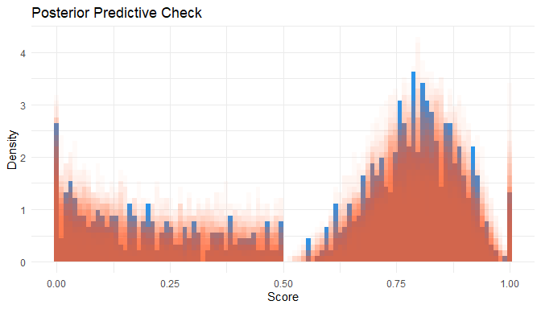

# cogmod


<!-- cogitR -->

<!-- cogbox -->

<!-- brainexplain -->

<!-- brainy: The R package for Computational Cognitive Models -->

<!-- BrainieR -->

<!-- ComputationalCognition -->

[](https://dominiquemakowski.github.io/cogmod/)
[](https://dominiquemakowski.github.io/cogmod/reference/index.html)

*Models of Cognition for Subjective Scales and Decision Making Tasks in
R*

This R package is dedicated to facilitate the application of
computational cognitive models in R under a Bayesian framework. These
are useful in the field of cognitive science and computational
neuropsycholology.

## Status


**This package is under development.** It’s not meant to be stable and
robust at this stage. Use at your own risks. If you have suggestions for
improvement, please get in touch!

- I’ve been seeking the best way to implement various sequential models
  for a long time, initially trying and [failing in
  R](https://github.com/DominiqueMakowski/easyRT), then developing a lot
  of hopes for a Julia solution (see the
  [SequentialSamplingModels.jl](https://github.com/itsdfish/SequentialSamplingModels.jl)),
  but I’m back at making some new attempts in R.
- See also this attempt at [**creating
  tutorials**](https://dominiquemakowski.github.io/CognitiveModels/)

## Features

- [**Models for Subjective Ratings Data (Likert/Slider
  Scales)**](https://dominiquemakowski.github.io/cogmod/articles/subjective_ratings.html)
  - [x] Choice-Confidence (CHOCO) models (Bi-modal Beta)
  - [x] Beta-gate (Ordered Beta, [Kubinec,
    2023](https://doi.org/10.1017/pan.2022.20))
  - [x] Discrete-Beta ([Sciandra,
    2024](https://link.springer.com/article/10.1007/s10651-023-00592-5))
- [**Models for Reaction
  Times**](https://dominiquemakowski.github.io/cogmod/articles/rt_models.html)
  - [x] Ex-Gaussian model (with the classical parameterization in which
    `mu` and `sigma` index the Gaussian component alone and `tau` the
    exponential tail - unlike `brms`’s native `exgaussian()`, whose `mu`
    indexes the mean of the entire distribution)
  - [x] Shifted LogNormal
  - [x] Shifted Wald (Inverse Gaussian)
  - [x] Weibull
  - [x] LogWeibull (Gumbel)
  - [x] Inverse Weibull (Fréchet)
  - [x] Gamma
  - [x] Inverse Gamma
- [**Models for Decision Making (Choice +
  RT)**](https://dominiquemakowski.github.io/cogmod/articles/decision_making.html)
  - [x] Drift Diffusion Model (DDM)
  - [x] Linear Ballistic Accumulator (LBA)
  - [x] LogNormal Race (LNR)


## What are Computational Cognitive Models?

Measures from cognitive tasks, such as decision-making paradigms
involving fast responses or ratings, often produce noisy, specific, and
complex patterns of results. Broadly speaking, there are three ways of
analysing such data.

- **The Summary Statistics Approach**: The traditional approach often
  involves not bothering with any of the distinctive characteristics of
  cognitive data, assume that observations are Normally distributed, and
  summarise them using simple statistics such as means (which is what
  linear models do). This is the approach underlying most *t*-tests,
  ANOVAs, and linear regression models. Although often convenient, these
  methods may provide a poor description of the data and offer only
  limited insight into the cognitive processes that generated the
  observations.
- **The Distributional Approach**: A more principled approach is to
  choose statistical models that better account for these particular
  distributions. This can involve transforming the data (for example,
  log-transforming reaction times so that linear models are more
  justified), using robust statistical methods (resilient to
  non-normality), or adopting more appropriate probability distributions
  (e.g., using Ex-Gaussian models for RTs). While these approaches often
  improve model fit and statistical inference, there can be a gap
  between the descriptive distributional parameters estimated and the
  cognitive mechanisms underlying the data generation process.
- **The Computational Approach**: The most recent approach is to use
  models that are specifically designed to approximate or account for
  the cognitive processes at stake. For instance, Evidence Accumulation
  Models conceptualize response time as the outcome of a noisy process
  of evidence accumulation in the brain. And Choice-Confidence models
  explain the bi-modal distributions often found with slider scales as
  the combination of a dual-process of discrete choice and continuous
  evaluation. These models combine a good distributional fit to the data
  with more meaningful and cognitively interpretable parameters.


## Installation

``` r
if (!requireNamespace("remotes", quietly = TRUE)) install.packages("remotes")

remotes::install_github("DominiqueMakowski/cogmod")
```

## Usage

For each model implemented, `cogmod` provides a **`brms`-compatible
custom family** (e.g., `choco()`) together with a **`stanvars` object**
(e.g., `choco_stanvars()`) that injects the Stan code required to
evaluate it. Both simply need to be passed to `brms::brm()` via the
`family` and `stanvars` arguments - everything else (formula syntax,
post-processing, predictions…) works like any other `brms` model.

Below, we simulate some data from the [**Choice-Confidence (CHOCO)
model**](https://dominiquemakowski.github.io/cogmod/reference/rchoco.html),
a distribution useful to describe bimodal ratings (e.g., confidence or
slider scales) as a mixture of a discrete choice (left vs. right side of
the scale) and a continuous Beta-distributed evaluation.

``` r
library(cogmod)
library(brms)
library(easystats)
library(ggplot2)

set.seed(33)

df <- data.frame()
for (x in seq(0.1, 0.9, by = 0.1)) {
  score <- rchoco(n = 100, p = 0.4 + x / 2, confright = 0.4 + x / 3,
                   confleft = 1 - x, pex = 0.03, bex = 0.6, pmid = 0)
  df <- rbind(df, data.frame(x = x, score = score))
}
```

A `brms` model can then be specified by adding `family = choco()` to the
formula, and passing `stanvars = choco_stanvars()` to `brm()`:

``` r
f <- bf(
  score ~ x,
  confright ~ x,
  confleft ~ x,
  precright ~ x,
  precleft ~ x,
  pex ~ x,
  bex ~ x,
  pmid = 0,
  family = choco()
)

m_choco <- brm(f,
  data = df, family = choco(), stanvars = choco_stanvars(),
  chains = 4, backend = "cmdstanr"
)
```

We can then analyze its results, and check its predictions like with any
other models.

<details class="code-fold">
<summary>Code</summary>

``` r
# Load a pre-fitted model for demonstration purposes
path <- "https://raw.github.com/DominiqueMakowski/cogmod/main/vignettes/models/"
m_choco <- readRDS(url(paste0(path, "m_choco.rds")))
```

</details>

``` r
# Generate predictions with easystats
pred <- estimate_prediction(m_choco, keep_iterations = 50, iterations = 50) |>
  reshape_iterations()

insight::get_data(m_choco) |>
  ggplot(aes(x = score, y = after_stat(density))) +
  geom_histogram(bins = 100, fill = "#2196F3") +
  geom_histogram(
    data = pred, aes(x = iter_value, group = as.factor(iter_group)),
    bins = 100, alpha = 0.03, position = "identity", fill = "#FF5722"
  ) +
  labs(title = "Posterior Predictive Check", x = "Score", y = "Density") +
  theme_minimal()
```



The model nicely recovers the bimodal shape of the observed data -
something that traditional (unimodal) Beta-related models fail to
capture (see the vignette for a comparison).

See the [Subjective
Ratings](https://dominiquemakowski.github.io/cogmod/articles/subjective_ratings.html),
[RT-only
Models](https://dominiquemakowski.github.io/cogmod/articles/rt_models.html),
and [Decision Making
Models](https://dominiquemakowski.github.io/cogmod/articles/decision_making.html)
vignettes for more detailed examples.


