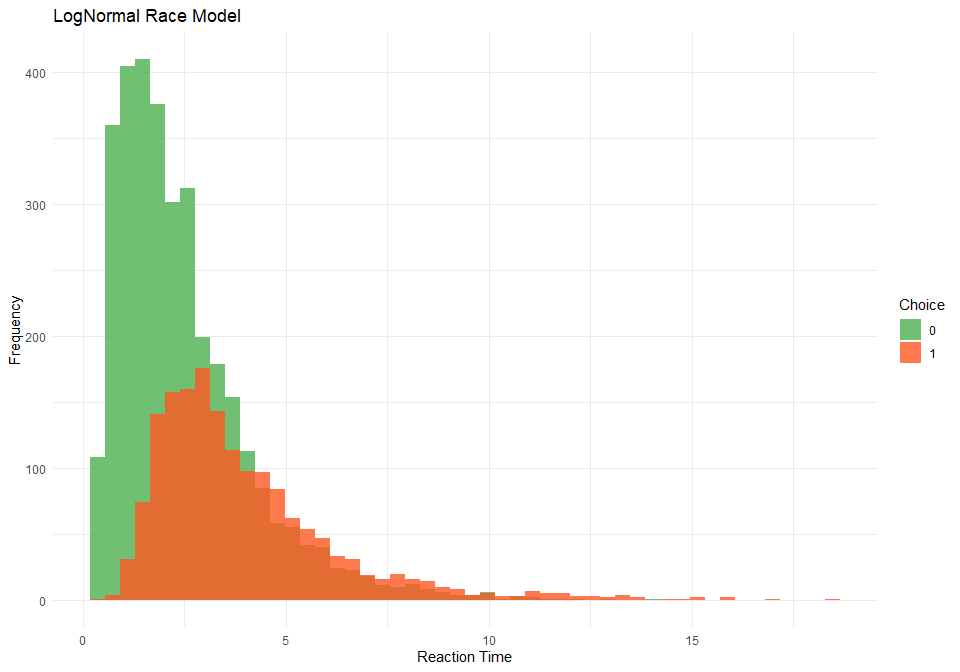
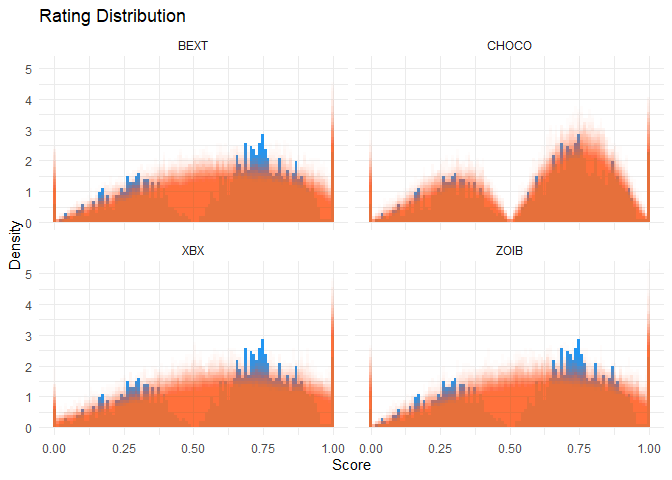

# cogmod


Cognitive Models for Subjective Scales and Decision Making Tasks in R

## Status

**This package is very much totally exploratory - currently made for my
own needs.** It’s not meant to be stable and robust at this stage. Use
at your own risks.

- If you have suggestions for improvement, please get in touch!
- I’ve been seeking the best way to implement various sequential models
  for a long time, initially trying and [failing in
  R](https://github.com/DominiqueMakowski/easyRT), then developing a lot
  of hopes for a Julia solution - but that’s not there *yet*, so I’m
  back at making some new attempts in R.
  - If you are interested in Sequential Sampling Models, see this
    amazing [Julia
    package](https://github.com/itsdfish/SequentialSamplingModels.jl)
  - See also this attempt at [**creating
    tutorials**](https://dominiquemakowski.github.io/CognitiveModels/)

## Installation

``` r
if (!requireNamespace("remotes", quietly = TRUE)) install.packages("remotes")

remotes::install_github("DominiqueMakowski/cogmod")
```

## CHOCO Model

The Choice-Confidence (CHOCO) model is useful to model data from
subjective ratings, such as Likert-type or analog scales, in which the
left and the right side correspond to different processes or higher
order categorical responses (e.g., “disagree” vs. “agree”, “true”
vs. “false”). They can be used to jointly model choice (left or right)
and confidence (the degree of left or right).

<details class="code-fold">
<summary>Code</summary>

``` r
library(ggplot2)
library(cogmod)

# Simulate data using rchoco() with two parameter sets
df1 <- rchoco(n = 5000, mu = 0.5, muleft = 0.4, phileft = 3, pex = 0.1)
df2 <- rchoco(n = 5000, mu = 0.7, muleft = 0.6, phileft = 5, pex = 0.05)

# Combine data into a single data frame
df <- data.frame(
  value = c(df1, df2),
  group = rep(c(
    "mu=0.5, muleft=0.4, phileft=3, kleft=0.9",
    "mu=0.7, muleft=0.6, phileft=5, kleft=0.95"
  ), each = 5000)
)

# Create the histogram
ggplot(df, aes(x = value, fill = group)) +
  geom_histogram(alpha = 0.8, position = "identity", bins = 50) +
  labs(title = "CHOCO Distribution", x = "Value", y = "", fill = "Parameters") +
  theme_minimal() +
  scale_fill_manual(values = c("#9C27B0", "#FF9800"))
```

</details>


## LNR Model

The Log-Normal Race (LNR) model is useful for modeling reaction times
and errors in decision-making tasks. The model assumes that each
accumulator draws a value from a LogNormal distribution (shifted by a
non-decision time τ). The winning accumulator (minimum draw) determines
the observed reaction time and choice.

<details class="code-fold">
<summary>Code</summary>

``` r
# Simulate data using rlnr()
lnr_data <- rlnr(n = 5000, mu = 1, mud = 0.5, sigmazero = 1, sigmad = -0.5, tau = 0.2)

# Create histograms for each choice
ggplot(lnr_data, aes(x = rt, fill = factor(response))) +
  geom_histogram(alpha = 0.8, position = "identity", bins = 50) +
  labs(title = "LNR Distribution", x = "Reaction Time", y = "Frequency", fill = "Choice") +
  theme_minimal() +
  scale_fill_manual(values = c("#4CAF50", "#FF5722"))
```

</details>



## Usage with `brms`

### Subjective Ratings

#### Simulate Data

``` r
options(mc.cores = parallel::detectCores() - 2)

library(easystats)
library(brms)
library(cmdstanr)

df <- data.frame(score = rchoco(n = 1000, mu = 0.6, muleft = 0.6, phileft = 3, pex = 0.03, bex = 0.6))

df |>
  ggplot(aes(x = score, y = after_stat(density))) +
  geom_histogram(bins = 100, fill = "#2196F3") +
  labs(title = "Rating Distribution", x = "Score", y = "Density") +
  theme_minimal()
```


#### ZOIB Model

The Zero-One Inflated Beta (ZOIB) model assumes that the data can be
modeled as a mixture of two logistic regression processes for the
boundary values (0 and 1) and a beta regression process for the
continuous proportions in-between.

``` r
f <- bf(
  score ~ 1,
  phi ~ 1,
  zoi ~ 1,
  coi ~ 1
)

m_zoib <- brm(f,
  data = df, family = zero_one_inflated_beta(), init = 0,
  chains = 4, iter = 500, backend = "cmdstanr"
)

m_zoib <- brms::add_criterion(m_zoib, "loo")  # For later model comparison

saveRDS(m_zoib, file = "man/figures/m_zoib.rds")
```

#### XBX Model

[Kosmidis & Zeileis (2024)](https://arxiv.org/abs/2409.07233) introduce
a generalization of the classic beta regression model with extended
support \[0, 1\]. Specifically, the extended-support beta distribution
(`xbeta`) leverages an underlying symmetric four-parameter beta
distribution with exceedence parameter nu to obtain support \[-nu, 1 +
nu\] that is subsequently censored to \[0, 1\] in order to obtain point
masses at the boundary values 0 and 1.

``` r
f <- bf(
  score ~ 1,
  phi ~ 1,
  kappa ~ 1
)

m_xbx <- brm(f,
  data = df, family = xbeta(), init = 0,
  chains = 4, iter = 500, backend = "cmdstanr"
)

m_xbx <- brms::add_criterion(m_xbx, "loo")  # For later model comparison

saveRDS(m_xbx, file = "man/figures/m_xbx.rds")
```

#### BEXT Model

The BeXt model corresponds to a reparametrized ordered beta model
([Kubinec, 2023](https://doi.org/10.1017/pan.2022.20)). Instead of
defining the left and right cutpoints, the BeXt parametrization uses the
likelihood of extreme values (0 and 1) and their balance (i.e., the
relative proportion of zeros and ones).

``` r
f <- bf(
  score ~ 1,
  phi ~ 1,
  pex ~ 1,
  bex ~ 1
)

m_bext <- brm(f,
  data = df, family = bext(), stanvars = bext_stanvars(), init = 0,
  chains = 4, iter = 500, backend = "cmdstanr"
)

m_bext <- brms::add_criterion(m_bext, "loo")  # For later model comparison

saveRDS(m_bext, file = "man/figures/m_bext.rds")
```

#### CHOCO Model

``` r
f <- bf(
  score ~ 1,
  muleft ~ 1,
  mudelta ~ 1,
  phileft ~ 1,
  phidelta ~ 1,
  pex ~ 1,
  bex ~ 1
)

m_choco <- brm(f,
  data = df, family = choco(), stanvars = choco_stanvars(), init = 0,
  chains = 4, iter = 500, backend = "cmdstanr"
)

m_choco <- brms::add_criterion(m_choco, "loo")  # For later model comparison

saveRDS(m_choco, file = "man/figures/m_choco.rds")
```

#### Model Comparison

``` r
m_zoib <- readRDS("man/figures/m_zoib.rds")
m_xbx <- readRDS("man/figures/m_xbx.rds")
m_bext <- readRDS("man/figures/m_bext.rds")
m_choco <- readRDS("man/figures/m_choco.rds")

loo::loo_compare(m_zoib, m_xbx, m_bext, m_choco) |> 
  parameters(include_ENP = TRUE)
```

    # Fixed Effects

    Name    | LOOIC |  ENP |   ELPD | Difference | Difference_SE |      p
    ---------------------------------------------------------------------
    m_choco | -6.49 | 6.84 |   3.25 |       0.00 |          0.00 |       
    m_zoib  | 77.47 | 3.73 | -38.73 |     -41.98 |          8.46 | < .001
    m_bext  | 77.76 | 3.91 | -38.88 |     -42.13 |          8.45 | < .001
    m_xbx   | 84.03 | 2.68 | -42.01 |     -45.26 |          8.73 | < .001

``` r
pred <- rbind(
  estimate_prediction(m_zoib, keep_iterations = 100) |>
    reshape_iterations() |>
    data_modify(Model = "ZOIB"),
  estimate_prediction(m_xbx, keep_iterations = 100) |>
    reshape_iterations() |>
    data_modify(Model = "XBX"),
  estimate_prediction(m_bext, keep_iterations = 100) |>
    reshape_iterations() |>
    data_modify(Model = "BEXT"),
  estimate_prediction(m_choco, keep_iterations = 100) |>
    reshape_iterations() |>
    data_modify(Model = "CHOCO")
)

insight::get_data(m_zoib) |>
  ggplot(aes(x = score, y = after_stat(density))) +
  geom_histogram(bins = 100, fill = "#2196F3") +
  labs(title = "Rating Distribution", x = "Score", y = "Density") +
  theme_minimal() + 
  geom_histogram(
    data = pred, aes(x = iter_value, group = as.factor(iter_group)),
    bins = 100, alpha = 0.03, position = "identity", fill = "#FF5722"
  ) +
  facet_wrap(~Model)
```



### Decision Making (Choice + RT)

#### Simulate Data

``` r
df <- brms::rwiener(n = 5000, delta = 0.5, alpha = 1, beta = .3, tau = .25) |>
  datawizard::data_rename(replacement = c("rt", "response")) |>
  datawizard::data_filter(rt < 2)

df |>
  ggplot(aes(x = rt, fill = factor(response))) +
  geom_histogram(alpha = 0.8, position = "identity", bins = 100) +
  labs(title = "RT Distribution", x = "Reaction Time", y = "Frequency", fill = "Choice") +
  theme_minimal() +
  scale_fill_manual(values = c("#009688", "#E91E63"))
```


#### Drift Diffusion Model (DDM)

``` r
f <- bf(
  rt | dec(response) ~ 1,
  bs ~ 1,
  bias ~ 1,
  ndt ~ 1
)

m_ddm <- brm(f,
  data = df, family = wiener(), 
  init = \() list(Intercept = 0, Intercept_bs = 0, Intercept_bias = 0, Intercept_ndt = log(0.2)),
  chains = 4, iter = 500, backend = "cmdstanr"
)

saveRDS(m_ddm, file = "man/figures/m_ddm.rds")
```

``` r
m_ddm <- readRDS("man/figures/m_ddm.rds")

parameters::parameters(m_ddm, component = "all")

# library(brms)
# library(cmdstanr)
#
# m_ddm <- readRDS(url("https://raw.github.com/DominiqueMakowski/cogmod/main/man/figures/m_ddm.rds"))
# # m_ddm
#
# insight::get_predicted(m_ddm, iterations = 5, data = insight::get_data(m_ddm)[1:4,]) |>
#   as.data.frame()
#
# brms::posterior_predict(m_ddm, ndraws=5, newdata = insight::get_data(m_ddm)[1:4,], negative_rt = TRUE)
```

#### LogNormal Race (LNR)

``` r
f <- bf(
  rt | dec(choice) ~ 1,
  mudelta ~ 1,
  sigmazero ~ 1,
  sigmadelta ~ 1,
  tau ~ 1
)

m_lnr <- brm(f,
  data = df,
  family = lnr(
    link_mu = "identity",
    link_mudelta = "identity",
    link_sigmazero = "softplus",
    link_sigmadelta = "identity",
    link_tau = "softplus"
  ),
  stanvars = lnr_stanvars(),
  chains = 4, iter = 500, backend = "cmdstanr"
)

saveRDS(m_lnr, file = "man/figures/m_lnr.rds")
```

``` r
m_lnr <- readRDS("man/figures/m_lnr.rds")

parameters::parameters(m_lnr, component = "all")

# library(brms)
# library(cmdstanr)
#
# m_ddm <- readRDS(url("https://raw.github.com/DominiqueMakowski/cogmod/main/man/figures/m_ddm.rds"))
# # m_ddm
#
# insight::get_predicted(m_ddm, iterations = 5, data = insight::get_data(m_ddm)[1:4,]) |>
#   as.data.frame()
#
# brms::posterior_predict(m_ddm, ndraws=5, newdata = insight::get_data(m_ddm)[1:4,], negative_rt = TRUE)
```

#### Model Comparison

``` r
loo::loo_compare(loo::loo(m_ddm), loo::loo(m_lnr))
```
