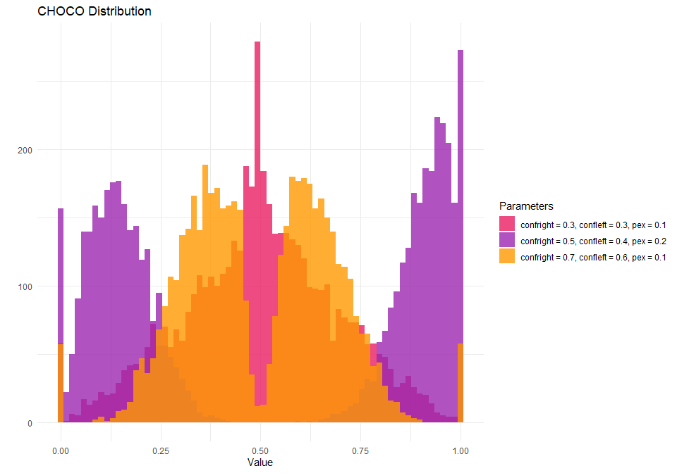
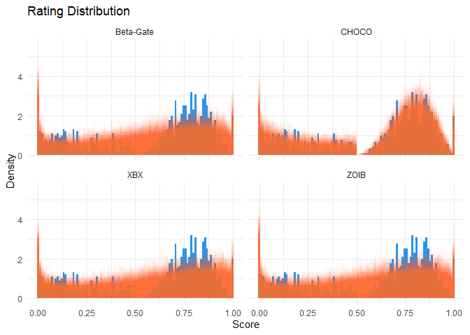
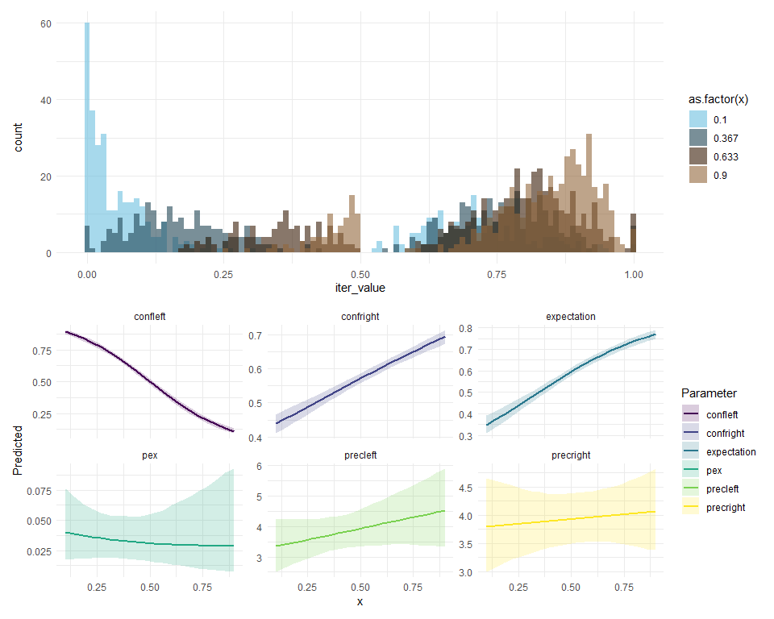

# cogmod


[](https://dominiquemakowski.github.io/cogmod/)
[](https://dominiquemakowski.github.io/cogmod/reference/index.html)

*Cognitive Models for Subjective Scales and Decision Making Tasks in R*

## Status


**This package is very much totally exploratory - currently made for my
own needs.** It’s not meant to be stable and robust at this stage. Use
at your own risks.

- If you have suggestions for improvement, please get in touch!
- I’ve been seeking the best way to implement various sequential models
  for a long time, initially trying and [failing in
  R](https://github.com/DominiqueMakowski/easyRT), then developing a lot
  of hopes for a Julia solution - but that’s not there *yet*, so I’m
  back at making some new attempts in R.
  - If you are interested in Sequential Sampling Models, see this
    amazing [Julia
    package](https://github.com/itsdfish/SequentialSamplingModels.jl)
  - See also this attempt at [**creating
    tutorials**](https://dominiquemakowski.github.io/CognitiveModels/)

## Installation

``` r
if (!requireNamespace("remotes", quietly = TRUE)) install.packages("remotes")

remotes::install_github("DominiqueMakowski/cogmod")
```

## Available Distributions

### CHOCO Model

The [**Choice-Confidence
(CHOCO)**](https://dominiquemakowski.github.io/cogmod/reference/rchoco.html)
model is useful to model data from subjective ratings, such as
Likert-type or analog scales, in which the left and the right side
correspond to different processes or higher order categorical responses
(e.g., “disagree” vs. “agree”, “true” vs. “false”). They can be used to
jointly model choice (left or right) and confidence (the degree of left
or right).

<details class="code-fold">
<summary>Code</summary>

``` r
library(ggplot2)
library(patchwork)
library(cogmod)

# Simulate data using rchoco() with two parameter sets
df1 <- rchoco(n = 5000, confright = 0.8, confleft = 0.7, pex = 0.05)
df2 <- rchoco(n = 5000, confright = 0.3, confleft = 0.3, pex = 0.1)
df3 <- rchoco(n = 5000, confright = 0.3, confleft = 0.3, pex = 0.1, 
               precright = 1.5, precleft = 1.5, pmid = 0.01)

# Combine data into a single data frame
df <- data.frame(
  value = c(df1, df2, df3),
  group = rep(c(
    "confright = 0.5, confleft = 0.4, pex = 0.2",
    "confright = 0.7, confleft = 0.6, pex = 0.1",
    "confright = 0.3, confleft = 0.3, pex = 0.1"
  ), each = 5000)
)

# Create the histogram
ggplot(df, aes(x = value, fill = group)) +
  geom_histogram(alpha = 0.8, position = "identity", bins = 70) +
  labs(title = "CHOCO Distribution", x = "Value", y = "", fill = "Parameters") +
  theme_minimal() +
  scale_fill_manual(values = c("#E91E63", "#9C27B0", "#FF9800"))
```

</details>



### LNR Model

The Log-Normal Race (LNR) model is useful for modeling reaction times
and errors in decision-making tasks. The model assumes that each
accumulator draws a value from a LogNormal distribution (shifted by a
non-decision time τ). The winning accumulator (minimum draw) determines
the observed reaction time and choice.

<details class="code-fold">
<summary>Code</summary>

``` r
# Simulate data using rlnr()
lnr_data <- rlnr(n = 5000, mu = 1, mudelta = 0.5, sigmazero = 1, sigmadelta = -0.5, ndt = 0.2)

# Create histograms for each choice
ggplot(lnr_data, aes(x = rt, fill = factor(response))) +
  geom_histogram(alpha = 0.8, position = "identity", bins = 50) +
  labs(title = "LogNormal Race Model", x = "Reaction Time", y = "Frequency", fill = "Choice") +
  theme_minimal() +
  scale_fill_manual(values = c("#4CAF50", "#FF5722"))
```

</details>


## Usage with `brms`

### Subjective Ratings

#### Simulate Data

``` r
options(mc.cores = parallel::detectCores() - 2)

library(easystats)
library(brms)
library(cmdstanr)

df <- data.frame()
for(x in seq(0.1, 0.9, by = 0.1)) {
  df <- data.frame(x = x,
                   score = rchoco(n = 100, p = 0.4 + x / 2, confright = 0.4 + x / 3, 
                                  confleft = 1-x, pex = 0.03, bex = 0.6, pmid = 0)) |> 
    rbind(df)
}

df |>
  ggplot(aes(x = score, y = after_stat(density))) +
  geom_histogram(bins = 100, fill = "#2196F3") +
  labs(title = "Rating Distribution", x = "Score", y = "Density") +
  theme_minimal()
```


#### ZOIB Model

The Zero-One Inflated Beta (ZOIB) model assumes that the data can be
modeled as a mixture of two logistic regression processes for the
boundary values (0 and 1) and a beta regression process for the
continuous proportions in-between.

``` r
f <- bf(
  score ~ x,
  phi ~ x,
  zoi ~ x,
  coi ~ x, 
  family = zero_one_inflated_beta()
)

m_zoib <- brm(f,
  data = df, family = zero_one_inflated_beta(), init = 0,
  chains = 4, iter = 500, backend = "cmdstanr"
)

m_zoib <- brms::add_criterion(m_zoib, "loo")  # For later model comparison

saveRDS(m_zoib, file = "man/figures/m_zoib.rds")
```

#### XBX Model

[Kosmidis & Zeileis (2024)](https://arxiv.org/abs/2409.07233) introduce
a generalization of the classic beta regression model with extended
support \[0, 1\]. Specifically, the extended-support beta distribution
(`xbeta`) leverages an underlying symmetric four-parameter beta
distribution with exceedence parameter nu to obtain support \[-nu, 1 +
nu\] that is subsequently censored to \[0, 1\] in order to obtain point
masses at the boundary values 0 and 1.

``` r
f <- bf(
  score ~ x,
  phi ~ x,
  kappa ~ x, 
  family = xbeta()
)

m_xbx <- brm(f,
  data = df, family = xbeta(), init = 0,
  chains = 4, iter = 500, backend = "cmdstanr"
)

m_xbx <- brms::add_criterion(m_xbx, "loo")  # For later model comparison

saveRDS(m_xbx, file = "man/figures/m_xbx.rds")
```

#### Beta-Gate Model

The [**Beta-Gate
model**](https://dominiquemakowski.github.io/cogmod/reference/rbetagate.html)
corresponds to a reparametrized Ordered Beta model ([Kubinec,
2023](https://doi.org/10.1017/pan.2022.20)). In this model, observed 0s
and 1s represent instances where the underlying continuous response
tendency fell beyond lower or upper boundary points (‘gates’).

``` r
f <- bf(
  score ~ x,
  phi ~ x,
  pex ~ x,
  bex ~ x, 
  family = betagate()
)

m_betagate <- brm(f,
  data = df, family = betagate(), stanvars = betagate_stanvars(), init = 0,
  chains = 4, iter = 500, backend = "cmdstanr"
)

m_betagate <- brms::add_criterion(m_betagate, "loo")  # For later model comparison

saveRDS(m_betagate, file = "man/figures/m_betagate.rds")
```

#### CHOCO Model

See the
[**documentation**](https://dominiquemakowski.github.io/cogmod/reference/rchoco.html)
of the Choice-Confidence (CHOCO).

``` r
f <- bf(
  score ~ x,
  confright ~ x,
  confleft ~ x,
  precright ~ x,
  precleft ~ x,
  pex ~ x,
  bex ~ x,
  pmid = 0, 
  family = choco()
)

m_choco <- brm(f,
  data = df, family = choco(), stanvars = choco_stanvars(), init = 0,
  chains = 4, iter = 500, backend = "cmdstanr"
)

m_choco <- brms::add_criterion(m_choco, "loo")  # For later model comparison

saveRDS(m_choco, file = "man/figures/m_choco.rds")
```

#### Model Comparison

We can compare these models together using the `loo` package, which
shows that CHOCO provides a significantly better fit than the other
models.

<details class="code-fold">
<summary>Code</summary>

``` r
m_zoib <- readRDS("man/figures/m_zoib.rds")
m_xbx <- readRDS("man/figures/m_xbx.rds")
m_betagate <- readRDS("man/figures/m_betagate.rds")
m_choco <- readRDS("man/figures/m_choco.rds")

loo::loo_compare(m_zoib, m_xbx, m_betagate, m_choco) |> 
  parameters(include_ENP = TRUE)
```

</details>

    # Fixed Effects

    Name       |   LOOIC |  ENP |   ELPD | Difference | Difference_SE |      p
    --------------------------------------------------------------------------
    m_choco    | -770.65 | 8.93 | 385.33 |       0.00 |          0.00 |       
    m_betagate | -159.76 | 7.21 |  79.88 |    -305.45 |         16.68 | < .001
    m_zoib     | -159.73 | 7.00 |  79.86 |    -305.46 |         16.99 | < .001
    m_xbx      | -145.03 | 5.11 |  72.51 |    -312.81 |         16.81 | < .001

Running posterior predictive checks allows to visualize the predicted
distributions from various models. We can see how typical Beta-related
models fail to capture the bimodal nature of the data, which is well
captured by the CHOCO model.

<details class="code-fold">
<summary>Code</summary>

``` r
pred <- rbind(
  estimate_prediction(m_zoib, keep_iterations = 200) |>
    reshape_iterations() |>
    data_modify(Model = "ZOIB"),
  estimate_prediction(m_xbx, keep_iterations = 200) |>
    reshape_iterations() |>
    data_modify(Model = "XBX"),
  estimate_prediction(m_betagate, keep_iterations = 200) |>
    reshape_iterations() |>
    data_modify(Model = "Beta-Gate"),
  estimate_prediction(m_choco, keep_iterations = 200) |>
    reshape_iterations() |>
    data_modify(Model = "CHOCO")
)

insight::get_data(m_zoib) |>
  ggplot(aes(x = score, y = after_stat(density))) +
  geom_histogram(bins = 100, fill = "#2196F3") +
  labs(title = "Rating Distribution", x = "Score", y = "Density") +
  theme_minimal() + 
  geom_histogram(
    data = pred, aes(x = iter_value, group = as.factor(iter_group)),
    bins = 100, alpha = 0.02, position = "identity", fill = "#FF5722"
  ) +
  facet_wrap(~Model)
```

</details>



#### Effect Visualisation

We can see how the predicted distribution changes as a function of **x**
and gets “pushed” to the right. Moreover, we can also visualize the
effect of **x** on specific parameters, showing that it mostly affects
the parameter **conf** (the mean confidence - i.e., central tendency -
on the right side), **confleft** (the relative confidence of the left
side), and **mu**, which corresponds to the ***p*** probability of
answering on the right. This is consistent with our expectations, and
reflects the larger and more concentrated mass on the right of the scale
for higher value of **x** (in brown).

<details class="code-fold">
<summary>Code</summary>

``` r
p1 <- modelbased::estimate_prediction(m_choco, data = "grid", length = 4, keep_iterations = 500) |> 
  reshape_iterations() |> 
  ggplot(aes(x = iter_value, fill = as.factor(x))) +
  geom_histogram(alpha = 0.6, bins = 100, position = "identity") +
  scale_fill_bluebrown_d() +
  theme_minimal()

# Predict various parameters
pred_params <- data.frame()
for(param in c("expectation", "confright", "confleft", "precright", "precleft", "pex")) {
  pred_params <- m_choco |> 
    modelbased::estimate_prediction(data = "grid", length = 20, predict = param) |>
    as.data.frame() |> 
    dplyr::mutate(Parameter = param) |>  # TODO: replace by data_modify after PR
    rbind(pred_params)
}

p2 <- pred_params |> 
  ggplot(aes(x = x, y = Predicted)) +
  geom_ribbon(aes(ymin = CI_low, ymax = CI_high, fill = Parameter), alpha = 0.2) +
  geom_line(aes(color = Parameter), linewidth = 1) +
  facet_wrap(~Parameter, scales = "free_y", ncol=3) +
  scale_fill_viridis_d() +
  scale_color_viridis_d() +
  theme_minimal()

p1 / p2
```

</details>



### Cognitive Tasks

#### Simulate Data

``` r
df <- rlnr(n = 2000, mu = 0, mudelta = 0.3, sigmazero = 1, sigmadelta = -0.5, ndt = 0.2) |> 
  datawizard::data_filter(rt < 5)

df |>
  ggplot(aes(x = rt, fill = factor(response))) +
  geom_histogram(alpha = 0.8, position = "identity", bins = 100) +
  labs(title = "RT Distribution", x = "Reaction Time", y = "Frequency", fill = "Choice") +
  theme_minimal() +
  scale_fill_manual(values = c("#009688", "#E91E63"))
```


#### RT-only Models

We are going to start with models that only predict the reaction time,
and ignore the choice. Note that we only use the data from the correct
trials (i.e., the ones with `response == 0`).

##### Normal

``` r
f <- bf(
  rt ~ 1
)

m_normal <- brm(f,
  data = df[df$response == 0,], 
  init = 0.5,
  chains = 4, iter = 500, backend = "cmdstanr"
)

m_normal <- brms::add_criterion(m_normal, "loo") 

saveRDS(m_normal, file = "man/figures/m_normal.rds")
```

##### ExGaussian

``` r
f <- bf(
  rt ~ 1,
  sigma ~ 1,
  beta ~ 1,
  family = exgaussian()
)

m_exgauss <- brm(f,
  data = df[df$response == 0,], 
  family = exgaussian(), 
  init = 0.5,
  chains = 4, iter = 500, backend = "cmdstanr"
)

m_exgauss <- brms::add_criterion(m_exgauss, "loo") 

saveRDS(m_exgauss, file = "man/figures/m_exgauss.rds")
```

##### Shifted LogNormal

``` r
f <- bf(
  rt ~ 1,
  sigma ~ 1,
  ndt ~ 1,
  family = shifted_lognormal(
    link_sigma = "log",
    link_ndt = "identity"
  )
)

priors <- brms::set_prior("normal(0, 1)", class = "Intercept", dpar = "ndt", ub=min(df$rt))  |> 
  brms::validate_prior(f, data = df[df$response == 0,]) 

m_lognormal <- brm(
  f,
  prior = priors,
  data = df[df$response == 0,], 
  init = 0,
  chains = 4, iter = 500, backend = "cmdstanr"
)

m_lognormal <- brms::add_criterion(m_lognormal, "loo") 

saveRDS(m_lognormal, file = "man/figures/m_lognormal.rds")
```

##### Shifted Wald (Inverse Gaussian)

``` r
f <- bf(
  rt ~ 1,
  alpha ~ 1,
  tau ~ 1,
  minrt = min(df$rt),
  family = shifted_wald()
)

priors <- brms::set_prior("normal(0, 1)", class = "Intercept", dpar = "tau")  |> 
  brms::validate_prior(f, data = df[df$response == 0,]) 

m_wald <- brm(f,
  data = df[df$response == 0,], 
  prior = priors,
  family = shifted_wald(), 
  stanvars = shifted_wald_stanvars(),
  init = 0.5,
  chains = 4, iter = 500, backend = "cmdstanr"
)

m_wald <- brms::add_criterion(m_wald, "loo") 

saveRDS(m_wald, file = "man/figures/m_wald.rds")
```

<!-- ##### Shifted LogNormal (using LNR) -->
<!-- ```{r} -->
<!-- #| eval: false -->
<!-- f <- bf( -->
<!--   rt | dec(response) ~ 1, -->
<!--   sigmazero ~ 1, -->
<!--   tau = ~ 1, -->
<!--   mudelta = -3, -->
<!--   sigmadelta = 0, -->
<!--   minrt = min(df$rt), -->
<!--   family = lnr() -->
<!-- ) -->
<!-- m_lnr0 <- brm( -->
<!--   f, -->
<!--   data = df[df$response == 0,],  -->
<!--   stanvars = lnr_stanvars(), -->
<!--   init = 0.5, -->
<!--   chains = 4, iter = 1000, backend = "cmdstanr" -->
<!-- ) -->
<!-- # options(error = recover) -->
<!-- # m_lnr0 <- brms::add_criterion(m_lnr0, "loo", importance_resampling = FALSE)  -->
<!-- # x <- log_lik(m_lnr0) -->
<!-- # x[x==Inf] -->
<!-- # loo::waic(m_lnr0) -->
<!-- saveRDS(m_lnr0, file = "man/figures/m_lnr0.rds") -->
<!-- insight::get_predicted(m_lnr0, iterations = 5, predict = "prediction") |>  -->
<!--   as.data.frame() -->
<!-- x <- estimate_prediction(m_lnr0, keep_iterations = 5) |>  -->
<!--   as.data.frame() -->
<!-- ``` -->

##### Model Comparison

We can compare these models together using the `loo` package, which
shows that CHOCO provides a significantly better fit than the other
models.

<details class="code-fold">
<summary>Code</summary>

``` r
m_normal <- readRDS("man/figures/m_normal.rds")
m_exgauss <- readRDS("man/figures/m_exgauss.rds")
m_lognormal <- readRDS("man/figures/m_lognormal.rds")
m_wald <- readRDS("man/figures/m_wald.rds")

loo::loo_compare(m_normal, m_exgauss, m_lognormal, m_wald) |> 
  parameters(include_ENP = TRUE)
```

</details>

    # Fixed Effects

    Name        |   LOOIC |  ENP |     ELPD | Difference | Difference_SE |      p
    -----------------------------------------------------------------------------
    m_wald      | 1426.44 | 2.48 |  -713.22 |       0.00 |          0.00 |       
    m_lognormal | 1431.19 | 2.54 |  -715.59 |      -2.37 |          0.96 | 0.013 
    m_exgauss   | 1447.76 | 2.79 |  -723.88 |     -10.66 |          2.26 | < .001
    m_normal    | 2005.83 | 4.01 | -1002.91 |    -289.69 |         25.54 | < .001

<details class="code-fold">
<summary>Code</summary>

``` r
pred <- rbind(
  estimate_prediction(m_normal, keep_iterations = 100) |>
    reshape_iterations() |>
    data_modify(Model = "Normal"),
  estimate_prediction(m_exgauss, keep_iterations = 100) |>
    reshape_iterations() |>
    data_modify(Model = "ExGaussian"),
  estimate_prediction(m_lognormal, keep_iterations = 100) |>
    reshape_iterations() |>
    data_modify(Model = "LogNormal"),
  estimate_prediction(m_wald, keep_iterations = 100) |>
    reshape_iterations() |>
    data_modify(Model = "Wald")
  # estimate_prediction(m_lnr0, keep_iterations = 100) |>
  #   datawizard::data_filter(Component == "rt") |>
  #   datawizard::data_select(-c("Component", "response", "rt")) |> 
  #   reshape_iterations() |>
  #   datawizard::data_modify(Model = "LNR", Residuals = NA)
)


pred |> 
  ggplot(aes(x=iter_value)) +
  geom_histogram(data = df[df$response == 0,], aes(x=rt, y = after_stat(density)), 
                 fill = "black", bins=100) +
  geom_line(aes(color=Model, group=iter_group), stat="density", alpha=0.3) +
  theme_minimal() +
  facet_wrap(~Model) +
  coord_cartesian(xlim = c(0, 5)) +
  see::scale_color_material_d(guide = "none")
```

</details>


#### Decision Making (Choice + RT)

##### Drift Diffusion Model (DDM)

``` r
f <- bf(
  rt | dec(response) ~ 1,
  bs ~ 1,
  bias ~ 1,
  ndt ~ 1,
  family = wiener()
)

priors <- brms::set_prior("normal(0, 1)", class = "Intercept", dpar = "ndt", ub=min(df$rt))  |> 
  brms::validate_prior(f, data = df[df$response == 0,]) 

m_ddm <- brm(f,
  data = df, family = wiener(), 
  init = \() list(Intercept = 0, Intercept_bs = 0, Intercept_bias = 0, Intercept_ndt = log(0.2)),
  chains = 4, iter = 500, backend = "cmdstanr"
)

m_ddm <- brms::add_criterion(m_ddm, "loo") 

saveRDS(m_ddm, file = "man/figures/m_ddm.rds")
```

##### Linear Ballistic Accumulator (LBA)

``` r
f <- bf(
  rt | dec(response) ~ 1,
  vdelta ~ 1,
  sigmazero ~ 1,
  sigmadelta ~ 1,
  A ~ 1, 
  k ~ 1,
  tau ~ 1,
  minrt = min(df$rt),
  family = lba()
)

priors <- c(
    brms::set_prior("normal(0, 1)", class = "Intercept", dpar = "tau"),
    brms::set_prior("normal(0, 1)", class = "Intercept", dpar = "A"),
    brms::set_prior("normal(0, 1)", class = "Intercept", dpar = "k"),
    brms::set_prior("normal(0, 1)", class = "Intercept", dpar = ""),
    brms::set_prior("normal(0, 1)", class = "Intercept", dpar = "vdelta"),
    brms::set_prior("normal(0, 1)", class = "Intercept", dpar = "sigmazero")
  ) |>
    brms::validate_prior(f, data = df)


m_lba <- brm(f,
  data = df,
  init = 1,
  prior = priors,
  family = lba(),
  stanvars = lba_stanvars(),
  chains = 4, iter = 500, backend = "cmdstanr"
)

m_lba <- brms::add_criterion(m_lba, "loo")

saveRDS(m_lba, file = "man/figures/m_lba.rds")
```

##### LogNormal Race (LNR)

``` r
f <- bf(
  rt | dec(response) ~ 1,
  mudelta ~ 1,
  sigmazero ~ 1,
  sigmadelta ~ 1,
  tau ~ 1,
  minrt = min(df$rt),
  family = lnr()
)

m_lnr <- brm(f,
  data = df,
  init = 1,
  family = lnr(),
  stanvars = lnr_stanvars(),
  chains = 4, iter = 500, backend = "cmdstanr"
)

m_lnr <- brms::add_criterion(m_lnr, "loo")

saveRDS(m_lnr, file = "man/figures/m_lnr.rds")
```

##### Model Comparison

``` r
m_ddm <- readRDS("man/figures/m_ddm.rds")
m_lnr <- readRDS("man/figures/m_lnr.rds")

loo::loo_compare(m_ddm, m_lnr) |> 
  parameters::parameters()
```

    # Fixed Effects

    Name  |   LOOIC |     ELPD | Difference | Difference_SE |      p
    ----------------------------------------------------------------
    m_lnr | 5446.91 | -2723.45 |       0.00 |          0.00 |       
    m_ddm | 5666.33 | -2833.17 |    -109.71 |         13.76 | < .001

<!-- ```{r} -->
<!-- #| code-fold: true -->
<!-- insight::get_predicted(m_ddm, iterations = 5, predict = "prediction") |>  -->
<!--   as.data.frame() |>  -->
<!--   head() -->
<!-- estimate_prediction(m_ddm, keep_iterations = 5) |>  -->
<!--   as.data.frame() |>  -->
<!--   head() -->
<!-- pred <- rbind( -->
<!--   estimate_prediction(m_ddm, keep_iterations = 100) |> -->
<!--     reshape_iterations() |> -->
<!--     data_modify(Model = "Normal"), -->
<!--   estimate_prediction(m_exgauss, keep_iterations = 100) |> -->
<!--     reshape_iterations() |> -->
<!--     data_modify(Model = "ExGaussian"), -->
<!--   estimate_prediction(m_lognormal, keep_iterations = 100) |> -->
<!--     reshape_iterations() |> -->
<!--     data_modify(Model = "LogNormal"), -->
<!--   estimate_prediction(m_wald, keep_iterations = 100) |> -->
<!--     reshape_iterations() |> -->
<!--     data_modify(Model = "Wald") -->
<!--   # estimate_prediction(m_lnr0, keep_iterations = 100) |> -->
<!--   #   datawizard::data_filter(Component == "rt") |> -->
<!--   #   datawizard::data_select(-c("Component", "response", "rt")) |>  -->
<!--   #   reshape_iterations() |> -->
<!--   #   datawizard::data_modify(Model = "LNR", Residuals = NA) -->
<!-- ) -->
<!-- pred |>  -->
<!--   ggplot(aes(x=iter_value)) + -->
<!--   geom_histogram(data = df[df$response == 0,], aes(x=rt, y = after_stat(density)),  -->
<!--                  fill = "black", bins=100) + -->
<!--   geom_line(aes(color=Model, group=iter_group), stat="density", alpha=0.3) + -->
<!--   theme_minimal() + -->
<!--   facet_wrap(~Model) + -->
<!--   coord_cartesian(xlim = c(0, 5)) + -->
<!--   see::scale_color_material_d(guide = "none") -->
<!-- ``` -->
