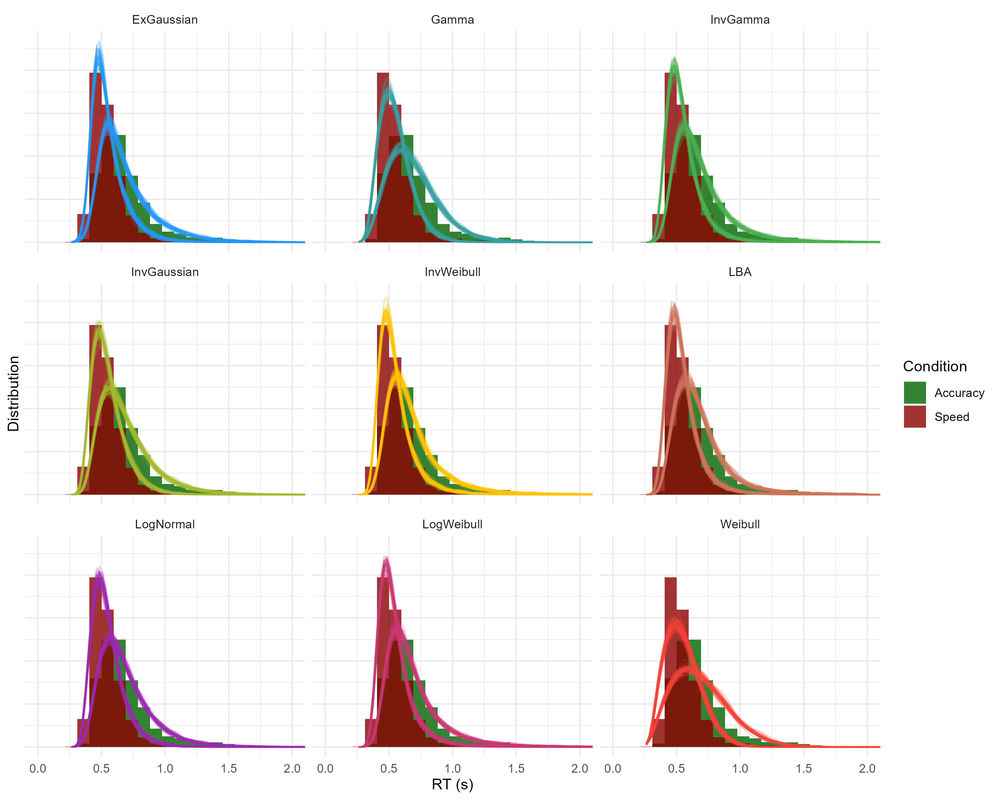

<!-- cogitR -->
<!-- cogbox -->
<!-- brainexplain -->
<!-- brainy: The R package for Computational Cognitive Models -->
<!-- BrainieR -->
<!-- ComputationalCognition -->


[](https://dominiquemakowski.github.io/cogmod/)
[](https://dominiquemakowski.github.io/cogmod/reference/index.html)

*Models of Cognition for Subjective Scales and Decision Making Tasks in R*

This R package is dedicated to facilitate the application of computational cognitive models in R under a Bayesian framework.
These are useful in the field of cognitive science and computational neuropsycholology. 

## Status


**This package is under development.** It's not meant to be stable and robust at this stage. Use at your own risks. If you have suggestions for improvement, please get in touch!

- I've been seeking the best way to implement various sequential models for a long time, initially trying and [failing in R](https://github.com/DominiqueMakowski/easyRT), then developing a lot of hopes for a Julia solution (see the [SequentialSamplingModels.jl](https://github.com/itsdfish/SequentialSamplingModels.jl)), but I'm back at making some new attempts in R.
- See also this attempt at [**creating tutorials**](https://dominiquemakowski.github.io/CognitiveModels/)

## Features

- [**Models for Subjective Ratings Data (Likert/Slider Scales)**](https://dominiquemakowski.github.io/cogmod/articles/subjective_ratings.html)
  - [x] Choice-Confidence (CHOCO) models (Bi-modal Beta)
  - [x] Beta-gate (Ordered Beta, [Kubinec, 2023](https://doi.org/10.1017/pan.2022.20))
  - [x] Discrete-Beta ([Sciandra, 2024](https://link.springer.com/article/10.1007/s10651-023-00592-5))
- [**Models for Reaction Times**](https://dominiquemakowski.github.io/cogmod/articles/rt_models.html)
  - [x] Ex-Gaussian model (with the classicala parameterization in which `mu` and `sigma` index the Gaussian component alone and `tau` the exponential tail - unlike `brms`'s native `exgaussian()`, whose `mu` indexes the mean of the entire distribution)
  - [x] Shifted LogNormal
  - [x] Shifted Wald (Inverse Gaussian)
  - [x] Weibull
  - [x] LogWeibull (Gumbel)
  - [x] Inverse Weibull (Fréchet)
  - [x] Gamma
  - [x] Inverse Gamma
- **Models for Decision Making (Choice + RT)**
  - [x] Drift Diffusion Model (DDM)
  - [x] Linear Ballistic Accumulator (LBA)
  - [x] LogNormal Race (LNR)
  
## What are Computational Cognitive Models?

Measures from cognitive tasks, such as decision-making paradigms involving fast responses or ratings, often produce noisy, specific, and complex patterns of results. Broadly speaking, there are three ways of analysing such data.

- **The Summary Statistics Approach**: The traditional approach often involves not bothering with any of the distinctive characteristics of cognitive data, assume that observations are Normally distributed, and summarise them using simple statistics such as means (which is what linear models do). This is the approach underlying most *t*-tests, ANOVAs, and linear regression models. Although often convenient, these methods may provide a poor description of the data and offer only limited insight into the cognitive processes that generated the observations.
- **The Distributional Approach**: A more principled approach is to choose statistical models that better account for these particular distributions. This can involve transforming the data (for example, log-transforming reaction times so that linear models are more justified), using robust statistical methods (resilient to non-normality), or adopting more appropriate probability distributions (e.g., using Ex-Gaussian models for RTs). While these approaches often improve model fit and statistical inference, there can be a gap between the descriptive distributional parameters estimated and the cognitive mechanisms underlying the data generation process.
- **The Computational Approach**: The most recent approach is to use models that are specifically designed to approximate or account for the cognitive processes at stake. For instance, Evidence Accumulation Models conceptualize response time as the outcome of a noisy process of evidence accumulation in the brain. And Choice-Confidence models explain the bi-modal distributions often found with slider scales as the combination of a dual-process of discrete choice and continuous evaluation. These models combine a good distributional fit to the data with more meaningful and cognitively interpretable parameters.


## Installation

```{r}
#| eval: false

if (!requireNamespace("remotes", quietly = TRUE)) install.packages("remotes")

remotes::install_github("DominiqueMakowski/cogmod")
```


## Usage with `brms`

```{r}
#| label: setup
#| message: false
#| warning: false

library(cogmod)
library(ggplot2)

# TODO.
```


See the [Subjective Ratings](https://dominiquemakowski.github.io/cogmod/articles/subjective_ratings.html), [RT-only Models](https://dominiquemakowski.github.io/cogmod/articles/rt_models.html), and [Decision Making Models](https://dominiquemakowski.github.io/cogmod/articles/decision_making.html) vignettes for detailed examples.



