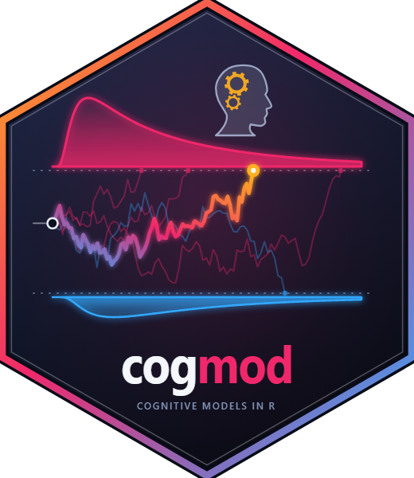
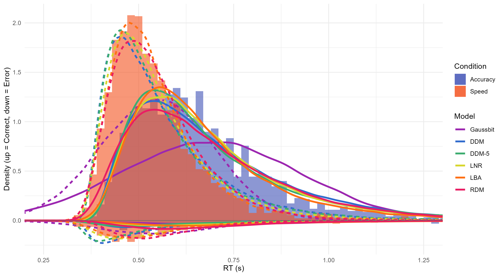

<!-- cogitR -->
<!-- cogbox -->
<!-- brainexplain -->
<!-- brainy: The R package for Computational Cognitive Models -->
<!-- BrainieR -->
<!-- ComputationalCognition -->
<!-- cocomor -->

# cogmod 

[](https://dominiquemakowski.github.io/cogmod/)
[](https://dominiquemakowski.github.io/cogmod/reference/index.html)

*Models of Cognition for Subjective Scales and Decision Making Tasks in R*

This R package is dedicated to facilitate the application of computational models of cognition in R under a Bayesian framework.
These are useful in the field of cognitive science and computational neuropsycholology. 

If you have suggestions for improvement, please [get in touch](https://github.com/DominiqueMakowski/cogmod/issues)! See also this related attempt at [**creating tutorials**](https://dominiquemakowski.github.io/CognitiveModels/).

## Features

- [**Models for Subjective Ratings Data (Likert/Slider Scales)**](https://dominiquemakowski.github.io/cogmod/articles/subjective_ratings.html)
  - [x] Choice-Confidence (CHOCO) models (Bi-modal Beta)
  - [x] Beta-gate (Ordered Beta, [Kubinec, 2023](https://doi.org/10.1017/pan.2022.20))
  - [x] Discrete-Beta ([Sciandra, 2024](https://link.springer.com/article/10.1007/s10651-023-00592-5))
- [**Models for Reaction Times**](https://dominiquemakowski.github.io/cogmod/articles/rt_models.html)
  - [x] Ex-Gaussian model (with the classical parameterization in which `mu` and `sigma` index the Gaussian component alone and `tau` the exponential tail - unlike `brms`'s native `exgaussian()`, whose `mu` indexes the mean of the entire distribution)
  - [x] Shifted LogNormal, Shifted Log-Student-t (robust LogNormal, heavy-tailed)
  - [x] Shifted Wald (Inverse Gaussian), Wald with drift variability, Ex-Wald ([Schwarz, 2001](https://link.springer.com/article/10.3758/bf03195403))
  - [x] Birnbaum-Saunders / fatigue life ([Birnbaum & Saunders, 1969](https://doi.org/10.2307/3212003)) - evidence accumulating in discrete cycles, one-directionally; an equal mixture of a Wald and its length-biased twin, in the same drift and threshold parameters
  - [x] Weibull, LogWeibull (Gumbel), Inverse Weibull (Fréchet)
  - [x] Gamma, Inverse Gamma, Shifted LogGamma (Generalized Gamma)
- [**Models for Decision Making (Choice + RT)**](https://dominiquemakowski.github.io/cogmod/articles/decision_making.html)
  - [x] Drift Diffusion Model (DDM)
  - [x] Linear Ballistic Accumulator (LBA)
  - [x] LogNormal Race (LNR)
  - [x] Racing Diffusion Model (RDM, [Tillman et al., 2020](https://doi.org/10.3758/s13423-020-01719-6))


## What are Computational Cognitive Models?

Measures from cognitive tasks, such as decision-making paradigms involving fast responses or ratings, often produce noisy, specific, and complex patterns of results. Broadly speaking, there are three ways of analysing such data.

- **The Summary Statistics Approach**: The traditional approach often involves not bothering with any of the distinctive characteristics of cognitive data, assume that observations are Normally distributed, and summarise them using simple statistics such as means (which is what linear models do). This is the approach underlying most *t*-tests, ANOVAs, and linear regression models. Although often convenient, these methods may provide a poor description of the data and offer only limited insight into the cognitive processes that generated the observations.
- **The Distributional Approach**: A more principled approach is to choose statistical models that better account for these particular distributions. This can involve transforming the data (for example, log-transforming reaction times so that linear models are more justified), using robust statistical methods (resilient to non-normality), or adopting more appropriate probability distributions (e.g., using Ex-Gaussian models for RTs). While these approaches often improve model fit and statistical inference, there can be a gap between the descriptive distributional parameters estimated and the cognitive mechanisms underlying the data generation process.
- **The Computational Approach**: The most recent approach is to use models that are specifically designed to approximate or account for the cognitive processes at stake. For instance, Evidence Accumulation Models conceptualize response time as the outcome of a noisy process of evidence accumulation in the brain. And Choice-Confidence models explain the bi-modal distributions often found with slider scales as the combination of a dual-process of discrete choice and continuous evaluation. These models combine a good distributional fit to the data with more meaningful and cognitively interpretable parameters.


## Installation

```{r}
#| eval: false

if (!requireNamespace("remotes", quietly = TRUE)) install.packages("remotes")

remotes::install_github("DominiqueMakowski/cogmod")
```


## Usage

For each model implemented, `cogmod` provides a **`brms`-compatible custom family** (e.g., `cogmod_choco()`) together with a **`stanvars` object** (e.g., `cogmod_choco_stanvars()`) that injects the Stan code required to evaluate it. Both simply need to be passed to `brms::brm()` via the `family` and `stanvars` arguments - everything else (formula syntax, post-processing, predictions...) works like any other `brms` model.

Below, we simulate some data from the [**Choice-Confidence (CHOCO) model**](https://dominiquemakowski.github.io/cogmod/reference/rcogmod_choco.html), a distribution useful to describe bimodal ratings (e.g., confidence or slider scales) as a mixture of a discrete choice (left vs. right side of the scale) and a continuous Beta-distributed evaluation.

```{r}
#| label: setup
#| message: false
#| warning: false

library(cogmod)
library(brms)
library(easystats)
library(ggplot2)

set.seed(33)

df <- data.frame()
for (x in seq(0.1, 0.9, by = 0.1)) {
  score <- rcogmod_choco(n = 100, p = 0.4 + x / 2, confright = 0.4 + x / 3,
                  confleft = 1 - x, pex = 0.03, bex = 0.6, pmid = 0)
  df <- rbind(df, data.frame(x = x, score = score))
}
```

A `brms` model can then be specified by adding `family = cogmod_choco()` to the formula, and passing `stanvars = cogmod_stanvars(f)` to `brm()`:

```{r}
#| eval: false

f <- bf(
  score ~ x,
  confright ~ x,
  confleft ~ x,
  precright ~ x,
  precleft ~ x,
  pex ~ x,
  bex ~ x,
  pmid = 0,
  family = cogmod_choco()
)

m_choco <- brm(f,
  data = df, stanvars = cogmod_stanvars(f),
  chains = 4, backend = "cmdstanr"
)
```


We can then analyze its results, and check its predictions like with any other models.

```{r}
#| code-fold: true

# Load a pre-fitted model for demonstration purposes
path <- "https://raw.github.com/DominiqueMakowski/cogmod/main/vignettes/models/"
m_choco <- readRDS(url(paste0(path, "m_choco.rds")))
```


```{r}
#| label: ppcheck
#| fig-width: 7
#| fig-height: 4

# Generate predictions with easystats
pred <- estimate_prediction(m_choco, keep_iterations = 50, iterations = 50) |>
  reshape_iterations()

insight::get_data(m_choco) |>
  ggplot(aes(x = score, y = after_stat(density))) +
  geom_histogram(bins = 100, fill = "#2196F3") +
  geom_histogram(
    data = pred, aes(x = iter_value, group = as.factor(iter_group)),
    bins = 100, alpha = 0.03, position = "identity", fill = "#FF5722"
  ) +
  labs(title = "Posterior Predictive Check", x = "Score", y = "Density") +
  theme_minimal()
```

The model nicely recovers the bimodal shape of the observed data - something that traditional (unimodal) Beta-related models fail to capture (see the vignette for a comparison).

See the [Subjective Ratings](https://dominiquemakowski.github.io/cogmod/articles/subjective_ratings.html), [RT-only Models](https://dominiquemakowski.github.io/cogmod/articles/rt_models.html), and [Decision Making Models](https://dominiquemakowski.github.io/cogmod/articles/decision_making.html) vignettes for more detailed examples.




## Roadmap

- [ ] **Log-logistic** - `log(RT - ndt) ~ Logistic`. The motivation is the *hazard function*: Weibull and Gamma hazards are monotone, whereas the log-logistic rises then falls, a shape none of the current families can produce.
- [ ] **Early responses as a process rather than a fixed mixture.** `poutlier` currently mixes in a half-Normal at zero   with a fixed scale: a contaminant with no mechanism, there so that one stray fast response cannot drag `ndt` down. LATER handles the same responses with a second *accumulator* - an "early" or "maverick" unit with a mean rate near zero and a large SD - that **races** the main one, so an early response is a decision that happened to win rather than a trial the model disowns. That is the better account, and it is what the second line on a reciprobit plot actually is.  It is also a large undertaking: a race needs the winner's density against the loser's survival for every family in `.OUTLIER_FAMILIES`, where the present mixture needs one scalar, and the early unit is *deliberately* half-defective  (with a mean rate of zero, half its trials never arrive at all) - which our normalised densities cannot represent unless the race is there to absorb the missing mass. Put on hold until we find a design that does not cost every family its closed form.
- [ ] **Shifted sinh-arcsinh (log-SHASH)** ([Jones & Pewsey, 2009](https://doi.org/10.1093/biomet/asp053)) - location, scale, skewness and tail weight as four separate parameters. Where `cogmod_loggamma()` ties skew and
  tail weight together through one `shape`, SHASH decouples them.
- [ ] Add and check `cogmod_priors()` and `cogmod_inits()` for subjective scale models.
