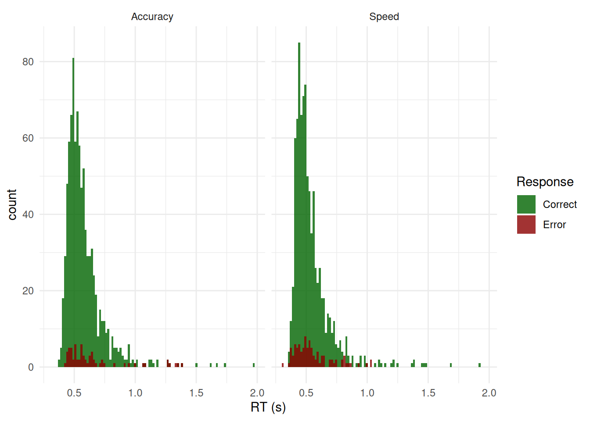
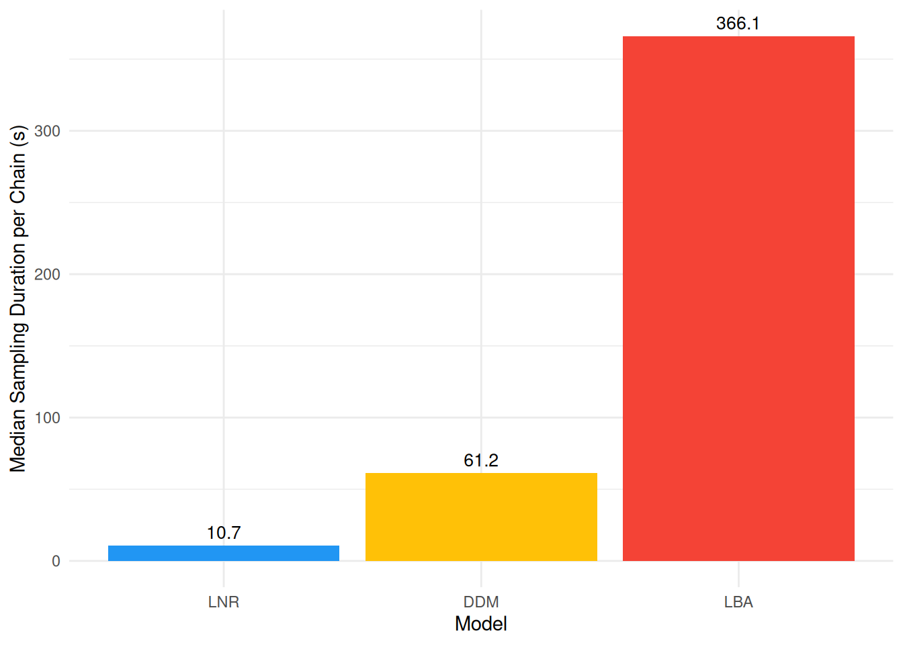

# Decision Making Models

``` r

library(cogmod)
library(easystats)
library(ggplot2)
library(brms)
library(cmdstanr)

options(mc.cores = parallel::detectCores() - 2)
```

## The Data

Decision making models jointly account for the **choice** that was made
and the **response time (RT)** it took to make it. Rather than
simulating data, we re-use the `wagenmakers2008` dataset (see the
[RT-only
Models](https://github.com/DominiqueMakowski/cogmod/articles/rt_models.md)
vignette) - but this time, instead of discarding the errors, we model
**choice** as *correct* vs. *error* responses. This is a common strategy
in the decision-making literature when the task itself does not have a
natural “left vs. right” stimulus category to map onto the two
accumulators/boundaries of the models below.

Evidence accumulation models are considerably more expensive to sample
than the RT-only models. We therefore use a smaller subset of the data
here, only one participant, so that the models below can be fit in a
reasonable amount of time for demonstration purposes.

``` r

set.seed(123)  # For reproducibility

df <- cogmod::wagenmakers2008
df <- df[df$Participant == 1, ]

# Rename/recode columns to match the models' expected format
# df$response <- as.integer(!df$Error)  # 1 = Correct, 0 = Error

# Show 10 first rows
head(df[c("Participant", "Condition", "RT", "Error")], 10)
#>    Participant Condition    RT Error
#> 1            1     Speed 0.700 FALSE
#> 2            1     Speed 0.392  TRUE
#> 3            1     Speed 0.460 FALSE
#> 4            1     Speed 0.455 FALSE
#> 5            1     Speed 0.505  TRUE
#> 6            1     Speed 0.773 FALSE
#> 7            1     Speed 0.390 FALSE
#> 8            1     Speed 0.587  TRUE
#> 9            1     Speed 0.603 FALSE
#> 10           1     Speed 0.435 FALSE
```

``` r

ggplot(df, aes(x = RT, fill = factor(Error))) +
  geom_histogram(bins = 100, alpha = 0.8, position = "identity") +
  facet_wrap(~Condition) +
  labs(x = "RT (s)", fill = "Response") +
  scale_fill_manual(values = c("darkgreen", "darkred"), labels = c("Correct", "Error")) +
  theme_minimal()
```



Errors are much rarer than correct responses (especially in the
`Accuracy` condition), which can be problematic for accurate
estimations.

## Models

All three models below use `dec(Error)` to indicate the two-choice
outcome (`0` = Correct, `1` = Error), and a fixed `minrt` (the minimum
observed RT) to scale the non-decision time parameter `tau`.

### Drift Diffusion Model (DDM)

The DDM assumes that evidence accumulates towards one of two boundaries
at a rate `mu` (drift rate). `bs` is the boundary separation (higher =
more cautious), `bias` is the starting point between the two boundaries
(`0.5` = unbiased), and `tau` is the non-decision time (as a proportion
of `minrt`).

Code

``` r

f <- bf(
  RT | dec(Error) ~ Condition,
  bs ~ Condition,
  bias ~ 1,
  tau ~ 1,
  minrt = min(df$RT),
  family = ddm()
)

priors <- brms::set_prior("normal(0, 1)", class = "Intercept", dpar = "tau") |>
  brms::validate_prior(f, data = df)

m_ddm <- brm(f,
  data = df,
  # prior = priors,
  init = 0,
  stanvars = ddm_stanvars(),
  chains = 4, iter = 500, backend = "cmdstanr"
)

m_ddm <- brms::add_criterion(m_ddm, "loo")  # Add model performance criterion

saveRDS(m_ddm, file = "models/m_ddm.rds")
```

### LogNormal Race (LNR)

The LNR is a somewhat simpler model. It is similar to the LBA, but each
accumulator’s finishing time is drawn directly from a LogNormal
distribution instead of a ballistic accumulation process. `mu`
(`nuzero`) and `nuone` are the (inverse log-space mean) processing
speeds for the “Error” and “Correct” accumulators, and
`sigmazero`/`sigmaone` their log-space SDs.

Code

``` r

f <- bf(
  RT | dec(Error) ~ Condition,
  nuone ~ Condition,
  sigmazero ~ 1,
  sigmaone ~ 1,
  tau ~ 1,
  minrt = min(df$RT),
  family = lnr()
)

priors <- brms::set_prior("normal(0, 1)", class = "Intercept", dpar = "tau") |>
  brms::validate_prior(f, data = df)

m_lnr <- brm(f,
  data = df,
  # prior = priors,
  init = 0,
  stanvars = lnr_stanvars(),
  chains = 4, iter = 500, backend = "cmdstanr"
)

m_lnr <- brms::add_criterion(m_lnr, "loo")  # Add model performance criterion

saveRDS(m_lnr, file = "models/m_lnr.rds")
```

### Linear Ballistic Accumulator (LBA)

The LBA assumes two independent accumulators (one per choice) that race
towards a common threshold `b` (`sigmabias` = start-point range `A`,
`bs` = extra distance so that `b = A + bs`). `mu` and `driftone` are the
mean drift rates for the “Correct” and “Error” accumulators, and
`sigmazero`/ `sigmaone` their between-trial drift variability.

Code

``` r

f <- bf(
  RT | dec(Error) ~ Condition,
  driftone ~ Condition,
  sigmazero ~ 1,
  sigmaone ~ 1,
  sigmabias ~ 1,
  bs ~ 1,
  tau ~ 1,
  minrt = min(df$RT),
  family = lba()
)

priors <- c(
  brms::set_prior("normal(0, 2)", class = "Intercept"),
  brms::set_prior("normal(0, 1)", class = "Intercept", dpar = "driftone"),
  brms::set_prior("normal(0, 1)", class = "Intercept", dpar = "sigmazero"),
  brms::set_prior("normal(0, 1)", class = "Intercept", dpar = "sigmaone"),
  brms::set_prior("normal(0, 1)", class = "Intercept", dpar = "sigmabias"),
  brms::set_prior("normal(0, 1)", class = "Intercept", dpar = "bs"),
  brms::set_prior("normal(0, 1)", class = "Intercept", dpar = "tau")
) |>
  brms::validate_prior(f, data = df)

m_lba <- brm(f,
  data = df,
  prior = priors,
  init = 0.5,
  stanvars = lba_stanvars(),
  chains = 4, iter = 500, backend = "cmdstanr"
)

m_lba <- brms::add_criterion(m_lba, "loo")  # Add model performance criterion

saveRDS(m_lba, file = "models/m_lba2.rds")
```

## Model Comparison

### Model Fit

``` r

loo::loo_compare(m_ddm, m_lba, m_lnr) |>
  report::report()
#> The difference in predictive accuracy, as indexed by Expected Log Predictive
#> Density (ELPD-LOO), suggests that '1' is the best model (ELPD = 904.58),
#> followed by '2' (diff-ELPD = -124.44 +- 14.86, p < .001) and '3' (diff-ELPD =
#> -69998.35 +- 60.98, p < .001)
```

### Sampling Duration

As with the RT-only models, we summarize each model’s sampling duration
by the median time per chain. Choice+RT models are considerably more
expensive to sample than RT-only models (see the [RT-only
Models](https://github.com/DominiqueMakowski/cogmod/articles/rt_models.md)
vignette): the DDM relies on Stan’s `wiener_lpdf`, which is
comparatively slow, while the LBA and LNR likelihoods involve evaluating
both a “winner” density and a “loser” survival function for every
observation.

``` r

duration <- rbind(
  data_modify(attributes(m_ddm$fit)$metadata$time$chain, Model = "DDM"),
  data_modify(attributes(m_lba$fit)$metadata$time$chain, Model = "LBA"),
  data_modify(attributes(m_lnr$fit)$metadata$time$chain, Model = "LNR")
) |>
  data_modify(Model = factor(Model, levels = c("LNR", "DDM", "LBA")))

duration_median <- aggregate(total ~ Model, data = duration, FUN = median)

duration_median |>
  ggplot(aes(x = Model, y = total, fill = Model)) +
  geom_col() +
  geom_text(aes(label = round(total, 1)), vjust = -0.5, size = 3.5) +
  labs(y = "Median Sampling Duration per Chain (s)") +
  scale_fill_material_d(guide = "none") +
  theme_minimal()
```



### Posterior Predictive Check

Code

``` r

# .density_rt_response <- function(rt, response, length.out = 100) {
#   rt_error <- rt[response == 0]
#   rt_correct <- rt[response == 1]
#   xaxis <- seq(0, max(rt_error, rt_correct) * 1.1, length.out = length.out)
# 
#   insight::check_if_installed("logspline")
#   rbind(
#     data.frame(x = xaxis,
#                y = logspline::dlogspline(xaxis, logspline::logspline(rt_error)),
#                response = 0),
#     data.frame(x = xaxis,
#                y = -logspline::dlogspline(xaxis, logspline::logspline(rt_correct)),
#                response = 1)
#   )
# }
# 
# density_rt_response <- function(data, rt = "RT", response = "Error", by = NULL, length.out = 100) {
#   if (is.null(by)) {
#     out <- .density_rt_response(data[[rt]], data[[response]], length.out = length.out)
#   } else {
#     out <- sapply(split(data, data[[by]]), function(x) {
#       d <- .density_rt_response(x[[rt]], x[[response]], length.out = length.out)
#       d[[by]] <- x[[by]][1]
#       d
#     }, simplify = FALSE)
#     out <- do.call(rbind, out)
#     out[[by]] <- as.factor(out[[by]])
#   }
#   out[[response]] <- as.factor(out[[response]])
#   row.names(out) <- NULL
#   out
# }
# 
# pred <- rbind(
#   estimate_prediction(m_ddm, data = df, iterations = 50, keep_iterations = TRUE) |>
#     reshape_iterations() |>
#     data_modify(Model = "DDM"),
#   estimate_prediction(m_lba, data = df, iterations = 50, keep_iterations = TRUE) |>
#     reshape_iterations() |>
#     data_modify(Model = "LBA"),
#   estimate_prediction(m_lnr, data = df, iterations = 50, keep_iterations = TRUE) |>
#     reshape_iterations() |>
#     data_modify(Model = "LNR")
# ) |>
#   datawizard::data_select(select = c("Row", "Component", "iter_value", "iter_group", "iter_index", "Model")) |>
#   datawizard::data_to_wide(id_cols = c("Row", "iter_group", "Model"), values_from = "iter_value", names_from = "Component")
# 
# dat <- rbind(
#   data_modify(density_rt_response(pred[pred$Model == "DDM", ], by = "iter_group"), Model = "DDM"),
#   data_modify(density_rt_response(pred[pred$Model == "LBA", ], by = "iter_group"), Model = "LBA"),
#   data_modify(density_rt_response(pred[pred$Model == "LNR", ], by = "iter_group"), Model = "LNR")
# )
# 
# p <- ggplot(df, aes(x = rt)) +
#   geom_histogram(data = df[df$response == 1, ], aes(y = after_stat(density)), fill = "darkgreen", bins = 100) +
#   geom_histogram(data = df[df$response == 0, ], aes(y = after_stat(-density)), fill = "darkred", bins = 100) +
#   geom_line(data = dat, aes(x = x, y = y, group = interaction(response, iter_group)), color = "grey30", alpha = 0.1) +
#   facet_wrap(~Model) +
#   coord_cartesian(xlim = c(0, 2)) +
#   labs(x = "RT (s)", y = "Density (top = Correct, bottom = Error)") +
#   theme_minimal()
# p
```
