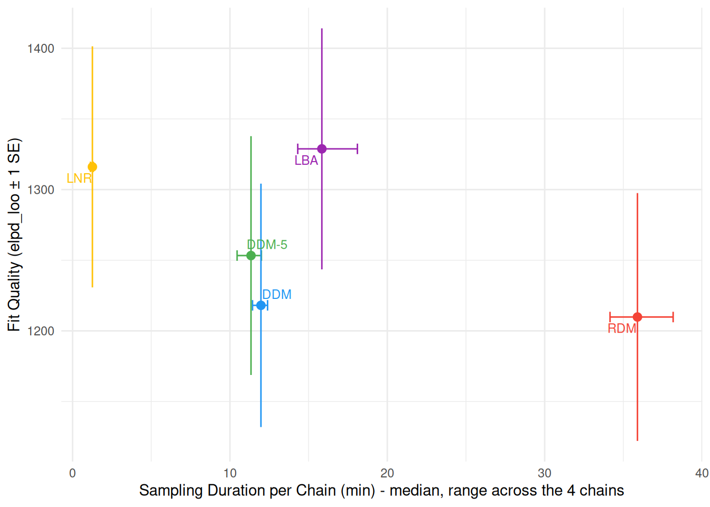

# Decision Making Models

## The Key Concept

Most “decision-making” models are **evidence accumulation models**: they
assume that evidence for a decision or choice is accumulated over time
until it reaches a threshold. The time it takes to reach the threshold
is the observed response time (RT). Many “variants” of such models
exist, differing in the assumptions they make about the accumulation
process.

Wald Model

`drift` drift rate

``` js
viewof drift = Inputs.range([1.5, 6], {value: 3, step: 0.1, width: 190})
```

`boundary` decision threshold

``` js
viewof boundary = Inputs.range([0.3, 0.8], {value: 0.5, step: 0.05, width: 190})
```

`ndt` non-decision time

``` js
viewof ndt = Inputs.range([0, 0.4], {value: 0.2, step: 0.01, width: 190})
```

``` js
// Both wrappers only decorate the figure and hand it back, so the plot below
// reads as it did before it was draggable and before it was animated.
dragHandles(fireTrials(Plot.plot({
  width: plotWidth,
  height: cfg.height,
  marginLeft: cfg.mleft,
  marginRight: cfg.mright,
  marginTop: cfg.mtop,
  marginBottom: cfg.mbottom,
  // No ticks anywhere on time - the axis is the arrow drawn at the start
  // point below, and the one number worth reading is the mean RT.
  x: {domain: [0, cfg.tmax], axis: null},
  // Two numbers on the evidence axis, the start point and the boundary, with
  // no tick marks: nothing else here has a protruding tick, and the labels
  // sit close enough to the frame to read without one.
  // The label is rotated a quarter turn anticlockwise, which turns the arrow
  // it is written with at each end into one pointing down and one pointing up.
  // Plot's own `labelArrow` would add a third.
  y: {domain: [cfg.ybot, cfg.ytop], label: "← Evidence →",
      labelArrow: "none", labelAnchor: "center", ticks: [0, boundary],
      tickFormat: d3.format(".2f"), tickSize: 0, tickPadding: 7},
  marks: [
    // The RT distribution, sitting on the boundary it is the crossing time of.
    Plot.areaY(density, {x: "t", y1: "base", y2: "y", fill: cfg.blue,
                         fillOpacity: 0.15}),
    Plot.line(density, {x: "t", y: "y", stroke: cfg.blue, strokeWidth: 2}),
    // Thirty trials, redrawn from scratch whenever a slider moves.
    Plot.line(trials.rows, {x: "t", y: "x", z: "id", stroke: cfg.blue,
                            strokeOpacity: 0.42, strokeWidth: 0.9, clip: true}),
    // Time runs along the start point. Black, because it is the one line here
    // that is an axis rather than an annotation.
    Plot.arrow([{x1: 0, y1: 0, x2: cfg.tmax, y2: 0}],
               {x1: "x1", y1: "y1", x2: "x2", y2: "y2", stroke: cfg.black,
                strokeWidth: 1.2, headLength: 7}),
    Plot.text([{t: cfg.tmax, y: 0}],
              {x: "t", y: "y", text: ["Time"], dx: -12, dy: 13,
               textAnchor: "end", fill: cfg.black, fontSize: 11}),
    // Nothing accumulates before ndt. The double arrow just above the time
    // arrow, spanning the flat stretch every path starts with, measures it
    // off - and is the whole annotation: a dropped line up to the boundary
    // only repeated what the foot of the drift arrow already marks.
    Plot.arrow(ndtSpan, {x1: "x1", y1: "y1", x2: "x2", y2: "y2",
                         stroke: cfg.purple, strokeWidth: 1, headLength: 6}),
    Plot.text(ndtSpan.slice(0, 1),
              {x: "x1", y: "y1", text: ["ndt"], dy: -7, fill: cfg.purple,
               fontSize: 11, stroke: "white", strokeWidth: 3,
               paintOrder: "stroke"}),
    // The boundary is the second axis of the figure, so it is drawn at the
    // weight of one rather than laid over the frame as a heavier line.
    Plot.ruleY([boundary], {stroke: cfg.orange, strokeWidth: 1.2}),
    Plot.text([{t: cfg.tmax, y: boundary}],
              {x: "t", y: "y", text: ["boundary"], dy: -7, textAnchor: "end",
               fill: cfg.orange, fontSize: 11}),
    // The boundary is a distance from the start point, not a place on the
    // clock. A dimension line at the right edge, where the paths have all
    // finished, says which of the two it is - directly under its label.
    Plot.arrow(boundarySpan, {x1: "x1", y1: "y1", x2: "x2", y2: "y2",
                              stroke: cfg.orange, strokeWidth: 1,
                              headLength: 6}),
    // The mean drift path: its slope is the drift rate, and it reaches the
    // boundary exactly at the mean decision time, which is where the dashed
    // line above it stands. The arc at its foot marks that slope as an angle.
    Plot.arrow([{x1: ndt, y1: 0, x2: ndt + boundary / drift, y2: boundary}],
               {x1: "x1", y1: "y1", x2: "x2", y2: "y2", stroke: cfg.green,
                strokeWidth: 2.2, headLength: 9}),
    Plot.arrow(driftArc.data, {x1: "x1", y1: "y1", x2: "x2", y2: "y2",
                               stroke: cfg.green, strokeWidth: 1.2,
                               headLength: 6, bend: driftArc.bend}),
    // The white stroke is a halo: these labels sit over the path tangle. The
    // label sits in the wedge the arc marks out rather than partway up the
    // arrow, which at a steep drift would put it on top of the boundary.
    Plot.text([driftArc.label],
              {x: "x", y: "y", text: ["drift"], dx: 2, textAnchor: "start",
               fill: cfg.green, fontSize: 11, stroke: "white", strokeWidth: 3,
               paintOrder: "stroke"}),
    Plot.dot(trials.hits, {x: "t", y: () => boundary, fill: cfg.orange, r: 3}),
    Plot.ruleX([ndt + boundary / drift],
               {y1: boundary, y2: cfg.ytop, stroke: cfg.grey,
                strokeDasharray: "4,3"}),
    Plot.text([{t: ndt + boundary / drift}],
              {x: "t", text: ["mean RT " + d3.format(".2f")(ndt + boundary / drift) + " s"],
               frameAnchor: "top", textAnchor: "start", dx: 4, dy: 8,
               fill: cfg.grey, fontSize: 11})
  ]
})))
```

``` js
// tmax and the slider ranges are set against each other: the slowest corner
// of the parameter space (drift 1.5, boundary 0.8, ndt 0.4) has a mean RT of
// 0.93 s, so 1.2 s of axis holds every setting without the frame ever having
// to rescale - which it must not do, or raising ndt would stop looking like a
// shift. Same for the evidence axis: ytop clears the tallest density (boundary
// 0.8 + dheight) and the frame is otherwise as tight as it can be, because the
// accumulation band is only as tall as `boundary` and the smallest one has to
// stay readable - which is also why the slider stops at 0.3. ybot leaves room
// for the paths, which wander below zero on the way up. ndty is where the ndt
// dimension line sits: a few pixels above the time arrow, in the strip the
// paths cannot leave until ndt has passed. mtop carries nothing, so the frame
// is back to what it was now the title has moved into the column on the left.
// One colour per parameter - drift green, boundary orange, ndt purple - and
// each one is worn by everything that parameter owns, the slider included.
// The three are repeated in the <style> block at the top of this file, which
// cannot read them from here. blue is the model's own output (density and
// paths), grey is for annotation that belongs to no parameter, black is the
// time axis.
cfg = ({tmax: 1.2, dt: 0.005, npaths: 30, ybot: -0.5, ytop: 1.4, dheight: 0.55,
        ndty: 0.07, height: 300, mleft: 46, mright: 18, mtop: 18, mbottom: 16,
        blue: "#3F51B5", orange: "#F4511E", green: "#009E73",
        purple: "#8E24AA", grey: "#90A4AE", black: "#000000"})
```

``` js
// The parameters column takes 200px plus the flex gap; Inputs.range does not
// carry its own label here, so the column is exactly as wide as it says.
plotWidth = Math.max(320, Math.min(width, 900) - 232)
```

``` js
// Three of the marks are handles. The boundary line drags up and down, an
// invisible vertical line at ndt drags left and right, and the drift arrow
// pivots about its foot - each writing to its own slider, so a value still
// lives in exactly one place and the figure is only a second way in.
//
// Every change rebuilds the plot, so the element the pointer went down on is
// gone by the second frame of a drag. The move and release listeners therefore
// go on the window, and the geometry they work from is measured once at
// pointerdown - which stays true, because each rebuild is the same size in the
// same place. The figure is drawn in its own svg units, so a screen pixel is
// worth `box.height / rect.height` of them: the two agree at full size and
// part company when the column is narrow enough for Plot's max-width to kick
// in.
dragHandles = function(plot) {
  const GRAB = 7;                    // how near the pointer has to come, in px
  const slider = {
    drift: (viewof drift).querySelector('input[type="range"]'),
    boundary: (viewof boundary).querySelector('input[type="range"]'),
    ndt: (viewof ndt).querySelector('input[type="range"]')
  };
  const at = (key) => Number(slider[key].value);
  const box = plot.viewBox.baseVal;
  const perPixel = (rect) => box.height / rect.height;
  // Where a value sits on screen, and the value at a point on screen: the same
  // map read each way, once per axis.
  const mapper = (scale, edge) => {
    const [d0, d1] = scale.domain, [p0, p1] = scale.range;
    const k = (p1 - p0) / (d1 - d0);
    return {
      to: (v, rect) => edge(rect) + (p0 + (v - d0) * k) / perPixel(rect),
      from: (p, rect) => d0 + ((p - edge(rect)) * perPixel(rect) - p0) / k
    };
  };
  const X = mapper(plot.scale("x"), (rect) => rect.left);
  const Y = mapper(plot.scale("y"), (rect) => rect.top);
  const toSegment = (p, a, b) => {
    const vx = b.x - a.x, vy = b.y - a.y, len = vx * vx + vy * vy;
    const t = len ? Math.max(0, Math.min(1, ((p.x - a.x) * vx +
                                             (p.y - a.y) * vy) / len)) : 0;
    return Math.hypot(p.x - (a.x + t * vx), p.y - (a.y + t * vy));
  };

  // `away` is the distance from the pointer to the handle; `read` is the value
  // the pointer is asking that parameter to take.
  const handle = {
    boundary: {
      cursor: "ns-resize",
      away: (p, rect) => Math.abs(p.y - Y.to(at("boundary"), rect)),
      read: (p, rect) => Y.from(p.y, rect)
    },
    ndt: {
      cursor: "ew-resize",
      // Nothing is drawn at ndt any more, so the line to grab is the one the
      // double arrow ends on, and only over the stretch of the figure ndt has
      // anything to say about: the time axis up to the boundary.
      away: (p, rect) =>
        p.y < Y.to(at("boundary"), rect) - GRAB || p.y > Y.to(0, rect) + GRAB
          ? Infinity : Math.abs(p.x - X.to(at("ndt"), rect)),
      read: (p, rect) => X.from(p.x, rect)
    },
    drift: {
      cursor: "move",
      // The arrow turns about its foot, so the rate the pointer asks for is
      // the slope of the line from the foot out to it - evidence over time,
      // which is what a drift rate is.
      away: (p, rect) => toSegment(p,
        {x: X.to(at("ndt"), rect), y: Y.to(0, rect)},
        {x: X.to(at("ndt") + at("boundary") / at("drift"), rect),
         y: Y.to(at("boundary"), rect)}),
      read: (p, rect) => Y.from(p.y, rect) / (X.from(p.x, rect) - at("ndt"))
    }
  };

  // Lines this thin are too fine to aim at, so anything within GRAB counts,
  // and where two handles are both in reach the nearer one wins.
  const nearest = (event, rect) => {
    const p = {x: event.clientX, y: event.clientY};
    let pick = null, best = GRAB;
    for (const key in handle) {
      const away = handle[key].away(p, rect);
      if (away < best) { pick = key; best = away; }
    }
    return pick;
  };

  plot.addEventListener("pointermove", (event) => {
    const pick = nearest(event, plot.getBoundingClientRect());
    plot.style.cursor = pick ? handle[pick].cursor : "";
  });

  plot.addEventListener("pointerdown", (event) => {
    const rect = plot.getBoundingClientRect();
    const pick = nearest(event, rect);
    if (!pick) return;
    event.preventDefault();
    document.body.style.userSelect = "none";
    const input = slider[pick];
    const lo = Number(input.min), hi = Number(input.max);
    const step = Number(input.step);
    const move = (e) => {
      const asked = handle[pick].read({x: e.clientX, y: e.clientY}, rect);
      if (!Number.isFinite(asked)) return;      // straight above the pivot
      const v = Math.max(lo, Math.min(hi, Math.round(asked / step) * step));
      if (v === Number(input.value)) return;
      input.value = v;
      input.dispatchEvent(new Event("input", {bubbles: true}));
    };
    const stop = () => {
      window.removeEventListener("pointermove", move);
      window.removeEventListener("pointerup", stop);
      document.body.style.userSelect = "";
    };
    window.addEventListener("pointermove", move);
    window.addEventListener("pointerup", stop);
  });

  return plot;
}
```

``` js
// A fresh set of trials every seven seconds - long enough for the one before
// it to have finished arriving and stood complete for a beat. The figure is an explainer, so
// it runs on its own - but not for a reader who has asked their machine for
// less movement, who gets one static set and no timer at all, and not while
// the figure is off screen, because this sits near the top of a long article
// and a figure nobody is looking at has no business simulating anything. The
// sliders are watched rather than the plot: they are in the same row, and
// unlike the plot they are not rebuilt out from under the observer.
volley = window.matchMedia("(prefers-reduced-motion: reduce)").matches ? null
  : Generators.observe((next) => {
      let n = 0, timer = null;
      next(n);
      const watch = new IntersectionObserver(([seen]) => {
        if (seen.isIntersecting && timer === null) {
          timer = setInterval(() => next(++n), 7000);
        } else if (!seen.isIntersecting && timer !== null) {
          clearInterval(timer);
          timer = null;
        }
      });
      watch.observe(viewof boundary);
      return () => {
        if (timer !== null) clearInterval(timer);
        watch.disconnect();
      };
    })
```

``` js
// True once per volley. The plot is rebuilt whenever a parameter changes too,
// and those rebuilds must not restart the sweep: the traces would be wiped off
// the figure for as long as a slider or a handle was moving. Cell state, not
// cell value - nothing depends on it, so it is created once and remembers.
newVolley = {
  let seen = null;
  return (n) => (n === seen ? false : (seen = n, true));
}
```

``` js
// The trials are fired one at a time rather than arriving as a block: each
// trace gets a clip of its own and they are let go a fifth of a second apart,
// so the reader watches evidence pile up thirty times over instead of once.
// Each trace draws at three times the model's own speed - at real time a
// single one takes a second, which is long enough that the set stops reading
// as one thing - and the dot a trace ends on rides that same trace's clip, so
// it lands as the trace reaches the boundary rather than when the set is done.
//
// A set takes 29 x 200 + 400 = 6.2 s to fill, and the timer below comes round
// at 7 s: the last trace holds for a moment, then the figure clears and starts
// over. Clearing is the cheap end of the two - keeping the traces and dropping
// the oldest would mean a rolling buffer, a launch time carried per trace, and
// a rebuild every time one was fired.
//
// Each rect is full width and *scaled* down to nothing, rather than drawn at
// zero width and grown: a browser that will not run the animation is then left
// with rects that cover everything and traces that are simply all there.
fireTrials = function(plot) {
  if (volley === null || !newVolley(volley)) return plot;
  const SPEED = 3;                       // times the model's own clock
  const STAGGER = 200;                   // ms between one trace and the next
  const svgns = "http://www.w3.org/2000/svg";
  const box = plot.viewBox.baseVal;
  const [x0, x1] = plot.scale("x").range;
  // The trials are the one line mark drawing more than a single path; the rest
  // of the figure is the frame, and stays.
  const held = [...plot.querySelectorAll('g[aria-label="line"]')]
    .find((g) => g.querySelectorAll("path").length > 1);
  if (!held) return plot;
  const clipOf = [...held.querySelectorAll("path")].map((path, i) => {
    const id = "cogmod-shot-" + volley + "-" + i;
    const clip = document.createElementNS(svgns, "clipPath");
    clip.setAttribute("id", id);
    const front = document.createElementNS(svgns, "rect");
    front.setAttribute("x", x0);
    front.setAttribute("y", 0);
    front.setAttribute("width", x1 - x0);
    front.setAttribute("height", box.height);
    front.style.transformBox = "view-box";
    front.style.transformOrigin = x0 + "px 0px";
    clip.appendChild(front);
    plot.insertBefore(clip, plot.firstChild);
    path.setAttribute("clip-path", "url(#" + id + ")");
    // `both` holds the first frame through the delay, so a trace waiting its
    // turn is clipped away rather than sitting there whole.
    front.animate([{transform: "scaleX(0)"}, {transform: "scaleX(1)"}],
                  {duration: cfg.tmax * 1000 / SPEED, delay: i * STAGGER,
                   easing: "linear", fill: "both"});
    return id;
  });
  // Plot draws the dots in the order the hits were recorded, and the paths one
  // per trial in trial order, which is what lets a dot find its own trace.
  const dots = plot.querySelector('g[aria-label="dot"]');
  if (dots) {
    [...dots.children].forEach((dot, i) => {
      const hit = trials.hits[i];
      if (hit && clipOf[hit.id]) {
        dot.setAttribute("clip-path", "url(#" + clipOf[hit.id] + ")");
      }
    });
  }
  return plot;
}
```

``` js
// The value bubble each slider shows while the pointer is on it. This runs
// once per input rather than on every move: it names the three `viewof`
// elements, not their values, so ojs does not re-run it when a slider moves -
// the listener takes over from there. Showing and hiding is left to CSS.
//
// The thumb is 13px wide and slides between the two ends of the track, so its
// centre travels the width of the input less one thumb - which is the offset
// the bubble has to follow to sit over it.
bubbles = {
  for (const form of [viewof drift, viewof boundary, viewof ndt]) {
    const range = form.querySelector('input[type="range"]');
    const bubble = form.appendChild(document.createElement("span"));
    bubble.className = "cogmod-bubble";
    const place = () => {
      const lo = Number(range.min), hi = Number(range.max);
      const frac = (range.valueAsNumber - lo) / (hi - lo);
      bubble.textContent = range.value;
      bubble.style.left = (range.offsetLeft + 6.5 +
                           frac * (range.offsetWidth - 13)) + "px";
    };
    range.addEventListener("input", place);
    place();
  }
  return "attached";
}
```

``` js
// Two arrows pointing outwards from the midpoint, which is where the label
// goes. Below about 40 ms of ndt the heads would be longer than the span they
// measure, so the whole annotation drops out rather than turn into a blob.
ndtSpan = ndt > 0.04
  ? [{x1: ndt / 2, y1: cfg.ndty, x2: 0, y2: cfg.ndty},
     {x1: ndt / 2, y1: cfg.ndty, x2: ndt, y2: cfg.ndty}]
  : []
```

``` js
// The same two-arrows-from-the-midpoint trick standing up: from the time line
// to the boundary, at the right edge of the frame. No dropout guard, because
// the shortest boundary the slider allows is still 40-odd pixels tall. bx is
// a hair in from tmax so the strokes clear the edge.
boundarySpan = {
  const bx = cfg.tmax - 0.02;
  return [{x1: bx, y1: boundary / 2, x2: bx, y2: 0},
          {x1: bx, y1: boundary / 2, x2: bx, y2: boundary}];
}
```

``` js
// The arc at the foot of the drift arrow, marking the angle it makes with
// time. Both ends have to be the same distance from the corner *on screen*,
// and the two axes carry different units, so this measures the frame in
// pixels and converts back. The radius shrinks with the arrow so that a steep,
// short arrow does not end up with an arc longer than itself.
//
// `bend` is the angle between the chord and the tangent at its ends, which for
// a circular arc is half the angle it subtends - so passing half the drift
// angle is what makes this an arc centred on the corner rather than a line
// cutting it off. It has to be computed: at 40 degrees, Plot's own default
// bend of 22.5 leaves a sagitta of two pixels and the curve reads as straight.
driftArc = {
  const pxPerSec = (plotWidth - cfg.mleft - cfg.mright) / cfg.tmax;
  const pxPerEv = (cfg.height - cfg.mtop - cfg.mbottom) / (cfg.ytop - cfg.ybot);
  const dx = (boundary / drift) * pxPerSec;
  const dy = boundary * pxPerEv;
  const len = Math.hypot(dx, dy);
  const r = Math.min(34, 0.45 * len);
  const half = Math.atan2(dy, dx) / 2;
  return {
    data: [{x1: ndt + r / pxPerSec, y1: 0,
            x2: ndt + (r * dx / len) / pxPerSec, y2: (r * dy / len) / pxPerEv}],
    bend: -half * 180 / Math.PI,
    // Out along the middle of the wedge, just clear of the arc.
    label: {x: ndt + (r + 14) * Math.cos(half) / pxPerSec,
            y: (r + 14) * Math.sin(half) / pxPerEv}
  };
}
```

``` js
// Shifted Wald density: the first-passage time of a Wiener process with unit
// diffusion noise, i.e. dcogmod_invgaussian(t, drift, boundary, ndt).
density = {
  const n = 500;
  const raw = [];
  let fmax = 0;
  for (let i = 0; i <= n; i++) {
    const t = cfg.tmax * i / n;
    const d = t - ndt;
    const f = d <= 0 ? 0
      : boundary / Math.sqrt(2 * Math.PI * Math.pow(d, 3)) *
        Math.exp(-Math.pow(boundary - drift * d, 2) / (2 * d));
    if (f > fmax) fmax = f;
    raw.push({t: t, f: f});
  }
  // The curve is drawn in evidence units, on top of the boundary, with its
  // peak pinned to a fixed height. The vertical scale of a density means
  // nothing on an evidence axis, and at drift 6, boundary 0.5 the peak is
  // twelve times what it is at drift 1 - unpinned, it would leave the frame.
  return raw.map(r => ({t: r.t, base: boundary,
                        y: boundary + (fmax > 0 ? r.f / fmax : 0) * cfg.dheight}));
}
```

``` js
// Euler-Maruyama paths for the same process, re-drawn whenever a slider moves.
trials = {
  volley;                       // a fresh set with every volley, and every move
  const rnorm = d3.randomNormal(0, 1);
  const sd = Math.sqrt(cfg.dt);
  const nsteps = Math.ceil((cfg.tmax - ndt) / cfg.dt);
  const rows = [];
  const hits = [];
  for (let k = 0; k < cfg.npaths; k++) {
    let x = 0;
    rows.push({id: k, t: 0, x: 0});
    rows.push({id: k, t: ndt, x: 0});
    for (let i = 1; i <= nsteps; i++) {
      x += drift * cfg.dt + sd * rnorm();
      const t = ndt + i * cfg.dt;
      if (x >= boundary) {
        rows.push({id: k, t: t, x: boundary});
        hits.push({id: k, t: t});
        break;
      }
      rows.push({id: k, t: t, x: x});
    }
  }
  return {rows: rows, hits: hits};
}
```

## The Data

``` r

library(cogmod)
library(easystats)
library(ggplot2)
library(dplyr)
library(brms)
library(cmdstanr)

options(mc.cores = parallel::detectCores() - 2)
```

Decision making models jointly account for the **choice** that was made
and the **response time (RT)** it took to make it. Rather than
simulating data, we re-use the Wagenmakers et al. (2008) lexical
decision data (see the [RT-only
Models](https://dominiquemakowski.github.io/cogmod/articles/rt_models.md)
vignette) - but this time, instead of discarding the errors, we model
**choice** as *correct* vs. *error* responses. This is a common strategy
in the decision-making literature when the task itself does not have a
natural “left vs. right” stimulus category to map onto the two
accumulators/boundaries of the models below.

Evidence accumulation models are considerably more expensive to sample
than the RT-only models. We therefore use a smaller subset of the data
here, only three participant, so that the models below can be fit in a
reasonable amount of time for demonstration purposes.

``` r

set.seed(123)  # For reproducibility

# Experiment 1 of Wagenmakers et al. (2008), from rtdists. 
data(speed_acc, package = "rtdists")

df <- data.frame(
  Participant = as.integer(as.character(speed_acc$id)),
  Condition = unname(c(accuracy = "Accuracy", speed = "Speed")[
    as.character(speed_acc$condition)]),
  RT = speed_acc$rt,
  Error = as.integer(as.character(speed_acc$response) != as.character(speed_acc$stim_cat)),
  Frequency = unname(c(high = "High", low = "Low", very_low = "Very Low")[
    sub("^nw_", "", as.character(speed_acc$frequency))])
) 


df <- df[df$Participant %in% c(1, 2, 3) & df$RT <= 2, ]

# Show 10 first rows
head(df, 10)
#>    Participant Condition    RT Error Frequency
#> 1            1     Speed 0.700     0       Low
#> 2            1     Speed 0.392     1  Very Low
#> 3            1     Speed 0.460     0  Very Low
#> 4            1     Speed 0.455     0  Very Low
#> 5            1     Speed 0.505     1       Low
#> 6            1     Speed 0.773     0      High
#> 7            1     Speed 0.390     0      High
#> 8            1     Speed 0.587     1       Low
#> 9            1     Speed 0.603     0       Low
#> 10           1     Speed 0.435     0      High
```

``` r

ggplot(df, aes(x = RT, fill = Condition)) +
  geom_histogram(data = df[df$Error == 0, ], aes(y = after_stat(count) / (nrow(df) * 0.02)),
                 binwidth = 0.02, alpha = 0.6, position = "identity") +
  geom_histogram(data = df[df$Error == 1, ], aes(y = -after_stat(count) / (nrow(df) * 0.02)),
                 binwidth = 0.02, alpha = 0.6, position = "identity") +
  geom_hline(yintercept = 0, color = "black", linewidth = 0.3) +
  labs(x = "RT (s)", y = "Distribution (Error - Correct)", fill = "Response") +
  scale_fill_manual(values = c("Accuracy"="#3F51B5", "Speed"="#F4511E")) +
  theme_minimal()
```


Errors are much rarer than correct responses (especially in the
`Accuracy` condition), which can be problematic for accurate
estimations.

## Models

All five models below use `dec(Error)` to indicate the two-choice
outcome (`0` = Correct, `1` = Error), and all five share the
parameterization used by the RT-only families (see
`vignette("outliers")`): `ndt` is estimated directly, in seconds, and a
`poutlier` parameter mixes in an outlier process so that `ndt` is not
capped at the fastest observed response. The outlier component is a half
Normal with a fixed scale of 0.2 s, so **reaction times must be in
seconds**.

[`cogmod_priors()`](https://dominiquemakowski.github.io/cogmod/reference/cogmod_priors.md)
and
[`cogmod_inits()`](https://dominiquemakowski.github.io/cogmod/reference/cogmod_inits.md)
read the family off the formula, so the same three lines set up any of
them. Both are worth using rather than hand-written priors and
`init = 0`: on a log link `init = 0` starts `ndt` at `exp(0) = 1`
second, above nearly every observed RT, and each of these families has
at least one direction the likelihood is flat in that `brms` would
otherwise leave improper.

### Drift Diffusion Model (DDM)

The DDM assumes that evidence accumulates towards one of two boundaries
at a rate `mu` (drift rate). `boundary` is the boundary separation
(higher = more cautious), `bias` is the starting point between the two
boundaries (`0.5` = unbiased), and `ndt` is the non-decision time, in
seconds.

Two conventions invert the signs one might expect. Following `brms`’s
own
[`wiener()`](https://paulbuerkner.com/brms/reference/brmsfamily.html)
family, the response coded `1` in `dec()` - here the **error** - is the
*upper* boundary, and `bias` is measured from the *lower* one. Good
performance therefore shows up as a **negative** `mu`, and `bias > 0.5`
puts the start point closer to the error boundary, making errors
*faster* than correct responses (`bias < 0.5` makes them slower; at
exactly `0.5` the two conditional RT distributions are identical).

Note that we use the “simple” 4-parameter DDM here, which does not
include between-trial variability in drift rate, starting point, or
non-decision time, hence the `sigmadrift`, `sigmabias`, and `sigmandt`
parameters are fixed to `0`. Estimating these parameters is possible,
but considerably more expensive and often unnecessary for many
applications. Note that `sigmandt` is the between-trial *range* of the
non-decision time in seconds (`st0`), with `ndt` its lower bound.

``` r

f <- bf(
  RT | dec(Error) ~ Condition,
  boundary ~ Condition,
  bias ~ 1,
  ndt ~ 1,
  sigmadrift = 0,
  sigmabias = 0,
  sigmandt = 0,
  family = cogmod_ddm()
)

m_ddm <- brm(f,
  data = df,
  prior = cogmod_priors(f, df),
  init = cogmod_inits(f, df),
  stanvars = cogmod_stanvars(f),
  chains = 4, iter = 500, backend = "cmdstanr"
)

m_ddm <- brms::add_criterion(m_ddm, "loo")  # Add model performance criterion
```

### DDM with Drift Variability (DDM-5)

The three variability parameters each produces a specific effect on the
*relative* speed of correct and error responses. Between-trial
variability in the **drift rate** (`sigmadrift`, Ratcliff’s $`s_v`$)
makes errors *slower* than correct responses, because errors are then
contributed disproportionately by the trials that happened to draw a low
drift. Variability in the **starting point** (`sigmabias`, $`s_z`$) does
the opposite, producing *faster* errors, and variability in the
**non-decision time** (`sigmandt`, $`s_{t0}`$) mostly affects the
leading edge of the distribution. Which one to free is therefore an
empirical question with a visible answer, and here the errors are
slightly *slower* than the correct responses - so `sigmadrift` is the
parameter to free.

We keep `sigmabias` and `sigmandt` fixed at `0`, for two reasons.
Statistically they are weakly identified with only few error trials, and
computationally the exact zero matters: `cogmod`’s Stan code falls back
to the dedicated (and much cheaper) drift-variability-only density when
both are exactly `0`, and to adaptive numerical quadrature otherwise. A
prior *concentrated near* zero would pay the full cost of the
7-parameter form without buying anything.

``` r

f <- bf(
  RT | dec(Error) ~ Condition,
  boundary ~ Condition,
  bias ~ 1,
  ndt ~ 1,
  sigmadrift ~ 1,
  sigmabias = 0,
  sigmandt = 0,
  family = cogmod_ddm()
)

# cogmod_priors() already supplies normal(0, 1) for sigmadrift, for the same
# reason it fences the other flat directions.
m_ddm5 <- brm(f,
  data = df,
  prior = cogmod_priors(f, df),
  init = cogmod_inits(f, df),
  stanvars = cogmod_stanvars(f),
  chains = 4, iter = 500, backend = "cmdstanr"
)

m_ddm5 <- brms::add_criterion(m_ddm5, "loo")  # Add model performance criterion
```

### LogNormal Race (LNR)

The LNR is a somewhat simpler model. It is similar to the LBA, but each
accumulator’s finishing time is drawn directly from a LogNormal
distribution instead of a ballistic accumulation process. `mu`
(`nuzero`) and `nuone` are the (inverse log-space mean) processing
speeds for the “Error” and “Correct” accumulators, and
`sigmazero`/`sigmaone` their log-space SDs.

The LNR also has a `sigmabias` parameter, a Uniform start-point range
below a threshold pinned one unit above it, which turns it into the LBA
with LogNormal drift rates ([Heathcote & Love,
2012](https://doi.org/10.3389/fpsyg.2012.00292)). It is fixed at zero
here, which is the LNR proper: a start-point range is hard to identify
from the shape of the RT distribution alone and adds a flat direction to
the likelihood at zero, so it is worth estimating only with a lot of
data or a specific hypothesis about start-point variability (see
[`?cogmod_lnr`](https://dominiquemakowski.github.io/cogmod/reference/rcogmod_lnr.md)).

Like every family in this package, the LNR is fit with `ndt` and
`poutlier`: `ndt` is estimated in seconds, with no upper bound tied to
the fastest observed response, and `poutlier` is the proportion of
trials attributed to a contaminant guessing process (see
`vignette("outliers")`).
[`cogmod_priors()`](https://dominiquemakowski.github.io/cogmod/reference/cogmod_priors.md)
and
[`cogmod_inits()`](https://dominiquemakowski.github.io/cogmod/reference/cogmod_inits.md)
both read the family off `f`, so they need no family-specific setup -
and `init = 0` is actively harmful here: on the log link it starts `ndt`
at `exp(0) = 1` second, above nearly every observed RT.

``` r

f <- bf(
  RT | dec(Error) ~ Condition,
  nuone ~ Condition,
  sigmazero ~ 1,
  sigmaone ~ 1,
  sigmabias = 0,
  ndt ~ Condition,
  family = cogmod_lnr()
)

m_lnr <- brm(f,
  data = df,
  prior = cogmod_priors(f, df),
  init = cogmod_inits(f, df),
  stanvars = cogmod_stanvars(f),
  chains = 4, iter = 500, backend = "cmdstanr"
)

m_lnr <- brms::add_criterion(m_lnr, "loo")  # Add model performance criterion
```

### Linear Ballistic Accumulator (LBA)

The LBA assumes two independent accumulators (one per choice) that race
towards a common threshold `b` (`sigmabias` = start-point range `A`,
`boundary` = extra distance so that `b = A + boundary`). `mu` and
`driftone` are the mean drift rates for the “Correct” and “Error”
accumulators, and `sigmazero`/ `sigmaone` their between-trial drift
variability.

Note that `sigmazero` is **fixed to 1** below. The evidence scale of an
LBA is arbitrary - multiply the drifts, their SDs, the start-point range
and the threshold by any constant and every finishing time is
unchanged - so the six parameters are identified only up to a common
factor. Priors make the posterior proper; only fixing one of them
identifies the scale.

Two more things are worth knowing before reading the estimates. First,
each drift rate is a Normal **truncated at zero** (the convention of
`rtdists`, `DMC` and `EMC2`; see
[`?rcogmod_lba2`](https://dominiquemakowski.github.io/cogmod/reference/rcogmod_lba2.md)),
and for an accumulator that rarely wins - the error accumulator here,
with a 5% error rate - the truncated Normal’s location and scale are
identified only through their ratio. `driftone` will therefore come out
well below zero with a wide `sigmaone`, and the pair should be read
together, as the shape of a distribution of small positive rates, rather
than `driftone` alone as a mean drift. Fixing `sigmaone = 1` as well is
sometimes worth doing.

Second, in our case, the `boundary` and `ndt` parameter are strongly
correlated, which makes sampling difficult and slow. In these cases,
setting `metric = "dense_e"` can help (x2 speed-ups in our case). This
setting is worth trying in other models as well. While it might pay off
for low-dimensional posteriors with strong correlations, for a hierarchy
with hundreds of participant-level parameters the dense matrix has more
entries to estimate than warmup can pin down, and the default might be
the safer choice. The
[performance](https://dominiquemakowski.github.io/cogmod/articles/performance.md)
article explains the trade-off and reports what it bought across the
families in a local benchmark.

``` r

f <- bf(
  RT | dec(Error) ~ Condition,
  driftone ~ Condition,
  sigmazero = 1,
  sigmaone ~ 1,
  sigmabias ~ 1,
  boundary ~ 1,
  ndt ~ 1,
  family = cogmod_lba2()
)

m_lba <- brm(f,
  data = df,
  prior = cogmod_priors(f, df),
  init = cogmod_inits(f, df),
  stanvars = cogmod_stanvars(f),
  chains = 4, iter = 500, backend = "cmdstanr",
  metric = "dense_e"  # see above
)

m_lba <- brms::add_criterion(m_lba, "loo")  # Add model performance criterion
```

### Racing Diffusion Model (RDM)

The RDM is the LBA’s stochastic counterpart - each accumulator
integrates evidence through the DDM’s random walk process instead of
accumulating linearly. It otherwise keeps the racing architecture: two
independent accumulators, a common threshold `b`, and a start point
drawn from `Uniform(0, sigmabias)`. The consequence of swapping the
ballistic path for a diffusing one is that the noise now lives *within*
a trial rather than between trials. That is the point of the model:
Tillman et al. ([2020](https://doi.org/10.3758/s13423-020-01738-8)) show
that within-trial variability alone accounts for the benchmark choice-RT
phenomena, without the between-trial drift variability that the LBA
(`sigmazero`/`sigmaone`) and the full DDM (`sigmadrift`) need. It is
therefore the more parsimonious race: `mu` and `driftone` are the drift
rates for the “Correct” and “Error” accumulators, and there is no drift
variability parameter to estimate.

Because each accumulator is a Wald (shifted inverse Gaussian) process,
the drift rates use a softplus link and are constrained to be
non-negative. Like the LNR, `ndt` is estimated in seconds, and
`poutlier` is the proportion of trials attributed to a contaminant early
responses (see `vignette("outliers")`).

``` r

f <- bf(
  RT | dec(Error) ~ Condition,
  driftone ~ Condition,
  sigmabias ~ 1,
  boundary ~ 1,
  ndt ~ 1,
  family = cogmod_rdm()
)

m_rdm <- brm(f,
  data = df,
  prior = cogmod_priors(f, df),
  init = cogmod_inits(f, df),
  stanvars = cogmod_stanvars(f),
  chains = 4, iter = 500, backend = "cmdstanr"
)

m_rdm <- brms::add_criterion(m_rdm, "loo")  # Add model performance criterion
```

**Identifiability of `sigmabias` and `boundary`**: This concerns the LBA
as much as the RDM, since both are parameterized the same way. The two
parameters enter the model only through the threshold
`b = boundary + sigmabias`, so they trade off almost freely, potentially
ruining model convergence.

This is a different identifiability problem from the model’s overall
*scale* invariance - multiplying every drift, its SD, the start-point
range and the threshold by a constant leaves every finishing time
unchanged - which the LBA literature resolves by fixing one drift-rate
SD to `1` (Brown & Heathcote,
[2008](https://doi.org/10.1016/j.cogpsych.2007.12.002)), the convention
already used for `sigmazero` above. There is no equivalent standard fix
for the `boundary`/`sigmabias` split itself. Toolboxes that estimate by
maximum likelihood (e.g. `rtdists`) just let both float freely and
accept the estimation noise that comes with it; Bayesian hierarchical
packages built around this model class (e.g. `EMC2`, the successor to
`DMC`) do not fix either parameter outright either - they regularize the
ridge with weakly-informative priors and partial pooling across
participants and conditions rather than pin the split down directly.
`cogmod` takes the same route at the level of a single fit: a prior on
`sigmabias` might help, and for the RDM
[`cogmod_priors()`](https://dominiquemakowski.github.io/cogmod/reference/cogmod_priors.md)
supplies a weakly informative one (`normal(0, 1)`) on the softplus
scale.

A prior of that shape does not make `sigmabias` itself trustworthy,
though, so prefer `boundary + sigmabias` whenever you interpret a
threshold or compare one across conditions, and treat the split between
the two as weakly-determined.

**When errors are too few to identify the second accumulator**: every
race above has to estimate an error process, and when errors are scarce
that process is informed by almost nothing. On the Accuracy condition of
these data, which carries about 75 errors, an RDM left to itself runs
`driftone` down to the floor of its link (a drift of 0.0001) with half
of the transitions divergent;
[`cogmod_priors()`](https://dominiquemakowski.github.io/cogmod/reference/cogmod_priors.md)
fences that with a prior on the error drift (see
[`?rcogmod_rdm`](https://dominiquemakowski.github.io/cogmod/reference/rcogmod_rdm.md)).
The structural alternative is to stop modelling the error process
altogether and fit the RT-only family with the errors as
**right-censored** correct responses, `bf(RT | cens(Error) ~ ...)`: an
error then says only that the correct process had not finished yet, so
there is no error accumulator to run away. On
[`cogmod_invgaussian()`](https://dominiquemakowski.github.io/cogmod/reference/rcogmod_invgaussian.md)
this is the censored shifted Wald of Miller et
al. ([2018](https://doi.org/10.1177/0146621617710465)). It is described
in the *Censored Shifted Wald* section of the [RT-only
Models](https://dominiquemakowski.github.io/cogmod/articles/rt_models.md)
vignette, together with the one check to run first: censoring can only
produce errors *slower* than correct responses, so where errors are
faster - a low boundary, a biased start point - stay with the race.

## Model Comparison

> Everything below is fitted to a subset of data, with no random
> effects, short chains, and predictors on only some parameters - with
> the goal of demonstrating the workflow. The “findings” are thus not to
> be taken at face value.

### Model Fit

``` r

loo::loo_compare(m_ddm, m_ddm5, m_lba, m_lnr, m_rdm) |>
  parameters(include_ENP = TRUE)
#> # Fixed Effects
#> 
#> Name   |   LOOIC |   ENP |    ELPD | Difference | Difference_SE |      p
#> ------------------------------------------------------------------------
#> m_lba  | -2657.6 |  7.38 | 1328.82 |       0.00 |          0.00 |       
#> m_lnr  | -2632.2 | 10.41 | 1316.08 |     -12.74 |         10.90 | 0.242 
#> m_ddm5 | -2506.6 | 11.06 | 1253.31 |     -75.52 |         18.84 | < .001
#> m_ddm  | -2436.2 | 10.66 | 1218.08 |    -110.75 |         21.43 | < .001
#> m_rdm  | -2419.6 |  6.92 | 1209.82 |    -119.00 |         18.14 | < .001
```

### Sampling Duration

Choice+RT models are considerably more expensive to sample than RT-only
models: the DDM relies on Stan’s `wiener_lpdf`, which is comparatively
slow, while the LBA, LNR and RDM likelihoods involve evaluating both a
“winner” density and a “loser” survival function for every observation.
Among the three races, the LNR is by far the cheapest, since its density
and survival are just LogNormal ones, while the RDM and the LBA are much
slower. Freeing `sigmadrift` is not free either: DDM-5 costs is
significantly slower than the simple DDM, though it remains cheaper than
either of the two slow races.

``` r

models <- list(
  DDM = m_ddm, `DDM-5` = m_ddm5, LNR = m_lnr, LBA = m_lba, RDM = m_rdm
)
model_levels <- names(models)

duration <- do.call(rbind, lapply(model_levels, function(nm) {
  data_modify(attributes(models[[nm]]$fit)$metadata$time$chain, Model = nm)
})) |>
  data_modify(Model = factor(Model, levels = model_levels), Minutes = total / 60)

duration_range <- duration |>
  summarize(
    duration_min = min(Minutes),
    duration_median = median(Minutes),
    duration_max = max(Minutes),
    .by = Model
  )

quality <- do.call(rbind, lapply(model_levels, function(nm) {
  est <- models[[nm]]$criteria$loo$estimates
  data.frame(Model = nm, elpd = est["elpd_loo", "Estimate"], elpd_se = est["elpd_loo", "SE"])
})) |>
  data_modify(Model = factor(Model, levels = model_levels))

fit_summary <- merge(duration_range, quality, by = "Model")

fit_summary |>
  ggplot(aes(x = duration_median, y = elpd, color = Model)) +
  geom_errorbar(aes(xmin = duration_min, xmax = duration_max), orientation = "y") +
  geom_errorbar(aes(ymin = elpd - elpd_se, ymax = elpd + elpd_se), width = 0) +
  geom_point(size = 2.5) +
  ggrepel::geom_text_repel(aes(label = Model), size = 3.2, show.legend = FALSE) +
  scale_color_material_d(guide = "none") +
  labs(
    x = "Sampling Duration per Chain (min) - median, range across the 4 chains",
    y = "Fit Quality (elpd_loo ± 1 SE)"
  ) +
  theme_minimal()
```



### Posterior Predictive Check

Each model predicts a **pair** of outcomes per trial, so
`estimate_prediction()` returns them in a `Component` column (`"rt"` and
`"response"`), which we pivot back into two columns.

Correct responses are drawn upwards and errors downwards, with the
observed data as histograms and the five models as overlaid density
lines (faint: one per posterior draw; bold: pooled over draws). Rather
than normalizing each half separately, both are scaled by the
**proportion** of that response, so that the area under each curve
equals its predicted frequency - which is why the error half is roughly
a twelfth of the size of the correct one. This makes the plot a check on
the *joint* distribution of choices and RTs: a model can only match it
by getting the error rate *and* the shape of both RT distributions
right.

Code

``` r

pred <- rbind(
  estimate_prediction(m_ddm, data = df, iterations = 50, 
                      keep_iterations = TRUE, ci = NULL) |>
    reshape_iterations() |>
    data_modify(Model = "DDM"),
  estimate_prediction(m_ddm5, data = df, iterations = 50, 
                      keep_iterations = TRUE, ci = NULL) |>
    reshape_iterations() |>
    data_modify(Model = "DDM-5"),
  estimate_prediction(m_lnr, data = df, iterations = 50, 
                      keep_iterations = TRUE, ci = NULL) |>
    reshape_iterations() |>
    data_modify(Model = "LNR"),
  estimate_prediction(m_lba, data = df, iterations = 50, 
                      keep_iterations = TRUE, ci = NULL) |>
    reshape_iterations() |>
    data_modify(Model = "LBA"),
  estimate_prediction(m_rdm, data = df, iterations = 50, 
                      keep_iterations = TRUE, ci = NULL) |>
    reshape_iterations() |>
    data_modify(Model = "RDM")
) |>
  datawizard::data_select(select = c("Row", "Component", "Condition", "iter_value", "iter_group", "iter_index", "Model")) |>
  datawizard::data_to_wide(id_cols = c("Row", "iter_group", "Model", "Condition"), values_from = "iter_value", names_from = "Component") |> 
  data_modify(Model = factor(Model, levels = c("DDM", "DDM-5", "LNR", "LBA", "RDM")))

# The LBA occasionally predicts enormous RTs (a near-zero drift rate takes a
# very long time to reach the threshold). `stat_density()` spreads its
# evaluation grid over the whole x-axis range, so a single extreme draw would
# flatten every curve.
pred <- data_filter(pred, rt < 3)

correct <- pred[pred$response == 0, ]
error <- pred[pred$response == 1, ]

n_obs <- nrow(df)  # Trials per posterior draw
n_iter <- length(unique(pred$iter_group))
bw <- 0.02  # Histogram bin width

# Dividing the counts by the *total* number of trials (rather than by the
# number of trials of that response) scales each half by its own frequency.
p <- ggplot(df, aes(x = RT)) +
  # Observed data
  geom_histogram(data = df[df$Error == 0, ], aes(y = after_stat(count) / (nrow(df) * 0.02),
                                                 fill = Condition),
                 binwidth = 0.02, alpha = 0.6, position = "identity") +
  geom_histogram(data = df[df$Error == 1, ], aes(y = -after_stat(count) / (nrow(df) * 0.02),
                                                 fill = Condition),
                 binwidth = 0.02, alpha = 0.6, position = "identity") +
  # One faint line per posterior draw
  # geom_line(data = correct,
  #           aes(x = rt, y = after_stat(count) / n_obs, color = Model,
  #               group = interaction(Model, iter_group, Condition)),
  #           stat = "density", alpha = 0.05, linewidth = 0.3) +
  # geom_line(data = error,
  #           aes(x = rt, y = -after_stat(count) / n_obs, color = Model,
  #               group = interaction(Model, iter_group, Condition)),
  #           stat = "density", alpha = 0.05, linewidth = 0.3) +
  # Posterior predictive density, pooled over draws
  geom_line(data = correct,
            aes(x = rt, y = after_stat(count) / (n_obs * n_iter), 
                color = Model, linetype = Condition),
            stat = "density", linewidth = 1.2) +
  geom_line(data = error,
            aes(x = rt, y = -after_stat(count) / (n_obs * n_iter), 
                color = Model, linetype = Condition),
            stat = "density", linewidth = 1.2) +
  geom_hline(yintercept = 0, color = "grey40", linewidth = 0.3) +
  scale_color_material_d(palette = "rainbow") +
  scale_fill_manual(values = c("Accuracy"="#3F51B5", "Speed"="#F4511E")) +
  guides(color = guide_legend(override.aes = list(alpha = 1, linewidth = 1.2)),
         linetype = "none") +
  coord_cartesian(xlim = c(0.25, 1.25)) +
  labs(x = "RT (s)", y = "Density (up = Correct, down = Error)", color = "Model") +
  # facet_wrap(~Model) +
  theme_minimal()
p
```


The mismatch discussed above is visible in the lower half: the **DDM**
(purple) places its error density well to the left of the observed
errors, while the three races put theirs on top of them. **DDM-5**
(blue) sits between the two - it recovers the average error timing but
spreads the errors too widely. In the upper half all five are close,
which is the point worth taking away: a model’s problem can be invisible
if one only looks at the RTs of correct responses.
