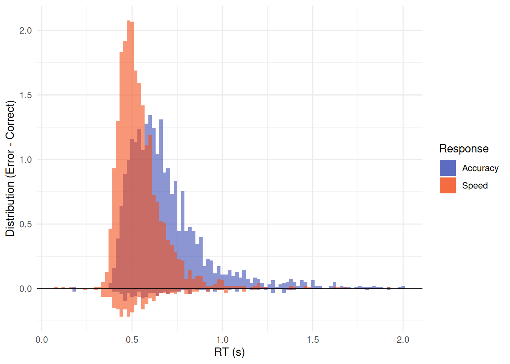
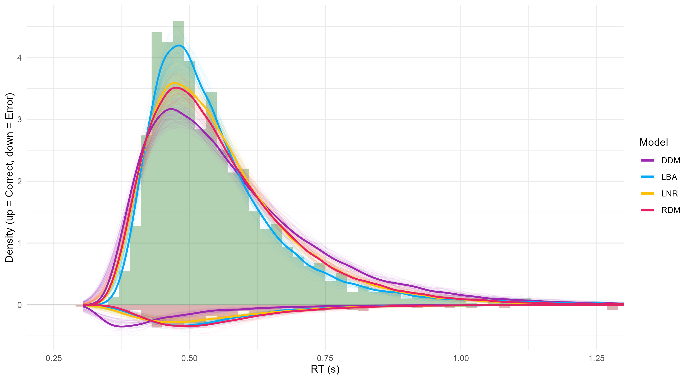

# Decision Making Models

``` r

library(cogmod)
library(easystats)
library(ggplot2)
library(brms)
library(cmdstanr)

options(mc.cores = parallel::detectCores() - 2)
```

## The Data

Decision making models jointly account for the **choice** that was made
and the **response time (RT)** it took to make it. Rather than
simulating data, we re-use the `wagenmakers2008` dataset (see the
[RT-only
Models](https://github.com/DominiqueMakowski/cogmod/articles/rt_models.md)
vignette) - but this time, instead of discarding the errors, we model
**choice** as *correct* vs. *error* responses. This is a common strategy
in the decision-making literature when the task itself does not have a
natural “left vs. right” stimulus category to map onto the two
accumulators/boundaries of the models below.

Evidence accumulation models are considerably more expensive to sample
than the RT-only models. We therefore use a smaller subset of the data
here, only one participant, so that the models below can be fit in a
reasonable amount of time for demonstration purposes.

``` r

set.seed(123)  # For reproducibility

df <- cogmod::wagenmakers2008
df <- df[df$Participant == 1, ]

# Show 10 first rows
head(df[c("Participant", "Condition", "RT", "Error")], 10)
#>    Participant Condition    RT Error
#> 1            1     Speed 0.700     0
#> 2            1     Speed 0.392     1
#> 3            1     Speed 0.460     0
#> 4            1     Speed 0.455     0
#> 5            1     Speed 0.505     1
#> 6            1     Speed 0.773     0
#> 7            1     Speed 0.390     0
#> 8            1     Speed 0.587     1
#> 9            1     Speed 0.603     0
#> 10           1     Speed 0.435     0
```

``` r

ggplot(df, aes(x = RT, fill = factor(Error))) +
  geom_histogram(bins = 100, alpha = 0.8, position = "identity") +
  facet_wrap(~Condition) +
  labs(x = "RT (s)", fill = "Response") +
  scale_fill_manual(values = c("darkgreen", "darkred"), labels = c("Correct", "Error")) +
  theme_minimal()
```



Errors are much rarer than correct responses (especially in the
`Accuracy` condition), which can be problematic for accurate
estimations.

## Models

All five models below use `dec(Error)` to indicate the two-choice
outcome (`0` = Correct, `1` = Error), and a fixed `minrt` (the minimum
observed RT) to scale the non-decision time parameter `tau`.

### Drift Diffusion Model (DDM)

The DDM assumes that evidence accumulates towards one of two boundaries
at a rate `mu` (drift rate). `bs` is the boundary separation (higher =
more cautious), `bias` is the starting point between the two boundaries
(`0.5` = unbiased), and `tau` is the non-decision time (as a proportion
of `minrt`).

Note that we use the “simple” 4-parameter DDM here, which does not
include between-trial variability in drift rate, starting point, or
non-decision time, hence the `sigmadrift`, `sigmabias`, and `sigmatau`
parameters are fixed to `0`. Estimating these parameters is possible,
but considerably more expensive and often unnecessary for many
applications.

``` r

f <- bf(
  RT | dec(Error) ~ Condition,
  bs ~ Condition,
  bias ~ 1,
  tau ~ 1,
  minrt = min(df$RT),
  sigmadrift = 0,
  sigmabias = 0,
  sigmatau = 0,
  family = ddm()
)

m_ddm <- brm(f,
  data = df,
  init = 0,
  stanvars = ddm_stanvars(),
  chains = 4, iter = 500, backend = "cmdstanr"
)

m_ddm <- brms::add_criterion(m_ddm, "loo")  # Add model performance criterion
```

### DDM with Drift Variability (DDM-5)

The three variability parameters are not decoration: each produces a
specific, and different, effect on the *relative* speed of correct and
error responses. Between-trial variability in the **drift rate**
(`sigmadrift`, Ratcliff’s $`s_v`$) makes errors *slower* than correct
responses, because errors are then contributed disproportionately by the
trials that happened to draw a low drift. Variability in the **starting
point** (`sigmabias`, $`s_z`$) does the opposite, producing *faster*
errors, and variability in the **non-decision time** (`sigmatau`,
$`s_{t0}`$) mostly affects the leading edge of the distribution. Which
one to free is therefore an empirical question with a visible answer,
and here the errors are slightly *slower* than the correct responses -
so `sigmadrift` is the parameter to free.

We keep `sigmabias` and `sigmatau` fixed at `0`, for two reasons.
Statistically they are weakly identified with only ~160 error trials,
and computationally the exact zero matters: `cogmod`’s Stan code falls
back to the dedicated (and much cheaper) drift-variability-only density
when both are exactly `0`, and to adaptive numerical quadrature
otherwise. A prior *concentrated near* zero would pay the full cost of
the 7-parameter form without buying anything.

``` r

f <- bf(
  RT | dec(Error) ~ Condition,
  bs ~ Condition,
  bias ~ 1,
  tau ~ 1,
  sigmadrift ~ 1,
  minrt = min(df$RT),
  sigmabias = 0,
  sigmatau = 0,
  family = ddm()
)

priors <- brms::set_prior("normal(0, 1)", class = "Intercept", dpar = "sigmadrift") |>
  brms::validate_prior(f, data = df)

m_ddm5 <- brm(f,
  data = df,
  prior = priors,
  init = 0,
  stanvars = ddm_stanvars(),
  chains = 4, iter = 500, backend = "cmdstanr"
)

m_ddm5 <- brms::add_criterion(m_ddm5, "loo")  # Add model performance criterion
```

### LogNormal Race (LNR)

The LNR is a somewhat simpler model. It is similar to the LBA, but each
accumulator’s finishing time is drawn directly from a LogNormal
distribution instead of a ballistic accumulation process. `mu`
(`nuzero`) and `nuone` are the (inverse log-space mean) processing
speeds for the “Error” and “Correct” accumulators, and
`sigmazero`/`sigmaone` their log-space SDs.

``` r

f <- bf(
  RT | dec(Error) ~ Condition,
  nuone ~ Condition,
  sigmazero ~ 1,
  sigmaone ~ 1,
  tau ~ 1,
  minrt = min(df$RT),
  family = lnr()
)

priors <- brms::set_prior("normal(0, 1)", class = "Intercept", dpar = "tau") |>
  brms::validate_prior(f, data = df)

m_lnr <- brm(f,
  data = df,
  # prior = priors,
  init = 0,
  stanvars = lnr_stanvars(),
  chains = 4, iter = 500, backend = "cmdstanr"
)

m_lnr <- brms::add_criterion(m_lnr, "loo")  # Add model performance criterion
```

### Linear Ballistic Accumulator (LBA)

The LBA assumes two independent accumulators (one per choice) that race
towards a common threshold `b` (`sigmabias` = start-point range `A`,
`bs` = extra distance so that `b = A + bs`). `mu` and `driftone` are the
mean drift rates for the “Correct” and “Error” accumulators, and
`sigmazero`/ `sigmaone` their between-trial drift variability.

``` r

f <- bf(
  RT | dec(Error) ~ Condition,
  driftone ~ Condition,
  sigmazero ~ 1,
  sigmaone ~ 1,
  sigmabias ~ 1,
  bs ~ 1,
  tau ~ 1,
  minrt = min(df$RT),
  family = lba()
)

priors <- c(
  brms::set_prior("normal(0, 2)", class = "Intercept"),
  brms::set_prior("normal(0, 1)", class = "Intercept", dpar = "driftone"),
  brms::set_prior("normal(0, 1)", class = "Intercept", dpar = "sigmazero"),
  brms::set_prior("normal(0, 1)", class = "Intercept", dpar = "sigmaone"),
  brms::set_prior("normal(0, 1)", class = "Intercept", dpar = "sigmabias"),
  brms::set_prior("normal(0, 1)", class = "Intercept", dpar = "bs"),
  brms::set_prior("normal(0, 1)", class = "Intercept", dpar = "tau")
) |>
  brms::validate_prior(f, data = df)

m_lba <- brm(f,
  data = df,
  prior = priors,
  init = 0.5,
  stanvars = lba_stanvars(),
  chains = 4, iter = 500, backend = "cmdstanr"
)

m_lba <- brms::add_criterion(m_lba, "loo")  # Add model performance criterion
```

### Racing Diffusion Model (RDM)

The RDM is the LBA’s stochastic counterpart - each accumulator
integrates evidence through the DDM’s random walk process instead of
accumulating linearly. It otherwise keeps the racing architecture: two
independent accumulators, a common threshold `b`, and a start point
drawn from `Uniform(0, sigmabias)`. The consequence of swapping the
ballistic path for a diffusing one is that the noise now lives *within*
a trial rather than between trials. That is the point of the model:
Tillman et al. ([2020](https://doi.org/10.3758/s13423-020-01738-8)) show
that within-trial variability alone accounts for the benchmark choice-RT
phenomena, without the between-trial drift variability that the LBA
(`sigmazero`/`sigmaone`) and the full DDM (`sigmadrift`) need. It is
therefore the more parsimonious race: `mu` and `driftone` are the drift
rates for the “Correct” and “Error” accumulators, and there is no drift
variability parameter to estimate.

Because each accumulator is a Wald (shifted inverse Gaussian) process,
the drift rates use a softplus link and are constrained to be
non-negative.

``` r

f <- bf(
  RT | dec(Error) ~ Condition,
  driftone ~ Condition,
  sigmabias ~ 1,
  bs ~ 1,
  tau ~ 1,
  minrt = min(df$RT),
  family = rdm()
)

priors <- c(
  brms::set_prior("normal(0, 2)", class = "Intercept"),
  brms::set_prior("normal(0, 1)", class = "Intercept", dpar = "driftone"),
  # See the note below: sigmabias needs a prior to stay identified.
  brms::set_prior("normal(-1, 1)", class = "Intercept", dpar = "sigmabias"),
  brms::set_prior("normal(0, 1)", class = "Intercept", dpar = "bs"),
  brms::set_prior("normal(0, 1)", class = "Intercept", dpar = "tau")
) |>
  brms::validate_prior(f, data = df)

m_rdm <- brm(f,
  data = df,
  prior = priors,
  init = 0.5,
  stanvars = rdm_stanvars(),
  chains = 4, iter = 500, backend = "cmdstanr"
)

m_rdm <- brms::add_criterion(m_rdm, "loo")  # Add model performance criterion
```

### Identifiability of `sigmabias` and `bs`

This concerns the LBA as much as the RDM, since both are parameterized
the same way. The two parameters enter the model only through the
threshold `b = bs + sigmabias`, so they trade off almost freely: on
simulated data with 4,000 trials, the profile log-likelihood moves by
about 3 units as `sigmabias` sweeps from 0 to half the threshold, while
`bs` slides to compensate. Under flat priors the sampler drifts down the
`sigmabias -> 0` ridge (which is just a race of two plain Wald
accumulators) and produces divergent transitions - several hundred of
them, in a 4,000-trial simulation.

A weakly informative prior on `sigmabias` is enough to prevent that:
under the softplus link, `normal(-1, 1)` is centred near `0.31`, and it
removes the divergences entirely. It does not make `sigmabias` itself
trustworthy, though. In a recovery check where the true value was `0.3`
and the prior was centred at `0.31`, the posterior still came back at
`0.21` - the likelihood pulls it down the ridge and the prior only
partly resists. The *sum* recovered accurately over the same fit (1.08
against a true 1.10).

So prefer `bs + sigmabias` whenever you interpret a threshold or compare
one across conditions, and treat the split between the two as
weakly-determined.

## Model Comparison

### Model Fit

``` r

loo::loo_compare(m_ddm, m_ddm5, m_lba, m_lnr, m_rdm) |>
  report::report()
#> The difference in predictive accuracy, as indexed by Expected Log Predictive
#> Density (ELPD-LOO), suggests that '1' is the best model (ELPD = 960.72),
#> followed by '2' (diff-ELPD = -56.02 +- 11.54, p < .001), '3' (diff-ELPD =
#> -76.21 +- 15.79, p < .001), '4' (diff-ELPD = -99.40 +- 20.69, p < .001) and '5'
#> (diff-ELPD = -180.57 +- 21.15, p < .001)
```

Two features of that ranking are worth dwelling on, because neither is
what one might expect.

The first is that the RDM finishes behind the LBA, despite being the
more parsimonious race - it buys its economy by dropping the
between-trial drift variability that the LBA carries in
`sigmazero`/`sigmaone`. On this participant, that variability earns its
keep. This is exactly the kind of question a common interface is for:
the claim that within-trial noise alone suffices is an empirical one,
and here it is tested rather than assumed.

The second is that the DDM comes last, even though it is the only model
here allowed to move its threshold across conditions (`bs ~ Condition`),
which is the mechanism the speed instructions are believed to act on.
The explanation is that its deficit lies on a different axis entirely.
We fitted the *simple* 4-parameter DDM, with `sigmadrift`, `sigmabias`
and `sigmatau` all fixed to `0`, and a DDM stripped of between-trial
variability can only produce errors that are *faster* than correct
responses. In this dataset they are slightly slower (median 0.533 s
against 0.519 s). Sampling from each fitted model makes the mismatch
plain: the DDM predicts errors 0.11 s faster than correct responses (95%
CI `[-0.13, -0.08]`), while the observed difference is `+0.014` s - far
outside that interval. The races each carry a separate drift for the
error accumulator and so are not forced into that prediction: the RDM
puts the gap at `+0.006` `[-0.015, +0.031]`, the LBA at `+0.004`
`[-0.021, +0.036]` and the LNR at `-0.008` `[-0.036, +0.021]`, all three
comfortably covering the observed value. Getting the condition mechanism
right does not compensate for being unable to represent the error
distribution at all, and the remedy is to free the variability
parameters rather than to abandon the DDM.

### Sampling Duration

As with the RT-only models, we summarize each model’s sampling duration
by the median time per chain. Choice+RT models are considerably more
expensive to sample than RT-only models (see the [RT-only
Models](https://github.com/DominiqueMakowski/cogmod/articles/rt_models.md)
vignette): the DDM relies on Stan’s `wiener_lpdf`, which is
comparatively slow, while the LBA, LNR and RDM likelihoods involve
evaluating both a “winner” density and a “loser” survival function for
every observation. Among the three races, the LNR is by far the
cheapest, since its density and survival are just LogNormal ones, while
the RDM and the LBA each need several normal CDF evaluations per
observation and land in the same, much slower, range.

``` r

duration <- rbind(
  data_modify(attributes(m_ddm$fit)$metadata$time$chain, Model = "DDM"),
  data_modify(attributes(m_ddm5$fit)$metadata$time$chain, Model = "DDM-5"),
  data_modify(attributes(m_lba$fit)$metadata$time$chain, Model = "LBA"),
  data_modify(attributes(m_lnr$fit)$metadata$time$chain, Model = "LNR"),
  data_modify(attributes(m_rdm$fit)$metadata$time$chain, Model = "RDM")
) |>
  data_modify(Model = factor(Model, levels = c("LNR", "DDM", "DDM-5", "RDM", "LBA")))

duration_median <- aggregate(total ~ Model, data = duration, FUN = median)

duration_median |>
  ggplot(aes(x = Model, y = total, fill = Model)) +
  geom_col() +
  geom_text(aes(label = round(total, 1)), vjust = -0.5, size = 3.5) +
  labs(y = "Median Sampling Duration per Chain (s)") +
  scale_fill_material_d(guide = "none") +
  theme_minimal()
```


### Posterior Predictive Check

Each model predicts a **pair** of outcomes per trial, so
`estimate_prediction()` returns them in a `Component` column (`"rt"` and
`"response"`), which we pivot back into two columns.

Correct responses are drawn upwards and errors downwards, with the
observed data as histograms and the four models as overlaid density
lines (faint: one per posterior draw; bold: pooled over draws). Rather
than normalizing each half separately, both are scaled by the
**proportion** of that response, so that the area under each curve
equals its predicted frequency - which is why the error half is roughly
a twelfth of the size of the correct one. This makes the plot a check on
the *joint* distribution of choices and RTs: a model can only match it
by getting the error rate *and* the shape of both RT distributions
right.

Code

``` r

pred <- rbind(
  estimate_prediction(m_ddm, data = df, iterations = 50, keep_iterations = TRUE) |>
    reshape_iterations() |>
    data_modify(Model = "DDM"),
  estimate_prediction(m_ddm5, data = df, iterations = 50, keep_iterations = TRUE) |>
    reshape_iterations() |>
    data_modify(Model = "DDM-5"),
  estimate_prediction(m_lba, data = df, iterations = 50, keep_iterations = TRUE) |>
    reshape_iterations() |>
    data_modify(Model = "LBA"),
  estimate_prediction(m_lnr, data = df, iterations = 50, keep_iterations = TRUE) |>
    reshape_iterations() |>
    data_modify(Model = "LNR"),
  estimate_prediction(m_rdm, data = df, iterations = 50, keep_iterations = TRUE) |>
    reshape_iterations() |>
    data_modify(Model = "RDM")
) |>
  datawizard::data_select(select = c("Row", "Component", "iter_value", "iter_group", "iter_index", "Model")) |>
  datawizard::data_to_wide(id_cols = c("Row", "iter_group", "Model"), values_from = "iter_value", names_from = "Component")

# The LBA occasionally predicts enormous RTs (a near-zero drift rate takes a
# very long time to reach the threshold). `stat_density()` spreads its
# evaluation grid over the whole x-axis range, so a single extreme draw would
# flatten every curve.
pred <- data_filter(pred, rt < 3)

correct <- pred[pred$response == 0, ]
error <- pred[pred$response == 1, ]

n_obs <- nrow(df)  # Trials per posterior draw
n_iter <- length(unique(pred$iter_group))
bw <- 0.02  # Histogram bin width

# Dividing the counts by the *total* number of trials (rather than by the
# number of trials of that response) scales each half by its own frequency.
p <- ggplot(df, aes(x = RT)) +
  # Observed data
  geom_histogram(data = df[df$Error == 0, ], aes(y = after_stat(count) / (n_obs * bw)),
                 binwidth = bw, fill = "darkgreen", alpha = 0.3) +
  geom_histogram(data = df[df$Error == 1, ], aes(y = -after_stat(count) / (n_obs * bw)),
                 binwidth = bw, fill = "darkred", alpha = 0.3) +
  # One faint line per posterior draw
  geom_line(data = correct,
            aes(x = rt, y = after_stat(count) / n_obs, color = Model,
                group = interaction(Model, iter_group)),
            stat = "density", alpha = 0.05, linewidth = 0.3) +
  geom_line(data = error,
            aes(x = rt, y = -after_stat(count) / n_obs, color = Model,
                group = interaction(Model, iter_group)),
            stat = "density", alpha = 0.05, linewidth = 0.3) +
  # Posterior predictive density, pooled over draws
  geom_line(data = correct,
            aes(x = rt, y = after_stat(count) / (n_obs * n_iter), color = Model),
            stat = "density", linewidth = 0.9) +
  geom_line(data = error,
            aes(x = rt, y = -after_stat(count) / (n_obs * n_iter), color = Model),
            stat = "density", linewidth = 0.9) +
  geom_hline(yintercept = 0, color = "grey40", linewidth = 0.3) +
  scale_color_material_d(palette = "rainbow") +
  guides(color = guide_legend(override.aes = list(alpha = 1, linewidth = 1.2))) +
  coord_cartesian(xlim = c(0.25, 1.25)) +
  labs(x = "RT (s)", y = "Density (up = Correct, down = Error)", color = "Model") +
  theme_minimal()
p
```



The mismatch discussed above is visible in the lower half: the **DDM**
places its error density distinctly to the left of the observed errors -
it peaks before the correct responses do - whereas the three races put
theirs on top of the observed distribution. In the upper half all four
are close, which is the point: the DDM’s problem is invisible if one
only looks at the RTs of correct responses.
