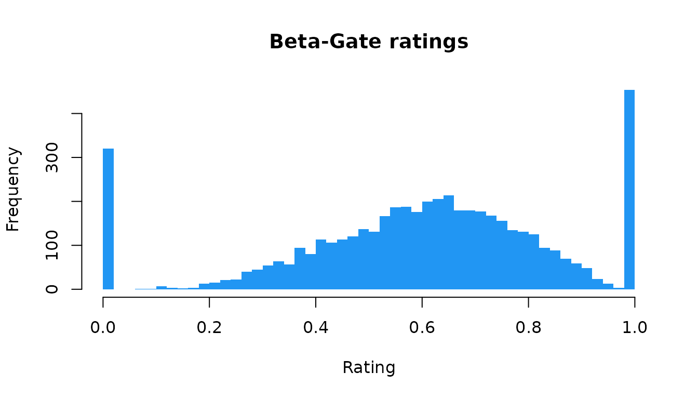

# Overview of cogmod

**cogmod** provides cognitive models for two broad families of
behavioural data: subjective ratings collected on Likert or analog
scales, and decision making tasks that yield reaction times and choices.

Each model comes in two halves. The first is a set of plain R
functions - `r*()` to simulate, `d*()` for the density, useful on their
own for simulation, predictions, visualization, and teaching.

``` r

library(cogmod)

set.seed(3)
x <- rcogmod_betagate(5000, mu = 0.6, phi = 4, pex = 0.15, bex = 0.4)
hist(x, breaks = 50, col = "#2196F3", border = NA,
     main = "Beta-Gate ratings", xlab = "Rating")
```



The second half is the machinery needed to *fit* the model as a custom
response distribution in [**brms**](https://paulbuerkner.com/brms/): a
family constructor, the Stan code implementing its log-density, and the
`log_lik`/`posterior_predict`/`posterior_epred` methods that make `loo`,
[`pp_check()`](https://mc-stan.org/bayesplot/reference/pp_check.html)
and the **easystats** post-processing functions work as they normally
would. Fitting requires a Stan backend
([**cmdstanr**](https://mc-stan.org/cmdstanr/) is recommended).

``` r

library(brms)

f <- bf(rating ~ condition + (1 | participant), phi ~ 1, pex ~ 1, bex ~ 1,
        family = cogmod_betagate())

m <- brm(
  f,
  data = df,
  stanvars = cogmod_stanvars(f),
  backend = "cmdstanr"
)
```

The pattern is the same for every model: name the family in
[`bf()`](https://paulbuerkner.com/brms/reference/brmsformula.html), then
let
[`cogmod_stanvars()`](https://dominiquemakowski.github.io/cogmod/reference/cogmod_stanvars.md)
supply the Stan code that goes with it. Two companions follow the same
shape - `cogmod_priors(f, df)` for the priors `brms` would otherwise
leave flat, and `cogmod_inits(f, df)` for starting values on the
families whose default start is a bad one.

## Where to go next

The [function
reference](https://dominiquemakowski.github.io/cogmod/reference/index.html)
lists every model with its parameterisation. Worked, end-to-end analyses
live on the package website, where they can be built with fitted models
that would be too slow to include here:

- [Subjective
  Ratings](https://dominiquemakowski.github.io/cogmod/articles/subjective_ratings.html) -
  Beta-Gate and CHOCO on rating data, compared against ZOIB and ordinal
  alternatives.
- [How to Properly Analyze Reaction Times
  Data](https://dominiquemakowski.github.io/cogmod/articles/rt_models.html) -
  why linear models on mean RT mislead, and how the RT-only families
  compare.
- [Decision Making
  Models](https://dominiquemakowski.github.io/cogmod/articles/decision_making.html) -
  fitting and comparing DDM, LBA, RDM and LNR on choice-RT data.
- [Assessing
  Reliability](https://dominiquemakowski.github.io/cogmod/articles/reliability.html) -
  interindividual variability and reliability of model parameters.

## Citation

``` r

citation("cogmod")
#> To cite cogmod in publications use:
#> 
#>   Makowski, D. (2026). cogmod: Cognitive Models for Subjective Scales
#>   and Decision Making Tasks. R package version 0.3.0.
#>   https://github.com/DominiqueMakowski/cogmod
#> 
#> A BibTeX entry for LaTeX users is
#> 
#>   @Manual{makowski2026cogmod,
#>     title = {{cogmod}: Cognitive Models for Subjective Scales and Decision Making Tasks},
#>     author = {Dominique Makowski},
#>     year = {2026},
#>     note = {R package version 0.3.0},
#>     url = {https://github.com/DominiqueMakowski/cogmod},
#>   }
```
