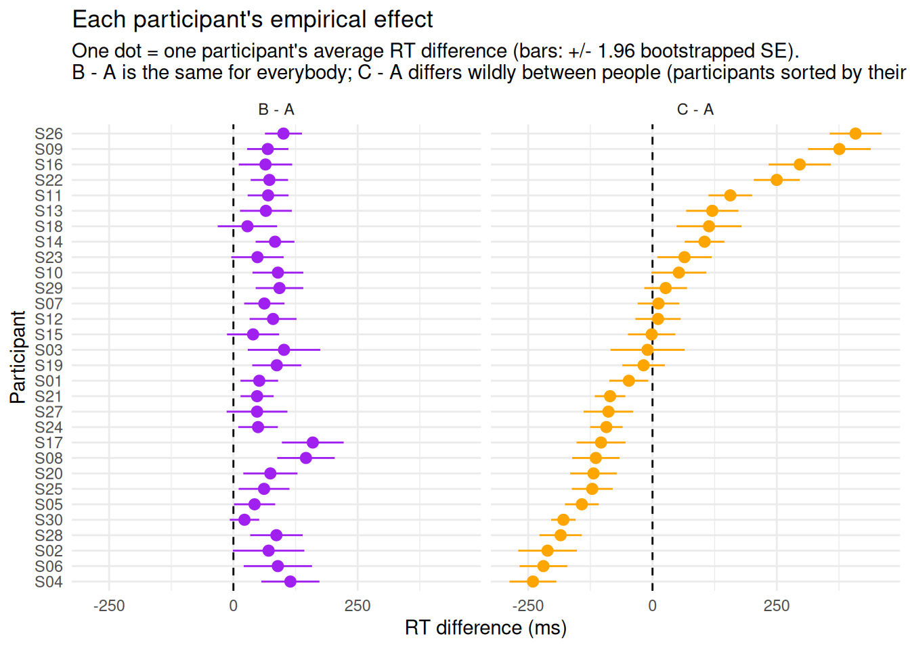
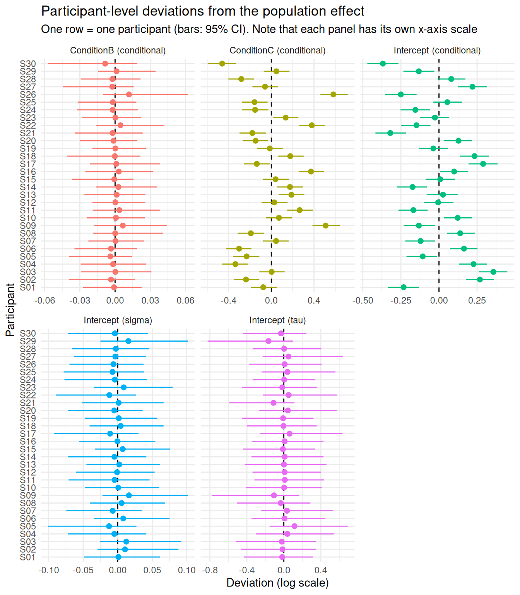

# Assessing Reliability and Interindividual Variability

``` r

library(cogmod)
library(easystats)
library(dplyr)
library(ggplot2)
library(brms)
library(cmdstanr)

options(mc.cores = parallel::detectCores() - 2)
```

Imagine we have designed a brand new cognitive task. It has three
conditions - **A**, **B** and **C** - and our ambition is to use it in a
**clinical context**: to quantify something about *individuals*, so that
a patient’s score can be related to their symptoms, compared to a norm,
or tracked over time.

The first thing we do is run a validation study and test whether the
conditions affect reaction times. As we will see, only one of them turns
out to have a significant effect - and the tempting conclusion is that
this effect is the one the task actually captures, and therefore the one
we should be computing for each patient.

That conclusion would be premature, and most likely wrong. An average
effect tells us what the manipulation does *to the group*. It says
nothing about whether it does the same thing to everybody, and nothing
about whether we can measure it in a single person with any precision.
Yet those two properties - **interindividual variability** and
**reliability** - are exactly what determines whether a task can serve
as an individual-level instrument, and they have to be assessed on their
own terms.

## Data Description

Our validation study is a typical repeated-measures design: 30
participants each perform 80 trials in each of the three conditions, and
we record their reaction times.

Code

``` r

# The data are generated from a **shifted LogNormal** process (see cogmod's
# rt_lognormal() family): a non-decision time `ndt` - the incompressible
# encoding + motor delay - to which a LogNormal-distributed decision time is
# added.
#
# Because we are simulating the data, we get to decide what is true, and we make
# the two effects *deliberately* different:
#
# - **A vs. B**: a small but extremely **consistent** effect. Every participant
#   is slowed down by about the same amount (the between-participant SD of the
#   effect is tiny, 0.01). There is essentially no interindividual variability.
# - **A vs. C**: an effect with a population mean of **exactly zero**, but a very
#   large between-participant SD (0.30). Some participants are dramatically
#   slowed down by condition C, others are dramatically speeded up.

set.seed(14)

n_participants <- 30
n_trials <- 80  # Per condition
ndt <- 0.15  # Non-decision time (s): no response can occur before that

participants <- data.frame(
  Participant = sprintf("S%02d", 1:n_participants),
  # Overall speed: participants differ substantially from one another
  Intercept = rnorm(n_participants, mean = log(0.6), sd = 0.20),
  # A vs. B: small effect, (almost) identical for everybody
  Effect_B = rnorm(n_participants, mean = 0.10, sd = 0.01),
  # A vs. C: no effect on average, but huge interindividual variability
  Effect_C = rnorm(n_participants, mean = 0.00, sd = 0.30)
)

sim <- expand.grid(
  Trial = 1:n_trials,
  Condition = c("A", "B", "C"),
  Participant = participants$Participant,
  stringsAsFactors = FALSE
) |>
  left_join(participants, by = "Participant") |>
  mutate(
    # Trial-level mean of the *decision* time, on the log scale
    meanlog = Intercept +
      if_else(Condition == "B", Effect_B, 0) +
      if_else(Condition == "C", Effect_C, 0),
    # Generate RTs, adding within-participant (trial-to-trial) noise, and shift
    # the whole distribution by the non-decision time
    RT = ndt + rlnorm(n(), meanlog = meanlog, sdlog = 0.22),
    Participant = factor(Participant),
    Condition = factor(Condition)
  ) |>
  arrange(Participant, Condition, Trial) |>
  select(Participant, Trial, Condition, RT)
```

Looking at the raw distributions, the three conditions are nearly
indistinguishable, and nothing suggests that B and C differ in any
interesting way.

``` r

ggplot(sim, aes(x = RT, fill = Condition)) +
  geom_density(alpha = 0.5) +
  scale_fill_manual(values = c("A" = "grey40", "B" = "purple", "C" = "orange")) +
  labs(
    title = "Raw RT distributions by condition",
    subtitle = "All trials pooled across participants: the three conditions look alike",
    x = "Reaction Time (s)", y = "Density"
  ) +
  theme_minimal()
```


## Empirical Estimates

Let us now compute the score we would hand to a clinician: for each
participant, average the RTs within each condition and subtract, giving
an “empirical” effect of B - A and of C - A (expressed here in
milliseconds).

Because each of these differences is computed from a finite number of
trials, it also comes with its own uncertainty. We quantify it by
**bootstrapping**: for a given participant, we resample their trials
with replacement within each condition, recompute the difference, and
repeat. The SD of the resulting bootstrap distribution is the **standard
error (SE)** of that participant’s score - i.e., how much it would
wobble if we ran the task again.

``` r

# Bootstrapped SE of the difference between two sets of trials
boot_se <- function(rt1, rt2, n_boot = 1000) {
  boot <- replicate(
    n_boot,
    mean(sample(rt2, replace = TRUE)) - mean(sample(rt1, replace = TRUE))
  )
  sd(boot)
}

set.seed(3)

empirical <- sim |>
  reframe(
    Effect = c("B - A", "C - A"),
    Difference = c(
      mean(RT[Condition == "B"]) - mean(RT[Condition == "A"]),
      mean(RT[Condition == "C"]) - mean(RT[Condition == "A"])
    ) * 1000,
    SE = c(
      boot_se(RT[Condition == "A"], RT[Condition == "B"]),
      boot_se(RT[Condition == "A"], RT[Condition == "C"])
    ) * 1000,
    .by = Participant
  )

empirical |>
  summarise(
    Mean = mean(Difference),
    SD = sd(Difference),
    Min = min(Difference),
    Max = max(Difference),
    SE = mean(SE),
    .by = Effect
  )
#>   Effect      Mean        SD       Min      Max       SE
#> 1  B - A 73.956648  30.80423   22.2618 159.6227 25.45262
#> 2  C - A  0.444845 170.68889 -240.4986 408.4365 24.20110
```

The two effects could not be more different, and yet **the number we
usually report - the mean - is blind to it**. The B - A effect is about
+74 ms on average, with a between-participant SD of ~31 ms. The C - A
effect has a mean of essentially zero (+0.4 ms) - but a
between-participant SD of ~171 ms, and it ranges from -240 ms to +408 ms
depending on which participant we look at.

The last column is where things get interesting. The typical
participant’s score carries an SE of about **25 ms** in both cases - the
two effects are measured with the same precision. But that precision
means very different things relative to how much participants actually
differ: 25 ms of noise is almost as large as the 31 ms of observed
spread in B - A, while it is a small fraction of the 171 ms observed in
C - A.

``` r

# Sort participants by the size of their C - A effect
order_C <- empirical |>
  filter(Effect == "C - A") |>
  arrange(Difference) |>
  pull(Participant)

empirical |>
  mutate(Participant = factor(Participant, levels = order_C)) |>
  ggplot(aes(x = Difference, y = Participant, color = Effect)) +
  geom_vline(xintercept = 0, linetype = "dashed") +
  geom_linerange(aes(xmin = Difference - 1.96 * SE, xmax = Difference + 1.96 * SE)) +
  geom_point(size = 2.5) +
  facet_wrap(~Effect) +
  scale_color_manual(values = c("B - A" = "purple", "C - A" = "orange")) +
  labs(
    title = "Each participant's empirical effect",
    subtitle = paste(
      "One dot = one participant's average RT difference (bars: +/- 1.96 bootstrapped SE).",
      "\nB - A is the same for everybody; C - A differs wildly between people",
      "(participants sorted by their C - A effect)."
    ),
    x = "RT difference (ms)", y = "Participant"
  ) +
  theme_minimal() +
  theme(legend.position = "none")
```



The picture is unambiguous. On the left, every single participant shows
the same small slowing in condition B: the effect is *reliable* in the
sense of being reproducible across people, but there is almost nothing
to distinguish one participant from another - the error bars are nearly
as wide as the entire range of scores. On the right, participants are
spread all over the place, with some being massively slower and others
massively faster in condition C, by amounts that dwarf their individual
error bars - and these differences cancel out to nothing at the group
level.

This is bad news for our original plan. Condition B - the one that
reached significance, and on which we were about to build our clinical
index - gives essentially the same score to everybody, and a measure
that does not vary between people cannot possibly correlate with
symptoms, separate patients from controls, or track change. Condition
C - the “null” effect that we would have discarded - is the one carrying
the individual differences we are after.

> **Careful: empirical estimates are noisy!**

These per-participant differences are *not* clean measurements of each
participant’s true effect. Each one is computed from a finite number of
trials and therefore carries measurement error - which is exactly what
the bootstrapped SE quantifies. For B - A, there still seems to be a
spread of ~31 ms, even though we generated the data with a near-zero
between-participant SD. The bootstrap tells us why: with an SE of ~25 ms
per participant, the observed variance is almost entirely measurement
noise. Subtracting the noise variance from the observed variance leaves
less than 20 ms of “true” spread - and even that residual is an
overestimate, since both quantities are themselves estimated. For C - A
the same subtraction barely changes anything (171 ms → ~169 ms): there,
the differences between people are real.

This back-of-the-envelope correction is the whole idea behind
reliability, but doing it by hand has obvious limits: it treats each
participant’s score as a fixed number to be de-noised afterwards, it
does not propagate the uncertainty into anything we do next (e.g.,
correlating the scores with a symptom questionnaire), and it says
nothing about the shape of the RT distribution the scores came from. **A
model can do all of this in one go**, by estimating the
between-participant variability and the trial-level noise jointly
instead of separating them after the fact.

## Modeling

We now fit a **mixed [shifted LogNormal
model](https://dominiquemakowski.github.io/cogmod/articles/rt_models.html#shifted-lognormal)**,
which mirrors the way the data were generated: the effect of `Condition`
is estimated at the population level (fixed effects) *and* allowed to
vary across participants (random slopes).

Because the family has more than one parameter, we can do the same for
the other two: `sigma` (how variable a participant’s decision times are)
and `tau` (their non-decision time, as a proportion of the minimum RT).
Giving each of them its own `(1 | Participant)` term means that every
participant gets their own dispersion and their own shift, rather than
being forced to share the group’s. This costs a few parameters, but it
is the only way to find out whether these quantities carry individual
differences of their own - and, as we will see below, to check whether
they are reliable enough to be used as scores.

``` r

f <- bf(
  RT ~ Condition + (Condition | Participant),
  sigma ~ 1 + (1 | Participant),
  tau ~ 1 + (1 | Participant),
  minrt = min(sim$RT),
  family = rt_lognormal()
)

priors <- brms::set_prior("normal(0, 1)", class = "Intercept", dpar = "tau") |>
  brms::validate_prior(f, data = sim)

m <- brm(f,
  data = sim,
  prior = priors,
  stanvars = rt_lognormal_stanvars(),
  init = 0,
  chains = 4, iter = 1000, backend = "cmdstanr"
)
```

The random-effects parts are the key ingredient: they tell the model
that each participant has their own intercept *and* their own condition
effects, their own `sigma` and their own `tau`, and they estimate how
much each of these varies. Note also that we do not need to transform
the RTs: `family = rt_lognormal()` handles the skew directly - and,
through `tau`, the non-decision time - so the coefficients are simply
expressed on the log scale of the decision time.

Let us first look at the **fixed effects**, i.e., the population-level
answer to “is there an effect of condition?”.

    #> Loading required namespace: rstan
    #> # Fixed Effects
    #>
    #> Parameter   | Median |         95% CI |     pd |  Rhat | ESS (tail)
    #> -------------------------------------------------------------------
    #> (Intercept) |  -0.45 | [-0.55, -0.36] |   100% | 1.010 |        671
    #> ConditionB  |   0.10 | [ 0.09,  0.12] |   100% | 1.005 |       1562
    #> ConditionC  |  -0.02 | [-0.13,  0.08] | 66.35% | 1.005 |        750
    #>
    #> # sigma Parameters
    #>
    #> Parameter   | Median |         95% CI |   pd |  Rhat | ESS (tail)
    #> -----------------------------------------------------------------
    #> (Intercept) |  -1.36 | [-1.43, -1.29] | 100% | 1.000 |        954
    #>
    #> # tau Parameters
    #>
    #> Parameter   | Median |        95% CI |     pd |  Rhat | ESS (tail)
    #> ------------------------------------------------------------------
    #> (Intercept) |   0.14 | [-0.35, 0.63] | 72.05% | 1.001 |        947
    #>
    #> Uncertainty intervals (equal-tailed) computed using a MCMC distribution
    #>   approximation.

This reproduces the classic conclusion: a clear effect of condition B
(0.10 on the log scale, 95% CI \[0.09, 0.12\], *pd* = 100%), and nothing
at all for condition C (-0.02, 95% CI \[-0.12, 0.08\], *pd* = 65%),
whose credible interval is comfortably centered on zero.

The crucial addition is the **random effects**, which quantify how much
participants differ from each other on each of these parameters:

``` r

parameters(m, effects = "random_variance")
#> # Fixed Effects (Participant)
#> 
#> Parameter               | Median |        95% CI |     pd |  Rhat | ESS (tail)
#> ------------------------------------------------------------------------------
#> (Intercept)             |   0.20 | [ 0.15, 0.27] |   100% | 1.009 |        693
#> ConditionB              |   0.01 | [ 0.00, 0.03] |   100% | 1.003 |        781
#> ConditionC              |   0.27 | [ 0.20, 0.36] |   100% | 1.004 |       1109
#> Intercept ~ ConditionB  |  -0.07 | [-0.82, 0.79] | 56.15% | 1.001 |       1303
#> Intercept ~ ConditionC  |  -0.18 | [-0.51, 0.18] | 83.30% | 1.003 |       1379
#> ConditionB ~ ConditionC |   0.42 | [-0.52, 0.93] | 79.55% | 1.049 |        247
#> 
#> # sigma Parameters (Participant)
#> 
#> Parameter   | Median |       95% CI |   pd |  Rhat | ESS (tail)
#> ---------------------------------------------------------------
#> (Intercept) |   0.03 | [0.00, 0.06] | 100% | 1.006 |       1042
#> 
#> # tau Parameters (Participant)
#> 
#> Parameter   | Median |       95% CI |   pd |  Rhat | ESS (tail)
#> ---------------------------------------------------------------
#> (Intercept) |   0.18 | [0.01, 0.44] | 100% | 1.004 |        781
#> 
#> Uncertainty intervals (equal-tailed) computed using a MCMC distribution
#>   approximation.
```

Here the two effects finally become distinguishable. The SD of the
`ConditionB` slope is 0.01, i.e., essentially nothing: participants
barely differ in how much B affects them. The SD of the `ConditionC`
slope, in contrast, is 0.26 - more than twenty times larger. This is the
model formally telling us that *there is a lot going on in condition C,
it just does not go in the same direction for everybody*. Note also that
the model recovers the true between-participant SD of the B effect
(~0.01) rather than the inflated ~31 ms spread of the raw empirical
differences: the measurement noise has been correctly assigned to the
residual term instead of being mistaken for interindividual variability.

## Group-Level Indices Extraction

Beyond knowing that participants differ, we often want to know *how*
each individual differs - for instance to correlate these individual
effects with another variable (a questionnaire score, a diagnosis,
another task). These participant-level deviations can be extracted with
[`modelbased::estimate_grouplevel()`](https://easystats.github.io/modelbased/reference/estimate_grouplevel.html).

``` r

random <- estimate_grouplevel(m)

head(random)
#> Component   | Group       | Level | Parameter  |    Median |      MAD |         95% CI
#> --------------------------------------------------------------------------------------
#> conditional | Participant | S01   | ConditionB | -9.18e-04 | 7.99e-03 | [-0.03,  0.02]
#> conditional | Participant | S01   | ConditionC |     -0.08 |     0.06 | [-0.19,  0.05]
#> conditional | Participant | S01   | Intercept  |     -0.23 |     0.05 | [-0.34, -0.13]
#> conditional | Participant | S02   | ConditionB | -3.51e-03 | 9.38e-03 | [-0.04,  0.02]
#> conditional | Participant | S02   | ConditionC |     -0.24 |     0.06 | [-0.35, -0.12]
#> conditional | Participant | S02   | Intercept  |      0.27 |     0.05 | [ 0.18,  0.36]
```

Each row is one participant’s deviation from the population-level
(fixed) effect, together with its uncertainty. We can visualize all of
them at once - `plot(random)` gives a quick default version, but
building the forest plot by hand lets us give each parameter its own
color:

``` r

as.data.frame(random) |>
  # `Component` distinguishes mu (conditional) from sigma and tau
  mutate(Parameter = paste0(Parameter, " (", Component, ")")) |>
  ggplot(aes(x = Median, y = Level, color = Parameter)) +
  geom_vline(xintercept = 0, linetype = "dashed") +
  geom_linerange(aes(xmin = CI_low, xmax = CI_high)) +
  geom_point(size = 2) +
  facet_wrap(~Parameter, scales = "free_x") +
  labs(
    title = "Participant-level deviations from the population effect",
    subtitle = "One row = one participant (bars: 95% CI). Note that each panel has its own x-axis scale",
    x = "Deviation (log scale)", y = "Participant"
  ) +
  theme_minimal() +
  theme(legend.position = "none")
```



The contrast between the two effects is now expressed as model
parameters rather than as raw averages. For `ConditionB`, all the
individual deviations are packed within ±0.03 of zero and every single
credible interval includes zero: the model concludes that, once
measurement noise is accounted for, participants essentially share the
same effect. For `ConditionC`, the deviations span -0.45 to +0.56 and
most of them clearly exclude zero - these are genuine, statistically
supported individual differences. The `sigma` and `tau` components
appear here as well, each with one deviation per participant.

Because these estimates come from a model, they are also **shrunk**
towards the population mean in proportion to how noisy each
participant’s data is: participants with fewer or more variable trials
are pulled more strongly towards the average. This is a feature, not a
bug - it is the model-based counterpart of the noise correction we
attempted by hand above, applied participant by participant rather than
to the group as a whole. It prevents us from over-interpreting extreme
values that the raw empirical differences produce by chance, and it is
why model-based individual scores are generally more reliable than
difference scores computed by hand - all the more so when participants
provide few trials, are noisy, or contribute unbalanced numbers of
observations.

## Quantifying Variability: the D-vour Index

So far we have been *looking* at plots and comparing SDs to SEs by hand.
It would be better to have a single number that answers the question
“are these individual estimates informative enough to be used as
individual scores?”. This is what the **Variance-Over-Uncertainty
Ratio** (*D-vour*), implemented in
[`performance::performance_dvour()`](https://easystats.github.io/performance/reference/performance_reliability.html),
provides. It is, in essence, a Signal-to-Noise ratio iindex
corresponding to the normalized ratio of the observed variability
between group levels to the uncertainty of their estimates:

``` math
D_{\text{vour}} = \frac{\sigma_{\text{between}}^2}{\sigma_{\text{between}}^2 + \mu_{\text{within}}^2}
```

where $`\sigma_{\text{between}}^2`$ is the between-participant
variability (the SD of the random effect point-estimates) and
$`\mu_{\text{within}}^2`$ is the mean squared uncertainty (the average
SE, or MAD, of those estimates). It is bounded between 0 and 1: values
close to 1 mean that participants differ from one another far more than
we are unsure about where each of them stands, while values close to 0
mean that the apparent spread is mostly measurement noise.

This is exactly the comparison we made informally above, and nothing
stops us from applying the same formula to the bootstrapped empirical
estimates:

``` r

empirical |>
  summarise(D_vour = sd(Difference)^2 / (sd(Difference)^2 + mean(SE)^2), .by = Effect)
#>   Effect    D_vour
#> 1  B - A 0.5942750
#> 2  C - A 0.9802932
```

The empirical B - A score lands at ~0.59 and the C - A score at ~0.98.
On the model-based indices, the same index is obtained by passing the
output of `estimate_grouplevel()` (or the model itself) to
`performance_dvour()`:

``` r

performance_dvour(random)
#>     Component       Group  Parameter    D_vour
#> 1 conditional Participant ConditionB 0.1530186
#> 2 conditional Participant ConditionC 0.9471905
#> 3 conditional Participant  Intercept 0.9436673
#> 4       sigma Participant  Intercept 0.1220825
#> 5         tau Participant  Intercept 0.1276238
```

The interpretation follows the same logic in both cases: the
`ConditionC` effect is highly reliable - the between-participant
differences overwhelm the uncertainty of each estimate - whereas
`ConditionB`, despite being the statistically significant effect, does
not carry usable interindividual information. The two versions need not
agree exactly - D-vour is scale-free, but the empirical scores still
contain the trial noise that the model has partialled out - yet they
lead to the same decision.

Because we gave `sigma` and `tau` their own random intercepts, the
output also contains one row per distributional parameter, and each of
them gets its own reliability verdict. This is worth doing
systematically: nothing guarantees that the parameters carrying the
individual differences are the ones we manipulated. Here, we know they
are not, because we generated every participant’s decision times with
the same `sdlog = 0.22` and the same non-decision time of 150 ms - so
`sigma` and `tau` should come out with a low D-vour, the model correctly
reporting that whatever spread we see in their group-level estimates is
uncertainty rather than genuine differences. Treat this as a **negative
control**: it is the behaviour we want the index to have, and it is the
pattern to expect for a parameter that is truly homogeneous across
people.

Real data usually behave differently. Response-time variability in
particular is often *more* discriminating between individuals than the
mean - it is one of the central points of [Williams et
al. (2021)](https://pubmed.ncbi.nlm.nih.gov/32437184/) - and
non-decision time is a natural candidate for a stable, person-specific
quantity. Had these been the reliable components in our data, the
sensible clinical index would have been `sigma` or `tau`, not a
condition contrast at all.

As for any such index, the thresholds are conventions rather than laws.
Values above **0.75** indicate strong group-level differences, values
around **0.5** call for caution (within- and between-group variability
are comparable), and values below **0.5** indicate that measurement
noise dominates. A useful intermediate landmark is **2/3** (0.666),
which corresponds to a 2:1 ratio of between-group variance to
uncertainty, and can be taken as the threshold for *moderately reliable*
random effect estimates.

> **Related indices and constructs**

D-vour is one member of a family of ideas that all revolve around
separating **true score variance** from **error variance**:

- It is formally close to an **intraclass correlation coefficient
  (ICC)**, with the important difference that the denominator uses the
  *uncertainty of the estimates* rather than the raw within-participant
  variance. Concretely, an ICC asks “how large are the differences
  between participants compared to the trial-to-trial noise?”, so it
  stays low whenever single trials are noisy - even if each
  participant’s score is, in the end, precisely estimated. D-vour asks
  the question that actually matters for an individual-level instrument:
  “how large are the differences between participants compared to how
  well we know where each of them stands?”. Collecting more trials per
  participant shrinks that uncertainty and increases D-vour, while
  leaving the raw within-participant variance - and hence the ICC -
  essentially untouched.
- It is a normalized version of the **signal-to-noise ratio** proposed
  by [Rouder & Mehrvarz
  (2024)](https://journals.sagepub.com/doi/full/10.1177/09637214231220923),
  who show that this quantity - unlike classical reliability
  coefficients - characterizes the *task* itself rather than the
  particular sample size it was administered with. The related
  [`performance::performance_reliability()`](https://easystats.github.io/performance/reference/performance_reliability.html)
  implements that trial-count-adjusted variant, and the two are worth
  reporting together.
- It is one quantitative expression of the **reliability paradox**
  described by [Hedge, Powell & Sumner
  (2018)](https://link.springer.com/article/10.3758/s13428-017-0935-1):
  the tasks with the most robust experimental effects are often the
  *worst* at measuring individual differences, precisely because a
  manipulation that affects everybody in the same way (our condition B)
  minimizes between-participant variance. This is not a statistical
  curiosity: it is a structural reason why many well-established
  paradigms transfer poorly to clinical or differential settings.
- The hierarchical-modelling perspective it rests on is developed in
  [Williams et al. (2021)](https://pubmed.ncbi.nlm.nih.gov/32437184/),
  whose mixed-effects location-scale framework is the reason we gave
  `sigma` and `tau` their own random effects above: in `cogmod`’s
  families, the dispersion, the shift or the drift rate can each carry
  their own reliability, and each deserves to be checked separately.

The practical recommendation that follows is simple: **compute D-vour
for every parameter you intend to use as an individual-level score**,
and report it alongside the effect itself. A parameter with a large
fixed effect and a low D-vour is a good group-level manipulation check
and a bad individual-level instrument.

## Conclusion

The take-home message is that **an average effect and an interindividual
difference are two different things**, and that a study designed to
detect the first can be blind to the second. A significant fixed effect
does not imply that the task is useful to characterize individuals, and
a null fixed effect does not imply that nothing is happening.

Mixed models give access to both at once: the fixed effects answer the
traditional group-level question, the random-effect SDs tell you whether
there is any interindividual variability to speak of, and the
group-level indices give you per-participant estimates that are usable
as individual scores - with D-vour telling you whether they are precise
enough to deserve that use.
