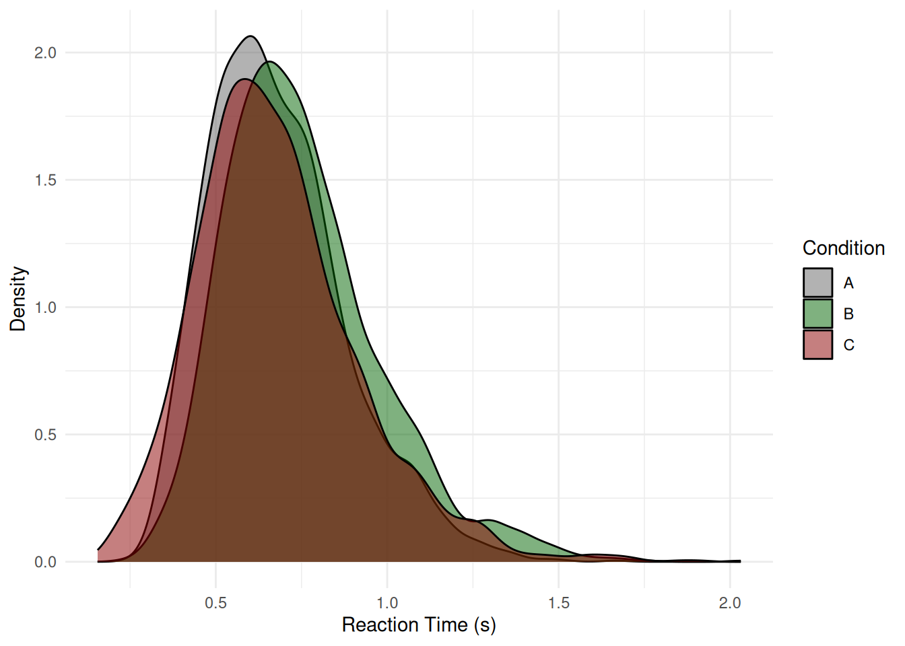

# Assessing Reliability and Interindividual Variability

``` r

library(cogmod)
library(easystats)
library(ggplot2)
library(brms)
library(cmdstanr)

options(mc.cores = parallel::detectCores() - 2)
```

Experimental psychology has traditionally been interested in **average
effects**: does this manipulation change reaction times *in general*?
But an average effect is only one property of an experimental task, and
arguably not always the most interesting one. A manipulation can produce
a rock-solid average effect that is identical in everybody - in which
case there is nothing to correlate with anything, and the task is
useless as an individual differences measure. Conversely, a manipulation
can have *no* average effect whatsoever while producing large and
systematic differences *between* individuals - which makes it a
potentially excellent marker of something, even though the classic
group-level test would declare it a failure.

This vignette illustrates that distinction on simulated data, and shows
how to recover participant-level effects from a mixed model.

## Data Description

We simulate a typical repeated-measures experiment: 30 participants each
perform 80 trials in **three conditions** (A, B and C), and we record
their reaction times.

The data are generated from a **LogNormal** distribution, which - as
discussed in the [RT models
vignette](https://dominiquemakowski.github.io/cogmod/articles/rt_models.html) -
is a much more sensible generative model for RTs than a Gaussian.
Everything happens on the log scale: each participant has their own
baseline speed (`Intercept`), and their own effect of condition B and C
relative to A.

The two effects are built to be *deliberately* different:

- **A vs. B**: a small but extremely **consistent** effect. Every
  participant is slowed down by about the same amount (the
  between-participant SD of the effect is tiny, 0.01). There is
  essentially no interindividual variability.
- **A vs. C**: an effect with a population mean of **exactly zero**, but
  a very large between-participant SD (0.30). Some participants are
  dramatically slowed down by condition C, others are dramatically
  speeded up.

Code

``` r

set.seed(14)

n_participants <- 30
n_trials <- 80  # Per condition

participants <- data.frame(
  Participant = sprintf("S%02d", 1:n_participants),
  # Overall speed: participants differ substantially from one another
  Intercept = rnorm(n_participants, mean = log(0.6), sd = 0.20),
  # A vs. B: small effect, (almost) identical for everybody
  Effect_B = rnorm(n_participants, mean = 0.10, sd = 0.01),
  # A vs. C: no effect on average, but huge interindividual variability
  Effect_C = rnorm(n_participants, mean = 0.00, sd = 0.30)
)

sim <- expand.grid(
  Trial = 1:n_trials,
  Condition = c("A", "B", "C"),
  Participant = participants$Participant,
  stringsAsFactors = FALSE
)
sim <- merge(sim, participants, by = "Participant")

# Trial-level mean on the log scale
sim$meanlog <- sim$Intercept +
  ifelse(sim$Condition == "B", sim$Effect_B, 0) +
  ifelse(sim$Condition == "C", sim$Effect_C, 0)

# Generate RTs, adding within-participant (trial-to-trial) noise
sim$RT <- rlnorm(nrow(sim), meanlog = sim$meanlog, sdlog = 0.22)

sim <- sim[order(sim$Participant, sim$Condition, sim$Trial), ]
sim <- data_select(sim, c("Participant", "Trial", "Condition", "RT"))
sim$Participant <- factor(sim$Participant)
sim$Condition <- factor(sim$Condition)

head(sim)
#>   Participant Trial Condition        RT
#> 1         S01     1         A 0.6253792
#> 2         S01     2         A 0.4165435
#> 3         S01     3         A 0.4191363
#> 4         S01     4         A 0.6696561
#> 5         S01     5         A 0.4592063
#> 6         S01     6         A 0.4870981
```

Looking at the raw distributions, the three conditions are nearly
indistinguishable, and nothing suggests that B and C differ in any
interesting way.

``` r

ggplot(sim, aes(x = RT, fill = Condition)) +
  geom_density(alpha = 0.5) +
  scale_fill_manual(values = c("A" = "grey40", "B" = "darkgreen", "C" = "darkred")) +
  labs(x = "Reaction Time (s)", y = "Density") +
  theme_minimal()
```


