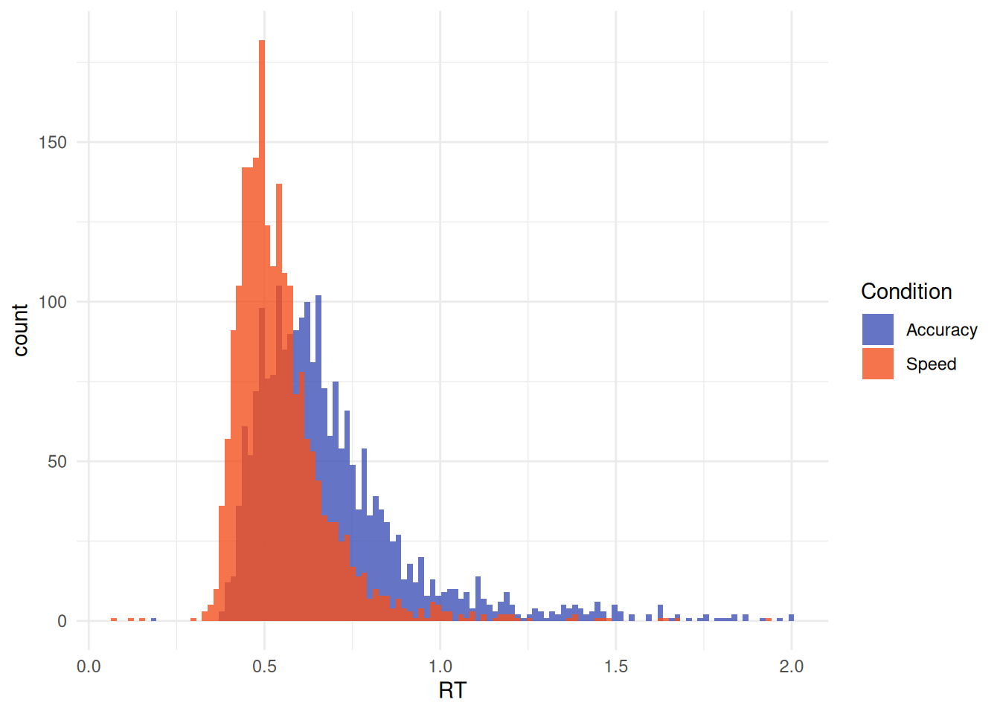
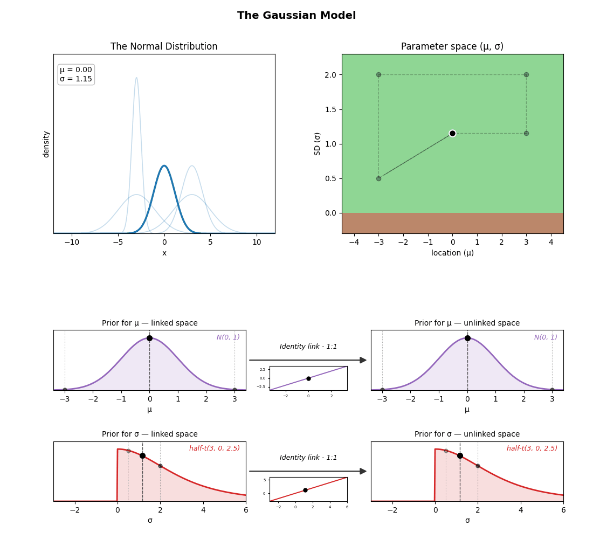
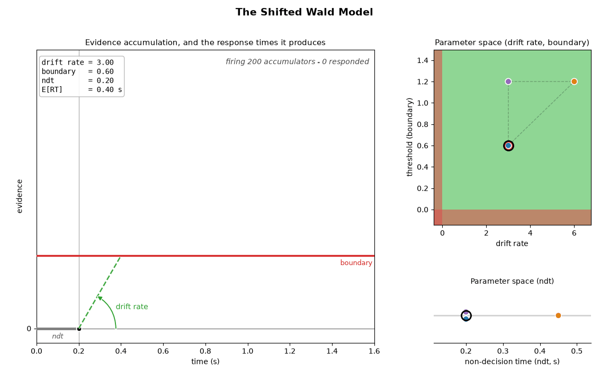

# How to Properly Analyze Reaction Times Data

``` r

library(cogmod)
library(easystats)
library(ggplot2)
library(dplyr)
library(brms)
library(cmdstanr)

options(mc.cores = parallel::detectCores() - 2)
```

## Why Linear Models are bad for RTs

After months of effort designing the study, recruiting participants and
collecting data, you finally get your hands on that dataset and decide
to check whether your super duper Nobel-prize-worthy experimental
condition has an effect on reaction times. You do what everybody does,
and what has always been done: fit a (mixed) linear model.

The data are bundled with `cogmod` as `badlm` - 20 participants, 25
trials in each of two conditions. See
[`?badlm`](https://dominiquemakowski.github.io/cogmod/reference/badlm.md)
(or `data-raw/badlm.R`) for how they were generated.

``` r

sim <- cogmod::badlm

head(sim)
#>   Participant Condition        RT
#> 1         S01         A 0.9246246
#> 2         S01         A 0.9434260
#> 3         S01         A 1.2198363
#> 4         S01         A 0.8415406
#> 5         S01         A 0.8886914
#> 6         S01         A 0.5201079
```

``` r

library(lme4)

model <- lmer(RT ~ Condition + (1 | Participant), data = sim)

parameters(model)
#> # Fixed Effects
#> 
#> Parameter     | Coefficient |   SE |        95% CI | t(996) |      p
#> --------------------------------------------------------------------
#> (Intercept)   |        0.69 | 0.01 | [ 0.67, 0.72] |  59.34 | < .001
#> Condition [B] |   -1.20e-03 | 0.01 | [-0.03, 0.03] |  -0.08 | 0.936 
#> 
#> # Random Effects
#> 
#> Parameter                   | Coefficient
#> -----------------------------------------
#> SD (Intercept: Participant) |        0.02
#> SD (Residual)               |        0.24
```

***Nothing.*** **NOTHING** 😭

The effect of `Condition B vs. Condition A` is minuscule and and
non-significant. Months of work, and the only conclusion you can write
down is ***“the condition had no effect on response times”***. As you
contemplate the ruins of your Nobel-prize aspirations, you start
seriously considering abandoning your dreams of a career in academia and
retraining as a goat farmer.

But then, as a last sanity check, you decide to actually **look** at the
data.

``` r

ggplot(sim, aes(x = RT, fill = Condition)) +
  geom_histogram(bins = 120, alpha = 0.8, position = "identity") +
  scale_fill_manual(values = c("orange", "blue")) +
  theme_minimal()
```


***Shock and horror!***

*The two distributions could hardly look more different!* Condition
**A** has responses starting almost immediately (some as fast as 150 ms)
and a long tail stretching past 2 seconds. Condition **B** has no
responses at all before ~600 ms, and then a tight, narrow bump. One
condition looks like fast, variable, possibly impulsive responding; the
other looks like a slow but highly consistent process with a long “dead
time” before any response can be emitted. These are, by any reasonable
standard, two *dramatically* different behaviours.

How come the test did not capture any of it? Because we simulated these
two distributions to have exactly the **same mean** - and the mean is
the only thing the linear model was ever looking at. Everything that
distinguishes these conditions - where the distribution *starts*, how
*wide* it is, how heavy its *tail* is - was invisible to it by
construction.

The lesson is not that the linear model lied: it faithfully answered the
question it was asked. The problem is that “is the mean RT different?”
is almost never the question we actually care about. Fortunately, better
models exist - models that describe the *shape* of the RT distribution
with parameters that can be mapped onto meaningful cognitive quantities.
The rest of this vignette is about them.

> ***“But I read that I can transform my data to make it more normal,
> should I do it?”***

Log-transforming (or inverse-transforming, or Box-Cox-ing) RTs is a very
common attempt at rescuing the linear model: make the data look
Gaussian, then proceed as usual. It is, however, **not a good idea**
([Schramm & Rouder, 2019](https://doi.org/10.31234/osf.io/9ksa6)).
Transformations do not merely “fix” the distribution, they silently
change the quantity being tested: the model no longer compares mean RTs
but means of transformed RTs, which do not back-transform to anything
you meant to ask about, and which can reverse, create or hide effects
relative to the untransformed scale. Worse, they do nothing about the
underlying problem illustrated above - a difference in shift, in spread
or in tail weight is still squeezed into a single location parameter.

What one should do instead is use a model that is appropriate for the
**shape** of the data and - ideally - for its **data generating
process**. That distinction matters if you want to push the boundaries
of what we can learn from your data. Some of the families below
(ExGaussian, Weibull, Gamma…) are essentially *descriptive*: they are
flexible enough to fit the shape of RT distributions well, but their
parameters have no guaranteed correspondence to cognitive mechanisms.
Others (Wald / Wiener, LBA, DDM) are *generative*: they are derived from
an explicit account of how a decision unfolds over time - evidence
accumulating towards a threshold - so their parameters (drift rate,
boundary separation, non-decision time) are meant to refer to actual
components of the process. Both are large improvements over the
Gaussian, but the latter allows for potentially stronger and more
interpretable claims.

**Useful references to start:**

- [**Lindelov’s overview of RT
  models**](https://lindeloev.github.io/shiny-rt/): An absolute
  must-read.
- [**De Boeck & Jeon
  (2019)**](https://www.frontiersin.org/articles/10.3389/fpsyg.2019.00102/full):
  A paper providing an overview of RT models.

## The Data

For this chapter, we will be using the data from [Wagenmakers et al.,
(2008)](https://doi.org/10.1016/j.jml.2007.04.006) - Experiment 1 also
reanalyzed by [Heathcote & Love
(2012)](https://doi.org/10.3389/fpsyg.2012.00292), that contains
responses and response times for several participants in two conditions
(where instructions emphasized either **speed** or **accuracy**). The
data are distributed in the
[`rtdists`](https://cran.r-project.org/package=rtdists) package as
`speed_acc`. We excluded trials with extreme slow responses (\>2 sec).

``` r

set.seed(123)  # For reproducibility

# Experiment 1 of Wagenmakers et al. (2008), from rtdists. 
data(speed_acc, package = "rtdists")

df <- data.frame(
  Participant = as.integer(as.character(speed_acc$id)),
  Condition = unname(c(accuracy = "Accuracy", speed = "Speed")[
    as.character(speed_acc$condition)]),
  RT = speed_acc$rt,
  Error = as.integer(as.character(speed_acc$response) != as.character(speed_acc$stim_cat)),
  Frequency = unname(c(high = "High", low = "Low", very_low = "Very Low")[
    sub("^nw_", "", as.character(speed_acc$frequency))])
)


df <- df[df$Participant %in% c(1, 2, 3) &
           df$Error == 0 & 
           df$RT <= 2, ]

# Show 10 first rows
head(df, 10)
#>    Participant Condition    RT Error Frequency
#> 1            1     Speed 0.700     0       Low
#> 3            1     Speed 0.460     0  Very Low
#> 4            1     Speed 0.455     0  Very Low
#> 6            1     Speed 0.773     0      High
#> 7            1     Speed 0.390     0      High
#> 9            1     Speed 0.603     0       Low
#> 10           1     Speed 0.435     0      High
#> 11           1     Speed 0.524     0  Very Low
#> 12           1     Speed 0.427     0      High
#> 13           1     Speed 0.456     0  Very Low
```

We are going to first take interest in the response times (RT) of
**Correct** answers only (as we can assume that errors are underpinned
by a different *generative process*).

``` r

ggplot(df, aes(x = RT, fill = Condition)) +
  geom_histogram(bins = 120, alpha = 0.8, position = "identity") +
  scale_fill_manual(values = c("Accuracy"="#3F51B5", "Speed"="#F4511E")) +
  theme_minimal()
```



## Main Models

### Normal (Gaussian)

It is worth stressing that basic linear models, often adopted as
“default” models (as they are the one obtained by simply running
[`lm()`](https://rdrr.io/r/stats/lm.html),
[`t.test()`](https://rdrr.io/r/stats/t.test.html) or
[`brm()`](https://paulbuerkner.com/brms/reference/brm.html) without
specifying a family), **are not a neutral or assumption-free
description** of the data. It is a model that assumes RTs are drawn from
a Normal distribution whose **mean** `mu` depends on the predictors. The
parameter that we then interpret and report as “the effect” of a
condition is a difference between the **means** of two Normal
distributions.

This comes with a set of assumptions that are rarely plausible for RT
data. First, the variance between various conditions is assumed to be
**fixed** (`sigma` is fixed as a constant across conditions and
participants), so any experimental effect can only manifest as a shift
in the mean - even though speed instructions, task difficulty or fatigue
typically change the *spread* and the *shape* of the RT distribution as
much as its center. Second, the Normal distribution is **symmetric** and
has support over the whole real line, whereas RTs are strictly positive,
bounded below by a non-decision time, and markedly right-skewed. The
model therefore assigns non-zero probability to negative response times,
and systematically misrepresents and underestimates the long right tail.

Beyond these statistical concerns, the deeper issue is *conceptual*: the
mean of a Normal distribution is not a quantity that maps onto anything
the cognitive system does. Slow trials, fast guesses and typical
responses are all absorbed into a single average, so a change in the
mean is ambiguous as to its origin - it could reflect a genuine slowing
of processing, a handful of attentional lapses in the tail, or a change
in response caution. The distributional models presented below are
attempts to carve the RT distribution into parameters that are, at least
in principle, more closely tied to distinct underlying processes.

``` r

f <- bf(RT ~ Condition)

m_normal <- brm(f,
  data = df,
  chains = 4, iter = 500, backend = "cmdstanr"
)

m_normal <- brms::add_criterion(m_normal, "loo")
```

The animation below unpacks what such a model actually contains: the two
parameters travelling through the space of possible Normal
distributions, and the prior placed on each of them. Both use an
**identity link**, i.e. they are sampled directly on their natural
scale - which for `sigma` is only possible because it is declared with a
lower bound of 0 and given a *truncated* prior (the half Student-t that
`brms` uses by default for scale parameters).



### ExGaussian

Rather than relying on default model families, such as Gaussian models,
one can select [models that accurately represent the distribution of
their outcome variable](https://lindeloev.github.io/shiny-rt/). For
instance, models based on **Exponentially modified Gaussian**
(ex-Gaussian) distributions, which are suited to their typical skewed
shape ([Balota & Yap, 2011](https://doi.org/10.1177/0963721411408885);
[Matzke & Wagenmakers, 2009](https://doi.org/10.3758/PBR.16.5.798)).

This distribution is a convolution of normal and exponential
distributions and has three parameters, namely $`\mu`$ (mu) and
$`\sigma`$ (sigma) - the mean and standard deviation of the Gaussian
distribution - and $`\tau`$ (tau) - the exponential component of the
distribution. Intuitively, these arguments reflect the centrality, the
width and the tail dominance, respectively.

Beyond the descriptive value of these types of models, some have tried
to interpret their parameters in terms of cognitive mechanisms, arguing
for instance that changes in the Gaussian components reflect changes in
attentional processes (e.g., “the time required for organization and
execution of the motor response”; Hohle, 1965), whereas changes in the
exponential component reflect changes in intentional (i.e.,
decision-related) processes (Kieffaber et al., 2006). However, [Matzke &
Wagenmakers (2009)](https://doi.org/10.3758/PBR.16.5.798) demonstrate
that there is no direct correspondence between ex-Gaussian parameters
and cognitive mechanisms, and underline their value primarily as
descriptive tools, rather than models of cognition *per se*.

Descriptively, the three parameters can be interpreted as:

- **Mu** $`\mu`$: The location / centrality of the RTs. Would correspond
  to the mean in a symmetrical distribution.
- **Sigma** $`\sigma`$: The variability and dispersion of the RTs. Akin
  to the standard deviation in normal distributions.
- **Tau** $`\tau`$: Tail weight / skewness of the distribution.

Despite the generally good fit and relative simplicity of Ex-Gaussian
models, they have one major drawback. Their underlying parameters do not
represent **independent** characteristics of the overall shape. The
shape of the distribution is detemrined by the interaction of all three
parameters. Below is an example of ex-Gaussian distributions that all
share the **same location and dispersion** parameters, and differ only
in their tail weight.


*Ex-Gaussian distributions with the same location ($`\mu`$ = 0.7, dashed
line) and dispersion ($`\sigma`$ = 0.2) parameters, varying only in tail
weight.*

Although only the tail weight parameter is changed, the whole
distribution appears to shift its centre of mass: as $`\tau`$ goes from
0 to 0.5, the peak moves from 0.70 to 0.93 and the mean from 0.70 to
1.20 s, while the SD of the whole distribution grows from 0.20 to 0.54.
**Hence, one should be careful not to interpret the value of mu directly
as the “mean” or the distribution “peak”, nor sigma as the SD or the
“width”**.

One important caveat: `brms`’s native
[`exgaussian()`](https://paulbuerkner.com/brms/reference/brmsfamily.html)
family does **not** use this “classical” parameterization familiar to
experimental psychologists: its `mu` indexes the mean of the *entire*
distribution (i.e., Gaussian + exponential combined) rather than the
location of the Gaussian component alone. This matters because a change
in the Gaussian location and an opposite change in the exponential tail
can cancel out at the level of the overall mean, so effects estimated on
`brms`’s default `mu` can lead to different (and potentially incorrect)
inferences about the underlying process than effects estimated on the
classical `mu`.

For this reason, `cogmod` provides its own
[`cogmod_exgaussian()`](https://dominiquemakowski.github.io/cogmod/reference/rcogmod_exgaussian.md)
custom family, in which `mu` and `sigma` are the mean and SD of the
Gaussian component and `tau` is the mean of the exponential tail -
directly matching the classical parameterization.

Note that `cogmod` also implements the **Generalised Ex-Gaussian**
([Marmolejo-Ramos et al.,
2023](https://doi.org/10.1007/s11571-022-09813-2)),
[`cogmod_geg()`](https://dominiquemakowski.github.io/cogmod/reference/rcogmod_geg.md),
which adds a `shape` parameter that raises the ex-Gaussian’s CDF to a
power. It reaches distributions the ex-Gaussian cannot - including
negatively skewed ones - and `shape = 1` recovers
[`cogmod_exgaussian()`](https://dominiquemakowski.github.io/cogmod/reference/rcogmod_exgaussian.md)
exactly, so the two can be compared with
[`loo_compare()`](https://mc-stan.org/loo/reference/loo_compare.html).
The cost is parameter interpretability: with `shape` free the mean is no
longer `mu + tau`, and `shape` is strongly confounded with `mu`. See
[`?cogmod_geg`](https://dominiquemakowski.github.io/cogmod/reference/rcogmod_geg.md)
for the details.

``` r

f <- bf(
  RT ~ Condition,
  sigma ~ Condition,
  tau ~ Condition,
  family = cogmod_exgaussian()
)

m_exgauss <- brm(f,
  data = df,
  prior = cogmod_priors(f, df),
  init = cogmod_inits(f, df),
  stanvars = cogmod_stanvars(f),
  chains = 4, iter = 500, backend = "cmdstanr"
)

m_exgauss <- brms::add_criterion(m_exgauss, "loo")
```

Note that every model below is fitted with `init = cogmod_inits(f, df)`.
`brms` initialises on the *unconstrained* scale, so the usual `init = 0`
starts `ndt` at `exp(0) = 1` second - above most sub-second reaction
times, which leaves every response attributed to the outlier component
and the decision parameters with no gradient to move on. For
[`cogmod_gamma()`](https://dominiquemakowski.github.io/cogmod/reference/rcogmod_gamma.md)
and
[`cogmod_weibull()`](https://dominiquemakowski.github.io/cogmod/reference/rcogmod_weibull.md)
that is fatal (the chain never moves at all); for the others it merely
wastes warmup walking `ndt` back down, which on a 1500-trial LogNormal
cost about 3x the sampling time.
[`cogmod_inits()`](https://dominiquemakowski.github.io/cogmod/reference/cogmod_inits.md)
sets each parameter separately and leaves everything it does not
recognise to Stan. See
[`?cogmod_inits`](https://dominiquemakowski.github.io/cogmod/reference/cogmod_inits.md).

### Shifted LogNormal

The LogNormal distribution assumes that it is the *logarithm* of the
RTs, rather than the RTs themselves, that is Normally distributed. This
is an attractive assumption for response times: it constrains the
variable to be strictly positive, and it produces the right-skewed shape
typical of RT data for free.

> **What is the rationale for LogNormal models?**

The reason why the Normal distribution is so ubiquitous in nature - and
hence used as a relatively good default model - is the **Central Limit
Theorem**, which states that the sum of a large number of independent
random variables tends (under fairly general conditions) towards a
Normal distribution. Because many things in nature are the result of the
*addition* of many random processes, the Normal distribution is very
common in real life.

However, it turns out that the *multiplication* of random variables
results in a **LogNormal** distribution. The reason is in fact the same
theorem: since the logarithm of a product is the sum of the logarithms,
a multiplicative cascade becomes an additive one on the log scale, and
the Central Limit Theorem applies there instead. And multiplicative
(rather than additive) cascades of processes are also very common in
nature, from the lengths of latent periods of infectious diseases to the
distribution of mineral resources in the Earth’s crust, and the
elementary mechanisms at stake in physics and cell biology ([Limpert et
al.,
2001](https://academic.oup.com/bioscience/article/51/5/341/243981)).

Thus, using LogNormal distributions for RTs can be justified with the
assumption that response times are the result of multiplicative
stochastic processes happening in the brain - each stage of processing
scaling, rather than adding to, the duration of the previous ones. Note
that this is a *plausibility* argument rather than a demonstrated
mechanism: it makes the LogNormal a well-motivated default, but it does
not turn `mu` and `sigma` into cognitive parameters.

Similarly to most implementations,
[`cogmod_lognormal()`](https://dominiquemakowski.github.io/cogmod/reference/rcogmod_lognormal.md)
parametrizes `mu` and `sigma` as the mean and SD of the distribution *on
the log scale* (so that the median of the distribution is
`ndt + exp(mu)`). The **shifted** version adds a third ingredient: a
non-decision time (`ndt`) before which no response can physically occur,
corresponding to the time taken by stimulus encoding and motor
execution. Without it, the distribution is forced to start at zero, and
the model has to distort the shape of the whole distribution to
accommodate the empty space between 0 and the first responses. `ndt` is
estimated directly, in seconds, rather than as a proportion of the
fastest observed response - which is only possible because the density
is mixed with a small outlier component (`poutlier`) that keeps it
positive below `ndt` instead of assigning it exactly zero density. See
`vignette("outliers")` for why that mixture is necessary and how its
priors are set.

Less purely descriptive than the ExGaussian, this model has some
theoretical grounding, conceptualizing responses as the output of
multiplicative random processes. However, despite capturing the shape of
RT distributions very well, its two parameters `mu` and `sigma` are not,
in themselves, cognitive quantities. It does, however, sit at the base
of a proper process model - the Lognormal Race (see
[`cogmod_lnr()`](https://dominiquemakowski.github.io/cogmod/reference/rcogmod_lnr.md)),
in which several LogNormal accumulators compete and the fastest one
determines both the response and the RT.

> **“Isn’t this the same as log-transforming my RTs?”**

It is not, and the difference is precisely the one discussed above.
Log-transforming the data and running a linear model on `log(RT)`
estimates the mean of the *transformed* values, which then has to be
interpreted on the log scale (or back-transformed into something that is
no longer the mean RT). The LogNormal model leaves the data untouched
and instead changes the *likelihood*: the RTs stay in seconds, and it is
the model that is told they arise from a LogNormal process. In addition,
the shift (`tau`) and the dispersion (`sigma`) are estimated as their
own parameters, and can be given their own predictors - something a
transformation can never give you, since it still funnels every effect
through a single location parameter.

``` r

f <- bf(
  RT ~ Condition,
  sigma ~ Condition,
  ndt ~ Condition,
  family = cogmod_lognormal()
)

m_lognormal <- brm(
  f,
  data = df,
  prior = cogmod_priors(f, df),
  init = cogmod_inits(f, df),
  stanvars = cogmod_stanvars(f),
  chains = 4, iter = 500, backend = "cmdstanr"
)

m_lognormal <- brms::add_criterion(m_lognormal, "loo")
```

### Inverse Gaussian (Shifted Wald)

This is where we cross an important line. The families discussed so far
are popular because their *shape* resembles that of RT distributions;
the Wald distribution, in contrast, is **derived** from a model *of the
process* that (potentially) generates the data. It considers responses
as the end of a noisy evidence accumulating process that accumulates
over time until it reaches a decision threshold: the distribution of the
times at which that threshold is first crossed *is* the Wald
distribution. Its skewed shape is not a modelling choice, it is a
consequence of the assumed mechanism.

The Shifted Wald model (also known as the Inverse Gaussian distribution)
is actually equivalent to a one-response version of the Drift Diffusion
Model (DDM) with no between-trial variability in drift rate (which is
what `sigmadrift = 0` does), starting point, or non-decision time. This
changes what the parameters mean. Instead of a location and a width, we
now estimate quantities that refer to distinct components of the
decision: `mu` is the **drift rate** (the speed at which evidence
accumulates, often read as task difficulty or processing efficiency),
`boundary` is the **decision threshold** (how much evidence is required
before responding, i.e., response caution), and `ndt` is again the
**non-decision time** (encoding and motor execution). This is why the
formula below regresses `Condition` on `boundary` rather than on
`sigma`: the natural hypothesis for a speed-vs-accuracy manipulation is
that instructions move the *threshold*, not the quality of the evidence.

Two caveats are worth keeping in mind. First, because this version has a
single boundary, it only describes the timing of *one* type of
response - it knows nothing about errors, and so cannot exploit the
joint distribution of choices and RTs (that is what the DDM and LBA of
the *Decision Making* vignette are for). Second, this interpretive gain
is not free: with RT data alone, drift rate and boundary separation
trade off against each other to a considerable degree, so their separate
estimates should be treated with more caution than their cognitive
labels suggest.

``` r

f <- bf(
  RT ~ Condition,
  boundary ~ Condition,
  ndt ~ Condition,
  sigmadrift = 0,
  family = cogmod_invgaussian()
)

m_wald <- brm(
  f,
  data = df,
  prior = cogmod_priors(f, df),
  init = cogmod_inits(f, df),
  stanvars = cogmod_stanvars(f),
  chains = 4, iter = 500, backend = "cmdstanr"
)

m_wald <- brms::add_criterion(m_wald, "loo")
```



### Linear Ballistic Accumulator

The LBA is normally a *race*: one accumulator per response option, each
rising linearly and ballistically - no within-trial noise - from a start
point drawn uniformly on `[0, A]` at a drift rate drawn from a normal,
until one of them reaches the threshold `b`. The first to arrive
determines both the response and the RT. With no choice to model there
is nothing to race, so what is used here is the **single-accumulator**
version: the RT is simply that one accumulator’s finishing time,
`(b - start) / drift`, plus non-decision time. All of the RT variability
therefore comes from across-trial variability in the start point
(`sigmabias`, the `A` above) and in the drift rate, rather than from
moment-to-moment noise within the trial.

`sigma` is fixed to `1` rather than estimated because the evidence scale
is arbitrary: nothing observable is measured in “units of evidence”.
Multiplying the drift rate, its standard deviation `sigma`, the
start-point range `A` and the threshold `b` all by the same constant
leaves the decision time `(b - start) / drift` completely unchanged,
since numerator and denominator scale together. Only *ratios* of these
parameters are identified, so exactly one of them has to be pinned down
to fix the scale, and by convention that is the drift standard
deviation. The remaining parameters are then read in units of the
across-trial drift SD. Any one of the four would do equally well;
`sigma` is chosen because it is the least interesting of them. Note that
this is what `sigma = 1` in the formula below does - it fixes the
parameter as a constant. Drop it and `brms` will happily *estimate* it
instead, leaving the model unidentified and the sampler free to wander
along that ridge.

Fixing the evidence scale is not quite the end of the identification
story. As the start-point range `sigmabias` shrinks toward zero the LBA
converges to the *recinormal* - the LATER model, in which
`1 / (RT - ndt)` is normally distributed - and it does so smoothly,
which means the likelihood becomes **flat** in `sigmabias` once the
range is small enough. On a `softplus` link zero sits at minus infinity,
so a flat prior over a flat likelihood is an improper posterior.
[`cogmod_priors()`](https://dominiquemakowski.github.io/cogmod/reference/cogmod_priors.md)
supplies weak `normal(0, 1)` priors on `sigmabias` and `boundary` for
exactly this reason - the threshold is `b = sigmabias + boundary`, so
the two share the ridge - which brings that same fit to `Rhat` 1.02, an
effective sample size of 387, and a sensible finite estimate. This is
the same argument as for `ndt` and `poutlier` in `vignette("outliers")`:
pass `prior = cogmod_priors(f, df)`.

``` r

f <- bf(
  RT ~ Condition,
  sigmabias ~ Condition,
  boundary ~ Condition,
  ndt ~ Condition,
  sigma = 1,
  family = cogmod_lba1()
)

m_lba <- brm(
  f,
  data = df,
  prior = cogmod_priors(f, df),
  init = cogmod_inits(f, df),
  stanvars = cogmod_stanvars(f),
  chains = 4, iter = 500, backend = "cmdstanr"
)

m_lba <- brms::add_criterion(m_lba, "loo")
```

## Other Models

Note that the families presented below have not been used nearly as
often in the RT literature as the ones above, and their properties in
this context are correspondingly less well documented. They are
nonetheless capable of generating close fits to RT data, and more
research is needed to establish whether they offer any real advantage -
in terms of fit, of interpretability, or of computational behaviour -
over the more established options.

### Recinormal (LATER)

The **recinormal** (reciprocal-of-normal) distribution is at the basis
of the **LATER** model - Linear Approach To Threshold with Ergodic Rate:
if the rate of linear accumulation varies normally from trial to trial,
then `1 / RT` is normally distributed, so RT itself is recinormal. This
idea is in fact *older* than most sequential-sampling models. Carpenter
proposed it in 1981, then formalized it with Williams in
[1995](https://doi.org/10.1038/377059a0), after noticing that the usual
skewed RT histogram never matched any standard statistical distribution,
and reasoning that since RT is the outcome of a *rate* process - a
signal rising to threshold, like a reaction reaching completion - it
made more sense to model the variability in that underlying rate than to
keep fitting shapes to its result. Switching the analysis from RT to
`1 / RT` and finding a clean Gaussian was the payoff of that reframing.

In the terms of the previous section, this is exactly where the LBA was
heading: set the start-point range `sigmabias` to zero and the
accumulator starts from the same place on *every* trial, so the only
thing left varying is the rate of rise. The decision time is then simply
`b / rate`, and a normally distributed rate makes `1 / (RT - ndt)`
normally distributed in turn. (The `- ndt` is the one refinement on the
classical statement above: any time spent on encoding and motor
execution is not part of the rate process, so it has to come off before
the reciprocal is taken.)

What makes LATER attractive is that its two parameters are directly
interpretable, and interpretable as something you can *see*, often
called **promptness** - how quickly the response comes, rather than how
long it takes - and `mu` and `sigma` are simply its mean and standard
deviation. This is what a *reciprobit* plot displays: promptness on a
probit axis, on which a LATER model is a straight line, `mu` sets its
position and `sigma` its slope. Carpenter’s central claim is read off
exactly that plot - manipulating the prior probability of a stimulus
shifts the line sideways (a change in `mu`, the rate of rise), while
manipulating urgency swivels it about its intercept (a change in the
threshold).

Going the other way is instructive too. LATER lets the *rate* vary from
trial to trial but treats the level the signal starts from as fixed;
letting that vary as well gives the **extended LATER (E-LATER)** model
of [Nakahara et
al. (2006)](https://doi.org/10.1016/j.neunet.2006.07.001) - which is to
say that the LBA’s `sigmabias` is not an LBA-specific device but the
same extension the oculomotor literature arrived at independently, the
two differing mainly in the distribution assumed for the starting level.

There is no separate family for this: LATER **is**
[`cogmod_lba1()`](https://dominiquemakowski.github.io/cogmod/reference/rcogmod_lba1.md)
with `sigmabias` fixed at zero. Two parameters have to be fixed rather
than one. As the evidence scale is arbitrary in the sense described
above - multiplying `mu`, `sigma`, `sigmabias` and `boundary` by any
common constant leaves the likelihood unchanged - so one of them has to
be fixed to break that. Compared to the 1-accumulator LBA, for LATER the
natural choice is `boundary = 1`, which leaves `mu` and `sigma` reading
directly as the mean and SD of promptness.

``` r

f <- bf(
  RT ~ Condition,
  sigma ~ Condition,
  ndt ~ Condition,
  sigmabias = 0,   # no start-point variability: this is what makes it LATER
  boundary = 1,    # absorbs the threshold, so mu and sigma are promptness
  family = cogmod_lba1()
)

m_recinormal <- brm(
  f,
  data = df,
  prior = cogmod_priors(f, df),
  init = cogmod_inits(f, df),
  stanvars = cogmod_stanvars(f),
  chains = 4, iter = 500, backend = "cmdstanr"
)

m_recinormal <- brms::add_criterion(m_recinormal, "loo")
```

### Wald-4

This mode corresponds to the Shifted Wald model with an extra parameter
corresponding to the variability of the drift rate. That extra parameter
makes it a **hybrid of the Wald and LATER models**: it is the only one
here carrying *both* sources of randomness. The Wald has
moment-to-moment noise within the trial and a drift rate that is the
same on every trial; LATER has no within-trial noise at all and puts all
of the variability into a drift rate that is redrawn each trial; Wald-4
has both at once, and each is nested inside it. Set `sigmadrift = 0` and
the across-trial variability disappears, leaving the plain Wald exactly.
Push the other way - letting the accumulated evidence grow large
relative to the diffusion noise, which here means scaling `mu`,
`boundary` and `sigmadrift` up together - and the within-trial noise
becomes negligible, leaving the recinormal of the previous section. That
second limit is approached rather than reached (the relative error falls
off as the square of the scaling factor), so it is not something you fix
in the formula, but it is worth knowing it is there: it means that large
values of all three parameters describe very nearly the same
distribution as small ones, which is a ridge, and part of why
[`cogmod_priors()`](https://dominiquemakowski.github.io/cogmod/reference/cogmod_priors.md)
puts a prior on `sigmadrift`.

``` r

f <- bf(
  RT ~ Condition,
  boundary ~ Condition,
  ndt ~ Condition,
  sigmadrift ~ Condition,
  family = cogmod_invgaussian()
)

m_wald4 <- brm(
  f,
  data = df,
  prior = cogmod_priors(f, df),
  init = cogmod_inits(f, df),
  stanvars = cogmod_stanvars(f),
  chains = 4, iter = 500, backend = "cmdstanr"
)

m_wald4 <- brms::add_criterion(m_wald4, "loo")
```

### ExWald

``` r

f <- bf(
  RT ~ Condition,
  boundary ~ Condition,
  ndt ~ Condition,
  tau ~ Condition,
  family = cogmod_exwald()
)

m_exwald <- brm(
  f,
  data = df,
  prior = cogmod_priors(f, df),
  init = cogmod_inits(f, df),
  stanvars = cogmod_stanvars(f),
  chains = 4, iter = 500, backend = "cmdstanr"
)

m_exwald <- brms::add_criterion(m_exwald, "loo")
```

### Censored Shifted Wald

Every model so far was fitted to the correct responses alone, on the
argument that errors come from a different generative process. Dropping
them is not free, though: it conditions on the correct process having
*won*, which truncates its slow tail - the trials on which a slow
correct response was coming are exactly the trials on which an error got
in first. The **censored shifted Wald** (Miller et al.,
[2018](https://doi.org/10.1177/0146621617710465)) keeps those trials
without modelling the error process at all. An error at time `t` is
taken to say one thing about the correct accumulator: it had not
finished by `t`. It therefore enters the likelihood as a
**right-censored** observation, contributing the Wald’s survival
`P(T > t)` where a correct response contributes its density. This is the
standard survival-analysis treatment of a competing event, and `brms`
already has the syntax for it, `cens()`.

``` r

# The same data, this time keeping the errors. `Error` becomes the censoring
# indicator: Error == 1 says the RT is a lower bound on the correct process's time.
df_cens <- data.frame(
  Participant = as.integer(as.character(speed_acc$id)),
  Condition = unname(c(accuracy = "Accuracy", speed = "Speed")[
    as.character(speed_acc$condition)]),
  RT = speed_acc$rt,
  Error = as.integer(as.character(speed_acc$response) != as.character(speed_acc$stim_cat))
)
df_cens <- df_cens[df_cens$Participant %in% c(1, 2, 3) & df_cens$RT <= 2, ]
```

``` r

f <- bf(
  RT | cens(Error) ~ Condition,
  boundary ~ Condition,
  ndt ~ Condition,
  sigmadrift = 0,
  family = cogmod_invgaussian()
)

m_cswald <- brm(
  f,
  data = df_cens,
  prior = cogmod_priors(f, df_cens),
  init = cogmod_inits(f, df_cens),
  stanvars = cogmod_stanvars(f),
  chains = 4, iter = 500, backend = "cmdstanr"
)
```

The same `cens()` works on every family of this vignette that has a
closed-form CDF - the LogNormal, the ex-Gaussian, the Gamma and Weibull
variants - so each has a censored version one addition term away, and
[`log_lik()`](https://mc-stan.org/rstantools/reference/log_lik.html)
(hence [`loo()`](https://mc-stan.org/loo/reference/loo.html)) scores the
censored trials the same way the sampler did. Two things are worth
knowing before reaching for it.

**What it assumes.** Censoring says the error tells you *nothing* about
the correct process beyond “not yet”. That is what buys the model its
stability when errors are few - there is no error accumulator to
estimate, which is exactly the parameter that runs away in a race fitted
to a high-accuracy condition (see the *Decision Making* vignette) - and
it is what stops being credible when errors are many, because at that
point they are a process of their own.
[`cogmod_priors()`](https://dominiquemakowski.github.io/cogmod/reference/cogmod_priors.md)
warns above 20% censored trials.

**The check to run first.** Censoring draws the errors from the
surviving tail, so it can only ever predict them *slower* than correct
responses. Fast errors - the signature of a low boundary or a biased
start point - cannot be produced by construction. So compare the two
before fitting:

``` r

aggregate(RT ~ Condition + Error, data = df_cens, FUN = median)
#>   Condition Error    RT
#> 1  Accuracy     0 0.635
#> 2     Speed     0 0.518
#> 3  Accuracy     1 0.629
#> 4     Speed     1 0.503
```

On these data the errors are, if anything, a shade *faster* than the
correct responses in both conditions, so the assumption is borderline
here at best, which suggests this model is not appropriate for this data
set. Where errors are faster, use a race that models the error
accumulator - the RDM or the LBA of the [*Decision
Making*](https://dominiquemakowski.github.io/cogmod/articles/decision_making.html)
vignette. Where they are slower, or where there is no error response at
all - go/no-go, deadlines, omissions - a non-response genuinely is a
right-censored draw from one accumulator, and censoring is the exact
model rather than an approximation.

One more consequence:
[`posterior_predict()`](https://mc-stan.org/rstantools/reference/posterior_predict.html)
predicts the latent, uncensored reaction time, as `brms` does for its
own families, so
[`pp_check()`](https://mc-stan.org/bayesplot/reference/pp_check.html) on
a censored fit compares uncensored replicates against a data column
whose error rows hold *censoring* times.

### Birnbaum-Saunders (BiSa)

The Birnbaum-Saunders (or *fatigue life*) model is the Wald’s near
neighbour, and it is stated in the same parameters - `mu` is a drift
rate and `boundary` a threshold in both - so the only thing that differs
between them is *how* the evidence arrives. Where the Wald accumulates
by diffusion, and evidence can move either way at any instant, here it
arrives in discrete cycles that only ever push towards the boundary:
what is random is the **size** of each increment, never its sign.

The result is an equal mixture of a Wald and that Wald’s length-biased
version, which makes it slower and more dispersed than the Wald at the
same parameters while keeping the same exponential-order right tail. It
has no extra parameter to pay for that, and the density is closed form
throughout.

``` r

f <- bf(
  RT ~ Condition,
  boundary ~ Condition,
  ndt ~ Condition,
  family = cogmod_bisa()
)

m_bisa <- brm(
  f,
  data = df,
  prior = cogmod_priors(f, df),
  init = cogmod_inits(f, df),
  stanvars = cogmod_stanvars(f),
  chains = 4, iter = 500, backend = "cmdstanr"
)

m_bisa <- brms::add_criterion(m_bisa, "loo")
```

### LogStudent

The LogStudent-*t* model varies kurtosis where LogGamma varies skew (see
below). As dof grows the Student-*t* becomes the Normal, with lighter
tails.

``` r

f <- bf(
  RT ~ Condition,
  sigma ~ Condition,
  dof ~ Condition,
  ndt ~ Condition,
  family = cogmod_logstudent()
)

m_logstudent <- brm(
  f,
  data = df,
  prior = cogmod_priors(f, df),
  init = cogmod_inits(f, df),
  stanvars = cogmod_stanvars(f),
  chains = 4, iter = 500, backend = "cmdstanr"
)

m_logstudent <- brms::add_criterion(m_logstudent, "loo")
```

### Weibull

This one is really slow, with bad convergence on our data, which is
caused by the geometry of that model rather than an expensive density,
and it applies to the Gamma too. Near the shift the Weibull density
behaves like `(RT - ndt)^(mu - 1)`, where `mu` is the shape.
Differentiating the outlier mixture with respect to `ndt` therefore
leaves a term in `(RT - ndt)^(mu - 2)`, which is **unbounded at every
observation whenever mu (the shape) is below 2**. The posterior is still
proper - the outlier component sees to that - but the gradient spikes
wherever `ndt` sits close to a response, and on these data it sits at
0.40 s, right inside the dense left edge where consecutive responses are
a millisecond or two apart.

The obvious remedies do not work, and it is worth knowing why before
reaching for them. A prior on `mu` (the shape) or `ndt` don’t help.
Fixing `ndt` at the fastest observed response would work by removing the
parameter, but it introduces a false rigid assumption about one fo the
key parameters.

The slow sampling and bad convergence is here a sign of a bad fit (as
shown below). What the sampler is struggling with is the model
contorting itself to represent a left edge it cannot otherwise reach.
That is not a reason to write the Weibull off for reaction times in
general: there can be cases where it is perfectly well behaved, just not
in our data.

``` r

f <- bf(
  RT ~ Condition,
  sigma ~ Condition,
  ndt ~ Condition,
  family = cogmod_weibull()
)

m_weibull <- brm(
  f,
  data = df,
  prior = cogmod_priors(f, df),
  init = cogmod_inits(f, df),
  stanvars = cogmod_stanvars(f),
  chains = 4, iter = 500, backend = "cmdstanr"
)

m_weibull <- brms::add_criterion(m_weibull, "loo")
```

### LogWeibull (Shifted Gumbel)

``` r

f <- bf(
  RT ~ Condition,
  sigma ~ Condition,
  ndt ~ Condition,
  family = cogmod_logweibull()
)

m_logweibull <- brm(
  f,
  data = df,
  prior = cogmod_priors(f, df),
  init = cogmod_inits(f, df),
  stanvars = cogmod_stanvars(f),
  chains = 4, iter = 500, backend = "cmdstanr"
)

m_logweibull <- brms::add_criterion(m_logweibull, "loo")
```

### Inverse Weibull (Shifted Fréchet)

``` r

f <- bf(
  RT ~ Condition,
  sigma ~ Condition,
  ndt ~ Condition,
  family = cogmod_invweibull()
)

m_invweibull <- brm(
  f,
  data = df,
  prior = cogmod_priors(f, df),
  init = cogmod_inits(f, df),
  stanvars = cogmod_stanvars(f),
  chains = 4, iter = 500, backend = "cmdstanr"
)

m_invweibull <- brms::add_criterion(m_invweibull, "loo")
```

### Gamma

`mu` is the shape and `sigma` the scale of the Gamma decision time.
Beyond being a convenient skewed shape, the Gamma also has a
first-passage-time reading, as the hitting time of an accumulator whose
starting point varies across trials - see [Tejo et
al. (2019)](https://doi.org/10.1007/s11571-019-09532-1) for a
discussion.

``` r

f <- bf(
  RT ~ Condition,
  sigma ~ Condition,
  ndt ~ Condition,
  family = cogmod_gamma()
)

m_gamma <- brm(
  f,
  data = df,
  prior = cogmod_priors(f, df),
  init = cogmod_inits(f, df),
  stanvars = cogmod_stanvars(f),
  chains = 4, iter = 500, backend = "cmdstanr"
)

m_gamma <- brms::add_criterion(m_gamma, "loo")
```

### Inverse Gamma

``` r

f <- bf(
  RT ~ Condition,
  sigma ~ Condition,
  ndt ~ Condition,
  family = cogmod_invgamma()
)

m_invgamma <- brm(
  f,
  data = df,
  prior = cogmod_priors(f, df),
  init = cogmod_inits(f, df),
  stanvars = cogmod_stanvars(f),
  chains = 4, iter = 500, backend = "cmdstanr"
)

m_invgamma <- brms::add_criterion(m_invgamma, "loo")
```

### LogGamma

Every model above commits to a distributional shape in advance: fitting
a Weibull asserts a Weibull, and the only way to ask whether that was
the right choice is to fit the alternatives separately and rank them.
The LogGamma is different in kind, because it carries a free `shape`
parameter that indexes a *continuum* running through those families
rather than picking one of them. At `shape = 0` it is exactly the
shifted LogNormal; at `shape = 1` the Weibull; at `shape = sigma` the
Gamma; at `shape = -1` the inverse Weibull. Values in between
interpolate smoothly, with the right tail thinning monotonically as
`shape` increases - power-law for negative values, lognormal at zero,
and progressively lighter than the Weibull above one. It is the shifted
LogNormal with the shape assumption relaxed rather than assumed.

This makes it useful as an exploratory step even when it is not the
model you intend to report. Rather than fitting five families and
comparing them with `loo` - a non-nested comparison that returns a
ranking but no interpretable quantity - you can fit this one and read
the posterior of `shape` directly. An interval comfortably covering 0 is
evidence that the LogNormal is adequate and the simpler model can be
preferred; an interval around 1 points to the Weibull instead; mass well
below 0 says the right tail is heavier than any of them. Because `shape`
accepts predictors like any other distributional parameter, you can also
ask whether the *shape* of the RT distribution itself shifts between
conditions, and not merely its location and scale.

The flexibility is not free. `shape` is only weakly identified without a
decent number of trials per cell, it trades off against `sigma` and
`ndt`, and the region `sigma * shape >= 1` is degenerate (the density
becomes unbounded at `ndt`), so starting values matter here. See
[`?rcogmod_loggamma`](https://dominiquemakowski.github.io/cogmod/reference/rcogmod_loggamma.md)
for the details.

``` r

f <- bf(
  RT ~ Condition,
  sigma ~ Condition,
  ndt ~ Condition,
  shape ~ Condition,
  family = cogmod_loggamma()
)

m_loggamma <- brm(
  f,
  data = df,
  prior = cogmod_priors(f, df),
  init = cogmod_inits(f, df),
  stanvars = cogmod_stanvars(f),
  chains = 4, iter = 500, backend = "cmdstanr"
)

m_loggamma <- brms::add_criterion(m_loggamma, "loo")
```

``` r

parameters::parameters(m_loggamma, test = NULL, diagnostic = NULL) |> 
  insight::format_table() |>
  insight::display()
#> Loading required namespace: rstan
```

| Parameter      | Component   | Median | 95% CI           |
|:---------------|:------------|-------:|:-----------------|
| (Intercept)    | conditional |  -1.04 | \[-1.19, -0.88\] |
| ConditionSpeed | conditional |  -0.22 | \[-0.42, -0.05\] |
| (Intercept)    | ndt         |  -1.38 | \[-1.71, -1.17\] |
| ConditionSpeed | ndt         |  -0.16 | \[-0.43, 0.17\]  |
| (Intercept)    | shape       |  -0.45 | \[-0.68, -0.20\] |
| ConditionSpeed | shape       |  -0.09 | \[-0.33, 0.17\]  |
| (Intercept)    | sigma       |  -0.63 | \[-0.88, -0.36\] |
| ConditionSpeed | sigma       |  -0.33 | \[-0.62, -0.02\] |

As we can see from the table above, the `shape`’s intercept is
approximately between -0.68 and -0.20, which suggest that the best fit
lies between the LogNormal and the Inverse Weibull. Let’s see if these
results hold up by comparing all the models.

## Model Comparison

### Model Fit

We can compare these models together using the `loo` package, which
shows how bad the linear model performs compared to the other models.

``` r

loo::loo_compare(m_normal, m_exgauss, m_lognormal, m_wald, 
                 m_lba, m_recinormal, m_wald4, m_exwald, 
                 m_bisa, m_logstudent,
                 m_weibull, m_logweibull, m_invweibull,
                 m_gamma, m_invgamma, m_loggamma
                 ) |>
  parameters(include_ENP = TRUE)
#> Warning: Difference in performance potentially due to chance. See McLatchie and
#> Vehtari (2023) for details.
#> # Fixed Effects
#> 
#> Name |   LOOIC |   ENP |    ELPD | Difference | Difference_SE |      p
#> ----------------------------------------------------------------------
#> 1    | -4801.1 |  7.75 | 2400.53 |       0.00 |          0.00 |       
#> 2    | -4796.6 |  7.33 | 2398.29 |      -2.24 |          1.64 | 0.171 
#> 3    | -4795.0 |  7.37 | 2397.50 |      -3.03 |          2.70 | 0.262 
#> 4    | -4792.0 |  6.84 | 2396.01 |      -4.52 |          3.29 | 0.168 
#> 5    | -4789.7 |  8.07 | 2394.85 |      -5.68 |          2.89 | 0.050 
#> 6    | -4783.4 |  6.07 | 2391.72 |      -8.81 |          2.64 | < .001
#> 7    | -4772.7 |  5.41 | 2386.35 |     -14.18 |          6.04 | 0.019 
#> 8    | -4772.5 |  5.24 | 2386.25 |     -14.28 |          6.08 | 0.019 
#> 9    | -4763.3 |  8.42 | 2381.64 |     -18.89 |          6.71 | 0.005 
#> 10   | -4744.8 |  9.69 | 2372.41 |     -28.12 |          8.60 | 0.001 
#> 11   | -4723.5 |  9.35 | 2361.74 |     -38.79 |          9.97 | < .001
#> 12   | -4703.4 | 10.22 | 2351.68 |     -48.85 |         11.31 | < .001
#> 13   | -4607.9 | 13.45 | 2303.96 |     -96.57 |         31.58 | 0.002 
#> 14   | -4569.6 | 11.85 | 2284.78 |    -115.75 |         18.62 | < .001
#> 15   | -4292.3 | 25.96 | 2146.15 |    -254.38 |         27.69 | < .001
#> 16   | -1888.8 |  7.18 |  944.40 |   -1456.13 |         73.83 | < .001
```

Note that you can also use
[`report::report()`](https://easystats.github.io/report/reference/report.html)
on the output of
[`loo_compare()`](https://mc-stan.org/loo/reference/loo_compare.html) to
get a textual summary.

### Sampling Duration

Because each model was fit with only 4 chains, a boxplot of the
per-chain sampling times is not very informative on its own, and looking
at duration in isolation misses the point: a model that samples faster
is not very useful if it fits worse. So the figure below puts both on
the same plot - fit duration on the x-axis (the *median* time per chain,
with a horizontal range spanning the fastest to the slowest of the 4
chains) against fit quality on the y-axis (`elpd_loo`, with a vertical
range of `± 1 SE` as an index of how precisely that estimate is known).

As expected, the **Gaussian** model is by far the fastest to sample,
since it relies on `brms`’s built-in (and heavily optimized) Normal
likelihood with no custom Stan code or non-decision time shift
involved - but it also has by far the worst fit. At the other end, the
**LBA** is by far the slowest, reflecting the added cost of its
multi-accumulator likelihood. The remaining RT-only models (ExGaussian,
LogNormal, Wald, Weibull, LogWeibull, InvWeibull, Gamma, and InvGamma)
are all relatively comparable to one another in duration, as they share
a similar structure (a simple closed-form density combined with a
non-decision time shift), so the figure mostly separates them along the
fit-quality axis instead.

``` r

models <- list(
  Normal = m_normal, ExGaussian = m_exgauss, LogNormal = m_lognormal,
  InvGaussian = m_wald, LBA = m_lba, Recinormal = m_recinormal, 
  Wald4 = m_wald4, ExWald = m_exwald,
  BiSa = m_bisa, LogStudent = m_logstudent,
  Weibull = m_weibull, LogWeibull = m_logweibull, InvWeibull = m_invweibull, 
  Gamma = m_gamma, InvGamma = m_invgamma, LogGamma = m_loggamma
)
model_levels <- names(models)

duration <- do.call(rbind, lapply(model_levels, function(nm) {
  data_modify(attributes(models[[nm]]$fit)$metadata$time$chain, Model = nm)
})) |>
  data_modify(Model = factor(Model, levels = model_levels), Minutes = total / 60)

duration_range <- duration |>
  summarize(
    duration_min = min(Minutes),
    duration_median = median(Minutes),
    duration_max = max(Minutes),
    .by = Model
  )

quality <- do.call(rbind, lapply(model_levels, function(nm) {
  est <- models[[nm]]$criteria$loo$estimates
  data.frame(Model = nm, elpd = est["elpd_loo", "Estimate"], elpd_se = est["elpd_loo", "SE"])
})) |>
  data_modify(Model = factor(Model, levels = model_levels))

fit_summary <- merge(duration_range, quality, by = "Model") |> 
  data_modify(Label = ifelse(Model == "Normal", paste0("Normal (= ", round(elpd), ")"), as.character(Model)),
              elpd = ifelse(Model == "Normal", elpd + 1000, elpd))

fit_summary |>
  ggplot(aes(x = duration_median, y = elpd, color = Model)) +
  geom_errorbar(aes(xmin = duration_min, xmax = duration_max), orientation = "y") +
  geom_errorbar(aes(ymin = elpd - elpd_se, ymax = elpd + elpd_se), width = 0) +
  geom_point(size = 2.5) +
  ggrepel::geom_text_repel(aes(label = Label), size = 3.2, show.legend = FALSE) +
  scale_color_material_d(guide = "none") +
  labs(
    x = "Sampling Duration per Chain (min) - median, range across the 4 chains",
    y = "Fit Quality (elpd_loo ± 1 SE)"
  ) +
  theme_minimal()
```


### Posterior Predictive Check

`iterations` controls the actual number of iterations used (e.g., for
the point-estimate) and `keep_iterations` the number included.

Code

``` r


pred <- rbind(
  estimate_prediction(m_normal, keep_iterations = 50, iterations = 50) |>
    reshape_iterations() |>
    data_modify(Model = "Normal"),
  estimate_prediction(m_exgauss, keep_iterations = 50, iterations = 50) |>
    reshape_iterations() |>
    data_modify(Model = "ExGaussian"),
  estimate_prediction(m_lognormal, keep_iterations = 50, iterations = 50) |>
    reshape_iterations() |>
    data_modify(Model = "LogNormal"),
  estimate_prediction(m_wald, keep_iterations = 50, iterations = 50) |>
    reshape_iterations() |>
    data_modify(Model = "InvGaussian"),
  estimate_prediction(m_lba, keep_iterations = 50, iterations = 50) |>
    reshape_iterations() |>
    data_modify(Model = "LBA"),
  estimate_prediction(m_recinormal, keep_iterations = 50, iterations = 50) |>
    reshape_iterations() |>
    data_modify(Model = "ReciNormal"),
  estimate_prediction(m_wald4, keep_iterations = 50, iterations = 50) |>
    reshape_iterations() |>
    data_modify(Model = "Wald-4"),
  estimate_prediction(m_exwald, keep_iterations = 50, iterations = 50) |>
    reshape_iterations() |>
    data_modify(Model = "ExWald"),
  estimate_prediction(m_bisa, keep_iterations = 50, iterations = 50) |>
    reshape_iterations() |>
    data_modify(Model = "BiSa"),
  estimate_prediction(m_logstudent, keep_iterations = 50, iterations = 50) |>
    reshape_iterations() |>
    data_modify(Model = "LogStudent"),
  estimate_prediction(m_weibull, keep_iterations = 50, iterations = 50) |>
    reshape_iterations() |>
    data_modify(Model = "Weibull"),
  estimate_prediction(m_logweibull, keep_iterations = 50, iterations = 50) |>
    reshape_iterations() |>
    data_modify(Model = "LogWeibull"),
  estimate_prediction(m_invweibull, keep_iterations = 50, iterations = 50) |>
    reshape_iterations() |>
    data_modify(Model = "InvWeibull"),
  estimate_prediction(m_gamma, keep_iterations = 50, iterations = 50) |>
    reshape_iterations() |>
    data_modify(Model = "Gamma"),
  estimate_prediction(m_invgamma, keep_iterations = 50, iterations = 50) |>
    reshape_iterations() |>
    data_modify(Model = "InvGamma"),
  estimate_prediction(m_loggamma, keep_iterations = 50, iterations = 50) |>
    reshape_iterations() |>
    data_modify(Model = "LogGamma")
) |>
  data_modify(Model = factor(Model, levels = c("Normal", "ExGaussian", "LogNormal", "InvGaussian", 
                                               "LBA", "ReciNormal", "Wald-4", "ExWald", "BiSa", "LogStudent",
                                               "Weibull", "LogWeibull", "InvWeibull", 
                                               "Gamma", "InvGamma", "LogGamma" 
                                               )))

p <- pred |>
  data_filter(iter_value < 2) |> 
  ggplot(aes(x=iter_value)) +
  geom_histogram(data = df, aes(x=RT, y = after_stat(density), fill = Condition),
                 position = "identity", bins=120, alpha = 0.6) +
  geom_line(aes(color=Model, group=interaction(Condition, iter_group)), stat="density", alpha=0.2) +
  theme_minimal() +
  theme(axis.text.y = element_blank()) +
  facet_wrap(~Model) +
  coord_cartesian(xlim = c(0, 2)) +
  scale_fill_manual(values = c("Accuracy"="#3F51B5", "Speed"="#F4511E")) +
  scale_color_material_d(guide = "none") +
  labs(x = "RT (s)", y = "Distribution")
p
```


### Conclusions

``` r

rez <- rbind(
  parameters::parameters(m_normal, test = NULL, diagnostic = NULL)  |> 
    data_modify(Model = "Normal"),
  parameters::parameters(m_exgauss, test = NULL, diagnostic = NULL) |> 
    data_modify(Model = "ExGaussian"),
  parameters::parameters(m_lognormal, test = NULL, diagnostic = NULL) |>
    data_modify(Model = "LogNormal"),
  parameters::parameters(m_wald, test = NULL, diagnostic = NULL) |>
    data_modify(Model = "InvGaussian"),
  parameters::parameters(m_lba, test = NULL, diagnostic = NULL) |>
    data_modify(Model = "LBA"),
  parameters::parameters(m_recinormal, test = NULL, diagnostic = NULL) |>
    data_modify(Model = "ReciNormal"),
  parameters::parameters(m_wald4, test = NULL, diagnostic = NULL) |>
    data_modify(Model = "Wald-4"),
  parameters::parameters(m_exwald, test = NULL, diagnostic = NULL) |>
    data_modify(Model = "ExWald"),
  parameters::parameters(m_bisa, test = NULL, diagnostic = NULL) |>
    data_modify(Model = "BiSa"),
  parameters::parameters(m_logstudent, test = NULL, diagnostic = NULL) |>
    data_modify(Model = "LogStudent"),
  parameters::parameters(m_weibull, test = NULL, diagnostic = NULL) |>
    data_modify(Model = "Weibull"),
  parameters::parameters(m_logweibull, test = NULL, diagnostic = NULL) |>
    data_modify(Model = "LogWeibull"),
  parameters::parameters(m_invweibull, test = NULL, diagnostic = NULL) |>
    data_modify(Model = "InvWeibull"),
  parameters::parameters(m_gamma, test = NULL, diagnostic = NULL) |>
    data_modify(Model = "Gamma"),
  parameters::parameters(m_invgamma, test = NULL, diagnostic = NULL) |>
    data_modify(Model = "InvGamma"),
  parameters::parameters(m_loggamma, test = NULL, diagnostic = NULL) |>
    data_modify(Model = "LogGamma")
) |>
  data_modify(Model = factor(Model, levels = c("Normal", "ExGaussian", "LogNormal", "InvGaussian", 
                                               "LBA", "ReciNormal", "Wald-4", "ExWald", "BiSa", "LogStudent",
                                               "Weibull", "LogWeibull", "InvWeibull", 
                                               "Gamma", "InvGamma", "LogGamma" 
                                               )))

rez |> 
  filter(grepl("ConditionSpeed", Parameter)) |>
  data_modify(Significant = sign(CI_low) == sign(CI_high),
              Component = ifelse(Component == "conditional", "mu", Component)) |>
  as.data.frame() |> 
  ggplot(aes(x = Median, y = Model, color = Model, alpha = Significant)) +
  geom_pointrange(aes(xmin = CI_low, xmax = CI_high), size = 1, linewidth = 1.5) +
  geom_vline(xintercept = 0, linetype = "dashed") + 
  scale_alpha_manual(values = c("TRUE" = 1, "FALSE" = 0.4), guide = "none") +
  scale_color_material_d(guide = "none") +
  scale_y_discrete(limits = rev(levels(rez$Model))) +
  facet_grid(~Component, scale = "free_x") +
  labs(x = "Speed - Accuracy", y = "Parameter")  +
  theme_minimal()
```


## Real Data

``` r

df_srt <- read.csv("https://raw.githubusercontent.com/RealityBending/DoggoNogoValidation/refs/heads/main/data/data_simpleRT.csv") |> 
  filter(RT > 0)

head(df_srt)

df_srt |> 
  ggplot(aes(x=RT)) +
  geom_histogram(aes(y = after_stat(density)), bins=120, alpha = 1) +
  theme_minimal() 
```

### Model Selection

#### Normal

``` r

f <- bf(RT ~ 1 + (1|Participant))

m_normal <- brm(f,
  data = df_srt,
  chains = 4, iter = 1250, warmup = 750, thin = 2, backend = "cmdstanr"
)

m_normal <- brms::add_criterion(m_normal, "loo")
```

#### ExGaussian

``` r

f <- bf(
  RT ~ 1 + (1|Participant),
  sigma ~ 1 + (1|Participant),
  tau ~ 1 + (1|Participant),
  family = cogmod_exgaussian()
)

m_exgauss <- brm(f,
  data = df_srt,
  prior = cogmod_priors(f, df_srt),
  init = cogmod_inits(f, df_srt),
  stanvars = cogmod_stanvars(f),
  chains = 4, iter = 1250, warmup = 750, thin = 2, backend = "cmdstanr"
)

m_exgauss <- brms::add_criterion(m_exgauss, "loo")
```

#### Model Comparison
