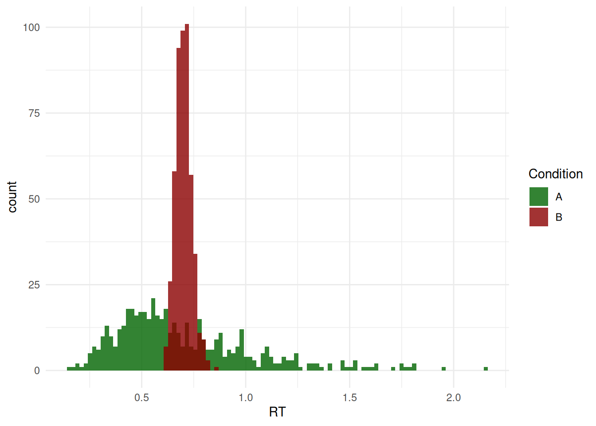
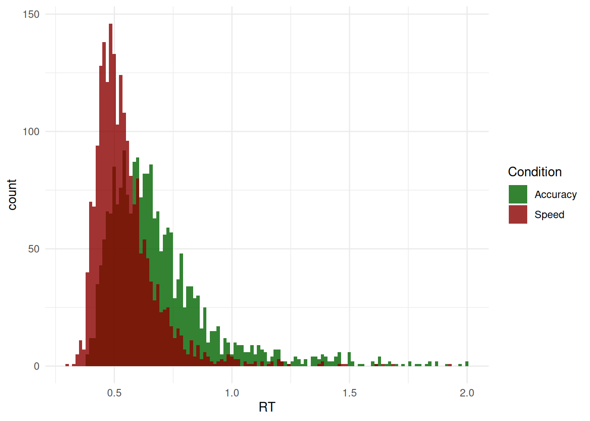
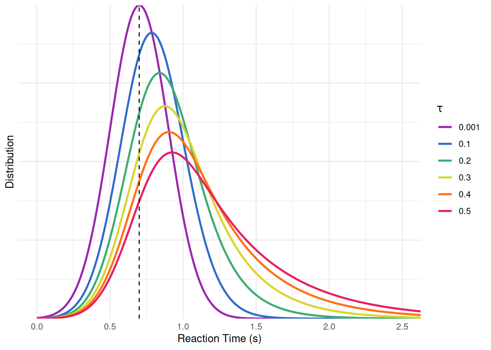
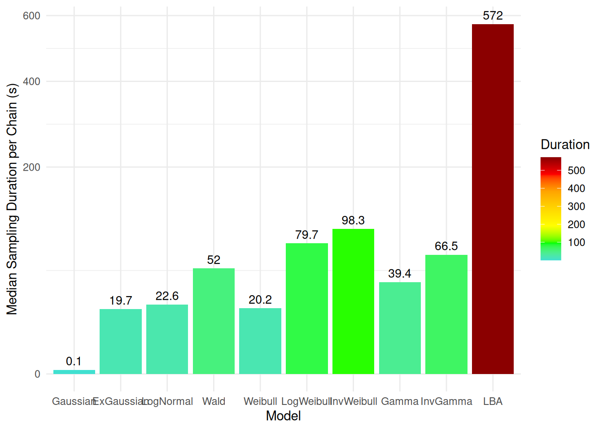
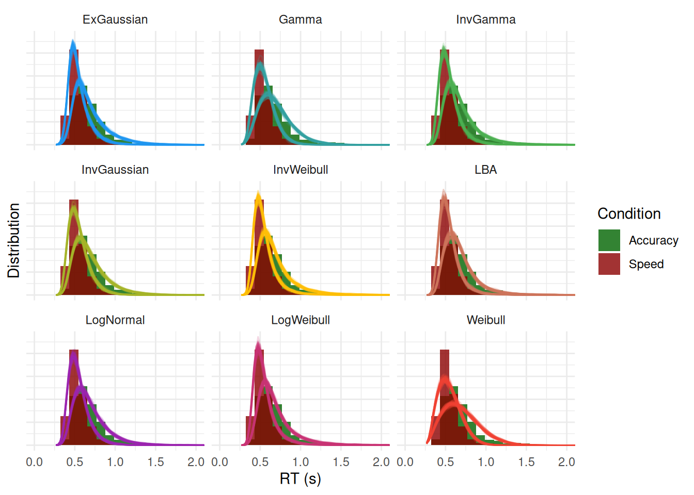

# How to Properly Analyze Reaction Times Data

``` r

library(cogmod)
library(easystats)
library(ggplot2)
library(brms)
library(cmdstanr)

options(mc.cores = parallel::detectCores() - 2)
```

## Why Linear Models are Bad for RTs

After months of effort designing the study, recruiting participants and
collecting data, you finally get your hands on that dataset and decide
to check whether your super duper Nobel-prize-worthy experimental
condition has an effect on reaction times. You do what is everybody does
and what has always been done, and fit a linear model.

Code

``` r

set.seed(5)

n <- 500

sim <- data.frame(
  Condition = rep(c("A", "B"), each = n),
  RT = c(
    # Wide distribution, very short time-to-first-response (tau = 0.05)
    0.05 + rlnorm(n, meanlog = log(0.65) - 0.5^2 / 2, sdlog = 0.5),
    # Narrow distribution, long non-decision time (tau = 0.45)
    0.45 + rlnorm(n, meanlog = log(0.25) - 0.15^2 / 2, sdlog = 0.15)
  )
)
```

``` r

model <- lm(RT ~ Condition, data = sim)

parameters::parameters(model)
#> Parameter     | Coefficient |   SE |        95% CI | t(998) |      p
#> --------------------------------------------------------------------
#> (Intercept)   |        0.70 | 0.01 | [ 0.68, 0.72] |  65.85 | < .001
#> Condition [B] |    4.25e-03 | 0.01 | [-0.03, 0.03] |   0.28 | 0.777
#> 
#> Uncertainty intervals (equal-tailed) and p-values (two-tailed) computed
#>   using a Wald t-distribution approximation.
```

***Nothing.*** **NOTHING** 😭

The effect of `Condition` is minuscule and about as far from
significance as it gets. Both groups respond in about 700 ms on average.
Months of work, and the only conclusion you can write down is ***“the
condition had no effect on response times”***. As you contemplate the
ruins of your Nobel-prize aspirations, you start seriously considering
abandoning your dreams of a career in academia and retraining as a goat
farmer.

But then, as a last sanity check, you decide to actually **look** at the
data.

``` r

ggplot(sim, aes(x = RT, fill = Condition)) +
  geom_histogram(bins = 100, alpha = 0.8, position = "identity") +
  scale_fill_manual(values = c("darkgreen", "darkred")) +
  theme_minimal()
```



***Shock and horror!***

The two distributions could hardly look more different! Condition **A**
has responses starting almost immediately (some as fast as 150 ms) and a
long tail stretching past 2 seconds. Condition **B** has no responses at
all before ~600 ms, and then a tight, narrow bump. One condition looks
like fast, variable, possibly impulsive responding; the other looks like
a slow but highly consistent process with a long “dead time” before any
response can be emitted. These are, by any reasonable standard, two
*dramatically* different behaviours.

How come the test did not capture any of it? Because we simulated these
two distributions to have exactly the **same mean** - and the mean is
the only thing the linear model was ever looking at. Everything that
distinguishes these conditions - where the distribution *starts*, how
*wide* it is, how heavy its *tail* is - was invisible to it by
construction.

The lesson is not that the linear model lied: it faithfully answered the
question it was asked. The problem is that “is the mean RT different?”
is almost never the question we actually care about. Fortunately, better
models exist - models that describe the *shape* of the RT distribution
with parameters that can be mapped onto meaningful cognitive quantities.
The rest of this vignette is about them.

> **“But I read that I can transform my data to make it more normal,
> should I do it?”**

Log-transforming (or inverse-transforming, or Box-Cox-ing) RTs is a very
common attempt at rescuing the linear model: make the data look
Gaussian, then proceed as usual. It is, however, **not a good idea**
([Schramm & Rouder, 2019](https://doi.org/10.31234/osf.io/9ksa6)).
Transformations do not merely “fix” the distribution, they silently
change the quantity being tested: the model no longer compares mean RTs
but means of transformed RTs, which do not back-transform to anything
you meant to ask about, and which can reverse, create or hide effects
relative to the untransformed scale. Worse, they do nothing about the
underlying problem illustrated above - a difference in shift, in spread
or in tail weight is still squeezed into a single location parameter.

What one should do instead is use a model that is appropriate for the
**shape** of the data and - ideally - for its **data generating
process**. That distinction matters if you want to push the boundaries
of what we can learn from your data. Some of the families below
(ExGaussian, Weibull, Gamma…) are essentially *descriptive*: they are
flexible enough to fit the shape of RT distributions well, but their
parameters have no guaranteed correspondence to cognitive mechanisms.
Others (Wald / Wiener, LBA, DDM) are *generative*: they are derived from
an explicit account of how a decision unfolds over time - evidence
accumulating towards a threshold - so their parameters (drift rate,
boundary separation, non-decision time) are meant to refer to actual
components of the process. Both are large improvements over the
Gaussian, but the latter allows for potentially stronger and more
interpretable claims.

> **Useful references to start**
>
> - [**Lindelov’s overview of RT
>   models**](https://lindeloev.github.io/shiny-rt/): An absolute
>   must-read.
> - [**De Boeck & Jeon
>   (2019)**](https://www.frontiersin.org/articles/10.3389/fpsyg.2019.00102/full):
>   A paper providing an overview of RT models.

## The Data

For this chapter, we will be using the data from [Wagenmakers et al.,
(2008)](https://doi.org/10.1016/j.jml.2007.04.006) - Experiment 1 also
reanalyzed by [Heathcote & Love
(2012)](https://doi.org/10.3389/fpsyg.2012.00292), that contains
responses and response times for several participants in two conditions
(where instructions emphasized either **speed** or **accuracy**). This
dataset is bundled directly with `cogmod` as `wagenmakers2008`. Using
the same procedure as the authors, we excluded all trials with
uninterpretable response time, i.e., responses that are too fast (\<200
ms instead of \<180 ms) or too slow (\>2 sec instead of \>3 sec).

``` r

set.seed(123)  # For reproducibility

df <- cogmod::wagenmakers2008
df <- df[df$RT > 0.2 & df$Participant %in% c(1, 2, 3), ]

# Show 10 first rows
head(df, 10)
#>    Participant Condition    RT Error Frequency
#> 1            1     Speed 0.700 FALSE       Low
#> 2            1     Speed 0.392  TRUE  Very Low
#> 3            1     Speed 0.460 FALSE  Very Low
#> 4            1     Speed 0.455 FALSE  Very Low
#> 5            1     Speed 0.505  TRUE       Low
#> 6            1     Speed 0.773 FALSE      High
#> 7            1     Speed 0.390 FALSE      High
#> 8            1     Speed 0.587  TRUE       Low
#> 9            1     Speed 0.603 FALSE       Low
#> 10           1     Speed 0.435 FALSE      High
```

We are going to first take interest in the response times (RT) of
**Correct** answers only (as we can assume that errors are underpinned
by a different *generative process*).

``` r

df <- df[df$Error == 0, ]
```

``` r

ggplot(df, aes(x = RT, fill = Condition)) +
  geom_histogram(bins = 120, alpha = 0.8, position = "identity") +
  scale_fill_manual(values = c("darkgreen", "darkred")) +
  theme_minimal()
```



## Models

### Normal (Gaussian)

It is worth stressing that basic linear models, often adopted as
“default” models (as they are the one obtained by simply running
[`lm()`](https://rdrr.io/r/stats/lm.html),
[`t.test()`](https://rdrr.io/r/stats/t.test.html) or
[`brm()`](https://paulbuerkner.com/brms/reference/brm.html) without
specifying a family), **are not a neutral or assumption-free
description** of the data. It is a model that assumes RTs are drawn from
a Normal distribution whose **mean** `mu` depends on the predictors. The
parameter that we then interpret and report as “the effect” of a
condition is a difference between the **means** of two Normal
distributions.

This comes with a set of assumptions that are rarely plausible for RT
data. First, the variance between various conditions is assumed to be
**fixed** (`sigma` is fixed as a constant across conditions and
participants), so any experimental effect can only manifest as a shift
in the mean - even though speed instructions, task difficulty or fatigue
typically change the *spread* and the *shape* of the RT distribution as
much as its center. Second, the Normal distribution is **symmetric** and
has support over the whole real line, whereas RTs are strictly positive,
bounded below by a non-decision time, and markedly right-skewed. The
model therefore assigns non-zero probability to negative response times,
and systematically misrepresents and underestimates the long right tail.

Beyond these statistical concerns, the deeper issue is *conceptual*: the
mean of a Normal distribution is not a quantity that maps onto anything
the cognitive system does. Slow trials, fast guesses and typical
responses are all absorbed into a single average, so a change in the
mean is ambiguous as to its origin - it could reflect a genuine slowing
of processing, a handful of attentional lapses in the tail, or a change
in response caution. The distributional models presented below are
attempts to carve the RT distribution into parameters that are, at least
in principle, more closely tied to distinct underlying processes.

Code

``` r

f <- bf(
  RT ~ Condition
)

m_normal <- brm(f,
  data = df,
  init = 0,
  chains = 4, iter = 500, backend = "cmdstanr"
)

m_normal <- brms::add_criterion(m_normal, "loo")

saveRDS(m_normal, file = "models/m_normal.rds")
```

### ExGaussian

Rather than relying on default model families, such as Gaussian models,
one can select [models that accurately represent the distribution of
their outcome variable](https://lindeloev.github.io/shiny-rt/). For
instance, models based on **Exponentially modified Gaussian**
(ex-Gaussian) distributions, which are suited to their typical skewed
shape ([Balota & Yap, 2011](https://doi.org/10.1177/0963721411408885);
[Matzke & Wagenmakers, 2009](https://doi.org/10.3758/PBR.16.5.798)).

This distribution is a convolution of normal and exponential
distributions and has three parameters, namely $`\mu`$ (mu) and
$`\sigma`$ (sigma) - the mean and standard deviation of the Gaussian
distribution - and $`\tau`$ (tau) - the exponential component of the
distribution. Intuitively, these arguments reflect the centrality, the
width and the tail dominance, respectively.

Beyond the descriptive value of these types of models, some have tried
to interpret their parameters in terms of cognitive mechanisms, arguing
for instance that changes in the Gaussian components reflect changes in
attentional processes (e.g., “the time required for organization and
execution of the motor response”; Hohle, 1965), whereas changes in the
exponential component reflect changes in intentional (i.e.,
decision-related) processes (Kieffaber et al., 2006). However, [Matzke &
Wagenmakers (2009)](https://doi.org/10.3758/PBR.16.5.798) demonstrate
that there is no direct correspondence between ex-Gaussian parameters
and cognitive mechanisms, and underline their value primarily as
descriptive tools, rather than models of cognition *per se*.

Descriptively, the three parameters can be interpreted as:

- **Mu** $`\mu`$: The location / centrality of the RTs. Would correspond
  to the mean in a symmetrical distribution.
- **Sigma** $`\sigma`$: The variability and dispersion of the RTs. Akin
  to the standard deviation in normal distributions.
- **Tau** $`\tau`$: Tail weight / skewness of the distribution.

Note that these parameters are not independent with respect to
distribution characteristics: on the right is an example of
distributions with the **same location and dispersion** parameters.
Although only the tail weight parameter is changed, the whole
distribution appears to shift its centre of mass (its peak moves from
0.70 to 0.93, and its mean from 0.70 to 1.20 s). **Hence, one should be
careful not to interpret the value of mu directly as the “mean” or the
distribution “peak”, nor sigma as the SD or the “width”**.



*Ex-Gaussian distributions with the same location ($`\mu`$ = 0.7) and
dispersion ($`\sigma`$ = 0.2) parameters, varying only in tail weight.*

One important caveat: `brms`’s native
[`exgaussian()`](https://paulbuerkner.com/brms/reference/brmsfamily.html)
family does **not** use this “classical” parameterization familiar to
experimental psychologists: its `mu` indexes the mean of the *entire*
distribution (i.e., Gaussian + exponential combined) rather than the
location of the Gaussian component alone. This matters because a change
in the Gaussian location and an opposite change in the exponential tail
can cancel out at the level of the overall mean, so effects estimated on
`brms`’s default `mu` can lead to different (and potentially incorrect)
inferences about the underlying process than effects estimated on the
classical `mu`.

For this reason, `cogmod` provides its own
[`rt_exgaussian()`](https://github.com/DominiqueMakowski/cogmod/reference/rrt_exgaussian.md)
custom family (internally relying on Stan’s `exp_mod_normal`
distribution), in which `mu` and `sigma` are the mean and SD of the
Gaussian component and `tau` is the mean of the exponential tail -
directly matching the classical parameterization.

Code

``` r

f <- bf(
  RT ~ Condition,
  sigma ~ Condition,
  tau ~ Condition,
  family = rt_exgaussian()
)

m_exgauss <- brm(f,
  data = df,
  stanvars = rt_exgaussian_stanvars(),
  init = 0,
  chains = 4, iter = 500, backend = "cmdstanr"
)

m_exgauss <- brms::add_criterion(m_exgauss, "loo")

saveRDS(m_exgauss, file = "models/m_exgauss.rds")
```

### Shifted LogNormal

The LogNormal distribution assumes that it is the *logarithm* of the
RTs, rather than the RTs themselves, that is Normally distributed. This
is an attractive assumption for response times: it constrains the
variable to be strictly positive, and it produces the right-skewed shape
typical of RT data for free. It also has an intuitive rationale - a
Normal distribution arises when many small influences *add up*, whereas
a LogNormal arises when they *multiply*, which is arguably a better
description of the way processing speed is affected by factors such as
arousal, difficulty or practice.

The **shifted** version adds a third ingredient: a non-decision time
(`ndt`) before which no response can physically occur, corresponding to
the time taken by stimulus encoding and motor execution. Without it, the
distribution is forced to start at zero, and the model has to distort
the shape of the whole distribution to accommodate the empty space
between 0 and the fastest observed response. In `cogmod`’s
[`rt_lognormal()`](https://github.com/DominiqueMakowski/cogmod/reference/rt_lognormal.md)
family, `mu` and `sigma` are the mean and SD *on the log scale* (so that
the median of the distribution is `ndt + exp(mu)`), and the shift is
expressed as `tau`, the *proportion* of the minimum RT that is taken up
by non-decision time (`ndt = tau * minrt`). This reparameterization
keeps `tau` bounded between 0 and 1, which is both easier to sample and
guarantees that the shift never exceeds the fastest observed response.

Like the ExGaussian, this model is primarily **descriptive**: it
captures the shape of RT distributions very well, but `mu` and `sigma`
are not, in themselves, cognitive quantities. It does, however, sit at
the base of a proper process model - the Lognormal Race (see
[`lnr()`](https://github.com/DominiqueMakowski/cogmod/reference/rlnr.md)),
in which several LogNormal accumulators compete and the fastest one
determines both the response and the RT.

> **Isn’t this the same as log-transforming my RTs?**
>
> It is not, and the difference is precisely the one discussed above.
> Log-transforming the data and running a linear model on `log(RT)`
> estimates the mean of the *transformed* values, which then has to be
> interpreted on the log scale (or back-transformed into something that
> is no longer the mean RT). The LogNormal model leaves the data
> untouched and instead changes the *likelihood*: the RTs stay in
> seconds, and it is the model that is told they arise from a LogNormal
> process. In addition, the shift (`tau`) and the dispersion (`sigma`)
> are estimated as their own parameters, and can be given their own
> predictors - something a transformation can never give you, since it
> still funnels every effect through a single location parameter.

Code

``` r

f <- bf(
  RT ~ Condition,
  sigma ~ Condition,
  tau ~ Condition,
  minrt = min(df$RT),
  family = rt_lognormal()
)

priors <- brms::set_prior("normal(0, 1)", class = "Intercept", dpar = "tau") |>
  brms::validate_prior(f, data = df)

m_lognormal <- brm(
  f,
  prior = priors,
  data = df,
  stanvars = rt_lognormal_stanvars(),
  init = 0,
  chains = 4, iter = 500, backend = "cmdstanr"
)

m_lognormal <- brms::add_criterion(m_lognormal, "loo")

saveRDS(m_lognormal, file = "models/m_lognormal.rds")
```

### Inverse Gaussian (Shifted Wald)

This is where we cross an important line. All the families discussed so
far were selected because their *shape* resembles that of RT
distributions; the Wald distribution, in contrast, is **derived** from a
model *of the process* that generates the data. Consider evidence
accumulating noisily over time until it reaches a decision threshold:
the distribution of the times at which that threshold is first crossed
*is* the Wald distribution. Its skewed shape is not a modelling choice,
it is a consequence of the assumed mechanism.

The Shifted Wald model (also known as the Inverse Gaussian distribution)
is actually equivalent to a one-response version of the Drift Diffusion
Model (DDM) with no between-trial variability in drift rate, starting
point, or non-decision time.

This changes what the parameters mean. Instead of a location and a
width, we now estimate quantities that refer to distinct components of
the decision: `mu` is the **drift rate** (the speed at which evidence
accumulates, often read as task difficulty or processing efficiency),
`bs` is the **boundary separation** (how much evidence is required
before responding, i.e., response caution), and `tau` is again the
**non-decision time** (encoding and motor execution). This is why the
formula below regresses `Condition` on `bs` rather than on `sigma`: the
natural hypothesis for a speed-vs-accuracy manipulation is that
instructions move the *threshold*, not the quality of the evidence.

Two caveats are worth keeping in mind. First, because this version has a
single boundary, it only describes the timing of *one* type of
response - it knows nothing about errors, and so cannot exploit the
joint distribution of choices and RTs (that is what the DDM and LBA of
the *Decision Making* vignette are for). Second, this interpretive gain
is not free: with RT data alone, drift rate and boundary separation
trade off against each other to a considerable degree, so their separate
estimates should be treated with more caution than their cognitive
labels suggest.

Code

``` r

f <- bf(
  RT ~ Condition,
  bs ~ Condition,
  tau ~ Condition,
  minrt = min(df$RT),
  family = rt_invgaussian()
)

priors <- brms::set_prior("normal(0, 1)", class = "Intercept", dpar = "tau") |>
  brms::validate_prior(f, data = df)

m_wald <- brm(
  f,
  prior = priors,
  data = df,
  stanvars = rt_invgaussian_stanvars(),
  init = 0,
  chains = 4, iter = 500, backend = "cmdstanr"
)

m_wald <- brms::add_criterion(m_wald, "loo")

saveRDS(m_wald, file = "models/m_wald.rds")
```

### Weibull

Note that the families presented from here on have not been used nearly
as often in the RT literature as the ones above, and their properties in
this context are correspondingly less well documented. They are
nonetheless capable of generating close fits to RT data, and more
research is needed to establish whether they offer any real advantage -
in terms of fit, of interpretability, or of computational behaviour -
over the more established options.

Code

``` r

f <- bf(
  RT ~ Condition,
  sigma ~ Condition,
  tau ~ Condition,
  minrt = min(df$RT),
  family = rt_weibull()
)

priors <- brms::set_prior("normal(0, 1)", class = "Intercept", dpar = "tau") |>
  brms::validate_prior(f, data = df)

m_weibull <- brm(
  f,
  prior = priors,
  data = df,
  stanvars = rt_weibull_stanvars(),
  init = 0,
  chains = 4, iter = 500, backend = "cmdstanr"
)

m_weibull <- brms::add_criterion(m_weibull, "loo")

saveRDS(m_weibull, file = "models/m_weibull.rds")
```

### LogWeibull (Shifted Gumbel)

Code

``` r

f <- bf(
  RT ~ Condition,
  sigma ~ Condition,
  tau ~ Condition,
  minrt = min(df$RT),
  family = rt_logweibull()
)

priors <- brms::set_prior("normal(0, 1)", class = "Intercept", dpar = "tau") |>
  brms::validate_prior(f, data = df)

m_logweibull <- brm(
  f,
  prior = priors,
  data = df,
  stanvars = rt_logweibull_stanvars(),
  init = 0,
  chains = 4, iter = 500, backend = "cmdstanr"
)

m_logweibull <- brms::add_criterion(m_logweibull, "loo")

saveRDS(m_logweibull, file = "models/m_logweibull.rds")
```

### Inverse Weibull (Shifted Fréchet)

Code

``` r

f <- bf(
  RT ~ Condition,
  sigma ~ Condition,
  tau ~ Condition,
  minrt = min(df$RT),
  family = rt_invweibull()
)

priors <- brms::set_prior("normal(0, 1)", class = "Intercept", dpar = "tau") |>
  brms::validate_prior(f, data = df)

m_invweibull <- brm(
  f,
  prior = priors,
  data = df,
  stanvars = rt_invweibull_stanvars(),
  init = 0,
  chains = 4, iter = 500, backend = "cmdstanr"
)

m_invweibull <- brms::add_criterion(m_invweibull, "loo")

saveRDS(m_invweibull, file = "models/m_invweibull.rds")
```

### Gamma

Code

``` r

f <- bf(
  RT ~ Condition,
  sigma ~ Condition,
  tau ~ Condition,
  minrt = min(df$RT),
  family = rt_gamma()
)

priors <- brms::set_prior("normal(0, 1)", class = "Intercept", dpar = "tau") |>
  brms::validate_prior(f, data = df)

m_gamma <- brm(
  f,
  prior = priors,
  data = df,
  stanvars = rt_gamma_stanvars(),
  init = 0,
  chains = 4, iter = 500, backend = "cmdstanr"
)

m_gamma <- brms::add_criterion(m_gamma, "loo")

saveRDS(m_gamma, file = "models/m_gamma.rds")
```

### Inverse Gamma

Code

``` r

f <- bf(
  RT ~ Condition,
  sigma ~ Condition,
  tau ~ Condition,
  minrt = min(df$RT),
  family = rt_invgamma()
)

priors <- brms::set_prior("normal(0, 1)", class = "Intercept", dpar = "tau") |>
  brms::validate_prior(f, data = df)

m_invgamma <- brm(
  f,
  prior = priors,
  data = df,
  stanvars = rt_invgamma_stanvars(),
  init = 0,
  chains = 4, iter = 500, backend = "cmdstanr"
)

m_invgamma <- brms::add_criterion(m_invgamma, "loo")

saveRDS(m_invgamma, file = "models/m_invgamma.rds")
```

### Linear Ballistic Accumulator

Code

``` r

f <- bf(
  RT ~ Condition,
  sigma = 1,
  sigmabias ~ Condition,
  bs ~ Condition,
  tau ~ Condition,
  minrt = min(df$RT),
  family = rt_lba()
)

priors <- c(
  brms::set_prior("normal(0, 1)", class = "Intercept", dpar = "mu"),
  brms::set_prior("normal(0, 1)", class = "Intercept", dpar = "sigmabias"),
  brms::set_prior("normal(0, 1)", class = "Intercept", dpar = "bs"),
  brms::set_prior("normal(0, 1)", class = "Intercept", dpar = "tau")
  )|>
  brms::validate_prior(f, data = df)

m_lba <- brm(
  f,
  prior = priors,
  data = df,
  stanvars = rt_lba_stanvars(),
  init = 0.5,
  chains = 4, iter = 500, backend = "cmdstanr"
)

m_lba <- brms::add_criterion(m_lba, "loo")

saveRDS(m_lba, file = "models/m_lba.rds")
```

## Model Comparison

### Model Fit

We can compare these models together using the `loo` package, which
shows that CHOCO provides a significantly better fit than the other
models.

``` r

loo::loo_compare(m_normal, m_exgauss, m_lognormal, m_wald,
                 m_weibull, m_logweibull, m_invweibull,
                 m_gamma, m_invgamma, m_lba) |>
  parameters(include_ENP = TRUE)
#> Loading required namespace: rstan
#> # Fixed Effects
#> 
#> Name |   LOOIC |   ENP |    ELPD | Difference | Difference_SE |      p
#> ----------------------------------------------------------------------
#> 1    | -4845.1 |  7.29 | 2422.56 |       0.00 |          0.00 |       
#> 2    | -4840.8 |  4.72 | 2420.41 |      -2.15 |          5.95 | 0.717 
#> 3    | -4840.4 |  5.03 | 2420.18 |      -2.38 |          6.00 | 0.691 
#> 4    | -4831.7 |  8.31 | 2415.85 |      -6.71 |          6.22 | 0.281 
#> 5    | -4793.3 |  6.41 | 2396.64 |     -25.93 |          9.55 | 0.007 
#> 6    | -4763.0 |  8.80 | 2381.50 |     -41.06 |         11.08 | < .001
#> 7    | -4728.7 | 10.84 | 2364.36 |     -58.20 |         15.07 | < .001
#> 8    | -4393.2 |  7.53 | 2196.61 |    -225.95 |         24.80 | < .001
#> 9    | -3680.4 |  9.33 | 1840.19 |    -582.37 |         38.96 | < .001
#> 10   | -1904.2 |  7.82 |  952.09 |   -1470.47 |         73.27 | < .001
```

### Sampling Duration

Because each model was fit with only 4 chains, a boxplot of the
per-chain sampling times is not very informative. Instead, we summarize
each model’s sampling duration by the *median* time per chain, annotated
with its value.

As expected, the **Gaussian** model is by far the fastest to sample,
since it relies on `brms`’s built-in (and heavily optimized) Normal
likelihood with no custom Stan code or non-decision time shift involved.
At the other end, the **LBA** is by far the slowest, reflecting the
added cost of its multi-accumulator likelihood. The remaining RT-only
models (ExGaussian, LogNormal, Wald, Weibull, LogWeibull, InvWeibull,
Gamma, and InvGamma) are all relatively comparable to one another, as
they share a similar structure (a simple closed-form density combined
with a non-decision time shift).

``` r

duration <- rbind(
  data_modify(attributes(m_normal$fit)$metadata$time$chain, Model="Gaussian"),
  data_modify(attributes(m_exgauss$fit)$metadata$time$chain, Model="ExGaussian"),
  data_modify(attributes(m_lognormal$fit)$metadata$time$chain, Model="LogNormal"),
  data_modify(attributes(m_wald$fit)$metadata$time$chain, Model="Wald"),
  data_modify(attributes(m_weibull$fit)$metadata$time$chain, Model="Weibull"),
  data_modify(attributes(m_logweibull$fit)$metadata$time$chain, Model="LogWeibull"),
  data_modify(attributes(m_invweibull$fit)$metadata$time$chain, Model="InvWeibull"),
  data_modify(attributes(m_gamma$fit)$metadata$time$chain, Model="Gamma"),
  data_modify(attributes(m_invgamma$fit)$metadata$time$chain, Model="InvGamma"),
  data_modify(attributes(m_lba$fit)$metadata$time$chain, Model="LBA")
) |>
  data_modify(Model = factor(Model, levels = c("Gaussian", "ExGaussian", "LogNormal", "Wald", "Weibull", "LogWeibull", "InvWeibull", "Gamma", "InvGamma", "LBA")))

duration_median <- aggregate(total ~ Model, data = duration, FUN = median)

duration_median |>
  ggplot(aes(x = Model, y = total, fill = total)) +
  geom_col() +
  geom_text(aes(label = round(total, 1)), vjust = -0.5, size = 3.5) +
  labs(y = "Median Sampling Duration per Chain (s)", fill = "Duration") +
  scale_fill_gradientn(colors = c("turquoise", "green", "yellow", "gold", "orange", "red", "darkred")) +
  scale_y_sqrt() +
  theme_minimal()
```



### Posterior Predictive Check

`iterations` controls the actual number of iterations used (e.g., for
the point-estimate) and `keep_iterations` the number included.

Code

``` r


pred <- rbind(
  # estimate_prediction(m_normal, keep_iterations = 50, iterations = 50) |>
  #   reshape_iterations() |>
  #   data_modify(Model = "Normal"),
  estimate_prediction(m_exgauss, keep_iterations = 50, iterations = 50) |>
    reshape_iterations() |>
    data_modify(Model = "ExGaussian"),
  estimate_prediction(m_lognormal, keep_iterations = 50, iterations = 50) |>
    reshape_iterations() |>
    data_modify(Model = "LogNormal"),
  estimate_prediction(m_wald, keep_iterations = 50, iterations = 50) |>
    reshape_iterations() |>
    data_modify(Model = "InvGaussian"),
  estimate_prediction(m_weibull, keep_iterations = 50, iterations = 50) |>
    reshape_iterations() |>
    data_modify(Model = "Weibull"),
  estimate_prediction(m_logweibull, keep_iterations = 50, iterations = 50) |>
    reshape_iterations() |>
    data_modify(Model = "LogWeibull"),
  estimate_prediction(m_invweibull, keep_iterations = 50, iterations = 50) |>
    reshape_iterations() |>
    data_modify(Model = "InvWeibull"),
  estimate_prediction(m_gamma, keep_iterations = 50, iterations = 50) |>
    reshape_iterations() |>
    data_modify(Model = "Gamma"),
  estimate_prediction(m_invgamma, keep_iterations = 50, iterations = 50) |>
    reshape_iterations() |>
    data_modify(Model = "InvGamma"),
  estimate_prediction(m_lba, keep_iterations = 50, iterations = 50) |>
    reshape_iterations() |>
    data_modify(Model = "LBA") |>
    data_filter(iter_value < 2)
)

p <- pred |>
  ggplot(aes(x=iter_value)) +
  geom_histogram(data = df, aes(x=RT, y = after_stat(density), fill = Condition),
                 position = "identity", bins=120, alpha = 0.8) +
  geom_line(aes(color=Model, group=interaction(Condition, iter_group)), stat="density", alpha=0.2) +
  theme_minimal() +
  theme(axis.text.y = element_blank()) +
  facet_wrap(~Model) +
  coord_cartesian(xlim = c(0, 2)) +
  scale_fill_manual(values = c("darkgreen", "darkred")) +
  scale_color_material_d(guide = "none") +
  labs(x = "RT (s)", y = "Distribution")
p
```


