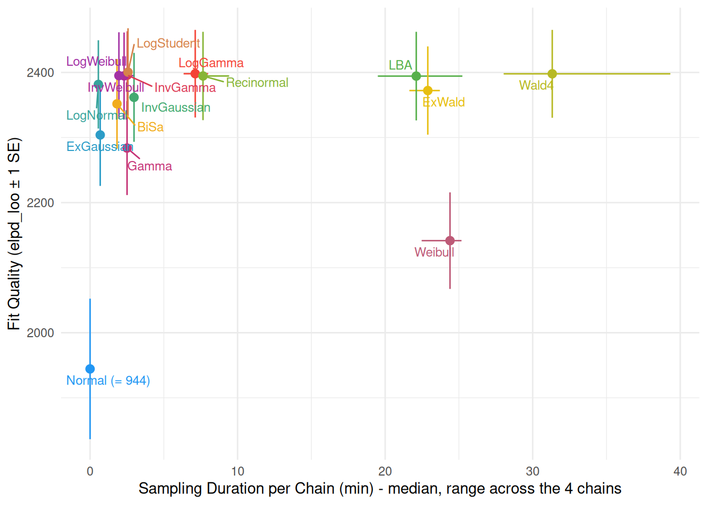
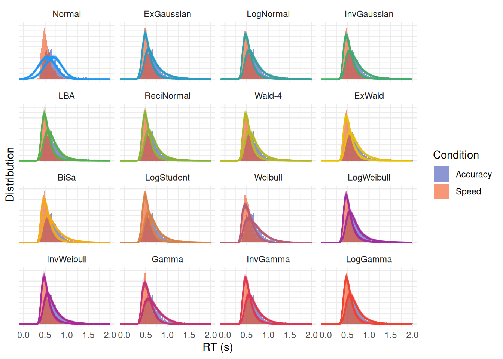
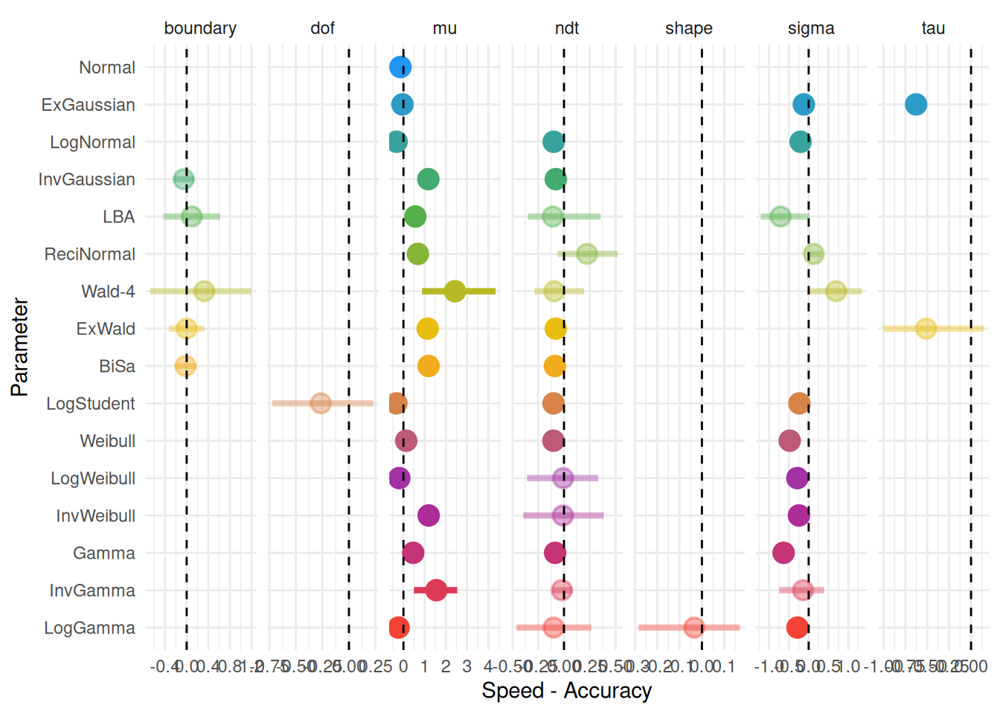

# How to Properly Analyze Reaction Times Data

``` r

library(cogmod)
library(easystats)
library(ggplot2)
library(dplyr)
library(brms)
library(cmdstanr)

options(mc.cores = parallel::detectCores() - 2)
```

## Why Linear Models are bad for RTs

After months of effort designing the study, recruiting participants and
collecting data, you finally get your hands on that dataset and decide
to check whether your super duper Nobel-prize-worthy experimental
condition has an effect on reaction times. You do what everybody does,
and what has always been done: fit a (mixed) linear model.

The data are bundled with `cogmod` as `badlm` - 20 participants, 25
trials in each of two conditions. See
[`?badlm`](https://dominiquemakowski.github.io/cogmod/reference/badlm.md)
(or `data-raw/badlm.R`) for how they were generated.

``` r

sim <- cogmod::badlm

head(sim)
#>   Participant Condition        RT
#> 1         S01         A 0.9246246
#> 2         S01         A 0.9434260
#> 3         S01         A 1.2198363
#> 4         S01         A 0.8415406
#> 5         S01         A 0.8886914
#> 6         S01         A 0.5201079
```

``` r

library(lme4)

model <- lmer(RT ~ Condition + (1 | Participant), data = sim)

parameters(model)
#> # Fixed Effects
#> 
#> Parameter     | Coefficient |   SE |        95% CI | t(996) |      p
#> --------------------------------------------------------------------
#> (Intercept)   |        0.69 | 0.01 | [ 0.67, 0.72] |  59.34 | < .001
#> Condition [B] |   -1.20e-03 | 0.01 | [-0.03, 0.03] |  -0.08 | 0.936 
#> 
#> # Random Effects
#> 
#> Parameter                   | Coefficient
#> -----------------------------------------
#> SD (Intercept: Participant) |        0.02
#> SD (Residual)               |        0.24
```

***Nothing.*** **NOTHING** 😭

The effect of `Condition B vs. Condition A` is minuscule and and
non-significant. Months of work, and the only conclusion you can write
down is ***“the condition had no effect on response times”***. As you
contemplate the ruins of your Nobel-prize aspirations, you start
seriously considering abandoning your dreams of a career in academia and
retraining as a goat farmer.

But then, as a last sanity check, you decide to actually **look** at the
data.

``` r

ggplot(sim, aes(x = RT, fill = Condition)) +
  geom_histogram(bins = 120, alpha = 0.8, position = "identity") +
  scale_fill_manual(values = c("orange", "blue")) +
  theme_minimal()
```


***Shock and horror!***

*The two distributions could hardly look more different!* Condition
**A** has responses starting almost immediately (some as fast as 150 ms)
and a long tail stretching past 2 seconds. Condition **B** has no
responses at all before ~600 ms, and then a tight, narrow bump. One
condition looks like fast, variable, possibly impulsive responding; the
other looks like a slow but highly consistent process with a long “dead
time” before any response can be emitted. These are, by any reasonable
standard, two *dramatically* different behaviours.

How come the test did not capture any of it? Because we simulated these
two distributions to have exactly the **same mean** - and the mean is
the only thing the linear model was ever looking at. Everything that
distinguishes these conditions - where the distribution *starts*, how
*wide* it is, how heavy its *tail* is - was invisible to it by
construction.

The lesson is not that the linear model lied: it faithfully answered the
question it was asked. The problem is that “is the mean RT different?”
is almost never the question we actually care about. Fortunately, better
models exist - models that describe the *shape* of the RT distribution
with parameters that can be mapped onto meaningful cognitive quantities.
The rest of this vignette is about them.

> ***“But I read that I can transform my data to make it more normal,
> should I do it?”***

Log-transforming (or inverse-transforming, or Box-Cox-ing) RTs is a very
common attempt at rescuing the linear model: make the data look
Gaussian, then proceed as usual. It is, however, **not a good idea**
([Schramm & Rouder, 2019](https://doi.org/10.31234/osf.io/9ksa6)).
Transformations do not merely “fix” the distribution, they silently
change the quantity being tested: the model no longer compares mean RTs
but means of transformed RTs, which do not back-transform to anything
you meant to ask about, and which can reverse, create or hide effects
relative to the untransformed scale. Worse, they do nothing about the
underlying problem illustrated above - a difference in shift, in spread
or in tail weight is still squeezed into a single location parameter.

What one should do instead is use a model that is appropriate for the
**shape** of the data and - ideally - for its **data generating
process**. That distinction matters if you want to push the boundaries
of what we can learn from your data. Some of the families below
(ExGaussian, Weibull, Gamma…) are essentially *descriptive*: they are
flexible enough to fit the shape of RT distributions well, but their
parameters have no guaranteed correspondence to cognitive mechanisms.
Others (Wald / Wiener, LBA, DDM) are *generative*: they are derived from
an explicit account of how a decision unfolds over time - evidence
accumulating towards a threshold - so their parameters (drift rate,
boundary separation, non-decision time) are meant to refer to actual
components of the process. Both are large improvements over the
Gaussian, but the latter allows for potentially stronger and more
interpretable claims.

**Useful references to start:**

- [**Lindelov’s overview of RT
  models**](https://lindeloev.github.io/shiny-rt/): An absolute
  must-read.
- [**De Boeck & Jeon
  (2019)**](https://www.frontiersin.org/articles/10.3389/fpsyg.2019.00102/full):
  A paper providing an overview of RT models.

## The Data

For this chapter, we will be using the data from [Wagenmakers et al.,
(2008)](https://doi.org/10.1016/j.jml.2007.04.006) - Experiment 1 also
reanalyzed by [Heathcote & Love
(2012)](https://doi.org/10.3389/fpsyg.2012.00292), that contains
responses and response times for several participants in two conditions
(where instructions emphasized either **speed** or **accuracy**). The
data are distributed in the
[`rtdists`](https://cran.r-project.org/package=rtdists) package as
`speed_acc`. We excluded trials with extreme slow responses (\>2 sec).

``` r

set.seed(123)  # For reproducibility

# Experiment 1 of Wagenmakers et al. (2008), from rtdists. 
data(speed_acc, package = "rtdists")

df <- data.frame(
  Participant = as.integer(as.character(speed_acc$id)),
  Condition = unname(c(accuracy = "Accuracy", speed = "Speed")[
    as.character(speed_acc$condition)]),
  RT = speed_acc$rt,
  Error = as.integer(as.character(speed_acc$response) != as.character(speed_acc$stim_cat)),
  Frequency = unname(c(high = "High", low = "Low", very_low = "Very Low")[
    sub("^nw_", "", as.character(speed_acc$frequency))])
)


df <- df[df$Participant %in% c(1, 2, 3) &
           df$Error == 0 & 
           df$RT <= 2, ]

# Show 10 first rows
head(df, 10)
#>    Participant Condition    RT Error Frequency
#> 1            1     Speed 0.700     0       Low
#> 3            1     Speed 0.460     0  Very Low
#> 4            1     Speed 0.455     0  Very Low
#> 6            1     Speed 0.773     0      High
#> 7            1     Speed 0.390     0      High
#> 9            1     Speed 0.603     0       Low
#> 10           1     Speed 0.435     0      High
#> 11           1     Speed 0.524     0  Very Low
#> 12           1     Speed 0.427     0      High
#> 13           1     Speed 0.456     0  Very Low
```

We are going to first take interest in the response times (RT) of
**Correct** answers only (as we can assume that errors are underpinned
by a different *generative process*).

``` r

ggplot(df, aes(x = RT, fill = Condition)) +
  geom_histogram(bins = 120, alpha = 0.8, position = "identity") +
  scale_fill_manual(values = c("Accuracy"="#3F51B5", "Speed"="#F4511E")) +
  theme_minimal()
```


## Main Models

### Normal (Gaussian)

It is worth stressing that basic linear models, often adopted as
“default” models (as they are the one obtained by simply running
[`lm()`](https://rdrr.io/r/stats/lm.html),
[`t.test()`](https://rdrr.io/r/stats/t.test.html) or
[`brm()`](https://paulbuerkner.com/brms/reference/brm.html) without
specifying a family), **are not a neutral or assumption-free
description** of the data. It is a model that assumes RTs are drawn from
a Normal distribution whose **mean** `mu` depends on the predictors. The
parameter that we then interpret and report as “the effect” of a
condition is a difference between the **means** of two Normal
distributions.

This comes with a set of assumptions that are rarely plausible for RT
data. First, the variance between various conditions is assumed to be
**fixed** (`sigma` is fixed as a constant across conditions and
participants), so any experimental effect can only manifest as a shift
in the mean - even though speed instructions, task difficulty or fatigue
typically change the *spread* and the *shape* of the RT distribution as
much as its center. Second, the Normal distribution is **symmetric** and
has support over the whole real line, whereas RTs are strictly positive,
bounded below by a non-decision time, and markedly right-skewed. The
model therefore assigns non-zero probability to negative response times,
and systematically misrepresents and underestimates the long right tail.

Beyond these statistical concerns, the deeper issue is *conceptual*: the
mean of a Normal distribution is not a quantity that maps onto anything
the cognitive system does. Slow trials, fast guesses and typical
responses are all absorbed into a single average, so a change in the
mean is ambiguous as to its origin - it could reflect a genuine slowing
of processing, a handful of attentional lapses in the tail, or a change
in response caution. The distributional models presented below are
attempts to carve the RT distribution into parameters that are, at least
in principle, more closely tied to distinct underlying processes.

``` r

f <- bf(RT ~ Condition)

m_normal <- brm(f,
  data = df,
  chains = 4, iter = 500, backend = "cmdstanr"
)

m_normal <- brms::add_criterion(m_normal, "loo")
```

The animation below unpacks what such a model actually contains: the two
parameters travelling through the space of possible Normal
distributions, and the prior placed on each of them. Both use an
**identity link**, i.e. they are sampled directly on their natural
scale - which for `sigma` is only possible because it is declared with a
lower bound of 0 and given a *truncated* prior (the half Student-t that
`brms` uses by default for scale parameters).


### ExGaussian

Rather than relying on default model families, such as Gaussian models,
one can select [models that accurately represent the distribution of
their outcome variable](https://lindeloev.github.io/shiny-rt/). For
instance, models based on **Exponentially modified Gaussian**
(ex-Gaussian) distributions, which are suited to their typical skewed
shape ([Balota & Yap, 2011](https://doi.org/10.1177/0963721411408885);
[Matzke & Wagenmakers, 2009](https://doi.org/10.3758/PBR.16.5.798)).

This distribution is a convolution of normal and exponential
distributions and has three parameters, namely $`\mu`$ (mu) and
$`\sigma`$ (sigma) - the mean and standard deviation of the Gaussian
distribution - and $`\tau`$ (tau) - the exponential component of the
distribution. Intuitively, these arguments reflect the centrality, the
width and the tail dominance, respectively.

Beyond the descriptive value of these types of models, some have tried
to interpret their parameters in terms of cognitive mechanisms, arguing
for instance that changes in the Gaussian components reflect changes in
attentional processes (e.g., “the time required for organization and
execution of the motor response”; Hohle, 1965), whereas changes in the
exponential component reflect changes in intentional (i.e.,
decision-related) processes (Kieffaber et al., 2006). However, [Matzke &
Wagenmakers (2009)](https://doi.org/10.3758/PBR.16.5.798) demonstrate
that there is no direct correspondence between ex-Gaussian parameters
and cognitive mechanisms, and underline their value primarily as
descriptive tools, rather than models of cognition *per se*.

Descriptively, the three parameters can be interpreted as:

- **Mu** $`\mu`$: The location / centrality of the RTs. Would correspond
  to the mean in a symmetrical distribution.
- **Sigma** $`\sigma`$: The variability and dispersion of the RTs. Akin
  to the standard deviation in normal distributions.
- **Tau** $`\tau`$: Tail weight / skewness of the distribution.

Despite the generally good fit and relative simplicity of Ex-Gaussian
models, they have one major drawback. Their underlying parameters do not
represent **independent** characteristics of the overall shape. The
shape of the distribution is detemrined by the interaction of all three
parameters. Below is an example of ex-Gaussian distributions that all
share the **same location and dispersion** parameters, and differ only
in their tail weight.


*Ex-Gaussian distributions with the same location ($`\mu`$ = 0.7, dashed
line) and dispersion ($`\sigma`$ = 0.2) parameters, varying only in tail
weight.*

Although only the tail weight parameter is changed, the whole
distribution appears to shift its centre of mass: as $`\tau`$ goes from
0 to 0.5, the peak moves from 0.70 to 0.93 and the mean from 0.70 to
1.20 s, while the SD of the whole distribution grows from 0.20 to 0.54.
**Hence, one should be careful not to interpret the value of mu directly
as the “mean” or the distribution “peak”, nor sigma as the SD or the
“width”**.

One important caveat: `brms`’s native
[`exgaussian()`](https://paulbuerkner.com/brms/reference/brmsfamily.html)
family does **not** use this “classical” parameterization familiar to
experimental psychologists: its `mu` indexes the mean of the *entire*
distribution (i.e., Gaussian + exponential combined) rather than the
location of the Gaussian component alone. This matters because a change
in the Gaussian location and an opposite change in the exponential tail
can cancel out at the level of the overall mean, so effects estimated on
`brms`’s default `mu` can lead to different (and potentially incorrect)
inferences about the underlying process than effects estimated on the
classical `mu`.

For this reason, `cogmod` provides its own
[`cogmod_exgaussian()`](https://dominiquemakowski.github.io/cogmod/reference/rcogmod_exgaussian.md)
custom family, in which `mu` and `sigma` are the mean and SD of the
Gaussian component and `tau` is the mean of the exponential tail -
directly matching the classical parameterization.

Note that `cogmod` also implements the **Generalised Ex-Gaussian**
([Marmolejo-Ramos et al.,
2023](https://doi.org/10.1007/s11571-022-09813-2)),
[`cogmod_geg()`](https://dominiquemakowski.github.io/cogmod/reference/rcogmod_geg.md),
which adds a `shape` parameter that raises the ex-Gaussian’s CDF to a
power. It reaches distributions the ex-Gaussian cannot - including
negatively skewed ones - and `shape = 1` recovers
[`cogmod_exgaussian()`](https://dominiquemakowski.github.io/cogmod/reference/rcogmod_exgaussian.md)
exactly, so the two can be compared with
[`loo_compare()`](https://mc-stan.org/loo/reference/loo_compare.html).
The cost is parameter interpretability: with `shape` free the mean is no
longer `mu + tau`, and `shape` is strongly confounded with `mu`. See
[`?cogmod_geg`](https://dominiquemakowski.github.io/cogmod/reference/rcogmod_geg.md)
for the details.

``` r

f <- bf(
  RT ~ Condition,
  sigma ~ Condition,
  tau ~ Condition,
  family = cogmod_exgaussian()
)

m_exgauss <- brm(f,
  data = df,
  prior = cogmod_priors(f, df),
  init = cogmod_inits(f, df),
  stanvars = cogmod_stanvars(f),
  chains = 4, iter = 500, backend = "cmdstanr"
)

m_exgauss <- brms::add_criterion(m_exgauss, "loo")
```

Note that every model below is fitted with `init = cogmod_inits(f, df)`.
`brms` initialises on the *unconstrained* scale, so the usual `init = 0`
starts `ndt` at `exp(0) = 1` second - above most sub-second reaction
times, which leaves every response attributed to the outlier component
and the decision parameters with no gradient to move on. For
[`cogmod_gamma()`](https://dominiquemakowski.github.io/cogmod/reference/rcogmod_gamma.md)
and
[`cogmod_weibull()`](https://dominiquemakowski.github.io/cogmod/reference/rcogmod_weibull.md)
that is fatal (the chain never moves at all); for the others it merely
wastes warmup walking `ndt` back down, which on a 1500-trial LogNormal
cost about 3x the sampling time.
[`cogmod_inits()`](https://dominiquemakowski.github.io/cogmod/reference/cogmod_inits.md)
sets each parameter separately and leaves everything it does not
recognise to Stan. See
[`?cogmod_inits`](https://dominiquemakowski.github.io/cogmod/reference/cogmod_inits.md).

### Shifted LogNormal

The LogNormal distribution assumes that it is the *logarithm* of the
RTs, rather than the RTs themselves, that is Normally distributed. This
is an attractive assumption for response times: it constrains the
variable to be strictly positive, and it produces the right-skewed shape
typical of RT data for free.

> **What is the rationale for LogNormal models?**

The reason why the Normal distribution is so ubiquitous in nature - and
hence used as a relatively good default model - is the **Central Limit
Theorem**, which states that the sum of a large number of independent
random variables tends (under fairly general conditions) towards a
Normal distribution. Because many things in nature are the result of the
*addition* of many random processes, the Normal distribution is very
common in real life.

However, it turns out that the *multiplication* of random variables
results in a **LogNormal** distribution. The reason is in fact the same
theorem: since the logarithm of a product is the sum of the logarithms,
a multiplicative cascade becomes an additive one on the log scale, and
the Central Limit Theorem applies there instead. And multiplicative
(rather than additive) cascades of processes are also very common in
nature, from the lengths of latent periods of infectious diseases to the
distribution of mineral resources in the Earth’s crust, and the
elementary mechanisms at stake in physics and cell biology ([Limpert et
al.,
2001](https://academic.oup.com/bioscience/article/51/5/341/243981)).

Thus, using LogNormal distributions for RTs can be justified with the
assumption that response times are the result of multiplicative
stochastic processes happening in the brain - each stage of processing
scaling, rather than adding to, the duration of the previous ones. Note
that this is a *plausibility* argument rather than a demonstrated
mechanism: it makes the LogNormal a well-motivated default, but it does
not turn `mu` and `sigma` into cognitive parameters.

Similarly to most implementations,
[`cogmod_lognormal()`](https://dominiquemakowski.github.io/cogmod/reference/rcogmod_lognormal.md)
parametrizes `mu` and `sigma` as the mean and SD of the distribution *on
the log scale* (so that the median of the distribution is
`ndt + exp(mu)`). The **shifted** version adds a third ingredient: a
non-decision time (`ndt`) before which no response can physically occur,
corresponding to the time taken by stimulus encoding and motor
execution. Without it, the distribution is forced to start at zero, and
the model has to distort the shape of the whole distribution to
accommodate the empty space between 0 and the first responses. `ndt` is
estimated directly, in seconds, rather than as a proportion of the
fastest observed response - which is only possible because the density
is mixed with a small outlier component (`poutlier`) that keeps it
positive below `ndt` instead of assigning it exactly zero density. See
`vignette("outliers")` for why that mixture is necessary and how its
priors are set.

Less purely descriptive than the ExGaussian, this model has some
theoretical grounding, conceptualizing responses as the output of
multiplicative random processes. However, despite capturing the shape of
RT distributions very well, its two parameters `mu` and `sigma` are not,
in themselves, cognitive quantities. It does, however, sit at the base
of a proper process model - the Lognormal Race (see
[`cogmod_lnr()`](https://dominiquemakowski.github.io/cogmod/reference/rcogmod_lnr.md)),
in which several LogNormal accumulators compete and the fastest one
determines both the response and the RT.

> **“Isn’t this the same as log-transforming my RTs?”**

It is not, and the difference is precisely the one discussed above.
Log-transforming the data and running a linear model on `log(RT)`
estimates the mean of the *transformed* values, which then has to be
interpreted on the log scale (or back-transformed into something that is
no longer the mean RT). The LogNormal model leaves the data untouched
and instead changes the *likelihood*: the RTs stay in seconds, and it is
the model that is told they arise from a LogNormal process. In addition,
the shift (`tau`) and the dispersion (`sigma`) are estimated as their
own parameters, and can be given their own predictors - something a
transformation can never give you, since it still funnels every effect
through a single location parameter.

The family also has a `sigmabias` parameter, a start-point range that
turns it into the single-accumulator LBA with a LogNormal drift rate
(see the LBA below, and
[`?cogmod_lognormal`](https://dominiquemakowski.github.io/cogmod/reference/rcogmod_lognormal.md)).
It is fixed at zero here, which is the shifted LogNormal proper: on
RT-only data a start-point range is identified through the shape of the
distribution alone and adds a flat direction to the likelihood at zero,
so it is worth estimating only with a specific hypothesis about
start-point variability.

``` r

f <- bf(
  RT ~ Condition,
  sigma ~ Condition,
  sigmabias = 0,
  ndt ~ Condition,
  family = cogmod_lognormal()
)

m_lognormal <- brm(
  f,
  data = df,
  prior = cogmod_priors(f, df),
  init = cogmod_inits(f, df),
  stanvars = cogmod_stanvars(f),
  chains = 4, iter = 500, backend = "cmdstanr"
)

m_lognormal <- brms::add_criterion(m_lognormal, "loo")
```

### Inverse Gaussian (Shifted Wald)

This is where we cross an important line. The families discussed so far
are popular because their *shape* resembles that of RT distributions;
the Wald distribution, in contrast, is **derived** from a model *of the
process* that (potentially) generates the data. It considers responses
as the end of a noisy evidence accumulating process that accumulates
over time until it reaches a decision threshold: the distribution of the
times at which that threshold is first crossed *is* the Wald
distribution. Its skewed shape is not a modelling choice, it is a
consequence of the assumed mechanism.

 

Wald

Recinormal

DDM

RDM

LBA-1

LBA-2

``` js
// The six tabs written as positions of the three toggles, plus what each of
// them does about `sigmabias` - the one slider that is part of a model's
// identity rather than of its shape, since the recinormal is the
// single-accumulator LBA at a start-point range of zero. Two cells read this:
// `tabs` below, which applies a recipe when a tab is clicked, and `opening`,
// which applies one before anything is drawn.
recipe = ({
  wald:       {seg: [0, 0, 0]},
  recinormal: {seg: [0, 0, 1], range: 0},
  ddm:        {seg: [1, 0, 0]},
  rdm:        {seg: [0, 1, 0]},
  lba1:       {seg: [0, 0, 1], ifZero: 0.3},
  lba2:       {seg: [0, 1, 1], ifZero: 0.3}
})
```

``` js
// Which of the six the figure opens on: the parent article's `cogmod-start`,
// carried onto the strip above by quarto's `meta` shortcode. It is spent here
// and never read again - the toggles below take it as their initial positions,
// and from the first click the reader owns them.
//
// It has to arrive as defaults rather than as a click on the tab after the
// fact. A click is a change, and everything in this figure answers changes:
// opening on the drift diffusion that way would draw the Wald first and then
// swap it out, rebuilding the drift and boundary sliders in front of the
// reader. This way that pass never happens.
//
// An article that names nothing gets the Wald, which is where the toggles
// start anyway. An unset key renders as neither a name nor an empty string, so
// the test is membership in `recipe` rather than anything about the text.
opening = {
  const bar = document.querySelector(".cogmod-tabs");
  return (bar && recipe[bar.dataset.start]) || recipe.wald;
}
```

Parameters

`drift``driftzero` drift rate

``` js
// Both ends of the range are set by the frame, and they move with the boundary
// count. With one boundary every accumulation has to reach it inside the
// figure, which puts the floor at 1.5: the mean path then lands at 0.93 s in
// the slowest corner (boundary 0.8, ndt 0.4). With two, the far boundary takes
// a share 1 / (1 + exp(drift * boundary)) of the responses, which at a
// drift of 3 is one response in twenty - too few to be worth a curve. So the
// range moves down to where both distributions can be seen (0.18 of them at
// the far boundary at the default) and stops at 1.2, which is where the mean
// path still lands inside the frame in that same slowest corner.
viewof drift = Inputs.range(nbounds === 1 ? [1.5, 6] : [1.2, 4],
                            {value: nbounds === 1 ? 3 : 1.5, step: 0.1,
                             width: 190})
```

`driftone` second rate

``` js
// The other racer's drift rate, so the same range as `driftzero` has - it
// climbs to the same boundary and has the same frame to stay inside. It starts
// lower rather than level: two equal rates make a race nobody wins, and since
// the two accumulators are drawn one over the other, identical rates would put
// the red curve exactly on top of the green and leave the figure looking like
// a Wald. This cell depends on nothing, so the accumulator toggle never
// rebuilds it - `model` below only shows and hides it, and it keeps its value
// while it is away.
viewof driftone = Inputs.range([1.5, 6], {value: 2, step: 0.1, width: 190})
```

`sigma``sigmazero` rate SD

``` js
// How far that rate scatters from one trial to the next, which is where a
// ballistic accumulator's variability lives: it has none within a trial, so
// this and `sigmabias` are between them the whole of what spreads the
// finishing times out. The package calls it `sigma` with one accumulator and
// `sigmazero` with two, and in a fit it is conventionally FIXED at 1, because
// the evidence scale of an LBA is arbitrary - multiply the rates, their SDs,
// the start-point range and the threshold by any constant and every finishing
// time is unchanged, so only ratios are identified and one parameter has to
// pin the scale (see ?rcogmod_lba2). Nothing is being estimated here and every
// other parameter is held by its own slider, so moving this one alone is a
// real change of shape rather than a walk along that ray - which is what makes
// it worth a slider in a figure and not in a formula. The floor is well clear
// of zero: at a tenth of this the density is a spike a couple of grid points
// wide, and what it would be showing is a model with no variability left in
// it at all. This cell depends on nothing, so it keeps its value while it is
// away.
viewof sigmazero = Inputs.range([0.4, 2], {value: 1, step: 0.1, width: 190})
```

`sigmaone` second SD

``` js
// The second accumulator's, which starts level with the first: unequal rates
// are already enough to make a race worth watching, and the two SDs are the
// one pair here whose *ratio* is the real quantity - the other half of why the
// convention pins `sigmazero` rather than both.
viewof sigmaone = Inputs.range([0.4, 2], {value: 1, step: 0.1, width: 190})
```

`boundary` decision threshold threshold offset

``` js
// The range moves with what `boundary` measures (see `edge`), while the figure
// stays exactly as it was: a boundary of 1 with two of them draws the same two
// lines as 0.5 did as a threshold. The ballistic ceiling is the lowest of the
// three because there the slider is an offset that stands on top of the
// start-point range rather than on the axis: 0.45 under a `sigmabias` of 0.35
// puts the threshold at the same 0.8 the Wald tops out at, which is what the
// frame has room for.
viewof boundary = Inputs.range(
  nbounds === 2 ? [0.6, 1.6] : ballistic ? [0.2, 0.45] : [0.3, 0.8],
  {value: nbounds === 2 ? 1 : ballistic ? 0.4 : 0.5,
   step: nbounds === 2 ? 0.1 : 0.05, width: 190})
```

`bias` start point

``` js
// Only the two-boundary model has a start point to place, so `model` below
// shows and hides this one with the second boundary - it starts out hidden in
// the markup, so that it cannot be seen before the first cell runs, and it
// keeps its value while it is away. The range stops well short of either end:
// at `bias` 0.2 the start point is already only a fifth of the way up from the
// lower boundary, which is as lopsided as the figure can draw and still
// measure it.
viewof bias = Inputs.range([0.2, 0.8], {value: 0.5, step: 0.05, width: 190})
```

`sigmabias` start-point range

``` js
// The ballistic families draw a start point from Uniform(0, sigmabias) on
// every trial, and write the threshold as an offset above that range, so this
// one slider both fans the paths out at the left and carries the boundary line
// up and down with it - which is what `b = sigmabias + boundary` means, and
// what the two stacked dimension arrows at the right edge show. Zero is a
// model rather than the end of the range: the accumulators all leave from the
// same place, and with one of them that is the recinormal, or LATER, model, in
// which 1 / (RT - ndt) is normally distributed - which is why the title over
// the figure changes there, and the only place in this figure where a slider
// does that. Which is why the opening value comes off the recipe wherever the
// recipe has one: a figure asked to open on the recinormal has to open with
// the range already at zero, or it opens on the LBA instead. Like `bias` and
// `driftone` nothing under this cell ever re-runs - `opening` is spent before
// the figure is drawn - so it is never rebuilt either: `model` below only
// shows and hides it, and it keeps its value while it is away.
viewof sigmabias = Inputs.range(
  [0, 0.35], {value: opening.range !== undefined ? opening.range : 0.3,
              step: 0.05, width: 190})
```

`ndt` non-decision time

``` js
viewof ndt = Inputs.range([0, 0.4], {value: 0.2, step: 0.01, width: 190})
```

``` js
// Both wrappers only decorate the figure and hand it back, so what follows
// reads as a plain `Plot.plot` call - dragging and animation are bolted on
// from the outside and nothing in the mark list knows about either.
dragHandles(fireTrials(Plot.plot({
  width: plotWidth,
  height: frame.height,
  marginLeft: cfg.mleft,
  marginRight: cfg.mright,
  marginTop: cfg.mtop,
  marginBottom: cfg.mbottom,
  // No ticks anywhere on time - the axis is the arrow drawn at the start
  // point below, and the one number worth reading is the mean RT.
  x: {domain: [0, cfg.tmax], axis: null},
  // Two numbers on the evidence axis, the start point and the boundary - three
  // once the boundary has a mirror image - with no tick marks: nothing else
  // here has a protruding tick, and the labels sit close enough to the frame
  // to read without one.
  // The label is rotated a quarter turn anticlockwise, which turns the arrow
  // it is written with at each end into one pointing down and one pointing up.
  // Plot's own `labelArrow` would add a third.
  y: {domain: [frame.ybot, frame.ytop], label: "← Evidence →",
      labelArrow: "none", labelAnchor: "center", ticks: frame.ticks,
      tickFormat: d3.format(".2f"), tickSize: 0, tickPadding: 7},
  // The race draws its two accumulators in two colours, which arrive on the
  // marks as values rather than as constants. Nothing here is worth a scale:
  // every colour in this figure is already a palette entry by the time it is
  // handed over.
  color: {type: "identity"},
  marks: [
    // The RT distributions, each sitting on the boundary it is the crossing
    // time of: one of them for the Wald, and two for either of the models that
    // produce a choice - the drift diffusion's second hanging under its second
    // boundary, the race's second lying over the same boundary as the first.
    // The first is green and the second red wherever there are two, which is
    // the pair of responses and not the pair of models. Whichever pair it is,
    // the two are drawn to a single scale, so the shorter is shorter by exactly
    // the share of the responses it takes. That share is what the second of
    // anything adds to the model, and giving each curve a height of its own
    // would throw it away.
    ...density.flatMap((curve) => [
      Plot.areaY(curve.rows, {x: "t", y1: "base", y2: "y", fill: curve.colour,
                              fillOpacity: 0.15}),
      Plot.line(curve.rows, {x: "t", y: "y", stroke: curve.colour,
                             strokeWidth: 2})
    ]),
    // Thirty traces, redrawn from scratch whenever a slider moves. The colour
    // is per trace rather than per mark, because the race's two accumulators
    // run in the same band and have to be one mark - `fireTrials` finds the
    // traces by being the only line mark drawing more than one path.
    Plot.line(trials.rows, {x: "t", y: "x", z: "id", stroke: "colour",
                            strokeOpacity: 0.42, strokeWidth: 0.9, clip: true}),
    // The rate the ballistic families draw from, straddling the arrow it is
    // the spread of - see `rateDensity`, which is where the instant it is cut
    // at is chosen. Empty in every model whose evidence wobbles, which has no
    // such draw to make. Area marks rather than lines, because what is wanted
    // is the whole outline: the straight left edge is the instant, and the
    // flat bottom is the truncation at a rate of zero.
    //
    // Knocked out of the traces rather than laid over them. This is the
    // busiest corner of the figure - thirty paths in the same two colours run
    // through it - and a curve tinted in the accumulator's own colour was
    // simply lost in them. White most of the way dims what is behind instead
    // of erasing it, and every fill is laid down before any outline so that
    // the two of a race each keep a whole one. Over the traces, then, and
    // under the arrows, which are the thing the curves are about.
    //
    // Nothing is named. No density in this figure is - not the response
    // densities on the boundaries, not the traces - because each is told apart
    // by the colour of the accumulator it belongs to, which is the colour that
    // accumulator's sliders wear in the column alongside. A name here would
    // also have to be thrown clear of the ones the arrows are already
    // carrying, over the one corner every one of them leaves from.
    ...rateDensity.curves.map((curve) =>
      Plot.areaX(curve.rows, {y: "y", x1: "base", x2: "x", fill: "white",
                              fillOpacity: 0.82})),
    ...rateDensity.curves.map((curve) =>
      Plot.areaX(curve.rows, {y: "y", x1: "base", x2: "x", fill: "none",
                              stroke: curve.colour, strokeWidth: 1.5})),
    // Time runs along the start point, and rides up and down with it. Black,
    // because it is the one line here that is an axis rather than an
    // annotation.
    Plot.arrow([{x1: 0, y1: start, x2: cfg.tmax, y2: start}],
               {x1: "x1", y1: "y1", x2: "x2", y2: "y2", stroke: cfg.black,
                strokeWidth: 1.2, headLength: 7}),
    Plot.text([{t: cfg.tmax, y: start}],
              {x: "t", y: "y", text: ["Time"], dx: -12, dy: 13,
               textAnchor: "end", fill: cfg.black, fontSize: 11}),
    // Nothing accumulates before ndt. The double arrow lies along the time
    // arrow, over the flat stretch every path starts with, and is the whole
    // annotation: a dropped line up to the boundary only repeated what the
    // foot of the drift arrow already marks.
    Plot.arrow(ndtSpan, {x1: "x1", y1: "y1", x2: "x2", y2: "y2",
                         stroke: cfg.purple, strokeWidth: 1.8, headLength: 8}),
    Plot.text(ndtSpan.slice(0, 1),
              {x: "x1", y: "y1", text: ["ndt"], dy: -8, fill: cfg.purple,
               fontSize: 11, stroke: "white", strokeWidth: 3,
               paintOrder: "stroke"}),
    // How far up from the lower boundary the evidence starts, which is what
    // `bias` is. At the left edge, where nothing has happened yet - and empty
    // with one boundary, which has no start point to place.
    Plot.arrow(biasSpan, {x1: "x1", y1: "y1", x2: "x2", y2: "y2",
                          stroke: cfg.teal, strokeWidth: 1.8, headLength: 8}),
    Plot.text(biasSpan.slice(0, 1),
              {x: "x1", y: "y1", text: ["bias"], dx: 5, textAnchor: "start",
               fill: cfg.teal, fontSize: 11, stroke: "white", strokeWidth: 3,
               paintOrder: "stroke"}),
    // The boundary is the second axis of the figure, so it is drawn at the
    // weight of one rather than laid over the frame as a heavier line. Its
    // mirror image carries no label of its own: the tick states its value, and
    // the two lines are one parameter.
    Plot.ruleY(frame.rules, {stroke: cfg.orange, strokeWidth: 1.2}),
    Plot.text([{t: cfg.tmax, y: edge}],
              {x: "t", y: "y", text: ["boundary"], dy: -7, textAnchor: "end",
               fill: cfg.orange, fontSize: 11}),
    // The boundary is a distance, not a place on the clock, and which distance
    // depends on how many boundaries there are. One dimension line at the right
    // edge, under the label, spans it: from the start point up to the threshold
    // with one boundary, and from one boundary to the other with two.
    Plot.arrow(boundarySpan, {x1: "x1", y1: "y1", x2: "x2", y2: "y2",
                              stroke: cfg.orange, strokeWidth: 1.8,
                              headLength: 8}),
    // The start-point range, standing on the axis directly under that arrow in
    // the ballistic families and empty everywhere else. The two are a
    // dimension chain, head to head: what they add up to is the threshold, and
    // that sum is the whole of what the offset parameterization says.
    Plot.arrow(sigmabiasSpan, {x1: "x1", y1: "y1", x2: "x2", y2: "y2",
                               stroke: cfg.teal, strokeWidth: 1.8,
                               headLength: 8}),
    Plot.text(sigmabiasSpan.slice(0, 1),
              {x: "x1", y: "y1", text: ["sigmabias"], dx: -5,
               textAnchor: "end", fill: cfg.teal, fontSize: 11,
               stroke: "white", strokeWidth: 3, paintOrder: "stroke"}),
    // The mean drift path of each accumulator, from the start point: its slope
    // is that accumulator's drift rate, and where it lands is the time a
    // noiseless accumulation would get there. One arrow, or two out of the same
    // corner to the same boundary at different angles once the race is on.
    Plot.arrow(driftPaths,
               {x1: "x1", y1: "y1", x2: "x2", y2: "y2", stroke: "colour",
                strokeWidth: 3, headLength: 11}),
    // The arc at each arrow's foot marks that slope as an angle, and the label
    // names which rate it is - where it goes is `driftArcs`' business, since
    // one arrow and two want it in different places. A mark apiece rather than
    // one of each over both: `bend` is an option and not a channel, so two arcs
    // of different sweeps cannot share a mark. The white stroke is a halo:
    // these labels sit over the arrows and the path tangle alike.
    ...driftArcs.flatMap((arc) => [
      Plot.arrow(arc.data, {x1: "x1", y1: "y1", x2: "x2", y2: "y2",
                            stroke: arc.colour, strokeWidth: 1.8,
                            headLength: 8, bend: arc.bend}),
      Plot.text([arc.label],
                {x: "x", y: "y", text: [arc.name], dx: arc.dx,
                 textAnchor: arc.anchor, fill: arc.colour, fontSize: 11,
                 stroke: "white", strokeWidth: 3, paintOrder: "stroke"})
    ]),
    Plot.dot(trials.hits, {x: "t", y: "x", fill: cfg.orange, r: 3}),
    Plot.ruleX([ndt + meanDT],
               {y1: edge, y2: frame.ytop, stroke: cfg.grey,
                strokeDasharray: "4,3"}),
    Plot.text([{t: ndt + meanDT}],
              {x: "t",
               text: [dtName + " RT " + d3.format(".2f")(ndt + meanDT) + " s"],
               frameAnchor: "top", textAnchor: "start", dx: 4, dy: 8,
               fill: cfg.grey, fontSize: 11})
  ]
})))
```

Assumptions

`boundaries`

``` js
// All three toggles open where `opening` puts them, which is how the two
// articles show two different models without holding two figures. The segment
// index is the recipe's, so `[1, 2][i]` and `["yes", "no"][i]` turn it back
// into the value that segment carries.
viewof nbounds = Inputs.radio([1, 2], {value: [1, 2][opening.seg[0]]})
```

`accumulators`

``` js
// This one and the boundary count are each only asked about while the other is
// at 1 - see `constrain`, which is what greys out whichever toggle the model on
// show cannot vary, and puts it back to its first segment so that a toggle
// nobody can turn is not left stating something that is not true.
viewof naccum = Inputs.radio([1, 2], {value: [1, 2][opening.seg[1]]})
```

`within-trial variability`

``` js
// Whether the evidence wobbles on its way up. Turning it off does not make the
// model deterministic: it moves every source of variability between trials -
// a rate drawn once per trial and a start point drawn from a range - which is
// the ballistic families' trade and what `trials` and `density` switch on. The
// package has no two-boundary ballistic model, so `constrain` greys this out
// under two.
viewof wnoise = Inputs.radio(["yes", "no"],
                             {value: ["yes", "no"][opening.seg[2]]})
```

``` js
// tmax and the slider ranges are set against each other. Both boundary ranges
// put the lines at the same place - an `edge` of 0.3 to 0.8 - so the figure is
// sized against that rather than against the slider: the slowest corner of the
// parameter space (drift at the floor of its range, edge 0.8, ndt 0.4) has a
// mean RT of 0.94 s, so 1.2 s of axis holds every setting without the frame
// ever having to rescale - which it must not do, or raising ndt would stop
// looking like a shift. Same for the evidence axis: ytop clears the tallest
// density (edge 0.8 + dheight) and the frame is otherwise as tight as it can
// be, because the accumulation band is only as tall as `edge` and the smallest
// one has to stay readable - which is why neither range goes below it. ybot
// leaves room for the paths, which wander below zero on the way up; with two
// boundaries they cannot go past the second one and the frame turns symmetric
// instead - see `frame`, which owns everything the boundary count moves,
// heights included. npaths is how many trials a volley fires, and nrace the
// same for the race, which draws two traces per trial and so fires half as
// many: thirty traces is the frame's budget either way, and under the race
// they are all in the one band between the start point and the boundary.
// driftcap is how far short of the right edge the drift
// arrow stops when the boundary is further off than the figure is wide - a
// tenth of a second, which leaves the arrowhead clear of the boundary label in
// that corner.
//
// The colours are read back out of the `:root` block at the top of this file
// rather than written again here, so the palette is stated once and the
// figure cannot fall out of step with the controls. A name that is not
// declared up there throws rather than coming back as an empty string, which
// would otherwise paint a mark in nothing at all and say nothing about why.
cfg = {
  const css = getComputedStyle(document.documentElement);
  const hex = (name) => {
    const v = css.getPropertyValue("--cogmod-" + name).trim();
    if (!v) throw new Error("--cogmod-" + name + " is not in the palette");
    return v;
  };
  return {tmax: 1.2, dt: 0.005, npaths: 30, nrace: 15, ybot: -0.5, ytop: 1.4,
          dheight: 0.55, driftcap: 0.1, mleft: 46, mright: 18,
          mtop: 18, mbottom: 16, blue: hex("blue"), red: hex("red"),
          azure: hex("azure"), violet: hex("violet"), orange: hex("orange"),
          green: hex("green"), teal: hex("teal"), purple: hex("purple"),
          grey: hex("grey"), black: hex("black")};
}
```

``` js
// Two accumulators under a single boundary is a race rather than a drift: two
// of the first process, each with its own rate, both climbing to the one
// boundary, the first to arrive taking the trial. It says how many of
// everything the figure draws and not what kind, so it covers the racing
// diffusion and the two-accumulator LBA alike - `ballistic` below is what
// separates those. Two boundaries is already the drift diffusion and has no
// second accumulator to give, so `constrain` holds `naccum` at 1 there - this
// still reads both, because the pass in which the second boundary arrives is
// one in which it has not been put back yet.
race = nbounds === 1 && naccum === 2
```

``` js
// Whether the evidence rises in a straight line. The third assumption on its
// own, and the one that swaps which process the figure is drawing rather than
// how many of it: no within-trial noise means the variability moves between
// trials instead, into a rate drawn once per trial and a start point drawn
// from `sigmabias`. The package has no two-boundary ballistic family, so
// `constrain` holds the toggle at "yes" there, and this reads the boundary
// count for the same reason `race` does - the pass in which the second
// boundary arrives is one in which the toggle has not been put back yet, and
// `edge` must not be left measuring a model that is already gone.
ballistic = nbounds === 1 && wnoise === "no"
```

``` js
// Where the boundary lines are drawn, either side of the middle of the figure.
// With two boundaries `boundary` is the whole gap between them, so each line
// sits at half of it. Otherwise it is the distance an accumulation has to
// cover, and the line sits at it - which is as true of the race, where both
// accumulators cover that same distance to the same line, as of the lone
// Wald. The ballistic families are the third case: their `boundary` is the
// distance from the *highest* possible start point to the threshold, so the
// line sits at that offset stacked on the start-point range, which is the
// `b = sigmabias + boundary` the package writes and the reason dragging
// `sigmabias` carries the boundary line with it. Everything geometric reads
// this rather than the slider - the lines, the ticks, the paths' stopping
// points, the drift arrows' targets - while the drift diffusion's density,
// which takes the separation as such, reads `boundary`.
edge = nbounds === 2 ? boundary / 2
                     : ballistic ? sigmabias + boundary : boundary
```

``` js
// The start point, in evidence units, and so the height the time axis is drawn
// at. With one boundary it is the zero of the axis and stays there - including
// in the race, which is drawn with `dcogmod_rdm()`'s `sigmabias` at zero, so
// both accumulators leave from there on every trial. With two boundaries,
// `bias` slides it between them - the same proportion `dcogmod_ddm()` takes,
// measured from the lower boundary, so 0.5 starts midway and 0.75 three
// quarters of the way up. Everything that begins where the evidence begins
// reads it: the time arrow, the ndt dimension line that now sits on that
// arrow, the feet of the drift arrows, and the paths.
start = nbounds === 2 ? edge * (2 * bias - 1) : 0
```

``` js
// The height the mean drift arrows leave from, which is the start point in
// every model that has one place to start. The ballistic families have a
// range instead - each trial draws its own start point from it - so the arrow
// that stands for the average trial leaves from the middle of that range,
// while the traces leave from all of it. Only the arrows, their arcs and the
// drag that turns them read this; the time axis stays on the zero of the
// evidence scale, which is the floor of the range and not a point inside it.
foot = ballistic ? sigmabias / 2 : start
```

``` js
// The evidence axis, which is the one thing the boundary count moves - and
// only the boundary count. A second accumulator adds no line and no direction:
// it races the first one to the same boundary, up the same axis, in the same
// band, and is told apart by its colour rather than by where it is drawn.
// Which is the point of drawing it that way: a race between two accumulators
// is not a choice between two directions, and giving the second one a boundary
// of its own below the axis said it was.
//
// Two boundaries do make the axis symmetric: either curve can be the taller of
// the two - a start point placed low makes the lower boundary the likelier one
// - so the frame has to hold a full-height density on both sides, which is
// `ytop` at each end. The figure is given the extra height rather than the
// extra domain alone, so a unit of evidence stays the same number of pixels
// tall as it was (140 against 140) and nothing looks squashed by the second
// boundary - which is the whole reason the two heights are stated here, next
// to the domains they have to be kept in proportion with, rather than among
// the constants in `cfg`. The ticks name the two boundaries and the start
// point between them; the start point is the only one of the three that is not
// also drawn as a line, the time axis being that line.
frame = nbounds === 1
  ? {ybot: cfg.ybot, ytop: cfg.ytop, height: 300,
     ticks: [0, edge], rules: [edge]}
  : {ybot: -cfg.ytop, ytop: cfg.ytop, height: 426,
     ticks: [-edge, start, edge], rules: [-edge, edge]}
```

``` js
// Each assumption makes this a different model, and everything that says which
// of the three is on show lives here: the name the title takes, the colour the
// chosen segment of both toggles wears, and which of the controls the model
// has no use for. The heading is written in the markdown above rather than
// returned from here, so that it keeps the place and the spacing it has; this
// cell only fills in the name.
model = {
  // `colour` is the model's own. The figure no longer draws anything in it -
  // the densities and the traces go by response, which is green and red in
  // every model - so it is left with the one job of marking the chosen segment
  // of the toggles, and what it tells apart there is the kind of process
  // rather than the individual model: blue for the one-boundary diffusions,
  // azure for the two-boundary one, violet for the pair that does not diffuse
  // at all. The three are never on screen together, one bar wearing one of
  // them, so they only have to be told from the parameter colours beside them.
  //
  // One name comes off a slider rather than off the toggles, which is the one
  // place in this figure where a slider changes the model and not just its
  // shape. A single ballistic accumulator with `sigmabias` at zero leaves the
  // same place on every trial, so its decision time is a fixed distance over a
  // normal rate and 1 / (RT - ndt) is normally distributed: that is the
  // recinormal, better known in the oculomotor literature as LATER (Carpenter
  // & Williams, 1995). Not a limit approached as the range shrinks - at zero
  // the family evaluates to that density exactly, to machine precision, in
  // cogmod_lba1() as here - so the title says so rather than going on calling
  // it the model it has stopped being. The race keeps its own name at zero:
  // two accumulators leaving the same place is still a race.
  const it = nbounds === 2
    ? {id: "ddm", name: "Drift Diffusion Model (DDM)", colour: cfg.azure}
    : ballistic
      ? race ? {id: "lba2", name: "Linear Ballistic Accumulator (LBA)",
                colour: cfg.violet}
             : sigmabias === 0
               ? {id: "recinormal", name: "Recinormal Model",
                  colour: cfg.violet}
               : {id: "lba1", name: "Single-Accumulator LBA",
                  colour: cfg.violet}
      : race ? {id: "rdm", name: "Racing Diffusion Model (RDM)",
                colour: cfg.blue}
             : {id: "wald", name: "Wald Model", colour: cfg.blue};
  const find = (sel) => document.querySelector(sel);
  const title = find(".cogmod-title");
  if (title) title.textContent = it.name;
  // Two classes on the row, one per assumption that changes what a parameter
  // *is* rather than whether it is there: the race renames the first rate and
  // its SD and pairs the sliders off by accumulator, and the ballistic form
  // renames what `boundary` measures and pairs the threshold with the
  // start-point range. See the stylesheet above for every rule they switch.
  const layout = find(".cogmod-layout");
  if (layout) {
    layout.classList.toggle("cogmod-racing", race);
    layout.classList.toggle("cogmod-ballistic", ballistic);
  }
  // A slider the model on show has no use for leaves the column, keeping its
  // value while it is away: `bias` has nothing to say about a single boundary,
  // a second rate or a second rate SD nothing to say about a single
  // accumulator, and neither a start-point range nor a between-trial spread of
  // the rate has anything to say about a process whose own noise is already
  // spreading the paths out. The assumptions themselves are handled the other
  // way round - see `constrain`.
  const show = (sel, on) => {
    const el = find(sel);
    if (el) el.hidden = !on;
  };
  show(".cogmod-par-bias", nbounds === 2);
  show(".cogmod-par-driftone", race);
  show(".cogmod-par-sigmazero", ballistic);
  show(".cogmod-par-sigmaone", ballistic && race);
  show(".cogmod-par-sigmabias", ballistic);
  // No segment can name a model by its position once there are three toggles,
  // so the colour is handed to the whole bar and the checked segments read it
  // off. The tab strip takes it the same way, which is what keeps the tab that
  // is on and the segments that are on the one colour.
  for (const sel of [".cogmod-assumptions", ".cogmod-tabs"]) {
    const bar = find(sel);
    if (bar) bar.style.setProperty("--seg", it.colour);
  }
  // Which tab is lit is read off the model rather than remembered from the
  // click, so the strip is right however the reader got here - by a tab, by a
  // toggle, or by dragging `sigmabias` to zero.
  for (const tab of document.querySelectorAll(".cogmod-tab")) {
    tab.setAttribute("aria-pressed", tab.dataset.model === it.id);
  }
  return it;
}
```

``` js
// The three toggles can make eight combinations and five of them are models.
// Everything the second boundary rules out is ruled out by the same fact: a
// drift diffusion is already a process between two boundaries, so it has no
// second accumulator to give, and the package has no ballistic family that
// runs between two of them either. Read the other way round, two accumulators
// have no second boundary to give and neither does a ballistic process. So
// whichever toggle the model on show cannot vary is greyed out and taken out
// of reach - all three are open only in the Wald, where every choice leads
// somewhere.
//
// It is also put back to its first segment. A toggle nobody can turn is still
// a toggle stating something, and leaving it holding a value that is not in
// effect would have the drift diffusion claim two accumulators, or claim to be
// ballistic - and would spring a model the reader did not ask for on them when
// they came back. Resetting it costs the value it was holding, which is the
// right trade: the reader leaves a model by the toggle they arrived on, and
// lands on the Wald, which is where every choice is open again.
//
// Writing to an input and letting ojs come round again is how the drag handles
// work too. It settles after one extra pass: by then the radio already reads
// its first segment, so nothing is dispatched and nothing re-runs.
constrain = {
  const lock = (sel, shut) => {
    const el = document.querySelector(sel);
    if (!el) return;
    el.classList.toggle("cogmod-locked", shut);
    const radios = [...el.querySelectorAll('input[type="radio"]')];
    for (const r of radios) r.disabled = shut;
    if (shut && radios.length && !radios[0].checked) {
      radios[0].checked = true;       // the 1, or the "yes"
      radios[0].dispatchEvent(new Event("input", {bubbles: true}));
    }
  };
  lock(".cogmod-assumption-bounds", naccum === 2 || ballistic);
  lock(".cogmod-assumption-accum", nbounds === 2);
  lock(".cogmod-assumption-noise", nbounds === 2);
}
```

``` js
// The tab strip under the title, wired up. A tab holds no state of its own: it
// writes the toggles - and, for the two models that differ by a slider rather
// than by an assumption, that slider - and lets ojs come round again, exactly
// as `constrain` and the drag handles do. So the model on show still has one
// definition, and the strip is a third way in rather than a second opinion.
// `model` is what lights the tab, off that one definition.
//
// It runs once. The four views it reaches for sit under `opening` and nothing
// else, and `opening` is a constant, so ojs never rebuilds them and the
// listener it hangs on the bar is never stranded on a detached element; the
// flag is there in case that ever stops being true.
//
// What a recipe holds is written out where `recipe` is. Its `sigmabias` half
// is a click's business rather than a start's: `range` pins the slider, and
// `ifZero` lifts it off zero only when it is already at zero, so that arriving
// from the recinormal shows a range again without overwriting one the reader
// set.
//
// All three toggles are written in one go, and `disabled` is lifted first.
// A locked toggle is out of the pointer's reach because the model on show
// cannot vary it, which is a statement about that model and not about this
// one: the combination being left is invalid only until the rest of it
// arrives, and `constrain` locks whatever the new model cannot vary on the
// next pass anyway.
tabs = {
  const bar = document.querySelector(".cogmod-tabs");
  if (!bar || bar.dataset.wired) return bar;
  bar.dataset.wired = "1";
  const segment = (view, i) => {
    const radios = [...view.querySelectorAll('input[type="radio"]')];
    for (const r of radios) r.disabled = false;
    const pick = radios[i];
    if (!pick || pick.checked) return;
    pick.checked = true;
    pick.dispatchEvent(new Event("input", {bubbles: true}));
  };
  const slide = (view, v) => {
    const el = view.querySelector('input[type="range"]');
    if (!el || Number(el.value) === v) return;
    el.value = v;
    el.dispatchEvent(new Event("input", {bubbles: true}));
  };
  bar.addEventListener("click", (event) => {
    const tab = event.target.closest(".cogmod-tab");
    const it = tab && recipe[tab.dataset.model];
    if (!it) return;
    segment(viewof nbounds, it.seg[0]);
    segment(viewof naccum, it.seg[1]);
    segment(viewof wnoise, it.seg[2]);
    const range = (viewof sigmabias).querySelector('input[type="range"]');
    if (it.range !== undefined) slide(viewof sigmabias, it.range);
    else if (it.ifZero !== undefined && Number(range.value) === 0) {
      slide(viewof sigmabias, it.ifZero);
    }
  });
  return bar;
}
```

``` js
// `.cogmod-controls` takes 200px plus the 1.75rem flex gap; Inputs.range does
// not carry its own label here, so the column is exactly as wide as it says.
plotWidth = Math.max(320, Math.min(width, 900) - 232)
```

``` js
// Most of the marks are handles. The boundary lines drag up and down, an
// invisible vertical line at ndt drags left and right, the start line slides
// between two boundaries, and each drift arrow pivots about its foot - every
// one writing to its own slider, so a value still lives in exactly one place
// and the figure is only a second way in. A handle belonging to a parameter
// the model on show does not have returns `Infinity` and is never picked.
//
// Every change rebuilds the plot, so the element the pointer went down on is
// gone by the second frame of a drag. The move and release listeners therefore
// go on the window, and the geometry they work from is measured once at
// pointerdown - which stays true, because each rebuild is the same size in the
// same place. The figure is drawn in its own svg units, so a screen pixel is
// worth `box.height / rect.height` of them: the two agree at full size and
// part company when the column is narrow enough for Plot's max-width to kick
// in.
dragHandles = function(plot) {
  const GRAB = 7;                    // how near the pointer has to come, in px
  const slider = {
    drift: (viewof drift).querySelector('input[type="range"]'),
    driftone: (viewof driftone).querySelector('input[type="range"]'),
    boundary: (viewof boundary).querySelector('input[type="range"]'),
    bias: (viewof bias).querySelector('input[type="range"]'),
    sigmabias: (viewof sigmabias).querySelector('input[type="range"]'),
    ndt: (viewof ndt).querySelector('input[type="range"]')
  };
  const at = (key) => Number(slider[key].value);
  // Where the lines are and where the evidence starts, read off the sliders
  // rather than taken from `edge`, `start` and `foot`, for the same reason
  // every other handle reads its own value live.
  const edgeAt = () => nbounds === 2 ? at("boundary") / 2
    : ballistic ? at("sigmabias") + at("boundary") : at("boundary");
  const origin = () => nbounds === 2 ? edgeAt() * (2 * at("bias") - 1) : 0;
  const footAt = () => ballistic ? at("sigmabias") / 2 : origin();
  const box = plot.viewBox.baseVal;
  const perPixel = (rect) => box.height / rect.height;
  // Where a value sits on screen, and the value at a point on screen: the same
  // map read each way, once per axis.
  const mapper = (scale, anchor) => {
    const [d0, d1] = scale.domain, [p0, p1] = scale.range;
    const k = (p1 - p0) / (d1 - d0);
    return {
      to: (v, rect) => anchor(rect) + (p0 + (v - d0) * k) / perPixel(rect),
      from: (p, rect) => d0 + ((p - anchor(rect)) * perPixel(rect) - p0) / k
    };
  };
  const X = mapper(plot.scale("x"), (rect) => rect.left);
  const Y = mapper(plot.scale("y"), (rect) => rect.top);
  const toSegment = (p, a, b) => {
    const vx = b.x - a.x, vy = b.y - a.y, len = vx * vx + vy * vy;
    const t = len ? Math.max(0, Math.min(1, ((p.x - a.x) * vx +
                                             (p.y - a.y) * vy) / len)) : 0;
    return Math.hypot(p.x - (a.x + t * vx), p.y - (a.y + t * vy));
  };

  // `away` is the distance from the pointer to the handle; `read` is the value
  // the pointer is asking that parameter to take.
  const handle = {
    boundary: {
      cursor: "ns-resize",
      // Either line is the handle when there are two of them, and the lower
      // one asks for the same value the upper would - one parameter drawn
      // twice - which is what the distance from the start point reads off.
      away: (p, rect) => {
        const b = edgeAt();
        return Math.min(...(nbounds === 1 ? [b] : [b, -b])
          .map((y) => Math.abs(p.y - Y.to(y, rect))));
      },
      // Once there are two, the line dragged is one side of a gap that is
      // symmetric about the middle, so the value it asks for is twice its
      // distance from there - and a line dragged through the middle comes out
      // the other side rather than sticking at the bottom of the slider. In
      // the ballistic families the slider is the offset above the start-point
      // range, so what the line asks for is its height less that range.
      read: (p, rect) => nbounds === 2 ? 2 * Math.abs(Y.from(p.y, rect))
        : ballistic ? Y.from(p.y, rect) - at("sigmabias")
                    : Y.from(p.y, rect)
    },
    ndt: {
      cursor: "ew-resize",
      // Nothing is drawn at ndt any more, so the line to grab is the one the
      // double arrow ends on, and only over the stretch of the figure ndt has
      // anything to say about: the accumulation band, between the boundaries
      // the evidence is on its way to.
      away: (p, rect) =>
        p.y < Y.to(edgeAt(), rect) - GRAB ||
        p.y > Y.to(nbounds === 1 ? 0 : -edgeAt(), rect) + GRAB
          ? Infinity : Math.abs(p.x - X.to(at("ndt"), rect)),
      read: (p, rect) => X.from(p.x, rect)
    },
    drift: {
      cursor: "move",
      // The arrow turns about its foot, so the rate the pointer asks for is
      // the slope of the line from the foot out to it - evidence over time,
      // which is what a drift rate is.
      away: (p, rect) => {
        const o = footAt();
        const tip = driftTip(at("ndt"), edgeAt(), o, at("drift"));
        return toSegment(p,
          {x: X.to(at("ndt"), rect), y: Y.to(o, rect)},
          {x: X.to(tip, rect),
           y: Y.to(o + at("drift") * (tip - at("ndt")), rect)});
      },
      read: (p, rect) => (Y.from(p.y, rect) - footAt()) /
                         (X.from(p.x, rect) - at("ndt"))
    },
    driftone: {
      cursor: "move",
      // The same handle on the second racer's arrow, which only the race
      // draws. It leaves the same corner for the same boundary, so the two are
      // the same measurement twice and only the rate read off differs - and
      // between two arrows both in reach, `nearest` hands the drag to the one
      // the pointer is actually on.
      away: (p, rect) => {
        if (!race) return Infinity;
        const o = footAt();
        const v = at("driftone");
        const tip = driftTip(at("ndt"), edgeAt(), o, v);
        return toSegment(p,
          {x: X.to(at("ndt"), rect), y: Y.to(o, rect)},
          {x: X.to(tip, rect), y: Y.to(o + v * (tip - at("ndt")), rect)});
      },
      read: (p, rect) => (Y.from(p.y, rect) - footAt()) /
                         (X.from(p.x, rect) - at("ndt"))
    },
    bias: {
      cursor: "ns-resize",
      // The start line itself, which is the time axis: dragging it slides the
      // start point between the boundaries. Only to the right of ndt, where
      // the line is free - to the left of it the ndt dimension arrow lies on
      // top and its own handle stands there.
      away: (p, rect) => nbounds === 1 ||
                         p.x < X.to(at("ndt"), rect) + GRAB
        ? Infinity : Math.abs(p.y - Y.to(origin(), rect)),
      read: (p, rect) => (Y.from(p.y, rect) + edgeAt()) / (2 * edgeAt())
    },
    sigmabias: {
      cursor: "ns-resize",
      // The lower of the two dimension arrows at the right edge, standing from
      // the axis to the top of the start-point range. Nothing else marks that
      // height - there is no line across the figure at `sigmabias`, because a
      // second horizontal rule would read as a second threshold - so the arrow
      // is the handle. Dragging it takes the boundary line with it: the
      // threshold is written above the range, so raising the range raises it,
      // and the arrow above keeps its length while the pair slides. At a range
      // of zero the segment is a point, which is still somewhere to grab and
      // drag back up.
      away: (p, rect) => {
        if (!ballistic) return Infinity;
        const bx = X.to(cfg.tmax - 0.02, rect);
        return toSegment(p, {x: bx, y: Y.to(0, rect)},
                            {x: bx, y: Y.to(at("sigmabias"), rect)});
      },
      read: (p, rect) => Y.from(p.y, rect)
    }
  };

  // Lines this thin are too fine to aim at, so anything within GRAB counts,
  // and where two handles are both in reach the nearer one wins.
  const nearest = (event, rect) => {
    const p = {x: event.clientX, y: event.clientY};
    let pick = null, best = GRAB;
    for (const key in handle) {
      const away = handle[key].away(p, rect);
      if (away < best) { pick = key; best = away; }
    }
    return pick;
  };

  plot.addEventListener("pointermove", (event) => {
    const pick = nearest(event, plot.getBoundingClientRect());
    plot.style.cursor = pick ? handle[pick].cursor : "";
  });

  plot.addEventListener("pointerdown", (event) => {
    const rect = plot.getBoundingClientRect();
    const pick = nearest(event, rect);
    if (!pick) return;
    event.preventDefault();
    document.body.style.userSelect = "none";
    const input = slider[pick];
    const lo = Number(input.min), hi = Number(input.max);
    const step = Number(input.step);
    const move = (e) => {
      const asked = handle[pick].read({x: e.clientX, y: e.clientY}, rect);
      if (!Number.isFinite(asked)) return;      // straight above the pivot
      const v = Math.max(lo, Math.min(hi, Math.round(asked / step) * step));
      if (v === Number(input.value)) return;
      input.value = v;
      input.dispatchEvent(new Event("input", {bubbles: true}));
    };
    const stop = () => {
      window.removeEventListener("pointermove", move);
      window.removeEventListener("pointerup", stop);
      document.body.style.userSelect = "";
    };
    window.addEventListener("pointermove", move);
    window.addEventListener("pointerup", stop);
  });

  return plot;
}
```

``` js
// A fresh set of trials every seven seconds - long enough for the one before
// it to have finished arriving and stood complete for a beat. The figure is an
// explainer, so it runs on its own - but not for a reader who has asked their
// machine for less movement, who gets one static set and no timer at all, and
// not while the figure is off screen, because this sits near the top of a long
// article and a figure nobody is looking at has no business simulating
// anything. The ndt slider is watched rather than the plot: it is in the same
// row, and unlike the plot - and unlike the drift and boundary sliders, which
// the boundary count rebuilds with new ranges - it is never replaced out from
// under the observer.
volley = window.matchMedia("(prefers-reduced-motion: reduce)").matches ? null
  : Generators.observe((next) => {
      let n = 0, timer = null;
      next(n);
      const watch = new IntersectionObserver(([seen]) => {
        if (seen.isIntersecting && timer === null) {
          timer = setInterval(() => next(++n), 7000);
        } else if (!seen.isIntersecting && timer !== null) {
          clearInterval(timer);
          timer = null;
        }
      });
      watch.observe(viewof ndt);
      return () => {
        if (timer !== null) clearInterval(timer);
        watch.disconnect();
      };
    })
```

``` js
// True once per volley. The plot is rebuilt whenever a parameter changes too,
// and those rebuilds must not restart the sweep: the traces would be wiped off
// the figure for as long as a slider or a handle was moving. Cell state, not
// cell value - nothing depends on it, so it is created once and remembers.
newVolley = {
  let seen = null;
  return (n) => (n === seen ? false : (seen = n, true));
}
```

``` js
// The trials are fired one at a time rather than arriving as a block: each
// trace gets a clip of its own and they are let go a fifth of a second apart,
// so the reader watches evidence pile up thirty times over instead of once.
// Each trace draws at three times the model's own speed - at real time a
// single one takes a second, which is long enough that the set stops reading
// as one thing - and the dot a trace ends on rides that same trace's clip, so
// it lands as the trace reaches the boundary rather than when the set is done.
//
// A set takes 29 x 200 + 400 = 6.2 s to fill, and the timer below comes round
// at 7 s: the last trace holds for a moment, then the figure clears and starts
// over. Clearing is the cheap end of the two - keeping the traces and dropping
// the oldest would mean a rolling buffer, a launch time carried per trace, and
// a rebuild every time one was fired.
//
// What is staggered is the trial, not the trace: a race's two accumulators are
// one trial and have to be let go together, or the figure would show a racer
// setting off against nobody. `trials.slot` is the trial each trace belongs to,
// and with fifteen of them the race fills in 3.2 s and holds the rest.
//
// Each rect is full width and *scaled* down to nothing, rather than drawn at
// zero width and grown: a browser that will not run the animation is then left
// with rects that cover everything and traces that are simply all there.
fireTrials = function(plot) {
  if (volley === null || !newVolley(volley)) return plot;
  const SPEED = 3;                       // times the model's own clock
  const STAGGER = 200;                   // ms between one trace and the next
  const svgns = "http://www.w3.org/2000/svg";
  const box = plot.viewBox.baseVal;
  const [x0, x1] = plot.scale("x").range;
  // The trials are the one line mark drawing more than a single path; the rest
  // of the figure is the frame, and stays.
  const held = [...plot.querySelectorAll('g[aria-label="line"]')]
    .find((g) => g.querySelectorAll("path").length > 1);
  if (!held) return plot;
  const clipOf = [...held.querySelectorAll("path")].map((path, i) => {
    const id = "cogmod-shot-" + volley + "-" + i;
    const clip = document.createElementNS(svgns, "clipPath");
    clip.setAttribute("id", id);
    const front = document.createElementNS(svgns, "rect");
    front.setAttribute("x", x0);
    front.setAttribute("y", 0);
    front.setAttribute("width", x1 - x0);
    front.setAttribute("height", box.height);
    front.style.transformBox = "view-box";
    front.style.transformOrigin = x0 + "px 0px";
    clip.appendChild(front);
    plot.insertBefore(clip, plot.firstChild);
    path.setAttribute("clip-path", "url(#" + id + ")");
    // `both` holds the first frame through the delay, so a trace waiting its
    // turn is clipped away rather than sitting there whole.
    front.animate([{transform: "scaleX(0)"}, {transform: "scaleX(1)"}],
                  {duration: cfg.tmax * 1000 / SPEED,
                   delay: trials.slot[i] * STAGGER,
                   easing: "linear", fill: "both"});
    return id;
  });
  // Plot draws the dots in the order the hits were recorded, and the paths one
  // per trace in trace order, which is what lets a dot find its own trace.
  const dots = plot.querySelector('g[aria-label="dot"]');
  if (dots) {
    [...dots.children].forEach((dot, i) => {
      const hit = trials.hits[i];
      if (hit && clipOf[hit.id]) {
        dot.setAttribute("clip-path", "url(#" + clipOf[hit.id] + ")");
      }
    });
  }
  return plot;
}
```

``` js
// The value bubble each slider shows while the pointer is on it. This runs
// once per input rather than on every move: it names the eight `viewof`
// elements, not their values, so ojs does not re-run it when a slider moves -
// the listener takes over from there. Showing and hiding is left to CSS.
//
// The thumb is 13px wide and slides between the two ends of the track, so its
// centre travels the width of the input less one thumb - which is the offset
// the bubble has to follow to sit over it.
bubbles = {
  for (const form of [viewof drift, viewof driftone, viewof sigmazero,
                      viewof sigmaone, viewof boundary, viewof bias,
                      viewof sigmabias, viewof ndt]) {
    // This runs again whenever the boundary count rebuilds one of these. The
    // ones it did not rebuild are the same elements as before, bubble and
    // listeners and all, so they are left alone: replacing the bubble there
    // would strand the old one with a live listener still writing to it.
    if (form.querySelector(".cogmod-bubble")) continue;
    const range = form.querySelector('input[type="range"]');
    const bubble = form.appendChild(document.createElement("span"));
    bubble.className = "cogmod-bubble";
    const place = () => {
      const lo = Number(range.min), hi = Number(range.max);
      const frac = (range.valueAsNumber - lo) / (hi - lo);
      bubble.textContent = range.value;
      bubble.style.left = (range.offsetLeft + 6.5 +
                           frac * (range.offsetWidth - 13)) + "px";
    };
    range.addEventListener("input", place);
    // A slider that was hidden when this ran has no width to measure, so the
    // bias and driftone ones are placed again as the pointer arrives - which
    // is the moment before the bubble is shown.
    form.addEventListener("pointerenter", place);
    place();
  }
}
```

``` js
// Two arrows pointing outwards from the midpoint, which is where the label
// goes. Below about 40 ms of ndt the heads would be longer than the span they
// measure, so the whole annotation drops out rather than turn into a blob.
ndtSpan = ndt > 0.04
  ? [{x1: ndt / 2, y1: start, x2: 0, y2: start},
     {x1: ndt / 2, y1: start, x2: ndt, y2: start}]
  : []
```

``` js
// The same trick standing up at the left edge, measuring the start point from
// the lower boundary - which is `bias`, times the separation. Nothing else is
// drawn out here: the paths do not start until ndt, and the densities are flat
// against their boundaries this early. The dropout guard is the ndt one's,
// in evidence units: below about a sixth of one the two heads would be longer
// than the span between them.
biasSpan = {
  const bx = 0.025;
  const z = start + edge;              // up from the lower boundary
  return nbounds === 1 || z < 0.16 ? []
    : [{x1: bx, y1: start - z / 2, x2: bx, y2: -edge},
       {x1: bx, y1: start - z / 2, x2: bx, y2: start}];
}
```

``` js
// The same two-arrows-from-the-midpoint trick standing up, at the right edge
// of the frame where the paths have all finished. One arrow for one parameter:
// it spans whatever stretch the slider sets (see `edge`). Under two boundaries
// that is the whole gap; otherwise it is one accumulation's climb, which the
// race's two accumulators make together - one line for one parameter, held in
// common, which is what a shared threshold is. Neither span moves
// with `bias` - the first is measured at a start point that cannot move, and
// the second is between the boundaries, which the start point slides between
// without changing. The ballistic families are the third case: their slider is
// the offset from the top of the start-point range to the threshold, so the
// span starts there rather than on the axis, and `sigmabiasSpan` measures the
// rest of the way down. No dropout guard, because the shortest boundary any of
// the three ranges allows is still 28 pixels tall. bx is a hair in from tmax so
// the strokes clear the edge.
boundarySpan = {
  const bx = cfg.tmax - 0.02;
  const [lo, hi] = nbounds === 2 ? [-edge, edge]
                                 : [ballistic ? sigmabias : 0, edge];
  const mid = (lo + hi) / 2;
  return [{x1: bx, y1: mid, x2: bx, y2: lo},
          {x1: bx, y1: mid, x2: bx, y2: hi}];
}
```

``` js
// The start-point range, on the same line as the boundary span and directly
// under it, so the two arrows meet head to head and read as a dimension chain:
// what they add up to is the threshold, which is exactly what
// `b = sigmabias + boundary` says and the one thing about the ballistic
// families a single arrow cannot. Empty in every other model. It drops out
// below the sixth of an evidence unit `biasSpan` gives up at, for the same
// reason - two arrowheads longer than the span between them - which is a
// moment before a reader dragging the range down to the recinormal limit loses
// the range itself.
sigmabiasSpan = {
  const bx = cfg.tmax - 0.02;
  return !ballistic || sigmabias < 0.16 ? []
    : [{x1: bx, y1: sigmabias / 2, x2: bx, y2: 0},
       {x1: bx, y1: sigmabias / 2, x2: bx, y2: sigmabias}];
}
```

``` js
// Where a mean drift arrow ends: at the line it is heading for, or `driftcap`
// short of the right edge when a slow drift starting far off would need more
// of the clock than the figure has to get there. What the arrow draws is the
// slope, and the slope is the same either way. Written here rather than at
// either of its two callers - `driftPaths` draws the arrows and the drift
// handles measure the pointer against them, off live slider values - so that
// the cap cannot end up meaning one thing to the figure and another to the
// drag.
driftTip = function(ndt, edge, start, drift) {
  return Math.min(ndt + (edge - start) / drift, cfg.tmax - cfg.driftcap);
}
```

``` js
// The mean drift paths: out of `foot` at each accumulator's mean rate, as far
// as `driftTip` allows. The race's two leave the same corner for the same
// boundary and differ only in how steeply they climb, which is the whole of
// what separates two racers - so the slower one arrives further to the right,
// and the wedge between the arrows is the head start the faster one has. In
// the ballistic families it is a mean over trials rather than a mean path
// through one, since no trial wanders off it: every trace is a straight line
// of its own, and this is the line the middle of the start-point range and the
// middle of the rate distribution make between them.
driftPaths = {
  const one = (v, name, colour) => {
    const x2 = driftTip(ndt, edge, foot, v);
    return {name: name, colour: colour, x1: ndt, y1: foot, x2: x2,
            y2: foot + v * (x2 - ndt)};
  };
  // `driftzero` is what the family calls the first rate once there is a
  // `driftone` to tell it from, which is only under the race.
  return race
    ? [one(drift, "driftzero", cfg.green), one(driftone, "driftone", cfg.red)]
    : [one(drift, "drift", cfg.green)];
}
```

``` js
// The arc at the foot of each drift arrow, marking the angle it makes with
// time. Both ends have to be the same distance from the corner *on screen*,
// and the two axes carry different units, so this measures the frame in
// pixels and converts back. The radius shrinks with the arrow so that a steep,
// short arrow does not end up with an arc longer than itself.
//
// `bend` is the angle between the chord and the tangent at its ends, which for
// a circular arc is half the angle it subtends - so passing half the drift
// angle is what makes this an arc centred on the corner rather than a line
// cutting it off. It has to be computed: at 40 degrees, Plot's own default
// bend of 22.5 leaves a sagitta of two pixels and the curve reads as straight.
//
// The race's two arcs start from the same corner and sweep over the same
// stretch of it, so at one radius they would lie on top of each other. They
// are therefore nested, the second inside the first.
//
// The labels cannot be nested out of each other's way in the same breath. Two
// wedges measured from the same axis are half a rate apart at their bisectors
// - a couple of degrees at rates as close as 3 and 2 - so a word in each lands
// on the other. With two arrows the labels therefore leave the wedge and sit
// on the arrows themselves, thrown to opposite sides: the steeper one above
// its arrow and the shallower one below, which are the two directions that
// lead away from the pair rather than between them. It is the steepness and
// not the order that picks the side, because either rate may be the larger;
// and at two equal rates, where the arrows coincide exactly and no placement
// read off the geometry could separate anything, the opposite offsets are
// still a full word apart.
driftArcs = {
  const pxPerSec = (plotWidth - cfg.mleft - cfg.mright) / cfg.tmax;
  const pxPerEv = (frame.height - cfg.mtop - cfg.mbottom) /
                  (frame.ytop - frame.ybot);
  const geo = driftPaths.map((path) => {
    const dx = (path.x2 - path.x1) * pxPerSec;
    const dy = (path.y2 - path.y1) * pxPerEv;
    return {dx: dx, dy: dy, len: Math.hypot(dx, dy),
            half: Math.atan2(dy, dx) / 2};
  });
  const above = geo.length < 2 || geo[0].half >= geo[1].half ? 0 : 1;
  return driftPaths.map((path, i) => {
    const {dx, dy, len, half} = geo[i];
    const r = Math.max(Math.min(34, 0.45 * len) - 13 * i, 10);
    const side = geo.length < 2 ? 0 : (i === above ? 1 : -1);
    // In the wedge, just clear of the arc, when it is the only arrow there;
    // otherwise off the middle of the arrow along its own normal, which for a
    // rising arrow points up and to the left.
    const label = side === 0
      ? {x: ndt + (r + 14) * Math.cos(half) / pxPerSec,
         y: foot + (r + 14) * Math.sin(half) / pxPerEv}
      : {x: (path.x1 + path.x2) / 2 - side * 13 * (dy / len) / pxPerSec,
         y: (path.y1 + path.y2) / 2 + side * 13 * (dx / len) / pxPerEv};
    return {
      name: path.name,
      colour: path.colour,
      data: [{x1: ndt + r / pxPerSec, y1: foot,
              x2: ndt + (r * dx / len) / pxPerSec,
              y2: foot + (r * dy / len) / pxPerEv}],
      bend: -half * 180 / Math.PI,
      label: label,
      // A label above its arrow runs further left and one below runs further
      // right, so neither word crosses back over the arrows it sits between.
      anchor: side > 0 ? "end" : "start",
      dx: side > 0 ? -3 : 2
    };
  });
}
```

``` js
// The distribution each trial draws its rate from, which only the ballistic
// families have. It is the one thing they carry that had no geometry until
// now: `sigmabias` has its dimension arrow, `boundary` its line and `ndt` its
// span, while the spread of the rate showed only in how widely the traces fan
// - which is also what `sigmabias` does to them, so neither of the two could
// be read off the fan alone.
//
// It is drawn where the literature draws it, across the arrow whose slope it
// is the spread of, and that placement is exact rather than decorative. A rate
// is a slope and belongs to neither axis of this figure - but at any one
// instant the evidence an accumulator has reached is its start point plus its
// rate times the time since ndt, which is the rate scaled by a constant. So a
// cross-section of the arrow at a fixed instant *is* the rate distribution,
// standing on the evidence axis, in the figure's own coordinates and needing
// no second axis of its own. Its mean sits on the arrow because the arrow is
// the mean rate, and the whole curve rides up and down with it.
//
// Everything it is drawn from follows from that instant:
//
// - The flat bottom is the truncation at a rate of zero. The Normal is
//   truncated there, and drawn as the family's own - divided by P(v > 0),
//   exactly as `lbaLdens` divides by it - because a negative rate is an
//   accumulator that never arrives. A rate of zero has reached the start point
//   and nothing more, so the cut lands on the height the arrows leave from,
//   and it is a visible edge only where the truncation is doing something: a
//   low mean against a wide SD, which is when it is worth seeing.
// - The straight left edge is the instant itself, and the curve bulges
//   forward from it in time units, as every density is drawn against a scale
//   of its own choosing.
// - It is the rate's own spread and not the trace fan's: the start point is
//   held at the middle of its range, so what widens the curve is `sigma`
//   alone, where the fan carries `sigmabias` as well. That is the whole reason
//   for drawing it - the two spreads are separable here and nowhere else in
//   the figure.
//
// The instant is as far along the arrow as the figure can afford: 0.45 of the
// shorter arrow's run, so that it is taken while both accumulators are still
// going, and pulled back from there whenever three SD would not fit under the
// boundary. Late is better than early because the spread grows with the time
// it has had - at ndt itself every trial is in the same place and there would
// be nothing to draw - and the cap is what keeps the widest setting either
// slider allows from climbing through the boundary line. Between them the two
// hold the curve inside the band at every setting.
//
// Both rates of a race are cross-sectioned at the one instant and share one
// width scale, so the narrower of them bulges further, as the two response
// densities above are drawn to a single scale for the same reason. They are
// centred on their own arrows and so sit at different heights on the one edge,
// which is the head start the faster accumulator has at that moment; where
// they overlap is the trials in which the slower one is nonetheless ahead.
rateDensity = {
  if (!ballistic) return {curves: []};
  const legs = race
    ? [{v: drift, s: sigmazero, colour: cfg.green},
       {v: driftone, s: sigmaone, colour: cfg.red}]
    : [{v: drift, s: sigmazero, colour: cfg.green}];
  const run = Math.min(...legs.map((l) => driftTip(ndt, edge, foot, l.v))) -
              ndt;
  // Three SD of the widest curve inside 0.42 of the band, which with a mean at
  // most 0.45 of the way up it leaves the tail clear of the boundary line.
  const dt = Math.min(0.45 * run,
                      0.42 * (edge - foot) /
                      (3 * Math.max(...legs.map((l) => l.s))));
  const t1 = ndt + dt;
  const wide = 0.1;              // how far the widest curve bulges, in seconds
  const n = 120;
  // From the cut at a rate of zero up to where the curve has died. The grid is
  // shared, so the two of a race are drawn against the same heights and their
  // overlap is read off the picture rather than computed twice.
  const spread = legs.map((l) => ({m: foot + l.v * dt, sd: l.s * dt,
                                   q: normCdf(l.v / l.s)}));
  const top = Math.max(...spread.map((g) => g.m + 3.2 * g.sd));
  const raw = spread.map((g) => {
    const f = [];
    for (let i = 0; i <= n; i++) {
      const y = foot + (top - foot) * i / n;
      f.push(normPdf((y - g.m) / g.sd) / (g.sd * g.q));
    }
    return f;
  });
  const fmax = Math.max(...raw.map((f) => Math.max(...f)));
  const scale = fmax > 0 ? wide / fmax : 0;
  const curves = legs.map((l, i) => ({
    colour: l.colour,
    rows: raw[i].map((v, j) => ({y: foot + (top - foot) * j / n, base: t1,
                                 x: t1 + v * scale}))
  }));
  return {curves: curves};
}
```

``` js
// Mean decision time, over both responses, which is where the dashed line
// stands. With one boundary and one accumulator it is `boundary / drift`, the
// inverse Gaussian's mean, and the drift arrow lands exactly on it.
//
// Everything else is shorter than its own arrow, and the dashed line then
// stands to the left of it. With two boundaries, the accumulations that would
// have taken longest are the ones that wander off and are absorbed at the
// other boundary, so they never contribute their long times to this mean - a
// mean path is no longer a mean time once the evidence can leave by the other
// door. `z` is the start point measured from the lower boundary, so this comes
// to `(edge / drift) * tanh(drift * edge)` at an unbiased start, and is shorter
// still at a biased one, whichever way it leans.
//
// With two accumulators the door is the other racer: the trial ends at
// min(T0, T1), whose mean is the integral of both survivors at once. There is
// no closed form for it, so it is integrated - Simpson over four seconds,
// which is eight times the longest mean the sliders can ask for and far enough
// out that the product of the two tails there is a millionth of nothing.
// With no within-trial noise there is no mean to mark at all. The rate is a
// Normal truncated at zero, the decision time is a distance divided by it, and
// E[1 / v] diverges - so the ballistic families have no first moment, which is
// why cogmod_lba1() has no posterior_epred(). The median does exist, and the
// dashed line stands there instead; `dtName` is what the label calls it, so
// the figure never says "mean" of a quantity that has none.
//
// It is the time at which the trial is still running with probability a half,
// found by bisection on the log survivors - one accumulator's with one of
// them, the sum of both with two, since a race ends when the first arrives.
// Survival is monotone, so forty halvings of [0, 8] land inside a microsecond,
// and 8 s is past anything the sliders can ask for.
meanDT = {
  if (ballistic) {
    const lsurv = (d) => lbaLsurv(d, drift, sigmazero, edge, sigmabias) +
                         (race ? lbaLsurv(d, driftone, sigmaone, edge,
                                          sigmabias) : 0);
    let lo = 0, hi = 8;
    for (let i = 0; i < 40; i++) {
      const mid = (lo + hi) / 2;
      if (lsurv(mid) > -Math.LN2) lo = mid; else hi = mid;
    }
    return (lo + hi) / 2;
  }
  if (race) {
    const n = 400, hi = 4, h = hi / n;
    let s = 0;
    for (let i = 0; i <= n; i++) {
      const d = i * h;
      const w = i === 0 || i === n ? 1 : (i % 2 ? 4 : 2);
      s += w * waldSurv(d, drift, edge) * waldSurv(d, driftone, edge);
    }
    return s * h / 3;
  }
  if (nbounds === 1) return boundary / drift;
  const z = boundary * bias;           // the start point, from the lower one
  return (boundary / drift) * (1 - Math.exp(-2 * drift * z)) /
                              (1 - Math.exp(-2 * drift * boundary)) - z / drift;
}
```

``` js
// What the label over the dashed line calls the place it stands - see `meanDT`
// for why the ballistic families get the other word. A cell of its own rather
// than a ternary in the mark, so that the reason lives next to the number it
// belongs to.
dtName = ballistic ? "median" : "mean"
```

``` js
// The densities the paths are the first-passage times of, each drawn in
// evidence units on top of the boundary it belongs to.
//
// With one boundary and one accumulator that is the shifted Wald, i.e.
// dcogmod_invgaussian(t, drift, boundary, ndt). With two boundaries it is the
// Wiener first-passage density, dcogmod_ddm(t, drift, 2 * boundary, bias,
// ndt), defective at each boundary: each curve integrates to the share of the
// responses that boundary takes rather than to one. At an unbiased start the
// two have the same shape and differ only in area, in the ratio
// exp(drift * boundary), so everything the drift does to the choice is in the
// areas. A start point off the middle breaks that: the near boundary takes
// both more of the responses and the faster ones.
//
// With two accumulators it is dcogmod_rdm(t, drift, driftone, boundary, 0,
// ndt) - the race, at `sigmabias` zero. What is drawn is again a defective
// pair, but defective for a different reason: an accumulator wins at time t by
// arriving then *and* by the other one not having arrived yet, so each curve
// is that accumulator's own Wald density times its rival's survivor. That
// second factor is the whole of what a race is. It makes both responses faster
// than either accumulator would be alone, and it hands the faster accumulator
// the larger share - the pair still integrating to one between them, so the
// areas read as the choice proportions exactly as they do under two
// boundaries. Both curves stand on the one boundary the racers share, one
// over the other in their two colours, because a race has one threshold and
// two runners rather than two thresholds.
//
// With no within-trial noise it is dcogmod_lba1(t, drift, 1, sigmabias,
// boundary, ndt) with one accumulator, and dcogmod_lba2() with two - the same
// defective pair the race draws, one accumulator's density times the other's
// survivor, over a different accumulator. The difference is where the spread
// comes from. A diffusing accumulator at a fixed rate is spread by its own
// noise; a ballistic one has none, so the density is an average over the two
// things drawn per trial instead - a rate from a Normal truncated at zero and
// a start point from Uniform(0, sigmabias). That average is closed-form, which
// is the LBA's whole selling point, and `lbaLdens` below is it. Drag
// `sigmabias` to zero and the average over start points goes with it, leaving
// a fixed distance divided by a normal rate: the recinormal.
//
// A pair is pinned by its common maximum, so the taller curve always reaches
// `dheight` and the shorter one keeps its share. The vertical scale of a
// density means nothing on an evidence axis, and at drift 6, boundary 0.5 the
// peak is twelve times what it is at drift 1 - unpinned, it would leave the
// frame.
//
// What comes out is one entry per curve, each already carrying the colour it
// is drawn in and the line it stands on, so the marks can be spread over it
// without asking which model made them. `sign` is the only thing the drift
// diffusion needs that the others do not: its second curve hangs under the
// lower boundary rather than standing on it.
density = {
  // A thousand points over 1.2 s. The fast corner of the ballistic families -
  // a high rate against the lowest threshold and the smallest spread either
  // slider allows - is a needle a few milliseconds wide, and five hundred
  // points sampled it about once. It is still only three pixels wide when it
  // is drawn, so what this buys is a needle that holds its shape while a
  // slider moves rather than one that flickers; the cost is a thousand
  // closed-form evaluations, which is nothing next to the rebuild they are
  // part of.
  const n = 1000;
  const first = [], second = [], ts = [];
  let fmax = 0;
  for (let i = 0; i <= n; i++) {
    const t = cfg.tmax * i / n;
    const d = t - ndt;
    let a = 0, b = 0;
    if (d > 0) {
      if (ballistic) {
        // Written on the log scale and exponentiated, as the family is: at a
        // drift of 6 a loser's survival underflows to exactly zero well inside
        // this figure's second of clock, and multiplying by it would zero the
        // winner's curve rather than make it small.
        a = Math.exp(lbaLdens(d, drift, sigmazero, edge, sigmabias) +
                     (race ? lbaLsurv(d, driftone, sigmaone, edge, sigmabias)
                           : 0));
        if (race) {
          b = Math.exp(lbaLdens(d, driftone, sigmaone, edge, sigmabias) +
                       lbaLsurv(d, drift, sigmazero, edge, sigmabias));
        }
      } else if (race) {
        a = waldPdf(d, drift, edge) * waldSurv(d, driftone, edge);
        b = waldPdf(d, driftone, edge) * waldSurv(d, drift, edge);
      } else if (nbounds === 1) {
        a = waldPdf(d, drift, boundary);
      } else {
        // `boundary` is the separation here, which is the scale the whole
        // density is written in: what the two share is the standardised
        // density rescaled to it, with the drift's own factor. The upper
        // boundary is the lower boundary of the reflected process, which is
        // what flips the drift and the start point.
        const k = Math.exp(-drift * drift * d / 2) / (boundary * boundary);
        const u = d / (boundary * boundary);
        a = k * Math.exp(drift * boundary * (1 - bias)) * fpt0(u, 1 - bias);
        b = k * Math.exp(-drift * boundary * bias) * fpt0(u, bias);
      }
    }
    fmax = Math.max(fmax, a, b);
    ts.push(t);
    first.push(a);
    second.push(b);
  }
  const scale = fmax > 0 ? cfg.dheight / fmax : 0;
  const curve = (values, base, sign, colour) => ({
    colour: colour,
    rows: values.map((v, i) => ({t: ts[i], base: base,
                                 y: base + sign * v * scale}))
  });
  const up = curve(first, edge, 1, cfg.green);
  if (nbounds === 2) return [up, curve(second, -edge, -1, cfg.red)];
  return race ? [up, curve(second, edge, 1, cfg.red)] : [up];
}
```

``` js
// One accumulator's first-passage density: a diffusion with unit noise and
// drift `v`, started at zero, reaching `a` at decision time `d`. This is the
// inverse Gaussian, and it is the same kernel three times over - the Wald
// model is one of these, and each racer in the RDM is another.
waldPdf = function(d, v, a) {
  return d > 0
    ? a / Math.sqrt(2 * Math.PI * d * d * d) *
      Math.exp(-Math.pow(a - v * d, 2) / (2 * d))
    : 0;
}
```

``` js
// The same accumulator's survivor, P(T > d), which is what makes the race a
// race: the rival has to still be going for this one to win. Written as the
// difference of two upper tails rather than as one minus the two lower ones,
// because out in the tail both are small and taking them from one would leave
// nothing but rounding. The two do cancel against each other there - the
// second never quite reaches the first - but over the second or so of clock
// this figure covers the loss is a digit or two, and `erfc` keeps its
// *relative* accuracy where a normal cdf written the usual way would already
// have lost it.
waldSurv = function(d, v, a) {
  if (!(d > 0)) return 1;
  const r = Math.sqrt(2 * d);
  return (erfc((v * d - a) / r) - Math.exp(2 * a * v) * erfc((v * d + a) / r))
         / 2;
}
```

``` js
// The complementary error function, which is not in the standard library and
// not worth a CDN request for. This is the Chebyshev fit of Numerical Recipes,
// whose fractional error is under 1.2e-7 everywhere - fractional being the
// property `waldSurv` needs, since it works with the tail rather than with one
// minus it.
erfc = function(x) {
  const z = Math.abs(x), t = 1 / (1 + z / 2);
  const y = t * Math.exp(-z * z - 1.26551223 +
    t * (1.00002368 + t * (0.37409196 + t * (0.09678418 +
    t * (-0.18628806 + t * (0.27886807 + t * (-1.13520398 +
    t * (1.48851587 + t * (-0.82215223 + t * 0.17087277)))))))));
  return x >= 0 ? y : 2 - y;
}
```

``` js
// The standard normal, which the ballistic families' rate distribution is and
// the diffusing ones have no use for. Both tails go through `erfc` rather than
// one of them through one minus the other, because the kernels below take
// differences of them at arguments a hair apart and far out, where one minus a
// number near one has nothing left.
normPdf = function(z) { return Math.exp(-z * z / 2) / Math.sqrt(2 * Math.PI); }
```

``` js
normCdf = function(z) { return erfc(-z / Math.SQRT2) / 2; }
```

``` js
normCdfUpper = function(z) { return erfc(z / Math.SQRT2) / 2; }
```

``` js
// The LBA's defective density divided by the start-point range A, which is
// R's `.lba_dens_over_A()` term for term:
//
//   [ drift * (Phi(z2) - Phi(z1)) + sigma * (phi(z1) - phi(z2)) ] / A
//
// with z2 = z1 + delta and delta = A / (sigma * t). It is an average of one
// rate's finishing time over every start point the range allows, and the whole
// of what a closed-form LBA likelihood is.
//
// Both differences vanish linearly in delta, so taking them directly and then
// dividing by A throws away every digit once the range is small - and the
// slider takes it to zero. Below delta = 1e-4 the Taylor expansion in delta is
// used instead, whose truncation error there is a thousandth of what the
// direct form has already lost; above it the two differences are taken
// tail-aware, upper tail against upper tail when both arguments are positive
// and phi(z1) times -expm1 for the other. All exactly as in the package, and
// for the same reasons.
lbaDensOverA = function(drift, sigma, st, z1, delta) {
  const phi1 = normPdf(z1);
  if (delta < 1e-4) {
    const series = (drift + sigma * z1) -
      (delta / 2) * (drift * z1 + sigma * (z1 * z1 - 1)) +
      (delta * delta / 6) * (drift * (z1 * z1 - 1) +
                             sigma * (z1 * z1 * z1 - 3 * z1));
    return phi1 * series / st;
  }
  const z2 = z1 + delta;
  const dPhi = z1 > 0 ? normCdfUpper(z1) - normCdfUpper(z2)
                      : normCdf(z2) - normCdf(z1);
  const dphi = phi1 * -Math.expm1(-delta * (z1 + z2) / 2);
  return (drift * dPhi + sigma * dphi) / (delta * st);
}
```

``` js
// One ballistic accumulator's log-density at decision time `d`: the LBA
// counterpart of `waldPdf`, and `.dlba1_raw()` without the outlier mixture.
// `b` is the threshold and `a` the start-point range below it, so the kernel's
// z1 is measured from the *highest* start point and delta spans the range.
//
// The rate is a Normal truncated at zero - without the truncation an
// accumulator could draw a negative rate and never finish, and the density
// would integrate to the probability that it does rather than to one - so the
// density is divided by P(v > 0). That is the convention of rtdists, DMC and
// EMC2 as well as of the package.
lbaLdens = function(d, v, s, b, a) {
  if (!(d > 0)) return -Infinity;
  const st = Math.max(s * d, 1e-10);
  const n2 = lbaDensOverA(v, s, st, (b - a - v * d) / st, a / st);
  return n2 > 0 ? Math.log(n2) - Math.log(normCdf(v / s)) : -Infinity;
}
```

``` js
// The same accumulator's log-survival, given its rate is positive: `waldSurv`
// for the ballistic families, and what makes their race a race exactly as it
// does the diffusing one. The median the dashed line stands at is solved on it
// too.
//
// The untruncated survival is (g(z2) - g(z1)) / delta with
// g(z) = z Phi(z) + phi(z), and since a finished accumulator always had a
// positive rate, what is wanted is (S - q) / (1 - q) with q = Phi(-v / sigma).
// The quotient cancels as delta goes to zero, so it takes the same Taylor
// branch the density does. This is `.lba_lsurv_trunc()`'s positive-rate branch
// alone - the package also carries an upper-tail branch for a negative mean
// rate, which a rarely chosen accumulator in a fit can have and neither drift
// slider here can reach.
lbaLsurv = function(d, v, s, b, a) {
  if (!(d > 0)) return 0;
  const st = Math.max(s * d, 1e-10);
  const z1 = (b - a - v * d) / st;
  const delta = a / st;
  let surv;
  if (delta < 1e-4) {
    const phi1 = normPdf(z1);
    surv = normCdf(z1) + (delta / 2) * phi1 -
           (delta * delta / 6) * z1 * phi1;
  } else {
    const g = (z) => z * normCdf(z) + normPdf(z);
    surv = (g(z1 + delta) - g(z1)) / delta;
  }
  const q = normCdf(-v / s);
  const num = surv - q;
  return num > 0 ? Math.min(Math.log(num) - Math.log(1 - q), 0) : -Infinity;
}
```

``` js
// The standard normal quantile, which the ballistic traces need and nothing
// else does: a rate is a held uniform read off the truncated Normal as a
// quantile, rather than a draw that is thrown away and taken again if it comes
// out negative. Rejection would hand a trial a different rate every time the
// drift slider moved it past the point where its first draw was rejected, and
// the point of holding the sample is that the traces on screen are the same
// trials throughout.
//
// `inverfc` is the inverse complementary error function of Numerical Recipes -
// a rational first guess refined by two Halley steps - and the quantile is that
// inverse read off the relation `normCdf` is written on. The refinement is on
// this file's own `erfc`, so it converges to that function's 1.2e-7 and not
// past it, which is several digits more than a picture of thirty traces needs.
normQuantile = function(p) {
  const inverfc = (y) => {
    if (y >= 2) return -100;
    if (y <= 0) return 100;
    const pp = y < 1 ? y : 2 - y;
    const t = Math.sqrt(-2 * Math.log(pp / 2));
    let x = -0.70711 * ((2.30753 + t * 0.27061) /
                        (1 + t * (0.99229 + t * 0.04481)) - t);
    for (let j = 0; j < 2; j++) {
      const err = erfc(x) - pp;
      x += err / (1.12837916709551257 * Math.exp(-x * x) - x * err);
    }
    return y < 1 ? x : -x;
  };
  return -Math.SQRT2 * inverfc(2 * p);
}
```

``` js
// One trial's ballistic rate: the held uniform `u` read off a Normal with mean
// `v` and SD `s`, truncated at zero. A `u` of nearly zero gives a rate
// of nearly zero, which is an accumulator that is still climbing when the
// figure runs out of clock - that tail is real, and it is why the ballistic
// families have no mean decision time for the dashed line to stand at.
ballisticRate = function(u, v, s) {
  const lo = normCdf(-v / s);
  return v + s * normQuantile(lo + u * (1 - lo));
}
```

``` js
// First-passage density at the lower boundary of the standardised Wiener
// process - no drift, unit separation, started at `w` - at time `u`. Every
// other diffusion's density is this one rescaled, which is the rescaling
// `density` above does. It is Navarro and Fuss (2009), the same pair of series
// R's `.ddm_lfpt0()` sums, but with fixed term counts rather than their
// error-driven ones: the figure never leaves 0 < u < 4, and over that stretch
// the counts below are well past the point where double precision stops
// noticing. The two series converge from opposite ends and both hold
// comfortably at u = 0.5, which is where the cheaper of them takes over.
fpt0 = function(u, w) {
  if (!(u > 0)) return 0;
  if (u < 0.5) {
    let s = 0;
    for (let k = -3; k <= 3; k++) {
      const wk = w + 2 * k;
      s += wk * Math.exp(-wk * wk / (2 * u));
    }
    return Math.max(0, s) / Math.sqrt(2 * Math.PI * u * u * u);
  }
  let s = 0;
  for (let k = 1; k <= 12; k++) {
    s += k * Math.exp(-k * k * Math.PI * Math.PI * u / 2) *
         Math.sin(k * Math.PI * w);
  }
  return Math.max(0, Math.PI * s);
}
```

``` js
// Everything random the paths are built from, drawn once per volley and held
// while the sliders move. Two things follow from holding it. The same thirty
// trials are re-drawn under the new parameters rather than replaced by fresh
// ones, so dragging `drift` shows this sample getting faster instead of a new
// sample that happens to be faster - which is the point of standing paths next
// to a density. And the expensive half of the work leaves the drag: a
// pointermove integrates a matrix that is already there.
//
// `dw` are the Brownian increments the diffusing models integrate. `z` and `q`
// are what the ballistic ones need in their place, one pair per accumulator
// per trial: `z` places the start point in the range and `q` is the quantile
// its rate is read off at. They are uniforms rather than finished values for
// the same reason the increments are increments - a trial keeps its place in
// the distribution while the sliders move the distribution under it, which is
// what makes the two sides of the toggle the same thirty trials drawn two
// ways.
//
// A row is as long as the longest run the sliders allow. The count below is
// `(tmax - ndt) / dt` and the ndt slider starts at 0, so the longest run is
// the whole of tmax and this is that same expression with ndt at its floor -
// exactly long enough, and only because the floor is 0. Move it and this has
// to move with it, or a path reads past the end of its row and integrates a
// NaN. The sqrt(dt) is in here rather than in the loop: these are increments
// of the process, not standard normals.
//
// Two of everything per trial, drawn whether or not the race is on: the second
// half is the second accumulator's, and the two accumulators are independent,
// so it has to be a draw of its own rather than the first half reused. Drawing
// it unconditionally is what keeps the first half the same sample on either
// side of the accumulator toggle, so switching models re-runs these trials
// rather than replacing them - and the same holds across the noise toggle,
// where all three arrays are drawn and only two of them are read.
draws = {
  volley;                                       // a fresh draw with each volley
  const rnorm = d3.randomNormal(0, 1);
  const runif = d3.randomUniform();
  const sd = Math.sqrt(cfg.dt);
  const nsteps = Math.ceil(cfg.tmax / cfg.dt);
  const step = () => sd * rnorm();
  const n = 2 * cfg.npaths;
  return {
    dw: Array.from({length: n},
                   () => Float64Array.from({length: nsteps}, step)),
    z: Float64Array.from({length: n}, runif),
    q: Float64Array.from({length: n}, runif)
  };
}
```

``` js
// The traces, redrawn whenever a slider moves. For the diffusing models they
// are Euler-Maruyama paths over the held increments, setting off from the
// start point, a trial ending at whichever boundary is touched first and
// carrying the height it ended at so that the dot which closes it knows which
// one to sit on. For the ballistic ones there is nothing to integrate: the
// path is a straight line and its arrival is read off. Which is the whole of
// what the third toggle does to this cell, and the whole of what it means -
// the wobble goes, and the spread that was in it moves into a rate and a start
// point drawn once per trial.
//
// `id` is the trace, and it is also the position of that trace among the paths
// Plot draws, which is what lets a dot in `fireTrials` find the trace it
// belongs to. The two are kept in step by pushing each trace's rows together
// and in id order, Plot grouping a line's `z` by first appearance. `slot` is
// the other half of that bookkeeping: the trial each trace belongs to, so that
// the animation lets a race's two traces go at once rather than staggering one
// behind the other.
trials = {
  const nsteps = Math.ceil((cfg.tmax - ndt) / cfg.dt);
  const rows = [];
  const hits = [];
  const slot = [];
  // A trace is the flat stretch before ndt, at whatever height this
  // accumulator starts from, and then the points it makes of the clock. The
  // height is an argument because the ballistic families draw theirs from a
  // range - so their traces are already fanned out at the left edge, which is
  // what a start point drawn before the trial begins looks like - where every
  // diffusing model leaves from the one start point.
  const trace = (id, colour, x0, pts) => {
    rows.push({id: id, colour: colour, t: 0, x: x0},
              {id: id, colour: colour, t: ndt, x: x0});
    for (const p of pts) rows.push({id: id, colour: colour, t: p.t, x: p.x});
  };
  if (ballistic) {
    // One accumulator's straight line: where it starts, how fast it climbs and
    // when it would arrive, all three fixed before the trial begins. A rate
    // slow enough to be still climbing at `tmax` simply never arrives, which
    // is a real corner of this model and not a failure of the figure.
    const leg = (j, v, s) => {
      const z = draws.z[j] * sigmabias;
      const rate = ballisticRate(draws.q[j], v, s);
      return {z: z, rate: rate,
              hit: rate > 0 ? ndt + (edge - z) / rate : Infinity};
    };
    for (let k = 0; k < (race ? cfg.nrace : cfg.npaths); k++) {
      const legs = race
        ? [leg(k, drift, sigmazero), leg(k + cfg.npaths, driftone, sigmaone)]
        : [leg(k, drift, sigmazero)];
      // The trial is over at the first arrival, so the loser's trace stops
      // where the winner's does - nothing about the loser has happened there -
      // and with nobody home by the right edge both simply run out of clock.
      const stop = Math.min(cfg.tmax, ...legs.map((a) => a.hit));
      legs.forEach((a, i) => {
        const id = race ? 2 * k + i : k;
        // Two points are a line. The min only keeps the winner's last point on
        // the boundary rather than a rounding above it.
        // A lone accumulator still going when the clock runs out has produced
        // no response to be coloured by and takes the grey, exactly as the
        // lone diffusing one does; the same test decides its dot below.
        trace(id,
              race ? (i === 0 ? cfg.green : cfg.red)
                   : (a.hit < cfg.tmax ? cfg.green : cfg.grey),
              a.z,
              [{t: stop, x: Math.min(edge, a.z + a.rate * (stop - ndt))}]);
        if (a.hit === stop && stop < cfg.tmax) {
          hits.push({id: id, t: stop, x: edge});
        }
        slot.push(k);
      });
    }
    return {rows: rows, hits: hits, slot: slot};
  }
  if (race) {
    // Two accumulators, each on noise of its own, both climbing the same axis
    // to the same boundary. The loser's trace stops where the winner's does:
    // nothing about the loser has happened there, it is simply that the race
    // is over and the trial with it. Only the winner gets a dot.
    for (let k = 0; k < cfg.nrace; k++) {
      const dw0 = draws.dw[k], dw1 = draws.dw[k + cfg.npaths];
      const one = [], two = [];
      let x0 = start, x1 = start;
      for (let i = 1; i <= nsteps; i++) {
        x0 += drift * cfg.dt + dw0[i - 1];
        x1 += driftone * cfg.dt + dw1[i - 1];
        const t = ndt + i * cfg.dt;
        const won = x0 >= edge;                 // a tie goes to the first one
        if (won || x1 >= edge) {
          one.push({t: t, x: won ? edge : x0});
          two.push({t: t, x: won ? x1 : edge});
          hits.push({id: won ? 2 * k : 2 * k + 1, t: t, x: edge});
          break;
        }
        one.push({t: t, x: x0});
        two.push({t: t, x: x1});
      }
      trace(2 * k, cfg.green, start, one);
      trace(2 * k + 1, cfg.red, start, two);
      slot.push(k, k);
    }
    return {rows: rows, hits: hits, slot: slot};
  }
  // One accumulator, and either one door or two. A path wears the colour of
  // the response it produced, which is the boundary it left by - so under two
  // boundaries the band is the choice as well as the timing, and the two
  // colours in it are the two the densities above and below are drawn in. A
  // path still going when the clock runs out has produced no response to be
  // coloured by, and takes the grey; it is the one trace with no dot on it.
  const floor = nbounds === 1 ? -Infinity : -edge;
  for (let k = 0; k < cfg.npaths; k++) {
    const dw = draws.dw[k];
    const pts = [];
    let x = start;
    let end = null;
    for (let i = 1; i <= nsteps; i++) {
      x += drift * cfg.dt + dw[i - 1];
      const t = ndt + i * cfg.dt;
      if (x >= edge || x <= floor) {
        end = x >= edge ? edge : floor;
        pts.push({t: t, x: end});
        hits.push({id: k, t: t, x: end});
        break;
      }
      pts.push({t: t, x: x});
    }
    trace(k, end === null ? cfg.grey : (end === edge ? cfg.green : cfg.red),
          start, pts);
    slot.push(k);
  }
  return {rows: rows, hits: hits, slot: slot};
}
```

The Shifted Wald model (also known as the Inverse Gaussian distribution)
is actually equivalent to a one-response version of the Drift Diffusion
Model (DDM) with no between-trial variability in drift rate (which is
what `sigmadrift = 0` does), starting point, or non-decision time
(`sigmandt = 0`). This changes what the parameters mean. Instead of a
location and a width (e.g., Mean and SD of the RT distribution), we now
estimate quantities that refer to distinct components of the decision:
`mu` is the **drift rate** (the speed at which evidence accumulates,
often read as task difficulty or processing efficiency), `boundary` is
the **decision threshold** (how much evidence is required before
responding, i.e., response caution), and `ndt` is again the
**non-decision time** (encoding and motor execution). This is why the
formula below regresses `Condition` on `boundary` rather than on
`sigma`: the natural hypothesis for a speed-vs-accuracy manipulation is
that instructions move the *threshold*, not the quality of the evidence.

Two caveats are worth keeping in mind. First, because this version has a
single boundary, it only describes the timing of *one* type of
response - it knows nothing about errors, and so cannot exploit the
joint distribution of choices and RTs (that is what the DDM and LBA of
the *Decision Making* vignette are for). Second, this interpretive gain
is not free: with RT data alone, drift rate and boundary separation
trade off against each other to a considerable degree, so their separate
estimates should be treated with more caution than their cognitive
labels suggest. This issue is even more critical when the additional
variability parameters (`sigmadrift` and `sigmandt`) are estimated, but
see below for details about that.

``` r

f <- bf(
  RT ~ Condition,
  boundary ~ Condition,
  ndt ~ Condition,
  sigmadrift = 0,  # Fixed at zero, not estimated
  sigmandt = 0,  # Fixed at zero, not estimated
  family = cogmod_invgaussian()
)

m_wald <- brm(
  f,
  data = df,
  prior = cogmod_priors(f, df),
  init = cogmod_inits(f, df),
  stanvars = cogmod_stanvars(f),
  chains = 4, iter = 500, backend = "cmdstanr"
)

m_wald <- brms::add_criterion(m_wald, "loo")
```


### Linear Ballistic Accumulator

The LBA is normally a *race*: one accumulator per response option, each
rising linearly and ballistically - no within-trial noise - from a start
point drawn uniformly on `[0, A]` at a drift rate drawn from a normal,
until one of them reaches the threshold `b`. The first to arrive
determines both the response and the RT. With no choice to model there
is nothing to race, so what is used here is the **single-accumulator**
version: the RT is simply that one accumulator’s finishing time,
`(b - start) / drift`, plus non-decision time. All of the RT variability
therefore comes from across-trial variability in the start point
(`sigmabias`, the `A` above) and in the drift rate, rather than from
moment-to-moment noise within the trial.

`sigma` is fixed to `1` rather than estimated because the evidence scale
is arbitrary: nothing observable is measured in “units of evidence”.
Multiplying the drift rate, its standard deviation `sigma`, the
start-point range `A` and the threshold `b` all by the same constant
leaves the decision time `(b - start) / drift` completely unchanged,
since numerator and denominator scale together. Only *ratios* of these
parameters are identified, so exactly one of them has to be pinned down
to fix the scale, and by convention that is the drift standard
deviation. The remaining parameters are then read in units of the
across-trial drift SD. Any one of the four would do equally well;
`sigma` is chosen because it is the least interesting of them. Note that
this is what `sigma = 1` in the formula below does - it fixes the
parameter as a constant. Drop it and `brms` will happily *estimate* it
instead, leaving the model unidentified and the sampler free to wander
along that ridge.

Fixing the evidence scale is not quite the end of the identification
story. As the start-point range `sigmabias` shrinks toward zero the LBA
converges to the *recinormal* - the LATER model, in which
`1 / (RT - ndt)` is normally distributed - and it does so smoothly,
which means the likelihood becomes **flat** in `sigmabias` once the
range is small enough. On a `softplus` link zero sits at minus infinity,
so a flat prior over a flat likelihood is an improper posterior.
[`cogmod_priors()`](https://dominiquemakowski.github.io/cogmod/reference/cogmod_priors.md)
supplies weak `normal(0, 1)` priors on `sigmabias` and `boundary` for
exactly this reason - the threshold is `b = sigmabias + boundary`, so
the two share the ridge - which brings that same fit to `Rhat` 1.02, an
effective sample size of 387, and a sensible finite estimate. This is
the same argument as for `ndt` and `poutlier` in `vignette("outliers")`:
pass `prior = cogmod_priors(f, df)`.

``` r

f <- bf(
  RT ~ Condition,
  sigmabias ~ Condition,
  boundary ~ Condition,
  ndt ~ Condition,
  sigma = 1,
  family = cogmod_lba1()
)

m_lba <- brm(
  f,
  data = df,
  prior = cogmod_priors(f, df),
  init = cogmod_inits(f, df),
  stanvars = cogmod_stanvars(f),
  chains = 4, iter = 500, backend = "cmdstanr"
)

m_lba <- brms::add_criterion(m_lba, "loo")
```

## Other Models

Note that the families presented below have not been used nearly as
often in the RT literature as the ones above, and their properties in
this context are correspondingly less well documented. They are
nonetheless capable of generating close fits to RT data, and more
research is needed to establish whether they offer any real advantage -
in terms of fit, of interpretability, or of computational behaviour -
over the more established options.

### Recinormal (LATER)

The **recinormal** (reciprocal-of-normal) distribution is at the basis
of the **LATER** model - Linear Approach To Threshold with Ergodic Rate:
if the rate of linear accumulation varies normally from trial to trial,
then `1 / RT` is normally distributed, so RT itself is recinormal. This
idea is in fact *older* than most sequential-sampling models. Carpenter
proposed it in 1981, then formalized it with Williams in
[1995](https://doi.org/10.1038/377059a0), after noticing that the usual
skewed RT histogram never matched any standard statistical distribution,
and reasoning that since RT is the outcome of a *rate* process - a
signal rising to threshold, like a reaction reaching completion - it
made more sense to model the variability in that underlying rate than to
keep fitting shapes to its result. Switching the analysis from RT to
`1 / RT` and finding a clean Gaussian was the payoff of that reframing.

In the terms of the previous section, this is exactly where the LBA was
heading: set the start-point range `sigmabias` to zero and the
accumulator starts from the same place on *every* trial, so the only
thing left varying is the rate of rise. The decision time is then simply
`b / rate`, and a normally distributed rate makes `1 / (RT - ndt)`
normally distributed in turn. (The `- ndt` is the one refinement on the
classical statement above: any time spent on encoding and motor
execution is not part of the rate process, so it has to come off before
the reciprocal is taken.)

What makes LATER attractive is that its two parameters are directly
interpretable, and interpretable as something you can *see*, often
called **promptness** - how quickly the response comes, rather than how
long it takes - and `mu` and `sigma` are simply its mean and standard
deviation. This is what a *reciprobit* plot displays: promptness on a
probit axis, on which a LATER model is a straight line, `mu` sets its
position and `sigma` its slope. Carpenter’s central claim is read off
exactly that plot - manipulating the prior probability of a stimulus
shifts the line sideways (a change in `mu`, the rate of rise), while
manipulating urgency swivels it about its intercept (a change in the
threshold).

Going the other way is instructive too. LATER lets the *rate* vary from
trial to trial but treats the level the signal starts from as fixed;
letting that vary as well gives the **extended LATER (E-LATER)** model
of [Nakahara et
al. (2006)](https://doi.org/10.1016/j.neunet.2006.07.001) - which is to
say that the LBA’s `sigmabias` is not an LBA-specific device but the
same extension the oculomotor literature arrived at independently, the
two differing mainly in the distribution assumed for the starting level.

There is no separate family for this: LATER **is**
[`cogmod_lba1()`](https://dominiquemakowski.github.io/cogmod/reference/rcogmod_lba1.md)
with `sigmabias` fixed at zero. Two parameters have to be fixed rather
than one. As the evidence scale is arbitrary in the sense described
above - multiplying `mu`, `sigma`, `sigmabias` and `boundary` by any
common constant leaves the likelihood unchanged - so one of them has to
be fixed to break that. Compared to the 1-accumulator LBA, for LATER the
natural choice is `boundary = 1`, which leaves `mu` and `sigma` reading
directly as the mean and SD of promptness.

``` r

f <- bf(
  RT ~ Condition,
  sigma ~ Condition,
  ndt ~ Condition,
  sigmabias = 0,   # no start-point variability: this is what makes it LATER
  boundary = 1,    # absorbs the threshold, so mu and sigma are promptness
  family = cogmod_lba1()
)

m_recinormal <- brm(
  f,
  data = df,
  prior = cogmod_priors(f, df),
  init = cogmod_inits(f, df),
  stanvars = cogmod_stanvars(f),
  chains = 4, iter = 500, backend = "cmdstanr"
)

m_recinormal <- brms::add_criterion(m_recinormal, "loo")
```

### Wald-4

This mode corresponds to the Shifted Wald model with an extra parameter
corresponding to the variability of the drift rate. That extra parameter
makes it a **hybrid of the Wald and LATER models**: it is the only one
here carrying *both* sources of randomness. The Wald has
moment-to-moment noise within the trial and a drift rate that is the
same on every trial; LATER has no within-trial noise at all and puts all
of the variability into a drift rate that is redrawn each trial; Wald-4
has both at once, and each is nested inside it. Set `sigmadrift = 0` and
the across-trial variability disappears, leaving the plain Wald exactly.
Push the other way - letting the accumulated evidence grow large
relative to the diffusion noise, which here means scaling `mu`,
`boundary` and `sigmadrift` up together - and the within-trial noise
becomes negligible, leaving the recinormal of the previous section. That
second limit is approached rather than reached (the relative error falls
off as the square of the scaling factor), so it is not something you fix
in the formula, but it is worth knowing it is there: it means that large
values of all three parameters describe very nearly the same
distribution as small ones, which is a ridge, and part of why
[`cogmod_priors()`](https://dominiquemakowski.github.io/cogmod/reference/cogmod_priors.md)
puts a prior on `sigmadrift`.

The family has one more variability parameter, `sigmandt`, which spreads
the non-decision time uniformly over `[ndt, ndt + sigmandt]` - the
single-boundary counterpart of the DDM’s `st0`. It is typically fixed at
zero because its effect can be confounded with that of other parameters
(the leading edge of the distibution is also affected by `ndt` and
`poutlier`). It is hard to estimate, and should only be freed (e.g.,
`sigmandt ~ 1`) with a lot of data and/or a strong prior (see
[`?rcogmod_invgaussian`](https://dominiquemakowski.github.io/cogmod/reference/rcogmod_invgaussian.md)).

``` r

f <- bf(
  RT ~ Condition,
  boundary ~ Condition,
  ndt ~ Condition,
  sigmadrift ~ Condition,
  sigmandt = 0,
  family = cogmod_invgaussian()
)

m_wald4 <- brm(
  f,
  data = df,
  prior = cogmod_priors(f, df),
  init = cogmod_inits(f, df),
  stanvars = cogmod_stanvars(f),
  chains = 4, iter = 500, backend = "cmdstanr"
)

m_wald4 <- brms::add_criterion(m_wald4, "loo")
```

### ExWald

``` r

f <- bf(
  RT ~ Condition,
  boundary ~ Condition,
  ndt ~ Condition,
  tau ~ Condition,
  family = cogmod_exwald()
)

m_exwald <- brm(
  f,
  data = df,
  prior = cogmod_priors(f, df),
  init = cogmod_inits(f, df),
  stanvars = cogmod_stanvars(f),
  chains = 4, iter = 500, backend = "cmdstanr"
)

m_exwald <- brms::add_criterion(m_exwald, "loo")
```

### Censored Shifted Wald

Every model so far was fitted to the correct responses alone, on the
argument that errors come from a different generative process. Dropping
them is not free, though: it conditions on the correct process having
*won*, which truncates its slow tail - the trials on which a slow
correct response was coming are exactly the trials on which an error got
in first. The **simple censored shifted Wald** (Miller et al.,
[2018](https://doi.org/10.1177/0146621617710465), their Eq. 4) keeps
those trials without modelling the error process at all. An error at
time `t` is taken to provide further information to the correct
accumulator: it had not finished by `t`. It therefore enters the
likelihood as a **right-censored** observation, contributing the Wald’s
survival `P(T > t)` where a correct response contributes its density.
This is the standard survival-analysis treatment of a competing event,
and `brms` already has the syntax for it, `cens()`.

``` r

# The same data, this time keeping the errors. `Error` becomes the censoring
# indicator: Error == 1 says the RT is a lower bound on the correct process's time.
df_cens <- data.frame(
  Participant = as.integer(as.character(speed_acc$id)),
  Condition = unname(c(accuracy = "Accuracy", speed = "Speed")[
    as.character(speed_acc$condition)]),
  RT = speed_acc$rt,
  Error = as.integer(as.character(speed_acc$response) != as.character(speed_acc$stim_cat))
)
df_cens <- df_cens[df_cens$Participant %in% c(1, 2, 3) & df_cens$RT <= 2, ]
```

``` r

f <- bf(
  RT | cens(Error) ~ Condition,
  boundary ~ Condition,
  ndt ~ Condition,
  sigmadrift = 0,
  sigmandt = 0,
  family = cogmod_invgaussian()
)

m_cswald <- brm(
  f,
  data = df_cens,
  prior = cogmod_priors(f, df_cens),
  init = cogmod_inits(f, df_cens),
  stanvars = cogmod_stanvars(f),
  chains = 4, iter = 500, backend = "cmdstanr"
)
```

The same `cens()` works on every family of this vignette that has a
closed-form CDF - the LogNormal, the ex-Gaussian, the Gamma and Weibull
variants - so each has a censored version one addition term away, and
[`log_lik()`](https://mc-stan.org/rstantools/reference/log_lik.html)
(hence [`loo()`](https://mc-stan.org/loo/reference/loo.html)) scores the
censored trials the same way the sampler did. Two things are worth
knowing before reaching for it.

**What it assumes.** Censoring says the error tells you *nothing* about
the correct process beyond “not yet”. That is what buys the model its
stability when errors are few - there is no error accumulator to
estimate (see the *Decision Making* vignette). It holds when the error
comes from a process independent of the correct one, which in practice
and is unlikely when a high number of errors is present (\> 5%). In
these cases, fully modelling the error process is usually preferred.

**The check to run first.** Censoring draws the errors from the
surviving tail, so it can only ever predict them *slower* than correct
responses. So compare the two before fitting:

``` r

aggregate(RT ~ Condition + Error, data = df_cens, FUN = median)
#>   Condition Error    RT
#> 1  Accuracy     0 0.635
#> 2     Speed     0 0.518
#> 3  Accuracy     1 0.629
#> 4     Speed     1 0.503
```

On these data the errors have the same median as the correct responses
in both conditions, and equal speed is the signature of a single
diffusion process, and the errors here are 5% (accuracy) and 10% (speed)
of the trials, which suggests this model is not appropriate for this
data set. The fit above is shown for its syntax only; but [*Decision
Making*](https://dominiquemakowski.github.io/cogmod/articles/decision_making.html)
models are the best tool for this data, and even more so if the errors
are *faster* than the correct responses, the signature of a low boundary
or a biased start point. Where errors are clearly slower, or where there
is no error response at all - go/no-go, deadlines, omissions - a
non-response genuinely is a right-censored draw from one accumulator and
censoring is the exact model rather than an approximation.
[`?rcogmod_invgaussian`](https://dominiquemakowski.github.io/cogmod/reference/rcogmod_invgaussian.md)
has Miller et al.’s demonstration: a Wald with a virtual deadline, where
dropping the timed-out trials or keeping the deadline as if it were an
RT biases every parameter and censoring recovers them.

One more consequence:
[`posterior_predict()`](https://mc-stan.org/rstantools/reference/posterior_predict.html)
predicts the latent, uncensored reaction time, as `brms` does for its
own families, so
[`pp_check()`](https://mc-stan.org/bayesplot/reference/pp_check.html) on
a censored fit compares uncensored replicates against a data column
whose error rows hold *censoring* times.

### Birnbaum-Saunders (BiSa)

The Birnbaum-Saunders (or *fatigue life*) model is the Wald’s near
neighbour, and it is stated in the same parameters - `mu` is a drift
rate and `boundary` a threshold in both - so the only thing that differs
between them is *how* the evidence arrives. Where the Wald accumulates
by diffusion, and evidence can move either way at any instant, here it
arrives in discrete cycles that only ever push towards the boundary:
what is random is the **size** of each increment, never its sign.

The result is an equal mixture of a Wald and that Wald’s length-biased
version, which makes it slower and more dispersed than the Wald at the
same parameters while keeping the same exponential-order right tail. It
has no extra parameter to pay for that, and the density is closed form
throughout.

``` r

f <- bf(
  RT ~ Condition,
  boundary ~ Condition,
  ndt ~ Condition,
  family = cogmod_bisa()
)

m_bisa <- brm(
  f,
  data = df,
  prior = cogmod_priors(f, df),
  init = cogmod_inits(f, df),
  stanvars = cogmod_stanvars(f),
  chains = 4, iter = 500, backend = "cmdstanr"
)

m_bisa <- brms::add_criterion(m_bisa, "loo")
```

### LogStudent

The LogStudent-*t* model varies kurtosis where LogGamma varies skew (see
below). As dof grows the Student-*t* becomes the Normal, with lighter
tails.

``` r

f <- bf(
  RT ~ Condition,
  sigma ~ Condition,
  dof ~ Condition,
  ndt ~ Condition,
  family = cogmod_logstudent()
)

m_logstudent <- brm(
  f,
  data = df,
  prior = cogmod_priors(f, df),
  init = cogmod_inits(f, df),
  stanvars = cogmod_stanvars(f),
  chains = 4, iter = 500, backend = "cmdstanr"
)

m_logstudent <- brms::add_criterion(m_logstudent, "loo")
```

### Weibull

This one is really slow, with bad convergence on our data, which is
caused by the geometry of that model rather than an expensive density,
and it applies to the Gamma too. Near the shift the Weibull density
behaves like `(RT - ndt)^(mu - 1)`, where `mu` is the shape.
Differentiating the outlier mixture with respect to `ndt` therefore
leaves a term in `(RT - ndt)^(mu - 2)`, which is **unbounded at every
observation whenever mu (the shape) is below 2**. The posterior is still
proper - the outlier component sees to that - but the gradient spikes
wherever `ndt` sits close to a response, and on these data it sits at
0.40 s, right inside the dense left edge where consecutive responses are
a millisecond or two apart.

The obvious remedies do not work, and it is worth knowing why before
reaching for them. Narrower priors on `mu` (the shape) or `ndt` don’t
seem to help much. Fixing `ndt` at the fastest observed response would
work by removing the parameter, but it introduces a false rigid
assumption about one of the key parameters.

The slow sampling and bad convergence is here a sign of a bad fit (as
shown below). What the sampler is struggling with is the model
contorting itself to represent a left edge it cannot otherwise reach.
That is not a reason to write the Weibull off for reaction times in
general: there can be cases where it is perfectly well behaved, just not
in our data.

``` r

f <- bf(
  RT ~ Condition,
  sigma ~ Condition,
  ndt ~ Condition,
  family = cogmod_weibull()
)

m_weibull <- brm(
  f,
  data = df,
  prior = cogmod_priors(f, df),
  init = cogmod_inits(f, df),
  stanvars = cogmod_stanvars(f),
  chains = 4, iter = 500, backend = "cmdstanr"
)

m_weibull <- brms::add_criterion(m_weibull, "loo")
```

### LogWeibull (Shifted Gumbel)

``` r

f <- bf(
  RT ~ Condition,
  sigma ~ Condition,
  ndt ~ Condition,
  family = cogmod_logweibull()
)

m_logweibull <- brm(
  f,
  data = df,
  prior = cogmod_priors(f, df),
  init = cogmod_inits(f, df),
  stanvars = cogmod_stanvars(f),
  chains = 4, iter = 500, backend = "cmdstanr"
)

m_logweibull <- brms::add_criterion(m_logweibull, "loo")
```

### Inverse Weibull (Shifted Fréchet)

``` r

f <- bf(
  RT ~ Condition,
  sigma ~ Condition,
  ndt ~ Condition,
  family = cogmod_invweibull()
)

m_invweibull <- brm(
  f,
  data = df,
  prior = cogmod_priors(f, df),
  init = cogmod_inits(f, df),
  stanvars = cogmod_stanvars(f),
  chains = 4, iter = 500, backend = "cmdstanr"
)

m_invweibull <- brms::add_criterion(m_invweibull, "loo")
```

### Gamma

`mu` is the shape and `sigma` the scale of the Gamma decision time.
Beyond being a convenient skewed shape, the Gamma also has a
first-passage-time reading, as the hitting time of an accumulator whose
starting point varies across trials - see [Tejo et
al. (2019)](https://doi.org/10.1007/s11571-019-09532-1) for a
discussion.

``` r

f <- bf(
  RT ~ Condition,
  sigma ~ Condition,
  ndt ~ Condition,
  family = cogmod_gamma()
)

m_gamma <- brm(
  f,
  data = df,
  prior = cogmod_priors(f, df),
  init = cogmod_inits(f, df),
  stanvars = cogmod_stanvars(f),
  chains = 4, iter = 500, backend = "cmdstanr"
)

m_gamma <- brms::add_criterion(m_gamma, "loo")
```

### Inverse Gamma

``` r

f <- bf(
  RT ~ Condition,
  sigma ~ Condition,
  ndt ~ Condition,
  family = cogmod_invgamma()
)

m_invgamma <- brm(
  f,
  data = df,
  prior = cogmod_priors(f, df),
  init = cogmod_inits(f, df),
  stanvars = cogmod_stanvars(f),
  chains = 4, iter = 500, backend = "cmdstanr"
)

m_invgamma <- brms::add_criterion(m_invgamma, "loo")
```

### LogGamma

Every model above commits to a distributional shape in advance: fitting
a Weibull asserts a Weibull, and the only way to ask whether that was
the right choice is to fit the alternatives separately and rank them.
The LogGamma is different in kind, because it carries a free `shape`
parameter that indexes a *continuum* running through those families
rather than picking one of them. At `shape = 0` it is exactly the
shifted LogNormal; at `shape = 1` the Weibull; at `shape = sigma` the
Gamma; at `shape = -1` the inverse Weibull. Values in between
interpolate smoothly, with the right tail thinning monotonically as
`shape` increases - power-law for negative values, lognormal at zero,
and progressively lighter than the Weibull above one. It is the shifted
LogNormal with the shape assumption relaxed rather than assumed.

This makes it useful as an exploratory step even when it is not the
model you intend to report. Rather than fitting five families and
comparing them with `loo` - a non-nested comparison that returns a
ranking but no interpretable quantity - you can fit this one and read
the posterior of `shape` directly. An interval comfortably covering 0 is
evidence that the LogNormal is adequate and the simpler model can be
preferred; an interval around 1 points to the Weibull instead; mass well
below 0 says the right tail is heavier than any of them. Because `shape`
accepts predictors like any other distributional parameter, you can also
ask whether the *shape* of the RT distribution itself shifts between
conditions, and not merely its location and scale.

The flexibility is not free. `shape` is only weakly identified without a
decent number of trials per cell, it trades off against `sigma` and
`ndt`, and the region `sigma * shape >= 1` is degenerate (the density
becomes unbounded at `ndt`), so starting values matter here. See
[`?rcogmod_loggamma`](https://dominiquemakowski.github.io/cogmod/reference/rcogmod_loggamma.md)
for the details.

``` r

f <- bf(
  RT ~ Condition,
  sigma ~ Condition,
  ndt ~ Condition,
  shape ~ Condition,
  family = cogmod_loggamma()
)

m_loggamma <- brm(
  f,
  data = df,
  prior = cogmod_priors(f, df),
  init = cogmod_inits(f, df),
  stanvars = cogmod_stanvars(f),
  chains = 4, iter = 500, backend = "cmdstanr"
)

m_loggamma <- brms::add_criterion(m_loggamma, "loo")
```

``` r

parameters::parameters(m_loggamma, test = NULL, diagnostic = NULL) |> 
  insight::format_table() |>
  insight::display()
#> Loading required namespace: rstan
```

| Parameter      | Component   | Median | 95% CI           |
|:---------------|:------------|-------:|:-----------------|
| (Intercept)    | conditional |  -0.92 | \[-1.15, -0.71\] |
| ConditionSpeed | conditional |  -0.23 | \[-0.41, -0.05\] |
| (Intercept)    | ndt         |  -1.60 | \[-2.33, -1.21\] |
| ConditionSpeed | ndt         |  -0.10 | \[-0.46, 0.26\]  |
| (Intercept)    | shape       |  -0.60 | \[-0.85, -0.29\] |
| ConditionSpeed | shape       |  -0.03 | \[-0.28, 0.17\]  |
| (Intercept)    | sigma       |  -0.82 | \[-1.13, -0.43\] |
| ConditionSpeed | sigma       |  -0.28 | \[-0.56, -0.04\] |

As we can see from the table above, the `shape`’s intercept is
approximately between -0.68 and -0.20, which suggest that the best fit
lies between the LogNormal and the Inverse Weibull. Let’s see if these
results hold up by comparing all the models.

## Model Comparison

### Model Fit

We can compare these models together using the `loo` package, which
shows how bad the linear model performs compared to the other models.

``` r

loo::loo_compare(m_normal, m_exgauss, m_lognormal, m_wald, 
                 m_lba, m_recinormal, m_wald4, m_exwald, 
                 m_bisa, m_logstudent,
                 m_weibull, m_logweibull, m_invweibull,
                 m_gamma, m_invgamma, m_loggamma
                 ) |>
  parameters(include_ENP = TRUE)
#> # Fixed Effects
#> 
#> Name         |   LOOIC |   ENP |    ELPD | Difference | Difference_SE |      p
#> ------------------------------------------------------------------------------
#> m_logstudent | -4801.1 |  7.72 | 2400.56 |       0.00 |          0.00 |       
#> m_loggamma   | -4796.2 |  7.23 | 2398.09 |      -2.47 |          2.30 | 0.283 
#> m_wald4      | -4795.8 |  7.45 | 2397.92 |      -2.64 |          1.45 | 0.068 
#> m_invgamma   | -4791.8 |  6.93 | 2395.92 |      -4.63 |          3.23 | 0.152 
#> m_logweibull | -4790.3 |  5.31 | 2395.14 |      -5.41 |          4.10 | 0.187 
#> m_invweibull | -4789.6 |  5.47 | 2394.79 |      -5.77 |          4.17 | 0.167 
#> m_recinormal | -4789.2 |  5.83 | 2394.59 |      -5.96 |          1.93 | 0.002 
#> m_lba        | -4788.8 |  8.29 | 2394.39 |      -6.16 |          2.39 | 0.010 
#> m_lognormal  | -4763.2 |  8.42 | 2381.62 |     -18.94 |          6.66 | 0.004 
#> m_exwald     | -4744.4 |  9.90 | 2372.19 |     -28.37 |          8.57 | < .001
#> m_wald       | -4723.5 |  9.51 | 2361.73 |     -38.82 |          9.96 | < .001
#> m_bisa       | -4703.5 | 10.13 | 2351.77 |     -48.79 |         11.26 | < .001
#> m_exgauss    | -4607.9 | 13.45 | 2303.96 |     -96.59 |         31.50 | 0.002 
#> m_gamma      | -4567.6 | 13.19 | 2283.81 |    -116.75 |         18.69 | < .001
#> m_weibull    | -4283.0 | 34.96 | 2141.52 |    -259.04 |         28.24 | < .001
#> m_normal     | -1888.8 |  7.18 |  944.40 |   -1456.16 |         73.81 | < .001
```

Note that you can also use
[`report::report()`](https://easystats.github.io/report/reference/report.html)
on the output of
[`loo_compare()`](https://mc-stan.org/loo/reference/loo_compare.html) to
get a textual summary.

### Sampling Duration

Because each model was fit with only 4 chains, a boxplot of the
per-chain sampling times is not very informative on its own, and looking
at duration in isolation misses the point: a model that samples faster
is not very useful if it fits worse. So the figure below puts both on
the same plot - fit duration on the x-axis (the *median* time per chain,
with a horizontal range spanning the fastest to the slowest of the 4
chains) against fit quality on the y-axis (`elpd_loo`, with a vertical
range of `± 1 SE` as an index of how precisely that estimate is known).

As expected, the **Gaussian** model is by far the fastest to sample,
since it relies on `brms`’s built-in (and heavily optimized) Normal
likelihood with no custom Stan code or non-decision time shift
involved - but it also has by far the worst fit. At the other end, the
**LBA** is by far the slowest, reflecting the added cost of its
multi-accumulator likelihood. The remaining RT-only models (ExGaussian,
LogNormal, Wald, Weibull, LogWeibull, InvWeibull, Gamma, and InvGamma)
are all relatively comparable to one another in duration, as they share
a similar structure (a simple closed-form density combined with a
non-decision time shift), so the figure mostly separates them along the
fit-quality axis instead.

``` r

models <- list(
  Normal = m_normal, ExGaussian = m_exgauss, LogNormal = m_lognormal,
  InvGaussian = m_wald, LBA = m_lba, Recinormal = m_recinormal, 
  Wald4 = m_wald4, ExWald = m_exwald,
  BiSa = m_bisa, LogStudent = m_logstudent,
  Weibull = m_weibull, LogWeibull = m_logweibull, InvWeibull = m_invweibull, 
  Gamma = m_gamma, InvGamma = m_invgamma, LogGamma = m_loggamma
)
model_levels <- names(models)

duration <- do.call(rbind, lapply(model_levels, function(nm) {
  data_modify(attributes(models[[nm]]$fit)$metadata$time$chain, Model = nm)
})) |>
  data_modify(Model = factor(Model, levels = model_levels), Minutes = total / 60)

duration_range <- duration |>
  summarize(
    duration_min = min(Minutes),
    duration_median = median(Minutes),
    duration_max = max(Minutes),
    .by = Model
  )

quality <- do.call(rbind, lapply(model_levels, function(nm) {
  est <- models[[nm]]$criteria$loo$estimates
  data.frame(Model = nm, elpd = est["elpd_loo", "Estimate"], elpd_se = est["elpd_loo", "SE"])
})) |>
  data_modify(Model = factor(Model, levels = model_levels))

fit_summary <- merge(duration_range, quality, by = "Model") |> 
  data_modify(Label = ifelse(Model == "Normal", paste0("Normal (= ", round(elpd), ")"), as.character(Model)),
              elpd = ifelse(Model == "Normal", elpd + 1000, elpd))

fit_summary |>
  ggplot(aes(x = duration_median, y = elpd, color = Model)) +
  geom_errorbar(aes(xmin = duration_min, xmax = duration_max), orientation = "y") +
  geom_errorbar(aes(ymin = elpd - elpd_se, ymax = elpd + elpd_se), width = 0) +
  geom_point(size = 2.5) +
  ggrepel::geom_text_repel(aes(label = Label), size = 3.2, show.legend = FALSE) +
  scale_color_material_d(guide = "none") +
  labs(
    x = "Sampling Duration per Chain (min) - median, range across the 4 chains",
    y = "Fit Quality (elpd_loo ± 1 SE)"
  ) +
  theme_minimal()
```



### Posterior Predictive Check

`iterations` controls the actual number of iterations used (e.g., for
the point-estimate) and `keep_iterations` the number included.

Code

``` r


pred <- rbind(
  estimate_prediction(m_normal, keep_iterations = 50, iterations = 50) |>
    reshape_iterations() |>
    data_modify(Model = "Normal"),
  estimate_prediction(m_exgauss, keep_iterations = 50, iterations = 50) |>
    reshape_iterations() |>
    data_modify(Model = "ExGaussian"),
  estimate_prediction(m_lognormal, keep_iterations = 50, iterations = 50) |>
    reshape_iterations() |>
    data_modify(Model = "LogNormal"),
  estimate_prediction(m_wald, keep_iterations = 50, iterations = 50) |>
    reshape_iterations() |>
    data_modify(Model = "InvGaussian"),
  estimate_prediction(m_lba, keep_iterations = 50, iterations = 50) |>
    reshape_iterations() |>
    data_modify(Model = "LBA"),
  estimate_prediction(m_recinormal, keep_iterations = 50, iterations = 50) |>
    reshape_iterations() |>
    data_modify(Model = "ReciNormal"),
  estimate_prediction(m_wald4, keep_iterations = 50, iterations = 50) |>
    reshape_iterations() |>
    data_modify(Model = "Wald-4"),
  estimate_prediction(m_exwald, keep_iterations = 50, iterations = 50) |>
    reshape_iterations() |>
    data_modify(Model = "ExWald"),
  estimate_prediction(m_bisa, keep_iterations = 50, iterations = 50) |>
    reshape_iterations() |>
    data_modify(Model = "BiSa"),
  estimate_prediction(m_logstudent, keep_iterations = 50, iterations = 50) |>
    reshape_iterations() |>
    data_modify(Model = "LogStudent"),
  estimate_prediction(m_weibull, keep_iterations = 50, iterations = 50) |>
    reshape_iterations() |>
    data_modify(Model = "Weibull"),
  estimate_prediction(m_logweibull, keep_iterations = 50, iterations = 50) |>
    reshape_iterations() |>
    data_modify(Model = "LogWeibull"),
  estimate_prediction(m_invweibull, keep_iterations = 50, iterations = 50) |>
    reshape_iterations() |>
    data_modify(Model = "InvWeibull"),
  estimate_prediction(m_gamma, keep_iterations = 50, iterations = 50) |>
    reshape_iterations() |>
    data_modify(Model = "Gamma"),
  estimate_prediction(m_invgamma, keep_iterations = 50, iterations = 50) |>
    reshape_iterations() |>
    data_modify(Model = "InvGamma"),
  estimate_prediction(m_loggamma, keep_iterations = 50, iterations = 50) |>
    reshape_iterations() |>
    data_modify(Model = "LogGamma")
) |>
  data_modify(Model = factor(Model, levels = c("Normal", "ExGaussian", "LogNormal", "InvGaussian", 
                                               "LBA", "ReciNormal", "Wald-4", "ExWald", "BiSa", "LogStudent",
                                               "Weibull", "LogWeibull", "InvWeibull", 
                                               "Gamma", "InvGamma", "LogGamma" 
                                               )))

p <- pred |>
  data_filter(iter_value < 2) |> 
  ggplot(aes(x=iter_value)) +
  geom_histogram(data = df, aes(x=RT, y = after_stat(density), fill = Condition),
                 position = "identity", bins=120, alpha = 0.6) +
  geom_line(aes(color=Model, group=interaction(Condition, iter_group)), stat="density", alpha=0.2) +
  theme_minimal() +
  theme(axis.text.y = element_blank()) +
  facet_wrap(~Model) +
  coord_cartesian(xlim = c(0, 2)) +
  scale_fill_manual(values = c("Accuracy"="#3F51B5", "Speed"="#F4511E")) +
  scale_color_material_d(guide = "none") +
  labs(x = "RT (s)", y = "Distribution")
p
```



### Conclusions

``` r

rez <- rbind(
  parameters::parameters(m_normal, test = NULL, diagnostic = NULL)  |> 
    data_modify(Model = "Normal"),
  parameters::parameters(m_exgauss, test = NULL, diagnostic = NULL) |> 
    data_modify(Model = "ExGaussian"),
  parameters::parameters(m_lognormal, test = NULL, diagnostic = NULL) |>
    data_modify(Model = "LogNormal"),
  parameters::parameters(m_wald, test = NULL, diagnostic = NULL) |>
    data_modify(Model = "InvGaussian"),
  parameters::parameters(m_lba, test = NULL, diagnostic = NULL) |>
    data_modify(Model = "LBA"),
  parameters::parameters(m_recinormal, test = NULL, diagnostic = NULL) |>
    data_modify(Model = "ReciNormal"),
  parameters::parameters(m_wald4, test = NULL, diagnostic = NULL) |>
    data_modify(Model = "Wald-4"),
  parameters::parameters(m_exwald, test = NULL, diagnostic = NULL) |>
    data_modify(Model = "ExWald"),
  parameters::parameters(m_bisa, test = NULL, diagnostic = NULL) |>
    data_modify(Model = "BiSa"),
  parameters::parameters(m_logstudent, test = NULL, diagnostic = NULL) |>
    data_modify(Model = "LogStudent"),
  parameters::parameters(m_weibull, test = NULL, diagnostic = NULL) |>
    data_modify(Model = "Weibull"),
  parameters::parameters(m_logweibull, test = NULL, diagnostic = NULL) |>
    data_modify(Model = "LogWeibull"),
  parameters::parameters(m_invweibull, test = NULL, diagnostic = NULL) |>
    data_modify(Model = "InvWeibull"),
  parameters::parameters(m_gamma, test = NULL, diagnostic = NULL) |>
    data_modify(Model = "Gamma"),
  parameters::parameters(m_invgamma, test = NULL, diagnostic = NULL) |>
    data_modify(Model = "InvGamma"),
  parameters::parameters(m_loggamma, test = NULL, diagnostic = NULL) |>
    data_modify(Model = "LogGamma")
) |>
  data_modify(Model = factor(Model, levels = c("Normal", "ExGaussian", "LogNormal", "InvGaussian", 
                                               "LBA", "ReciNormal", "Wald-4", "ExWald", "BiSa", "LogStudent",
                                               "Weibull", "LogWeibull", "InvWeibull", 
                                               "Gamma", "InvGamma", "LogGamma" 
                                               )))

rez |> 
  filter(grepl("ConditionSpeed", Parameter)) |>
  data_modify(Significant = sign(CI_low) == sign(CI_high),
              Component = ifelse(Component == "conditional", "mu", Component)) |>
  as.data.frame() |> 
  ggplot(aes(x = Median, y = Model, color = Model, alpha = Significant)) +
  geom_pointrange(aes(xmin = CI_low, xmax = CI_high), size = 1, linewidth = 1.5) +
  geom_vline(xintercept = 0, linetype = "dashed") + 
  scale_alpha_manual(values = c("TRUE" = 1, "FALSE" = 0.4), guide = "none") +
  scale_color_material_d(guide = "none") +
  scale_y_discrete(limits = rev(levels(rez$Model))) +
  facet_grid(~Component, scale = "free_x") +
  labs(x = "Speed - Accuracy", y = "Parameter")  +
  theme_minimal()
```



## Real Data

``` r

df_srt <- read.csv("https://raw.githubusercontent.com/RealityBending/DoggoNogoValidation/refs/heads/main/data/data_simpleRT.csv") |> 
  filter(RT > 0)

head(df_srt)

df_srt |> 
  ggplot(aes(x=RT)) +
  geom_histogram(aes(y = after_stat(density)), bins=120, alpha = 1) +
  theme_minimal() 
```

### Model Selection

#### Normal

``` r

f <- bf(RT ~ 1 + (1|Participant))

m_normal <- brm(f,
  data = df_srt,
  chains = 4, iter = 1250, warmup = 750, thin = 2, backend = "cmdstanr"
)

m_normal <- brms::add_criterion(m_normal, "loo")
```

#### ExGaussian

``` r

f <- bf(
  RT ~ 1 + (1|Participant),
  sigma ~ 1 + (1|Participant),
  tau ~ 1 + (1|Participant),
  family = cogmod_exgaussian()
)

m_exgauss <- brm(f,
  data = df_srt,
  prior = cogmod_priors(f, df_srt),
  init = cogmod_inits(f, df_srt),
  stanvars = cogmod_stanvars(f),
  chains = 4, iter = 1250, warmup = 750, thin = 2, backend = "cmdstanr"
)

m_exgauss <- brms::add_criterion(m_exgauss, "loo")
```

#### Model Comparison
