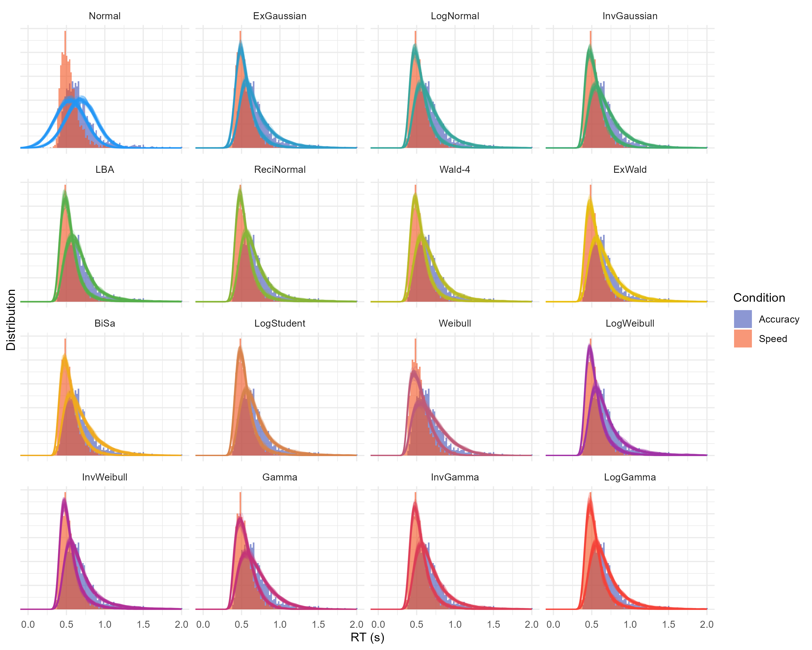

# cogmod

[](https://dominiquemakowski.github.io/cogmod/)
[](https://cran.r-project.org/package=cogmod)
[](https://github.com/DominiqueMakowski/cogmod/actions/workflows/R-CMD-check.yaml)
[](https://dominiquemakowski.github.io/cogmod/reference/index.html)
[](https://cran.r-project.org/package=cogmod)

*Models of Cognition for Subjective Scales and Decision Making Tasks in
R*

This R package is dedicated to facilitate the application of
computational models of cognition in R under a Bayesian framework. These
are useful in the field of cognitive science and computational
neuropsycholology.

If you have suggestions for improvement, please [get in
touch](https://github.com/DominiqueMakowski/cogmod/issues)!

## Features

[**Models for Subjective Ratings Data (Likert/Slider
Scales)**](https://dominiquemakowski.github.io/cogmod/articles/subjective_ratings.html)

Choice-Confidence (CHOCO) models (Bi-modal Beta)

Beta-gate (Ordered Beta, [Kubinec,
2023](https://doi.org/10.1017/pan.2022.20))

Discrete-Beta ([Sciandra,
2024](https://link.springer.com/article/10.1007/s10651-023-00592-5))

[**Models for Reaction
Times**](https://dominiquemakowski.github.io/cogmod/articles/rt_models.html)

Ex-Gaussian model (with the classical parameterization in which `mu` and
`sigma` index the Gaussian component alone and `tau` the exponential
tail - unlike `brms`’s native
[`exgaussian()`](https://paulbuerkner.com/brms/reference/brmsfamily.html),
whose `mu` indexes the mean of the entire distribution)

Shifted LogNormal (optionally with a start-point range, which makes it
the single-accumulator LBA with a LogNormal drift), Shifted
Log-Student-t (robust LogNormal, heavy-tailed)

Shifted Wald (Inverse Gaussian), Wald with drift variability, Ex-Wald
([Schwarz, 2001](https://link.springer.com/article/10.3758/bf03195403))

Birnbaum-Saunders / fatigue life ([Birnbaum & Saunders,
1969](https://doi.org/10.2307/3212003)) - evidence accumulating in
discrete cycles, one-directionally; an equal mixture of a Wald and its
length-biased twin, in the same drift and threshold parameters

Weibull, LogWeibull (Gumbel), Inverse Weibull (Fréchet)

Gamma, Inverse Gamma, Shifted LogGamma (Generalized Gamma)

[**Models for Decision Making (Choice +
RT)**](https://dominiquemakowski.github.io/cogmod/articles/decision_making.html)

Drift Diffusion Model (DDM)

Linear Ballistic Accumulator (LBA)

LogNormal Race (LNR), optionally with a start-point range, which makes
it the LBA with LogNormal drift rates

Racing Diffusion Model (RDM, [Tillman et al.,
2020](https://doi.org/10.3758/s13423-020-01719-6))


Response formats covered by cogmod, and the main families available for
each. Every family comes with a `_stanvars()` function supplying its
Stan code, and with `d*()` and `r*()` functions for density evaluation
and simulation.

## What are Computational Cognitive Models?

Measures from cognitive tasks, such as decision-making paradigms
involving fast responses or ratings, often produce noisy, specific, and
complex patterns of results. Broadly speaking, there are three ways of
analysing such data.

- **The Summary Statistics Approach**: The traditional approach often
  involves not bothering with any of the distinctive characteristics of
  cognitive data, assume that observations are Normally distributed, and
  summarise them using simple statistics such as means (which is what
  linear models do). This is the approach underlying most *t*-tests,
  ANOVAs, and linear regression models. Although often convenient, these
  methods may provide a poor description of the data and offer only
  limited insight into the cognitive processes that generated the
  observations.
- **The Distributional Approach**: A more principled approach is to
  choose statistical models that better account for these particular
  distributions. This can involve transforming the data (for example,
  log-transforming reaction times so that linear models are more
  justified), using robust statistical methods (resilient to
  non-normality), or adopting more appropriate probability distributions
  (e.g., using Ex-Gaussian models for RTs). While these approaches often
  improve model fit and statistical inference, there can be a gap
  between the descriptive distributional parameters estimated and the
  cognitive mechanisms underlying the data generation process.
- **The Computational Approach**: The most recent approach is to use
  models that are specifically designed to approximate or account for
  the cognitive processes at stake. For instance, Evidence Accumulation
  Models conceptualize response time as the outcome of a noisy process
  of evidence accumulation in the brain. And Choice-Confidence models
  explain the bi-modal distributions often found with slider scales as
  the combination of a dual-process of discrete choice and continuous
  evaluation. These models combine a good distributional fit to the data
  with more meaningful and cognitively interpretable parameters.


Illustration animation of Drift Diffusion Models

## Installation

Install the released version from
[CRAN](https://cran.r-project.org/package=cogmod):

``` r

install.packages("cogmod")
```

Or the development version from GitHub:

``` r

if (!requireNamespace("remotes", quietly = TRUE)) install.packages("remotes")

remotes::install_github("DominiqueMakowski/cogmod")
```

Fitting the models requires a working Stan installation through
[`brms`](https://paulbuerkner.com/brms/). The examples use the
`cmdstanr` backend, which is not on CRAN: follow its [installation
guide](https://mc-stan.org/cmdstanr/articles/cmdstanr.html#installing-cmdstan)
to set up CmdStan.

## Usage

Using a `cogmod` model requires two arguments beyond a standard
[`brm()`](https://paulbuerkner.com/brms/reference/brm.html) call:
`family` and `stanvars`. Two further helpers,
[`cogmod_priors()`](https://dominiquemakowski.github.io/cogmod/reference/cogmod_priors.md)
and
[`cogmod_inits()`](https://dominiquemakowski.github.io/cogmod/reference/cogmod_inits.md),
are strictly speaking optional but should be treated as part of the
call: they provide adapted chain-initialization values and weakly
informative priors on the sensitive parameters to limit convergence
issues and other sampling pathologies.

Note that `brms` *estimates* every parameter of the family that the
formula does not mention, so the parameters that are hard to identify
are best pinned explicitly: `sigmabias = 0` below (the start-point
range, which turns the shifted LogNormal into a single-accumulator LBA),
and likewise `sigmadrift = 0` and `sigmandt = 0` for
[`cogmod_invgaussian()`](https://dominiquemakowski.github.io/cogmod/reference/rcogmod_invgaussian.md),
unless the design and the amount of data speak to that source of
between-trial variability.

``` r

library(cogmod)
library(brms)

# Specify the formula using brms' bf()
f <- bf(
  RT ~ Condition,
  sigma ~ Condition,
  ndt ~ Condition,
  sigmabias = 0,  # No start-point variability
  family = cogmod_lognormal()
)

# Fit the model
m <- brm(
  f,
  data = df,
  prior = cogmod_priors(f, df),
  init = cogmod_inits(f, df),
  stanvars = cogmod_stanvars(f),
  backend = "cmdstanr"
)
```

We can then analyze its results, and check its predictions like with any
other models. See the [Subjective
Ratings](https://dominiquemakowski.github.io/cogmod/articles/subjective_ratings.html),
[RT-only
Models](https://dominiquemakowski.github.io/cogmod/articles/rt_models.html),
and [Decision Making
Models](https://dominiquemakowski.github.io/cogmod/articles/decision_making.html)
vignettes for more detailed examples.

These models are slow to sample, and refits are common - the same model
on more data, or a pilot on a few participants followed by the full
sample.
[`cogmod_warmstart()`](https://dominiquemakowski.github.io/cogmod/reference/cogmod_warmstart.md)
carries over what a previous fit’s warmup learned (its adapted metric,
step size and location), so that the new run needs only a short warmup:

``` r

ws <- cogmod_warmstart(m_pilot, data = df)  # map the pilot onto the full model

m <- brm(
  f,
  data = df,
  prior = cogmod_priors(f, df),
  stanvars = cogmod_stanvars(f),
  init = ws$init,
  inv_metric = ws$inv_metric,
  step_size = ws$step_size,
  warmup = 100, iter = 600,
  backend = "cmdstanr"
)
```

See the
[Performance](https://dominiquemakowski.github.io/cogmod/articles/performance.html)
vignette for what this buys and when it is safe.



## Roadmap

**Log-logistic** - `log(RT - ndt) ~ Logistic`. The motivation is the
*hazard function*: Weibull and Gamma hazards are monotone, whereas the
log-logistic rises then falls, a shape none of the current families can
produce.

**Early responses as a process rather than a fixed mixture.** `poutlier`
currently mixes in a half-Normal at zero with a fixed scale: a
contaminant with no mechanism, there so that one stray fast response
cannot drag `ndt` down. LATER handles the same responses with a second
*accumulator* - an “early” or “maverick” unit with a mean rate near zero
and a large SD - that **races** the main one, so an early response is a
decision that happened to win rather than a trial the model disowns.
That is the better account, and it is what the second line on a
reciprobit plot actually is. It is also a large undertaking: a race
needs the winner’s density against the loser’s survival for every family
in `.OUTLIER_FAMILIES`, where the present mixture needs one scalar, and
the early unit is *deliberately* half-defective (with a mean rate of
zero, half its trials never arrive at all) - which our normalised
densities cannot represent unless the race is there to absorb the
missing mass. Put on hold until we find a design that does not cost
every family its closed form.

**Shifted sinh-arcsinh (log-SHASH)** ([Jones & Pewsey,
2009](https://doi.org/10.1093/biomet/asp053)) - location, scale,
skewness and tail weight as four separate parameters. Where
[`cogmod_loggamma()`](https://dominiquemakowski.github.io/cogmod/reference/rcogmod_loggamma.md)
ties skew and tail weight together through one `shape`, SHASH decouples
them.

Add and check
[`cogmod_priors()`](https://dominiquemakowski.github.io/cogmod/reference/cogmod_priors.md)
and
[`cogmod_inits()`](https://dominiquemakowski.github.io/cogmod/reference/cogmod_inits.md)
for subjective scale models.

Go/No-go models:
<https://ampl-psych.github.io/EMC2/reference/DDMGNG.html>

**LBA with other drift-rate distributions** ([Terry et al.,
2015](https://doi.org/10.1016/j.jmp.2015.09.002)). The LBA’s likelihood
only needs, for each accumulator, the CDF and PDF of the drift and the
mean of the drift truncated to an interval; the Uniform start point does
the rest. The **LogNormal** variant is done: it is
[`cogmod_lognormal()`](https://dominiquemakowski.github.io/cogmod/reference/rcogmod_lognormal.md)
and
[`cogmod_lnr()`](https://dominiquemakowski.github.io/cogmod/reference/rcogmod_lnr.md)
with `sigmabias > 0`, since the shifted LogNormal and the LNR are that
LBA with the start point removed, and adding the start-point range back
was one dpar on each rather than new families. Two lessons from it carry
over. The scaling constraint moves with the drift distribution - fixing
the drift *scale* (`sigmazero = 1`, the LBA convention) pins the Normal
and the Gamma, but a LogNormal rate’s `sigma` is untouched by rescaling,
so the *threshold* has to be pinned instead, which is why the LNR’s
offset is fixed at 1 - and Stan’s upper-tail normal log-CDF is not
accurate enough for the fast tail (use `erfc`). Still to do: **Gamma**
and **Fréchet** drifts as families of their own, since there is no
existing race to nest them into. Gamma variance grows with the mean,
matching neural firing-rate variability and the recurring finding that
the matching accumulator needs the larger drift SD (and it won the one
published head-to-head, on lexical decision); its density is two
regularised incomplete gammas per accumulator, and the cost is Stan’s
gradient with respect to the shape, which is a slow series. Fréchet with
`sigmabias = 0` yields Luce / multinomial-logit choice probabilities,
bridging RT models and random-utility choice models, but its heavy drift
tail produces too many very fast responses and its mean is undefined for
shape ≤ 1. The four predicted CDFs are nearly indistinguishable and
differ only in the tails, so the drift distribution is a modelling
*choice* to justify theoretically and to compare by LOO or Bayes factor,
not by raw likelihood. Validate against
[`rtdists::dLBA()`](https://rdrr.io/pkg/rtdists/man/LBA.html), check the
`sigmabias = 0` limits reduce to the named distributions (inverse-Gamma
and Weibull), and run a cross-fitting matrix at realistic
per-participant trial counts (the published comparison used 20,000).

**Curvilinear LBA trajectories.** Any trajectory that is *affine* in the
start point `z` and the drift `v` - `x(t) = a(t) z + g(t) v + c(t)` -
crosses the threshold exactly when the plain LBA does with an effective
time `g(t)`, an effective start-point range `a(t) * sigmabias` and an
effective threshold `b - c(t)`, so its CDF is one wrapper around the LBA
core (density by the chain rule) and it inherits every drift
distribution above for free. Three choices of `(a, g, c)` are worth
having, in this order. **Time warp** (`x = z + v g(t)`,
e.g. `g(t) = (exp(gamma t) - 1) / gamma`, series-expanded near
`gamma = 0`): a time-dependent gain on evidence, the ballistic
counterpart of urgency signals ([Hawkins et al.,
2015](https://doi.org/10.1523/JNEUROSCI.2410-14.2015)); it preserves the
finishing-time *order* on every trial, so choice probabilities are
exactly the LBA’s and only the RT shape changes - a built-in unit test.
A collapsing threshold is the additive cousin (`c(t) = b - b(t)`) and
*does* move accuracy. **Ballistic Ornstein-Uhlenbeck**
(`dx/dt = v + gamma x`, so `a = exp(gamma t)`): the Leaky Competing
Accumulator ([Usher & McClelland,
2001](https://doi.org/10.1037/0033-295X.108.3.550)) without noise or
inhibition; `gamma < 0` is leak, `gamma > 0` self-excitation ([Bogacz et
al., 2006](https://doi.org/10.1037/0033-295X.113.4.700)). The start
point is amplified or forgotten over time, an accumulator finishes only
if `z + v / gamma > 0`, so bias and drift interact and accuracy changes;
and with piecewise-constant input the integral stays analytic, giving
primacy (`gamma > 0`) or recency (`gamma < 0`) - the LCA’s signature
phenomenon with a closed-form likelihood. Accumulator-specific `gamma`
is cheap; ballistic lateral inhibition keeps affinity but makes the
winner’s density a bivariate integral over the start-point box; a floor
at zero breaks affinity and is out of scope. **Literal gravity**
(`dx/dt = v + gamma / (b - x)^2`) is not affine in `v`, needs a
one-dimensional quadrature and loses the composability, so only if a
story specifically needs distance-dependent attraction. Expect `gamma`
to trade off against threshold and drift scale, since curvature acts on
the tail exactly where the drift distributions differ; recover before
believing anything.

**Expected-RT attractor (a prior over decision time).** Hypothesis:
given a goal the system holds a prior `T*` on how long the decision
*should* take, and trajectories heading to finish early are slowed while
late ones are sped up, so the attractor is the point `(T*, b)` on the
threshold rather than the threshold line - bidirectional bending that
gravity cannot produce. In the linear-Gaussian case predictive coding is
precision weighting, so the effective rate is the sensory drift shrunk
toward the rate that reaches threshold at `T*`:
`v_eff = (1 - w) v + w v*`, with `w` the relative prior precision. Two
readings of `v*` map onto the two mechanisms above: a prior over
*finishing time*, `v* = (b - z) / T*`, is a pure time warp with
`g(t) = (1 - w) t / (1 - w t / T*)` and leaves accuracy untouched; a
prior over *rate*, `v* = b / T*`, is an LBA with drift scaled by
`(1 - w)` and a linearly collapsing threshold `b (1 - w t / T*)`, and
moves accuracy. Both are affine, so both are wrappers on the same core;
curvature proper appears when `w(t)` evolves (rising as `T*` approaches,
or falling as sensory precision accumulates), still affine, still closed
form. The distinctive prediction is that urgency and collapsing bounds
compress only the *right* tail, whereas a time prior pulls the fastest
responses toward `T*` too - so manipulate temporal expectation (pacing,
deadline, foreperiod) and test whether the 10th percentile moves, not
only the 90th. Known problems: nothing finishes after `T* / w` because
the prior eventually dominates (bound `w(t)` below 1, or give `T*`
trial-to-trial variability at the cost of one quadrature, as scalar
timing would suggest anyway); and `T*` is a new time scale competing
with `boundary`, `sigmabias` and drift scale, identified only through RT
shape in the first version. Precedents: [Frazier & Yu
(2008)](https://papers.nips.cc/paper/3314-sequential-hypothesis-testing-under-stochastic-deadlines)
and [Drugowitsch et
al. (2012)](https://doi.org/10.1523/JNEUROSCI.4010-11.2012) let a prior
over time act on the *threshold*; [Simen et
al. (2011)](https://doi.org/10.1523/JNEUROSCI.3121-10.2011) model
interval timing as an accumulator whose drift is set to `b / T*`. This
is a precision-weighted blend of Simen’s timing ramp with the LBA’s
evidence ramp. Order: the finishing-time version first (a specific
`g(t)`, nearly free once the time warp exists), then the rate version,
then `w(t)`, then `T*` variability if the hard ceiling bites. Unit
tests: `w = 0` recovers the LBA, the first version reproduces LBA choice
probabilities exactly, the second with fixed `w` reproduces the
collapsing-threshold LBA.

Kumaraswamy model for easy bounded 0-1 data
