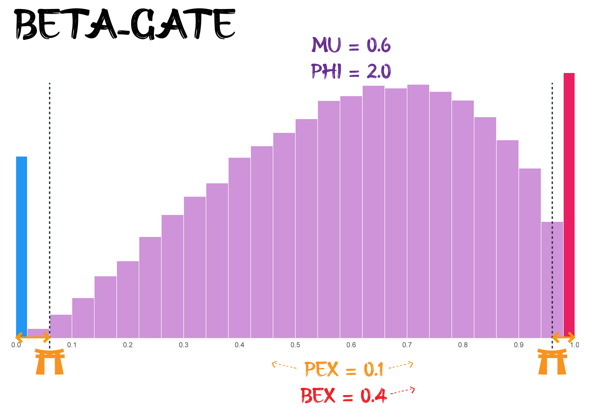

# Beta-Gate Model

The Beta-Gate model represents subjective ratings as a mixture of a
continuous Beta distribution with additional point masses at the
extremes (0 and 1). This structure effectively captures common patterns
in subjective rating data where respondents often select extreme values
at higher rates than would be expected from a Beta distribution alone.

The Beta-Gate model corresponds to a reparametrized ordered beta model
([Kubinec, 2023](https://doi.org/10.1017/pan.2022.20)). In the ordered
Beta model, the extreme values (0 and 1) arise from censoring an
underlying latent process based on cutpoints ("gates"). Values falling
past the gates are considered extremes (zeros and ones). The difference
from the Ordered Beta is the way the cutpoints are defined, as well as
the scale of the precision parameter phi.



It differs from the Zero-One-Inflated Beta (ZOIB) model in that the ZOIB
model has `zoi` and `coi` parameters, directly controlling the
likelihood of extreme values. Instead, Beta-Gate uses `pex` and `bex` to
define "cutpoints" after which extreme values become likely. In an
ordered beta framework, the boundary probabilities arise through a
single underlying ordering process (the location of the cutpoints on the
latent scale). In a ZOIB framework, the boundaries are more like
additional mass points inserted into a beta distribution. In Beta-gate
models, extreme values arise naturally from thresholding a single latent
process.

## Usage

``` r
rbetagate(n, mu = 0.5, phi = 3, pex = 0.1, bex = 0.5)

dbetagate(x, mu = 0.5, phi = 3, pex = 0.1, bex = 0.5, log = FALSE)

betagate_lpdf_expose()

betagate_stanvars()

betagate(
  link_mu = "logit",
  link_phi = "softplus",
  link_pex = "logit",
  link_bex = "logit"
)

log_lik_betagate(i, prep)

posterior_predict_betagate(i, prep, ...)

posterior_epred_betagate(prep)
```

## Arguments

- n:

  Number of simulated values.

- mu:

  Mean of the underlying Beta distribution (`0 < mu < 1`).

- phi:

  Precision parameter of the underlying Beta distribution (must be
  strictly positive). Can be conceptualized as an "agreement" indicator:
  higher `phi` means less dispersion (more agreement) among ratings,
  holding `mu` fixed. Note: In many implementations, `phi` is
  parametrized differently, and correspond to the double of our `phi`
  argument (cogmod's `phi` = standard's `phi` \* 2). Our parametrization
  Makes it `phi = 1` corresponds to uniform when `mu = 0.5`, which makes
  setting priors more convenient (e.g., on the logit scale)

- pex:

  Controls the location of the lower and upper boundary gates
  (`0 <= pex <= 1`). It defines the total probability mass allocated to
  the extremes (0 or 1). Higher `pex` increases the probability of
  extreme values (0 or 1).

- bex:

  Balances the extreme probability mass `pex` between 0 and 1
  (`0 <= bex <= 1`). A balance of `0.5` means that the 'gates' are
  symmetrically placed around the center of the distribution, and values
  higher or lower than `0.5` will shift the relative "ease" of crossing
  the gates towards 1 or 0, respectively.

- x:

  Vector of quantiles (values at which to evaluate the density). Must be
  between 0 and 1, inclusive.

- log:

  Logical; if TRUE, returns the log-density.

- link_mu, link_phi, link_pex, link_bex:

  Link functions for the parameters.

- i, prep:

  For brms' functions to run: index of the observation and a `brms`
  preparation object.

- ...:

  Additional arguments.

## Value

A vector of simulated outcomes in the range 0-1.

## Details

**Special cases:**

- When `pex = 0`: Pure Beta distribution with mean `mu` and precision
  `phi * 2`.

- When `pex = 1`: Pure Bernoulli distribution with `P(1) = bex`,
  `P(0) = 1-bex`.

- When `bex = 0` and `pex = 1`: All mass at 0.

- When `bex = 1` and `pex = 1`: All mass at 1.

**Psychological Interpretation:**

- `mu`: Can be interpreted as the underlying average tendency or
  preference strength, disregarding extreme "all-or-nothing" responses.

- `phi`: Reflects the certainty or consistency of the non-extreme
  responses. Higher `phi` indicates responses tightly clustered around
  `mu` (more certainty), while lower `phi` (especially `phi = 1`)
  suggests more uniform or uncertain responses.

- `pex`: Represents the overall tendency towards extreme responding
  (choosing 0 or 1). This could reflect individual response styles
  (e.g., acquiescence, yea-saying/nay-saying) or properties of the item
  itself (e.g., polarizing questions).

- `bex`: Indicates the *direction* of the extreme response bias.
  `bex > 0.5` suggests a bias for producing ones more easily, while
  `bex < 0.5` suggests a bias towards zero.

## References

- Kubinec, R. (2023). Ordered beta regression: a parsimonious,
  well-fitting model for continuous data with lower and upper bounds.
  Political Analysis, 31(4), 519-536.

## Examples

``` r
# Symmetric gates (c0=0.05, c1=0.95), pex=0.1, bex=0.5
x1 <- rbetagate(10000, mu = 0.5, phi = 3, pex = 0.1, bex = 0.5)
# hist(x1, breaks=50, main="rbetagate: Symmetric Cutpoints (pex=0.1)")

# Asymmetric gates (c0=0.15, c1=0.95), pex=0.2, bex=0.25
x2 <- rbetagate(10000, mu = 0.5, phi = 3, pex = 0.2, bex = 0.25)
# hist(x2, breaks=50, main="rbetagate: Asymmetric Cutpoints (pex=0.2, bex=0.25)")

# No gating (pure Beta)
x3 <- rbetagate(10000, mu = 0.7, phi = 5, pex = 0, bex = 0.5)
# hist(x3, breaks=50, main="rbetagate: No Extreme Values (pex=0)")

x <- seq(0, 1, length.out = 1001)
densities <- dbetagate(x, mu = 0.5, phi = 5, pex = 0.2, bex = 0.5)
plot(x, densities, type = "l", main = "Density Function", xlab = "y", ylab = "Density")

# You can expose the lpdf function as follows:
# betagate_lpdf <- betagate_lpdf_expose()
# betagate_lpdf(y = 0.5, mu = 0.6, phi = 10, pex = 0.2, bex = 0.5)
```
