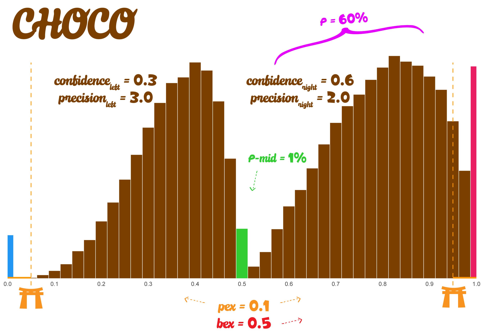

# Choice-Confidence (CHOCO) Model

Simulates data from the Choice-Confidence (CHOCO) model. This model is
useful for subjective ratings (e.g., Likert-type scales) where responses
represent a choice between two underlying categories (e.g., "disagree"
vs. "agree") along with a degree of confidence or intensity.

The CHOCO model divides the response scale at a middle-value. Responses
above and below the middle are modeled by two rescaled (and mirrored for
the left side)
[Beta-Gate](https://github.com/DominiqueMakowski/cogmod/reference/rbetagate.md)
distributions. In Beta-Gate distributions, extreme values (0 or 1) are
generated by the "lumping" of values that crossed a threshold (or
"gate"). The location of these gates from the center of the distribution
is controlled by the `pex` and `bex` parameters, influecing the ease of
crossing the gate (and thus the probability of extreme values).



## Usage

``` r
rchoco(
  n,
  p = 0.5,
  confright = 0.5,
  precright = 4,
  confleft = 0.5,
  precleft = 4,
  pex = 0.1,
  bex = 0.5,
  pmid = 0,
  mid = 0.5
)

dchoco(
  x,
  p = 0.5,
  confright = 0.5,
  precright = 4,
  confleft = 0.5,
  precleft = 4,
  pex = 0.1,
  bex = 0.5,
  pmid = 0,
  mid = 0.5,
  log = FALSE
)

choco_lpdf_expose()

choco_stanvars()

choco(
  link_mu = "logit",
  link_confright = "logit",
  link_precright = "softplus",
  link_confleft = "logit",
  link_precleft = "softplus",
  link_pex = "logit",
  link_bex = "logit",
  link_pmid = "logit"
)

log_lik_choco(i, prep)

posterior_predict_choco(i, prep, ...)

posterior_epred_choco(prep)
```

## Arguments

- n:

  Number of simulated trials.

- p:

  Proportion parameter determining the balance between the left and
  right sides *after excluding* the probability mass at the middle
  (`pmid`). `P(Right Side | Not Middle) = p`.

- confright, confleft:

  Mean parameter (`mu`) for the underlying Beta-Gate distribution for
  the *right* side and *left* side, respectively. Represents confidence
  towards 1. `0 < confright < 1`.

- precright, precleft:

  Precision parameter (`phi`) for the underlying Beta-Gate distribution
  for the *right* side and *left* side, respectively. Must be positive.
  Higher values indicate more concentrated distributions, and a value of
  1 corresponds to a uniform distribution.

- pex:

  Controls the location of the lower and upper boundary gates
  (`0 <= pex <= 1`). It defines the total probability mass allocated to
  the extremes (0 or 1). Higher `pex` increases the probability of
  extreme values (0 or 1).

- bex:

  Balances the extreme probability mass `pex` between 0 and 1
  (`0 <= bex <= 1`). A balance of `0.5` means that the 'gates' are
  symmetrically placed around the center of the distribution, and values
  higher or lower than `0.5` will shift the relative "ease" of crossing
  the gates towards 1 or 0, respectively.

- pmid:

  Probability mass exactly at the `mid`. This determines the proportion
  of trials where the output is directly assigned the value of `mid`,
  bypassing the left or right components.

- mid:

  The point dividing the scale (`0 < mid < 1`). Typically set to 0.5.
  Note that in the Stan implementation, `mid` is fixed at 0.5 and not
  available as a parameter.

- x:

  Vector of quantiles (values at which to evaluate the density). Must be
  between 0 and 1, inclusive.

- log:

  Logical; if TRUE, returns the log-density.

- link_mu, link_confright, link_precright, link_confleft, link_precleft,
  link_pex, link_bex, link_pmid:

  Link functions for the parameters.

- i, prep:

  For brms' functions to run: index of the observation and a `brms`
  preparation object.

- ...:

  Additional arguments.

## Details

**Psychological Interpretation:**

- `p`: Represents the overall tendency to choose the "right" category
  (e.g., "agree") over the "left" category (e.g., "disagree"), given
  that a choice is made (i.e., not responding exactly at `mid`).

- `confright` and `confleft`: Average confidence level when choosing the
  "right" or "left" category. Higher values (closer to 1) indicate
  stronger confidence or agreement towards the extreme end of the scale.

- `precright` and `precleft`: Certainty or consistency of the confidence
  ratings for the right and left choices, respectively. Higher values
  indicate less variability in confidence ratings around their
  respective means (`confright`, `confleft`).

- `pex`: Represents the overall tendency towards extreme responding
  (choosing 0 or 1). This could reflect individual response styles
  (e.g., acquiescence, yea-saying/nay-saying) or properties of the item
  itself (e.g., polarizing questions).

- `bex`: Indicates the *direction* of the extreme response bias.
  `bex > 0.5` suggests a bias for producing ones more easily, while
  `bex < 0.5` suggests a bias towards zero.

## References

- Kubinec, R. (2023). Ordered beta regression: a parsimonious,
  well-fitting model for continuous data with lower and upper bounds.
  Political Analysis, 31(4), 519-536. (Describes the underlying ordered
  beta model)

## See also

rbetagate

## Examples

``` r
# Simulate data with different parameterizations
# 10% at mid, 50/50 split otherwise, symmetric confidence/precision
x1 <- rchoco(n=5000, p = 0.5, confright = 0.5, precright = 4,
  confleft = 0.5, precleft = 4, pex = 0.1, bex = 0.5, pmid = 0, mid = 0.5)
hist(x1, breaks = 50, main = "CHOCO: Symmetric Confidence/Precision", xlab = "y")


# No mid mass, 70% probability on right, higher confidence left (closer to 0)
x2 <- rchoco(n=5000, p = 0.7, confright = 0.5, precright = 3,
  confleft = 0.8, precleft = 5, pex = 0.15, bex = 0.7, pmid = 0, mid = 0.5)
hist(x2, breaks = 50, main = "CHOCO: Asymmetric p, Higher Conf Left", xlab = "y")


# Lower confidence overall (closer to mid), high probability in the middle
x3 <- rchoco(n=5000, p = 0.5, confright = 0.2, precright = 3,
  confleft = 0.2, precleft = 3, pex = 0, bex = 0.5, pmid = 0.05, mid = 0.5)
hist(x3, breaks = 50, main = "CHOCO: Low confidence overall", xlab = "y")

if (FALSE) { # \dontrun{
# Example usage in brm formula:
# bf(y ~ x1 + (1|group),
#    confright ~ x3,
#    confleft ~ x3,
#    precright ~ 1,
#    precleft ~ 1,
#    pex ~ s(age),
#    bex ~ 1,
#    pmid ~ 1,
#    family = choco())
} # }
```
